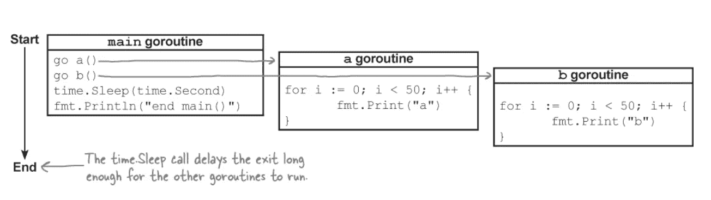

# Go 中的线程安全

> 原文：<https://blog.devgenius.io/thread-safety-in-go-6ea8db5bfef8?source=collection_archive---------5----------------------->

线程是程序中的执行流。正常情况下，程序只有一个流(线程)，但在某些情况下，程序有多个流。这就是所谓的多线程。

CPU 只是一个计算器。它只是计算被传递的值，所以它不关心这些值从哪里来，到哪里去。在多线程中，操作系统控制线程，如果线程多于 CPU，操作系统就让线程切换到使用 CPU。

并发性是一个程序同时做多件事情的能力。实际上，当我们谈到并发程序时，我们指的是具有两个或更多彼此独立运行的任务的程序，这些任务几乎同时运行，但仍然是同一个程序的一部分。流行的编程语言通过使用线程来实现并发。

Goroutines 也经常被称为绿色线程。Goroutines 由语言运行时而不是操作系统来维护和调度。goroutine 的内存消耗和上下文切换成本比 OS 线程低得多。所以，一个 Go 程序同时维护几万个 goroutines 不成问题，只要系统内存足够。

需要记住的重要一点是，Go 不是并行语言，而是并发语言，这意味着 Goroutine 不是以独立的方式工作，而是将每个 Goroutine 分成更小的部分，每个 Go routine 一次运行其中的一个子部分。



并发计算可以共享资源，通常是内存资源。以下是并发计算时可能出现的一些情况:
在一个计算正在向一个内存段写入数据的同一周期内，另一个计算正在从同一个内存段读取数据。则由另一个计算读取的数据的完整性可能不会被保留。

这些情况被称为数据竞争。并发编程的职责之一是控制并发计算之间的资源共享，这样数据竞争就永远不会发生。实现这一任务的方法被称为并发同步或数据同步

人们被并发所吸引，因为他们相信并发程序运行得更快。不幸的是，情况并非总是如此。更多的并发性不会自动提高速度，而且会使代码更难理解。关键是要理解并发不是并行。并发是一种工具，可以更好地组织您试图解决的问题。

写一个 Goroutine 没什么特别的；它们只是普通的函数。实际上，每个函数都很容易成为一个 Goroutine 我们所要做的就是在调用函数之前写下单词 **go** 。

```
**func** sum(m, n **int**) **int** {
  **return** (n * (n + 1) / 2) - (m * (m - 1) / 2)
}**func** main() {
  **go** sum(40,700)
}
```

无论运行 sum()函数需要多长时间，main()函数都不会关心 sum()函数，因为这些函数将独立运行。

通道允许 goroutines 相互通信。Goroutines 通过通道发送或接收消息(值)。

如果 goroutines 是并发 Go 程序的活动，那么通道就是它们之间的连接。通道是一种通信机制，允许一个 goroutine 向另一个 goroutine 发送值。每个通道都是特定类型的值的管道，这种类型称为通道的元素类型。元素类型为 int 的通道的类型被写成 chan int。

最著名的并发问题之一是死锁。当死锁发生时。当一组 goroutines 在互相等待，但没有一个人能够继续时，就会发生死锁。

由于对共享资源的非同步访问以及试图同时读取和写入该资源，会发生争用情况。

原子函数提供了同步访问整数和指针的机制。通常用于修复竞争条件的原子函数。

**同步**包下的**原子**中的函数提供了用于实现同步算法的低级原子内存原语。

数据竞争是并发系统中最常见也是最难调试的错误类型之一。当两个 goroutines 同时访问同一个变量，并且其中至少有一个访问是写操作时，就会发生数据争用，通过在 run 或 build 命令中添加-race 标志，可以很容易地检测到数据争用情况。

通过无缓冲通道进行通信会导致发送和接收例程同步。因此，无缓冲通道有时被称为同步通道。当在无缓冲通道上发送值时，值的接收发生在发送 goroutine 重新唤醒之前。让我们看看 nextId 函数如何与无缓冲通道一起工作。

**互斥和 rw 互斥**

Mutex 代表“互斥”，是保护程序关键部分的一种方式。互斥体提供了一种并发安全的方式来表达对这些共享资源的独占访问。您负责通过使用互斥锁来保护对内存的访问，从而协调对内存的访问。但是，作为一个通用指南，何时使用互斥:缓存、状态。下面的代码有数据竞争问题，但是构建或运行通常不会导致问题。

让我们重构上面的代码:

**结论**
包同步非常有用，而且性能很高，但这些功能需要非常小心才能正确使用。除了特殊的、低级别的应用，同步最好用通道来完成。通过交流分享记忆；不要通过共享内存来交流。

[](https://go.dev/doc/articles/race_detector) [## 数据竞争检测器——Go 编程语言

### 数据竞争是并发系统中最常见也是最难调试的错误类型之一。当…时，会发生数据竞争

go.dev](https://go.dev/doc/articles/race_detector) [](https://github.com/golang/go/wiki/MutexOrChannel) [## MutexOrChannel golang/go Wiki

### 此时您不能执行该操作。您已使用另一个标签页或窗口登录。您已在另一个选项卡中注销，或者…

github.com](https://github.com/golang/go/wiki/MutexOrChannel)