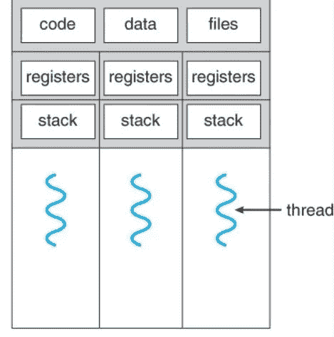

# 操作系统中的线程

> 原文：<https://blog.devgenius.io/threads-in-operating-system-f27d0c5470c7?source=collection_archive---------2----------------------->

内核级和用户级线程

[https://unsplash.com/photos/XJXWbfSo2f0](https://unsplash.com/photos/XJXWbfSo2f0)

线程也称为轻量级进程，它是通过进程代码执行的流程。
线程通过并行运行来提高应用程序的性能。线程切换不需要与操作系统交互，不像进程需要与操作系统交互。一个线程有自己的程序计数器、系统寄存器和堆栈，但是它们共享公共的代码、数据和文件，如下图所示。

[https://www . cs . UIC . edu/~ jbell/course notes/operating systems/4 _ threads . html](https://www.cs.uic.edu/~jbell/CourseNotes/OperatingSystems/4_Threads.html)

如果一个线程被阻塞或者正在等待某个 I/O 操作，同一任务中的另一个线程可以不受任何干扰地运行。

线程有两种实现方式，
1。**用户级线程:**在用户级线程中，线程由应用程序管理，内核不知道线程。应用程序从单个线程开始，然后开始在该线程中运行。这些线程可以在任何应用程序上运行，并且创建和管理速度很快。

2.**内核级线程:**这些线程由内核管理，这些线程由操作系统直接支持。内核能够在多个进程上同时调度来自同一进程的多个线程。内核线程的创建和管理速度比用户线程慢。

当多个线程同时执行时，我们称之为多线程。同一应用程序中的多个线程可以在多个处理器上并行运行，当有阻塞系统调用时，它不需要阻塞整个进程。
有三种不同类型的多线程模型，

1.  **多对多模型:**在这个模型中，用户级线程复用到数量更少或相等的内核级线程。如果一个用户线程被阻塞，我们可以将其他用户线程调度到另一个内核线程。
2.  **多对一模型:**在这里，许多用户级线程映射到一个内核级线程，线程管理在用户空间完成。当一个线程进行阻塞系统调用时，整个进程被阻塞。在这个模型中，多线程不能在多处理器上并行运行。
3.  **一对一模型:**这里，一个用户级线程一次只能使用一个内核级线程。这种模式比多对一模式有更多的并发性。在这个模型中，创建一个用户线程需要一个相应的内核线程。

有关操作系统中线程的更多信息，请参考此[站点](https://www.tutorialspoint.com/operating_system/os_multi_threading.htm)。