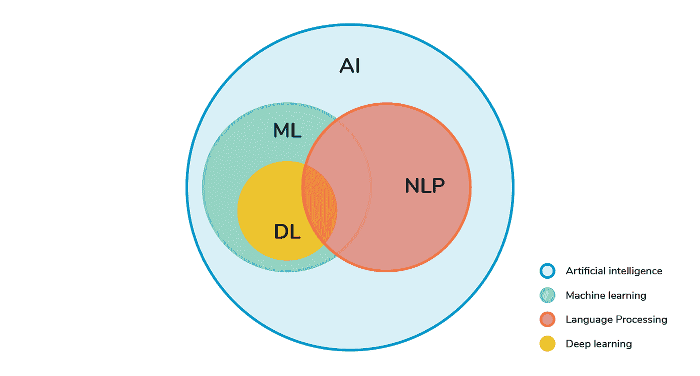

# 你的投资组合中需要的三个 NLP 项目

> 原文：<https://blog.devgenius.io/three-nlp-projects-you-need-in-your-portfolio-2a1a124f2570?source=collection_archive---------1----------------------->

## 任何有抱负的机器学习工程师都应该在他们的投资组合中包含 NLP 项目

[图片来自 Devopedia](https://devopedia.org/natural-language-processing)

[自然语言处理](https://pythonalgos.com/2021/11/23/what-is-natural-language-processing-nlp/)是机器学习的两大子领域之一。[在 21 世纪 20 年代，自然语言处理将是商业领域最重要的事情之一](/are-the-2020s-the-decade-of-natural-language-processing-6304d6d6b9c4)。有如此多的非结构化文本数据。知道如何将文本数据转化为可操作的见解的人将会既富有又有影响力。

你来这里是因为你想做机器学习。如果你想成为一名机器学习工程师，这里有三个自然语言处理方面的项目，你应该把它们放在你的投资组合中。在这篇文章中，我们将介绍三个 NLP 项目，一个人工智能文本摘要器，一个人工智能内容调节器和一个人工智能情感分析器，为什么你应该在你的投资组合中有这些，以及如何建立它的简要概述。

## 人工智能文本摘要器

为什么你应该有一个人工智能文本摘要在你的投资组合？文本摘要是自然语言处理的重要组成部分。有两种类型的文本摘要，提取的和抽象的。文本摘要用于减少页面上无用文本的数量，从而节省读者的时间。

文本摘要器背后的基本思想是权衡文本中的短语、单词和句子，然后选择最重要的。您可以选择您的权重和权重分配方法，为您的用例创建最佳的文本摘要。文本摘要是你想要使用 [NLP 停用词](https://pythonalgos.com/2021/12/19/nlp-stop-words-when-and-why-to-use-them/)的情况之一，这样你就不会不恰当地加重某些句子的重量。

这里有一个关于如何[创建一个人工智能文本摘要器](https://pythonalgos.com/2021/11/28/build-your-own-ai-text-summarizer-in-python/)的完整教程。

## 人工智能内容版主

内容适度对于保护我们的思想已经很重要了。随着网络上的信息量每天都在增长，内容适度将变得更加重要。内容审核目前已经通过算法完成，但用人工智能来补充将是未来的事情。

要为文本内容创建一个人工智能内容审核系统，你需要选择要评级的单词，检查它们的出现次数，并应用将应用评级的规则。除了内容安全评级，您还可以捕捉触发警告。

这里有一个完整的教程，教你如何[创造一个人工智能内容版主](https://pythonalgos.com/2021/12/24/how-to-build-an-ai-content-moderation-system/)。

## 人工智能情感分析器

情感分析可能是这个行业最流行的词汇之一。然而，这实际上是一项非常重要的任务。您可以将情感分析应用于餐厅评论、员工评论和客户反馈表等，以创建可操作的见解。

情感分析器通过检查文本中单词、短语和句子的情感来工作。和总结一样，如何权衡这些来得出一个全面的感悟，就看你自己了。

这里有一个关于如何[创建一个人工智能情感分析器](https://pythonalgos.com/2021/12/15/ask-nlp-the-media-on-the-obama-presidency-over-time/)的完整教程。

## 摘要

如果你想精通 NLP，你必须建立项目。在这篇文章中，我们讨论了三个你可以构建的 NLP 项目，为什么你应该构建它们，以及如何构建它们的简要概述。

如果这对你有帮助，请在 LinkedIn 和 Twitter 上分享，以帮助他人！要无限制使用媒体，今天就成为[媒体会员](https://medium.com/@ytang07/membership)！记得关注我，[唐](https://medium.com/@ytang07)，获取更多关于 NLP、软件和成长的帖子。请务必关注 [Plain Simple Software](https://medium.com/plain-simple-software) 获取更多软件文章！

## 进一步阅读

*   [三种类型的递归神经网络](https://pub.towardsai.net/three-types-of-recurrent-neural-networks-567b4e9c4261)
*   [你可能不知道的五种软件工作](/five-jobs-in-software-jobs-you-may-not-know-9712b26623b0)
*   [接口和抽象类有什么区别](https://medium.com/plain-simple-software/whats-the-difference-between-an-interface-and-an-abstract-class-d1fe50338325)
*   [三个令人惊讶的 Python 资源提升你的技能](/3-surprising-python-resources-to-turbocharge-your-skills-aecdfeb0d14b)
*   [软件工程师编排指南](https://pythonalgos.com/a-software-engineers-guide-to-the-orchestrator-pattern/)