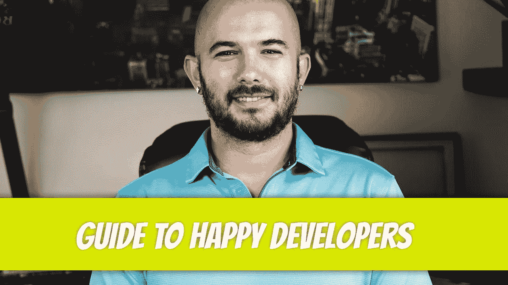

# 让开发者开心的三件事

> 原文：<https://blog.devgenius.io/three-things-that-make-developers-happy-caa5dbe568f9?source=collection_archive---------9----------------------->

如果所有的开发人员都只是快乐地工作，那不是很好吗？发生这种情况的可能性接近于零，但是，有一些事情确实让开发人员感到高兴。

## 明确的要求

你会认为客户会欣喜若狂地向你提供他们想要的东西。从来都不是这样。要么他们不知道如何正确地收集他们的想法，要么他们不想花钱请专家来指导他们。你大部分时间收到的是一堆松散的笔记、涂鸦、幻灯片和 excel 表格。在将“开放解释”的需求传递给 UI/UX 团队之前，业务分析师获取这些信息并与客户交谈几次。团队尽最大努力创造设计。经过几次迭代之后，客户同意了提议的设计。设计是不完整的，这取决于开发人员使用他们的最佳判断。有时候客户很高兴，这是你所能期望的。

这是大多数公司最好的情况。更多的时候，公司没有一个合格的 BA 或者根本没有 BA；项目经理处理这两种角色。客户在任何需要收集需求的时候都很忙，但是要求显示进度。他们拒绝为 HiFi 设计付费，并认为开发者应该通过查看少数 LoFi 设计来知道他们想要什么。他们要求不断修改，并认为他们不应该支付这些费用。开发人员筋疲力尽，最终退出。

在极少数情况下，星象一致，你开始为一家完美的公司工作。英国广播公司和首相之间有明显的区别，这两个职位都是摇滚明星。客户明白需求收集过程是一个付费的过程，他们有资金支持。HiFi 设计是用所有可能的应用状态创建的。开发人员接收他们的任务，完美地计划并链接到各种合流页面。他们进入涅磐。即使客户提出变更，时间线也会根据这些变更而改变。

尽管这是每个公司都努力追求的目标，但只有少数公司能够实现。当一个开发者尝到甜头，他或她很快就会被宠坏。在你的余生中享受听“应该这样做”的乐趣。

## 合适的项目经理

非技术项目经理不属于开发世界。没有什么比向他们的项目经理寻求帮助，而项目经理什么都不懂更让开发人员沮丧的了。开发人员被拉进大多数客户会议，因为项目经理不知道如何向客户解释。任务没有意义，吉拉董事会总是一团糟。我说的不是懒惰的项目经理。这些人很努力，却把一切都搞得一团糟。

完美的项目经理是以前拥有软技能的开发人员。他们了解开发人员的工作方式，可以轻松地与客户沟通。最优秀的人尝到了需求聚集完美的滋味，并肩负着复制这种环境的使命，在这种环境中，一切都运行顺利。

开发人员和项目经理之间的良好关系是项目成功的关键。

## 健康的工作环境

糟糕的工作/生活平衡会让开发者们退避三舍。不幸的是，人们期望开发人员在一天中的任何时候都可以回答任何可能出现的问题。当开发人员去度假时，他们经常会听到，“确保随身携带手机。”不管他们在做什么，也不管他们是否有时间休息，他们都应该检查懈怠/团队。部署在非工作时间进行，以免影响用户。这通常是在晚上 9 点或以后。我不知道这是如何开始的，也不知道为什么开发人员选择容忍它，但这不是我个人可以忍受的事情。所有个体都想完成自己的工作，断开连接；开发者也没什么不同。

一个没有有毒同事的工作环境是一个理想的工作场所，然而，总有至少一个。我不确定是谁伤害了这个人的成长，但他/她肩负着让所有人生活痛苦的使命。他们努力应对压力，并会寻找一切机会来制造压力。这些压力制造者有时用微笑掩盖他们的毒性，但你知道他们是谁。是大家一直回避的人。

还有一些人破坏进步，因为他们无法走出“美好的旧时光”这些是你必须像老鹰一样小心的。确保他们的毒性不会传染给团队的其他成员。一旦如此，就很难打破这种思维定势。开发人员会感到不高兴，他们也不知道具体原因。

## 最后的话

让开发者开心并不需要太多。让所有员工都开心的是同样的东西。明确的工作要求，熟练的同事，缺乏压力制造者。这要求真的过分吗？

迪诺·卡伊奇目前是 [LSBio(生命周期生物科学公司)](https://www.lsbio.com/)、[绝对抗体](https://absoluteantibody.com/)、 [Kerafast](https://www.kerafast.com/) 、[珠穆朗玛生物](https://everestbiotech.com/)、[北欧 MUbio](https://www.nordicmubio.com/) 和 [Exalpha](https://www.exalpha.com/) 的 IT 主管。他还担任我的自动系统的首席执行官。他有十多年的软件工程经验。他拥有计算机科学学士学位，辅修生物学。他的背景包括创建企业级电子商务应用程序、执行基于研究的软件开发，以及通过写作促进知识的传播。

你可以在 [LinkedIn](https://www.linkedin.com/in/dinocajic/) 上联系他，在 [Instagram](https://instagram.com/think.dino) 上关注他，或者[订阅他的媒体出版物](https://dinocajic.medium.com/subscribe)。

[*阅读迪诺·卡吉克(以及媒体上成千上万其他作家)的每一个故事。你的会员费直接支持迪诺·卡吉克和你阅读的其他作家。你也可以在媒体上看到所有的故事。*](https://dinocajic.medium.com/membership)