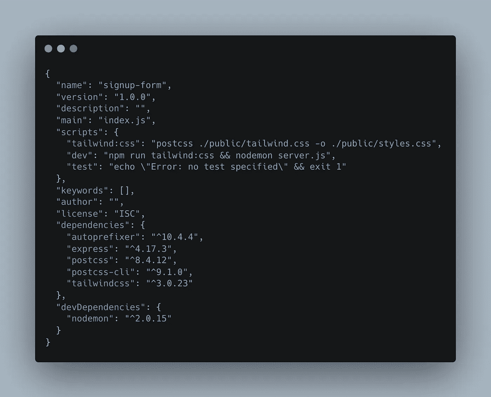

# 用普通 HTML & JS 配置 TailwindCSS 的三种方法

> 原文：<https://blog.devgenius.io/three-ways-to-configure-tailwindcss-with-vanilla-html-js-7175e1b8758a?source=collection_archive---------1----------------------->


CSS &创新的爱子！

如果你正在阅读这篇文章，那么你对 CSS 框架也有很好的品味。在本指南中，我们将介绍在前端和全栈普通 HTML 项目中集成 TailwindCSS 的三大方法。

# 方法 1

我称之为“亲吻”法。保持简单愚蠢。事实上，这非常简单，我们只需在普通的`index.html`文件(或任何其他文件)中的`<head></head>`标签中添加下面一行即可。html 文件):

```
<script src="https://cdn.tailwindcss.com"></script>
```

就这么简单！然而，这也有不利的一面。虽然你可能会得到大多数顺风的优秀工具，但你不会得到所有的。限制可以在减少的色谱和不能使用`::before`和`::after`假选择器之间变化。

为了解决这些问题，我向您介绍…

# 方法 2

方法 2 将为您提供 TailwindCSS 的全部功能，同时保持您的代码库小而简单；非常适合前端开发。为了省去我解释的麻烦，Tailwind 已经预先考虑到了旁观者对这种方法的好奇，它编写了自己的简洁明了的说明指南，用您的普通 HTML 项目深入了解 Tailwind:

*   [https://tailwindcss.com/docs/guides/vite](https://tailwindcss.com/docs/guides/vite)

当一个人想要使用简单的 HTML 和 Tailwind，将额外的负担和安装保持在最低限度时，这无疑是开发人员体验的顶峰。

可能会提示您安装“Create-vite ”,我将继续安装。接下来，对于一个普通的 HTML 项目，您需要选择:

1.  “香草”——用于框架。
2.  “香草”——代表变体。
3.  你已经准备好通过上面的链接安装 Tailwind 了。

# 方法 3

这个用例是为那些喜欢从基本必需品构建全栈应用的人准备的。这样的一个例子，可能是具有 Node.js & Express 后端和良好的 ol '服务器渲染的普通 HTML & JS 的全栈应用程序。登录墙后面的任何应用程序都可能是此类应用程序的合适候选对象。那么，如何将 TailwindCSS 整合到服务器呈现的 HTML 文件中呢？为此，请遵循以下步骤:

1.  用终端命令`$ npm init -y`初始化您的节点服务器。
2.  安装以下软件包:`$ npm i tailwindcss autoprefixer postcss postcss-cli express`。
3.  我可能还会推荐安装 Nodemon，以获得更好的使用`$ npm i --save-dev nodemon`的开发体验。
4.  在项目根目录下运行命令:`$ npx tailwindcss init`。
5.  创建一个 Postcss 配置文件:`$ touch postcss.config.js`。
6.  创建以下文件夹和文件:
7.  `$ mkdir public`。
8.  `$ touch public/tailwind.css`。
9.  `$ touch public/styles.css`。

这是我们创建的大部分文件目录。我们仍然需要将以下代码插入到我们的三个文件中:

***postcss . config . js***

```
module.exports = {   
plugins: [     
require('tailwindcss'),     
require('autoprefixer'),   
]}
```

***tailwind . config . js***

```
module.exports = {  
content: ["./public/**/*.{html,js}"],  
theme: {    extend: {},  },  
plugins: []
}
```

***tailwind.css***

```
@tailwind base; @tailwind components; @tailwind utilities;
```

## 最后一步

最后一步，我们需要修改下面两行到我们的 ***package.json*** 文件中:

```
"tailwind:css": "postcss ./public/tailwind.css -o ./public/styles.css",    
"dev": "npm run tailwind:css && nodemon server.js"
```

每当我们用命令`$ npm run dev`运行我们的 Server/server.js 文件时，这将把 TailwindCSS 编译成我们的 HTML 文件。我们最终应该得到一个如下所示的 ***package.json*** :



/package.json

就这样，我们可以在页面的`<head></head>`部分使用下面的脚本标记将样式表导入到我们选择的 HTML 文件中:

```
<link rel="stylesheet" href="styles.css" />
```

完了！现在，您可以在自己的全栈项目中使用 TailwindCSS，而不需要任何奇特的前端框架。