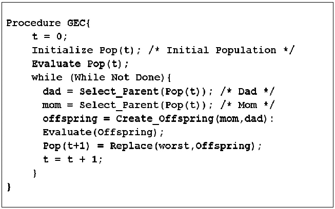
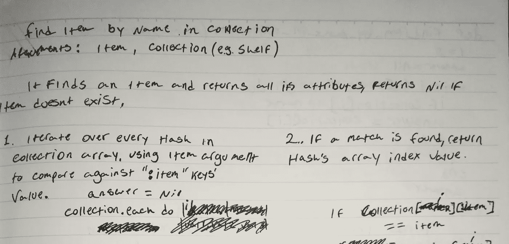

# 编码不是编程。

> 原文：<https://blog.devgenius.io/throughout-my-last-few-weeks-in-school-even-though-im-far-from-the-most-competent-student-in-my-bdaa5054167e?source=collection_archive---------31----------------------->

Emile Perron 在 [Unsplash](https://unsplash.com?utm_source=medium&utm_medium=referral) 上的照片

在学校的这六周时间里，尽管我远非班上最有能力的学生，但还是有几个同龄人直接找到我，或者大声问我，为什么在有交付成果的情况下，我能如此轻松地编写代码。我通常会问他们的过程是什么样的，在几次谈话的过程中，我意识到许多努力编写代码的人有一个共同点:他们都专注于编写代码。

我发现解谜是生活中最大的乐趣之一；我订阅了 NYT 填字游戏，聪明，在我手机上的 50 个左右的游戏中，有 40 个是基于字谜的。我现在就不再卖弄了，但是，是的，你可能会说我喜欢批判性思维。我认为吸引我从事软件工程的主要原因，也是许多为之奋斗的人似乎忘记的事情，实际上是编程。传统意义上的编程，从 a 点到 b 点有哪些步骤？

这是个谜，一直都是。当你给某人指明去某个地方的方向时，你用步骤为他们把拼图拼在一起。在这个拐角处向右转，穿过街道，沿着这个街区走。具体的说明可能会根据他们使用的交通方式而变化——是汽车还是滑板？但是到了最后，你仍然在拼凑一个拼图。

在这个类比中，你已经编写了一套指令，而运输方式就是执行它的代码。换句话说，代码是后来才出现的。

当我们去看现场演出时，我们会得到一本小册子，上面有按顺序排列的演出清单。电视以预定的方式显示内容。我们用特殊的语法告诉计算机做事情的顺序。这些都被称为“程序”，然而其中只有一个使用代码。明白我的意思了吗？

当被给予可交付成果时，我总是坐下来写下我认为为了交付它们我需要采取的步骤。在我规划出我要去的地方之后，就是我考虑让每一步发生需要什么代码的时候了。如果我不知道某个特定步骤的方法或操作，我会查找它。记住，谷歌搜索不是作弊。世界上所有的代码都唾手可得，但如果你只是开始埋头苦干，而不后退一步，想一想你要达到的目标是什么，那么你很容易迷失在混乱中。

伪代码示例，承蒙约书亚·亚当斯【https://www.researchgate.net/ 

许多程序员在计划他们的步骤时喜欢使用的另一种方法叫做伪代码。这是一个很好的方法，可以专注于写出步骤，而不用强调实际的语法。本质上，你在这里所做的是格式化你的抽象，在某种程度上，它仍然具有类似于特性的功能，但是仍然是人类可读的，并且允许关于在其中实际发生什么操作的灵活性。

这当然很有用，但我发现它不够抽象，不足以让我作为起点。我经常发现自己在更困难的项目上使用伪代码，作为从笔记到编码的中间步骤。

书法是关键。

在我非常清晰，非常好看的笔记样本中，我所做的基本上是用文字写出来的，我需要写的函数的每一步会做什么。通过对它们进行编号，我可以在页面的另一部分勾画出直接引用它们的操作。超级简单，超级有用，特别是如果你是那种发现自己在 50 行代码中，对应该做什么只有模糊记忆的人。一样。

所有这些并不是说我的方法是唯一的，甚至是最有效的编程方法。有些人可以得到指令并开始编写代码，这些人用 c 语言思考。对这些人来说，这可能看起来有点初级，甚至有点矫枉过正，但如果你自己发现很难通过项目来解决问题，因为你总是专注于你应该使用什么代码，这可能有助于退一步思考代码应该做什么。