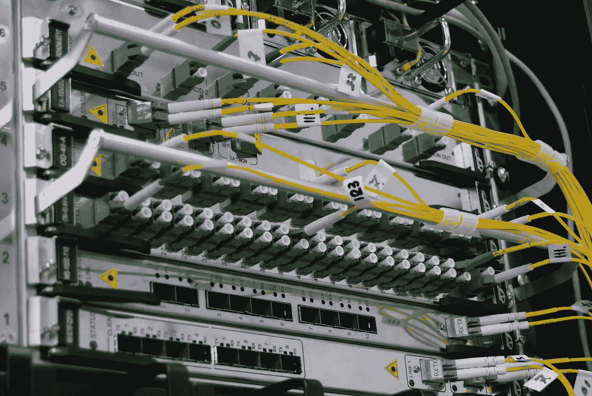

# 用硬件解决软件问题

> 原文：<https://blog.devgenius.io/throwing-hardware-at-a-software-problem-d4ef77d57630?source=collection_archive---------15----------------------->

## 最愚蠢的行为。

# 无数系统工程师没完没了地讲述“我早就告诉过你”的故事。

添加实例/内存/vCPU 本质上只是投入硬件来修复软件问题。除非系统运行 JAVA 或者 SCALA 应用，python/golang 中的实际微服务等。，不需要超过 500Mb 的内存；如果任何服务消耗超过这个数，就会被杀死(OOM)。

性能和可扩展性

如果一项服务能够以与增加的资源成比例的方式提高性能，那么它就是可扩展的。通常，提高性能意味着服务更多的工作单元，但它也可以处理更大的工作单元，例如当数据集增长时。

## 查看性能与可伸缩性的另一种方式:

*   如果有性能问题，那么对于单个用户来说，您的系统会很慢。
*   如果您有可伸缩性问题，那么您的系统对于单个用户来说很快，但是在重负载下很慢。

这是我曾经面临的说服软件工程师的问题。绝对没有理由编写或维护糟糕的代码，并期望 DevOps/SRE 团队为他们的应用程序增加内存。

难的部分不是说服软件工程师，而是让他们坚定地反对改变他们的思维模式，去写干净高效的代码。

## 举个例子，一个批处理作业消耗/接收大量随机数据，然后清理并发送给 elasticsearch。

软件工程师希望 devops 团队在上述环境中添加更多的作业实例。

> 一个更好的解决方案是根据批处理的字节大小和文档数量来更智能地确定批处理大小，而不是一次性读取、清理和发送。如果批量字节大小超过限制，则发送它；否则，在达到单据编号批量时发送。这些工作可能会成为一种无意的断路器，防止数百兆字节的批处理陷入弹性搜索的泥沼；如果我们向工作中添加更多的实例，我们实际上是将问题推向了弹性搜索的上游。

编写干净简单的代码很难。
但是维护不必要的复杂代码更加费力。
最终选择权在你。但是，嘿，有些人喜欢危险的生活。

> 有一句名言..如果你有一个问题，你使用正则表达式，现在你有两个问题。:)