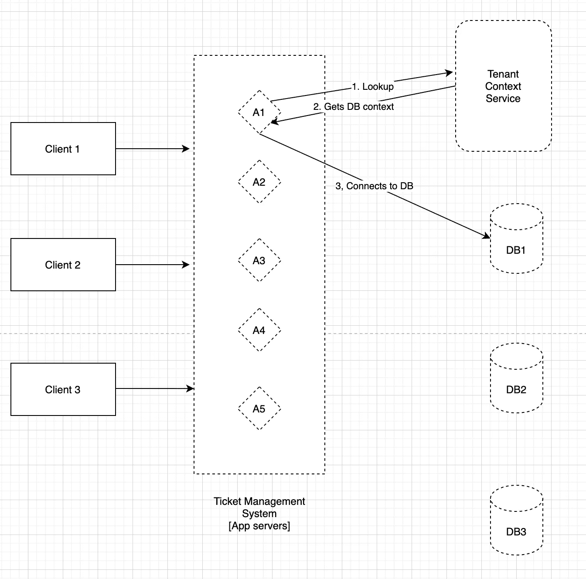

# 票务管理系统设计

> 原文：<https://blog.devgenius.io/ticket-management-system-design-c32f948ce3c4?source=collection_archive---------2----------------------->

> 功能需求

*   多个客户端将连接到一个票证管理系统。
*   根据服务级别协议，票证可以分为不同类型:金牌—2 小时内，银牌—4 小时内，铜牌—8 小时内。
*   给定，每张票需要 1 分钟解决。
*   收到票证时，仅当 SLA 可以保证时才创建票证。
*   必须在客户端特定的数据存储中创建票证。

> 非功能性需求

*   高度可用
*   一致的
*   超低延迟
*   多租户[注意:数据库管理是开发人员的选择]

基础架构

> 公共端点

*   /create_ticket
    -输入:ticket_type，client_id
    -输出:status，ticket_id
*   /取消 _ 票证
    -输入:票证 id
    -输出:状态
*   /create_account
    -输入:客户名称、官方电子邮件、密码
    -输出:状态、客户 id
*   /login
    -输入:client_id
    -输出:sub_domain
*   /logout
    -输入:client_id
    -输出:状态

> 内部端点[在 VPN 内]

*   /validate_eta
    -输入:client_id，ticket_type
    -输出:status，slot_id
    -注意:slot 是软分配的[处于挂起状态]
*   /allocate_slot
    -输入:客户端 id、票证类型、插槽 id
    -输出:票证 id

> 选择

*   DB 类型
    1。NoSQL —可扩展但不一致
    2。SQL —一致但不可扩展
*   DB 设计
    1。针对所有客户端的单一数据库:仅可垂直扩展，并且客户端数据之间没有隔离
    2。单个数据库但不同的模式:隔离但不可水平伸缩。多个数据库:一个或多个数据库/客户端

## 数据库模式

*   每个客户都有自己的数据库。
*   下面的模式是每个客户端数据库。

> 如何验证 ETA

*   在创建票证之前，我们必须检查票证是否可以在请求的 ETA 内解决[基于票证类型:金、银和铜]
*   因此，目前的计划是使用内部端点/validate_eta 来验证 ETA，然后如果可以的话，将请求放入消息总线，如 KAFKA 或 RabbitMQ，并通知客户端。
*   对特定客户机 DB 中的 slots 表进行简单的查询，以获得从当前时间开始在所请求的 ETA 内的最少可用时间，这是可行的。如果我从查询中得到一个时间戳，那么可能没有。
*   查询:select min(time from slots where available = ' available ' and time > now()and time< now() + now() + eta_duration

> Why Multi-Tenant?

Advantages of multi-tenant model

*   The client here itself is a big entity and not an individual customer. So the traffic they draw in will be significant. Single tenant model has scalability issues.
*   Upgrades will be costlier and hard to manage. For about 1000 clients if each client has its own ticketing system. Once we plan to upgrade, we have to do it across clients which is costly.
*   Outage protection.
*   Stateless app servers.
*   Horizontally scalable.

**HLD—尝试 1**

此设置的问题:

*   应用服务器必须计算出每个请求要连接哪个数据库。
*   少数应用服务器可能必须处理数千个数据库。

> HLD —尝试 2

此设置的问题:

*   引入另一个服务来存储数据库上下文增加了另一个中心，随着租户上下文服务记录的增长，它将变得更慢，并将增加延迟。
*   如果不进行扩展，这项服务将成为 SPOF。
*   我们要求这个有:
    1。超低延迟。
    2。高度可扩展。
    3。一致。

> 和平与 CQRS

pace LC[间隙定理的扩展]指出:

在分割的情况下

*   选择可用性+一致性
*   或者延迟+一致性

解决速度限制的方法是 CQRS。

*   使用不同的模型[在应用程序或数据库中]来更新信息和读取信息。
*   这个想法是在写的时候做一次计算，不管做多少次都要用到。
*   所以我们可以把租户上下文服务的 DB 分为命令 DB 和查询 DB。
*   使用命令 DB，我们将实现一致性。
*   有了 Query DB，我们将实现可伸缩性和高可用性。
*   但是整个系统最终会保持一致。

> 最终确定数据库模型

*   此时，我们可以最终确定命令和查询模型的 DB/DB 类型。
*   我选择了一个 NoSQL 数据库——dynamo DB，因为要存储的数据将是精确的键值类型。对于命令和查询模型。
*   此外，计划将查询模型扩展到 AWS 的各个区域(使用 AWS 作为部署平台)。
*   命令和查询数据库之间的同步可以通过 AWS Kinesis 流来完成。
*   使用 DynamoDB 为我们提供了 99.99%的可用性，相当于每年 52 分钟的停机时间。但是，由于我们在整个地区复制了它，因此可用性达到了 99.9999%。
*   个人客户数据库也会选择 Postgres。

> HLD —最终

伙计们，如果你喜欢我的内容，你会考虑关注我的链接:[https://www.linkedin.com/in/hitesh-pattanayak-52290b160/](https://www.linkedin.com/in/hitesh-pattanayak-52290b160/)