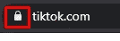
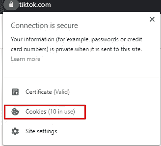
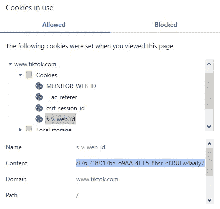
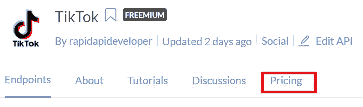
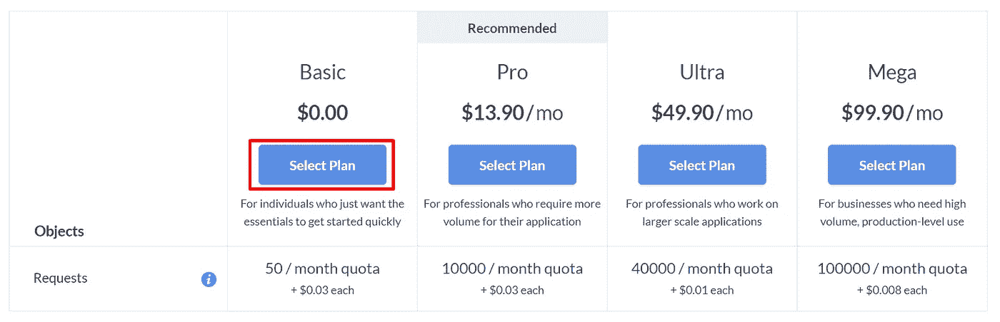
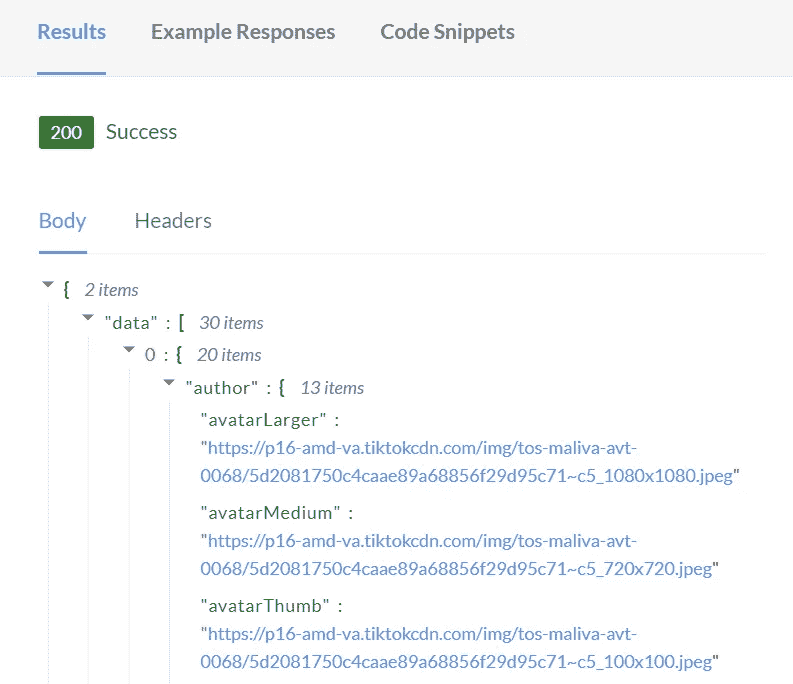
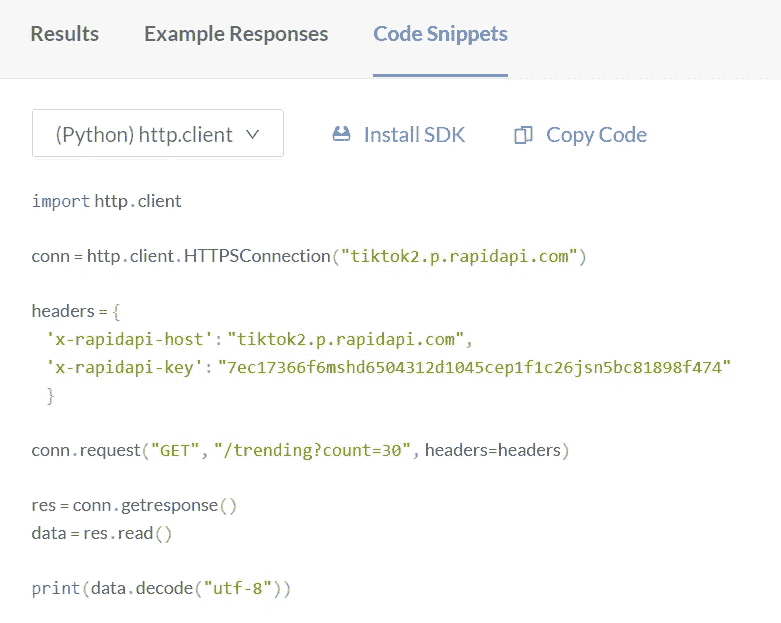

# 抖音 Api Python

> 原文：<https://blog.devgenius.io/tiktok-api-python-41d76c67a833?source=collection_archive---------0----------------------->


照片由[索伦·费伊萨](https://unsplash.com/@solenfeyissa?utm_source=unsplash&utm_medium=referral&utm_content=creditCopyText)在 [Unsplash](https://unsplash.com/s/photos/tiktok?utm_source=unsplash&utm_medium=referral&utm_content=creditCopyText) 上拍摄

在本文中，我将展示如何用 python 轻松地从抖音 API 中检索信息。有两种不同的方法可以访问这个 API。一个将使用我开发的开源免费 python 包。另一个选择是使用 RapidAPI 将这个 API 作为一个服务，它运行我的 python 包，但是你不必担心服务器托管。

如果你更喜欢视觉学习，看看我为使用这个 API 制作的视频。我将在那个频道发布更多与逆向工程网站相关的内容，如果你对此感兴趣，请订阅。此外，请随意查看我的另一个 [YouTube 频道](https://www.youtube.com/c/davidteather)，这是与编程和工程相关的更有趣的内容:)

# 使用免费的 TikTokApi Python 包

在本节中，我们将使用我的免费开源 python 包来检索信息。如果您只是在本地运行脚本，而不是在服务器应用程序中运行，那么这个解决方案是理想的。

**设置 TikTokApi 包**

要设置这个包，你必须运行`pip install TikTokApi`然后`python -m playwright install`来安装这个包和允许这个包在后台运行 chrome 的脚本

然后，我们将创建一个简单的脚本来确保 API 正常工作。我们需要找到 verifyFp 值。要做到这一点，去 tiktok.com 在你的浏览器。

点击 url 旁边的挂锁，如下图所示



然后点击 cookies 显示你当前的 cookies



转到[www.tiktok.com](http://www.tiktok.com)->cookie->s _ v _ webid，然后复制 s_v_webid cookie 的内容并粘贴到 verifyFp 中



```
from TikTokApi import TikTokApi
verifyFp="verify_YOUR_S_V_WEB_ID_COOKIE"
api = TikTokApi.get_instance(custom_verifyFp=verifyFp)
print(api.trending(count=1))
```

如果你把字典打印到屏幕上，那么你就可以继续了。如果你开始遇到问题，检查一下[项目主页](https://github.com/davidteather/tiktok-api)在某个地方的问题标签中肯定会有人有你的问题。

> verifyFp 令牌似乎在大约 2 小时后过期，如果你在一个 verifyFp 下做了太多，它可能会抑制你的请求。目前，你可以通过做`api = TikTokApi.get_instance(custom_verifyFp=verifyFp, use_test_endpoints=True`来规避这个问题，但是我不能保证这在将来会有效

**示例脚本**

现在我们已经正确地设置了这个包，接下来将会有一些你可以用它做什么的演示。

> 终点的完整文档可在[此处](https://github.com/davidteather/TikTok-Api/blob/master/README.md)获得

第一个例子是一个生成抖音汇编的脚本。这是一个由我维护的官方项目，你可以在这里找到[的代码](https://github.com/davidteather/TikTokBot)

以下所有脚本都假设您已经在它们上面附加了以下几行。

```
from TikTokApi import TikTokApi
verifyFp="verify_YOUR_S_V_WEB_ID_COOKIE"
api = TikTokApi.get_instance(custom_verifyFp=verifyFp)
print(api.trending(count=1))
```

流行音乐`api.discoverMusic()`

流行标签`api.discoverHashtags()`

趋势 TikToks `api.trending()`

用户的 TikToks `api.byUsername('therock')`

标签 TikToks`api.byHashtag('funny')`

这个包中还有很多方法，但是这些是用户最常用的方法。

# **抖音 API 即服务**

在这一节中，我将演示如何使用 RapidAPI 将这个包作为服务使用，RapidAPI 是一个允许轻松使用 API 的网站。如果你不想在你的服务器上处理抖音 API 或者你不能让它在服务器上工作(或者如果你只是想支持我)，这个设置是最理想的。

首先，你需要去[RapidAPI.com](https://rapidapi.com/)你需要创建一个账户来使用 API。

接下来，访问 RapidAPI 上的 [TikTokApi](https://rapidapi.com/rapidapideveloper/api/tiktok2)

> 为了尽可能透明，我是这个 API 的创建者，并收取访问它的费用来支付服务器费用(但是有一个免费层)

您需要订阅 API 来测试它。单击顶部的定价选项卡，可以查看不同的计划。



然后会有一些不同的计划可供选择，但我建议现在只做基本的计划，除非你需要更多的请求。



免责声明:计划定价、每月请求和超额收费在未来可能会有所不同。

您将需要添加一张信用卡，以确保 RapidAPI 可以向您收取费用。如果您超过免费层每月 50 个请求的配额，它将向您收取超额费用。

RapidAPI 为您提供了大量有用的示例，可以使用您需要的任何语言。如果您转到 API 的[端点](https://rapidapi.com/rapidapideveloper/api/tiktok2/endpoints)部分，您可以看到您可以发出的所有不同请求。

我将使用趋势抖音端点作为示例。您可以从浏览器测试这些请求。


然后结果会出现在页面的右下角。



您还可以使用代码片段部分生成 python、node.js、PHP 和更多语言，这样您就不必自己编写任何代码。



你可以切换你的语言，只是复制所有的代码。

我希望这篇教程能帮到你，如果你喜欢的话，可以考虑看看我的其他文章，关于你能用 TikTokApi 做的更多事情，你可以在这里找到。我迫不及待地想看到人们能够使用这个 API 完成的所有项目。