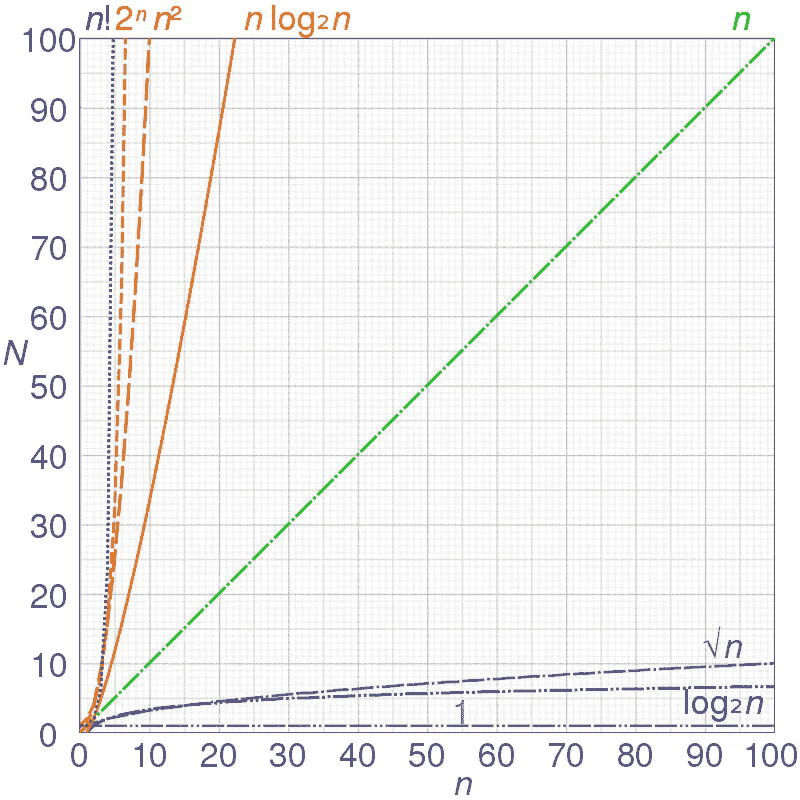
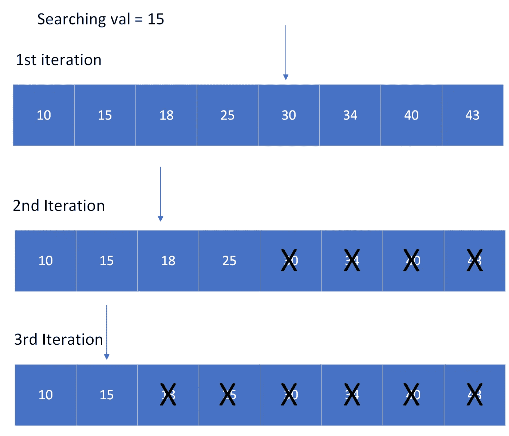
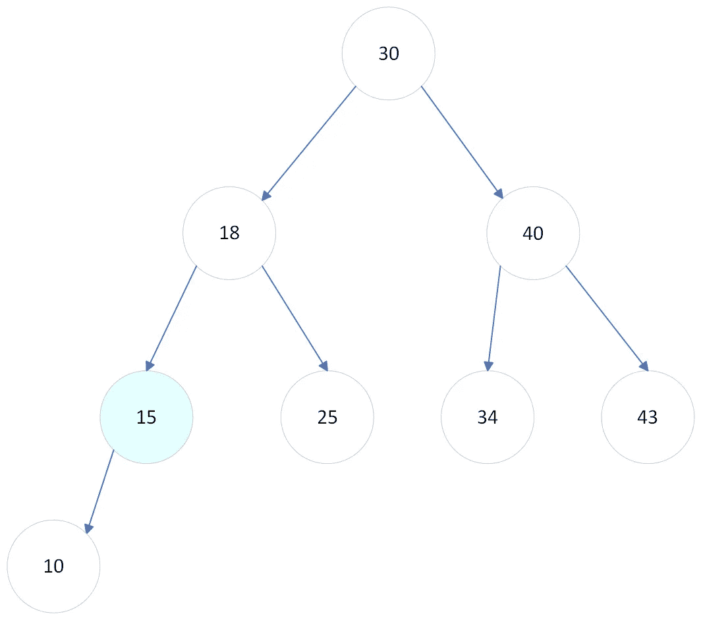

# 算法时间复杂度如何工作(以及它为什么有用)

> 原文：<https://blog.devgenius.io/time-complexity-for-algorithms-simply-explained-part-1-2-ca41f2ebf21a?source=collection_archive---------11----------------------->


沙哈达特·拉赫曼在 [Unsplash](https://unsplash.com/s/photos/function?utm_source=unsplash&utm_medium=referral&utm_content=creditCopyText) 上拍摄的照片

在软件工程行业中，经常看到对例程和算法交付结果所需时间的担忧。

想象一下，你正试图找出去你所在城市的一家餐馆的路。很可能，你会使用谷歌地图之类的应用。给定起点和目的地，应用程序将尝试找到到达目的地的最佳路线。在幕后，它会运行一个算法，以便找到你可以采取的最短路径。

我们需要考虑这个算法要运行多长时间才能给出答案。

如果超过几秒钟，就用户体验而言，它做得不好。

时间复杂性的目的是给我们一些工具来评估一个算法在速度方面做得有多好。以下是我们将涉及的主题的摘要:

1.  什么是算法时间复杂度？
2.  大 O 符号。
3.  我们如何衡量它？
4.  最佳情况、最差情况和一般情况

**算法时间复杂度的定义**

简单地说，算法的时间复杂度是运行时间和输入大小之间的关系。它也可以考虑其他参数。但是通常它只与输入的大小有关。

假设我们有一个未排序的数字数组，我们想计算数字 47 在数组中出现了多少次:

示例:[1，4，2，10，40，25，47，11]

已知数组是未排序的，为了得到数字 47 出现的次数，必须遍历整个数组。

```
inputArray = [1, 4, 2, 10, 40, 25, 47, 11]
count = 0## Loop checking each element of the array
for element in inputArray

  ## Is element equal to 47?  
  if element == 47

    ## If that is the case
    ## Update the count value
    count = count + 1 
```

结果将是 **count = 1** 最后，我们必须遍历数组中的所有元素以获得正确的计数。

有理由假设这段代码运行的计算机时间与其输入的大小成正比(我们将称之为 **n** )。因此可以把它写成 **n.** 的函数

```
Computer Time = f(n)
```

因为我们在每次迭代中唯一要做的事情就是检查一个值是否等于 47。如果我们输入一个两倍大的数组，那么遍历整个数组需要两倍的时间。

**2。大 O 符号**

通常，时间复杂度用 big-O 符号表示。在计算机科学中，根据算法的运行时间和输入大小(以及其他相关参数)之间的相关性对算法进行分类是一种惯例。

几个例子:

*   O(n):算法运行时间的增长与输入大小成正比，正如我们在计算一个数字在数组中出现的次数的例子中所看到的。
*   O(n):算法运行时间的增长与输入大小的平方成正比。
*   O(log n):运行时增长率与 n 的对数(通常以 2 为底)成正比，与 O(n)和 O(n)相比，它的增长速度要慢得多。

下图显示了这些增长率在比较您可能会发现的一些常见时间复杂性时的差异:



增长率对比，图片来自维基百科:[https://en.wikipedia.org/wiki/Big_O_notation](https://en.wikipedia.org/wiki/Big_O_notation)

通常我们感兴趣的是找到一种以尽可能低的增长率运行的算法版本:对数或平方根被认为是最好的。

一个与 n 成正比甚至与 n 成正比的增长率并不理想，但在某些情况下是可以接受的。

另一方面，指数或阶乘增长的 rates(2^n 和 **n！**)在性能方面简直是噩梦。

**只有主导术语才重要**

假设我们正在运行一个具有以下复杂性表达式的算法:

*f(n)* = *8n + 2n*

意味着它的运行时间与上面的函数成正比。

随着 *n* 变得非常大，在 *f(n)* 表达式中 *2n* 的影响变小。换句话说， *n* 是 *f(n)的主导项。*

实际上，我们不需要把这个算法的复杂度写成:

O( *8n + 2n*

仅仅表示为 O( *n* )就足够了，注意我们甚至没有包括常数乘以 *n .*

这个推理可以应用到任何其他复杂度类型: *log n* ， *n* 等等。它简化了表达复杂性的方式，我们只需要关心与其他项相比增长最快的项。

这就是 big-O 符号如此有趣的原因，它允许我们将最终在运行时间和输入大小之间具有相同依赖性的算法组合在一起。

我们如何衡量它？

既然我们理解了时间复杂性的含义以及如何表达它，我们需要问自己:我们如何测量或估计它？

嗯，没有固定的数学公式可以找到它，它是通过计算算法执行的运算次数来估计的。

回到最初的例子:要计算数组中数字的出现次数，涉及的操作有:

*   遍历数组
*   检查一个元素是否等于 47(或任何其他数字)
*   递增计数器

我们可以认为等式检查总是要花费相同的时间(我们称之为单一操作)。此外，我们正在重复这个操作 **n** 次。

让我们假设，在运行我们的出现计数算法时，我们还想计数我们得到小于 10 的数的次数。

新算法看起来会像这样:

```
inputArray = [1, 4, 2, 10, 40, 25, 47, 11]
count = 0
countLessThan10 = 0## Loop checking each element of the array
for element in inputArray

  ## Is element equal to 47?  
  if element == 47

    ## If that is the case
    ## Update the count value
    count = count + 1

  if 10 > element

    countLessThan10 = countLessThan10 + 1
```

我们正在运行的操作有:

1.  遍历数组
2.  检查元素是否等于 47(或任何其他数字)。
    如果是这种情况，增加计数器
3.  检查元素是否小于 10(或任何其他数字)。
    如果是这种情况，增加计数器

条件检查将在每次迭代中发生，因此，如果计数器频繁递增**，时间复杂度将是类似于 **2n** 或 **3n** 的东西。**

由于优势原理，我们可以把乘法常数放在一边。时间复杂度仍然可以表示为 **O(n)。**

**最佳情况、最差情况和一般情况**

区分算法可以运行和落入一些不同的情况是很重要的。让我们用另一个算法例子来理解这一点:

假设我们只想检查一个数字数组中是否有某个值:

```
function checkArrayHasValue(searchedNum, array)

  for element in array
    ## Equality check
    if element == searchedNum
     ## Return true if the element has been found      
     return true

  ## Return false if the searched number
  ## Was not found
  return false## Worst case example## Check if the array [1, 2, 3, 4] has the number 10 in it
checkArrayHasValue(10, [1, 2, 3, 4])## Best case example
checkArrayHasValue(10, [10, 2, 3, 4])## Average case
checkArrayHasValue(10, [1, 2, 10, 3, 4])
```

在最坏的情况下，我们必须遍历整个数组。 **(O(n))**

在最好的情况下，我们能够马上确定答案，因为数字 10 在数组的开始。 **(O(1))**

一般情况下会介于这两者之间。
**(O(n/2)(大致)= > O(n))**

**我们应该用哪一个？**

更有趣的是，我们的算法有一个执行上限。它告诉我们运行一个算法的最大计算机时间。

因此，通常将时间复杂度表示为陷入最坏情况。除了最坏的情况极不可能发生，而一般情况在大多数时候能更好地预测会发生什么的情况。然后，我们可以采用平均用例来表示时间复杂度。

**实际例子:二分搜索法**

二分搜索法算法广泛用于在**排序的**值列表中查找元素。它是这样工作的:

输入:一个大小为 **n** 的数组和一个我们想要查找的值( **val** )

1.  我们首先将数组分成两半，检查中间的元素是否等于 **val** 。如果不是这样，我们转到以下步骤。
2.  如果中间的元素大于 **val，**我们丢弃数组的后半部分。如果中间的元素小于 **val** ，我们丢弃数组的前半部分。
3.  对于数组的剩余部分，我们重复这个过程，直到找到所需的元素。



二分搜索法的例子。作者图片

最好的情况:最好的情况是当我们在第一次试验中发现期望值正好在数组的中间，O(1)

最坏情况:下面的图片将帮助我们想象最坏情况的复杂性



二分搜索法图。作者图片

花了三次迭代才找到期望值。换句话说，我们必须将数组划分两次，才能找到搜索到的值。由于数组的原始大小为 8，我们最多只能将数组划分三次:

值得注意的是 *8 = 2*

从上图来看，更准确地说，最糟糕的情况是搜索 **val = 10** 。最坏的情况与阵列可以被分成两半的次数成正比。

4 号的 2 倍，

8 码的 3 倍，

16 码的 4 倍，以此类推。

对应的是对数增长。我们可以得出结论，最坏情况的复杂度是 O(log n)

平均情况也将与 log n 成正比。

因此，我们观察到，在二分搜索法:

*   最佳情况:O(1)
*   最坏情况:O(log n)
*   平均情况:O(对数 n)

**结论**

在本文中，我们探讨了时间复杂性的含义。以下是一些关键要点:

*   时间复杂性是一种表达算法运行时间与其输入大小和其他相关参数之间的相关性的方式。
*   它作为一种效率的衡量标准，允许我们比较不同算法的性能。
*   这种度量通常用 big-O 符号表示。通常我们只考虑它的主导项。
*   我们可以通过计算执行的操作数来估计时间复杂度。

谢谢你坚持到最后！如果这些见解有所帮助，请考虑关注我的 [Medium](https://medium.com/@leonardo5621_66451) 以获取更多像这样的故事！