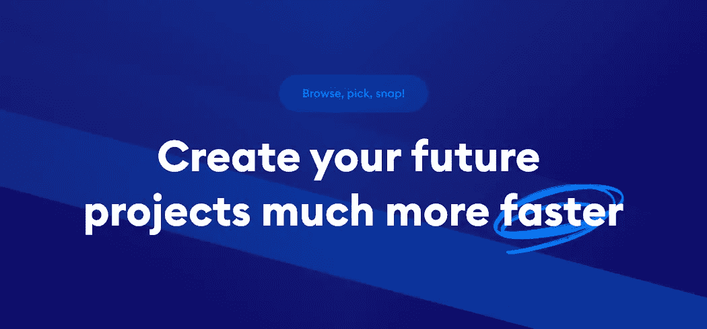
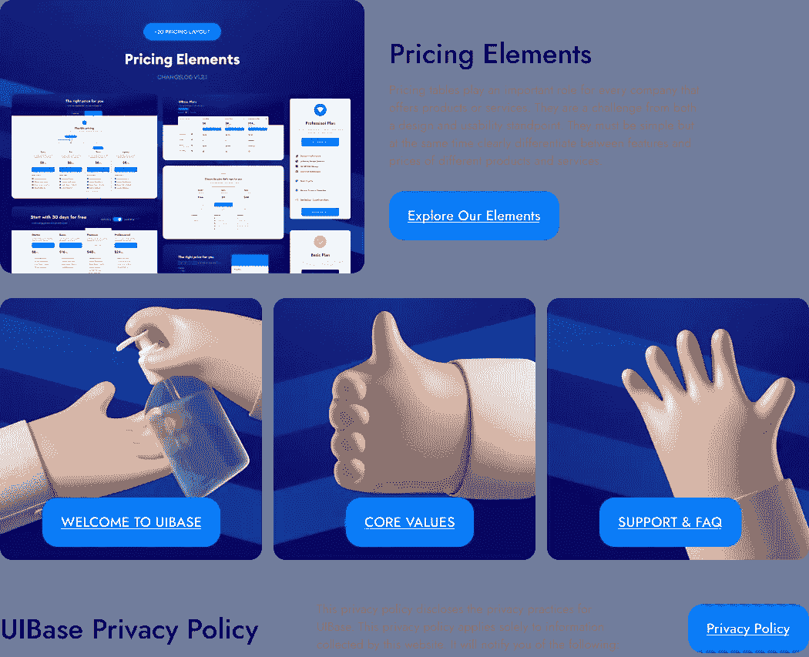

# 节省时间，创意迸发的用户界面库

> 原文：<https://blog.devgenius.io/time-saving-idea-sparking-ui-library-9d76793b42d6?source=collection_archive---------3----------------------->

UIBase 创建了一个专业的设计库和 UI 工具包。

# **与 UIBase 见面👋**

**UIBase** 是一个快速启动计划，面向希望在这一领域提升自己的初创公司、数字机构、设计师和用户。我们为用户创造了+900 个元素。我们准备销售的每件产品的价格是**固定 12 美元**。有了我们的产品，您为客户或自己创建的每个工作区域都将变得更快。

发布的元素

我们的产品正在开发中，分别为 **Figma** 、 **Adobe XD** 、 **Sketch** 和**编码模板**。在我们创造了许多让用户满意的产品后，我们开始用**网页设计库**为您的需求提供最快的解决方案。您可以通过在 **3 个步骤**中将您购买的元素组应用到您自己的工作流程中来加快您的工作。

您可以通过您购买的每个产品的欢迎屏幕上的链接或从我们的网站与我们联系。您可以从我们的联系页面向我们提出您想要开发的产品的请求。我们的目标是开发适合每个预算的产品，并增加用户对这些产品的可访问性。通过跟踪变更日志，您可以跟踪我们最近添加的产品，产品是为哪个计划设计的，以及我们处于哪个阶段。

欢迎屏幕上的信息内容。

**美观、现代、简洁的用户界面**

我们投入了大量精力来创建一个方便易用的统一系统

为 Sketch、Figma 和 Adobe XD 构建

你可以通过[这个链接](https://uibase.design/elements/)联系到我们的元素组，更密切地关注我们。

## UIBase v1.2.1 现已上线！

 [## UI Base -终极 UI 元素库

### 设计原则漂亮，现代和干净的用户界面浏览，挑选，快照！只需找到您想要的组件，然后…

uibase.design](https://uibase.design/) 

# 感谢滚动🤗