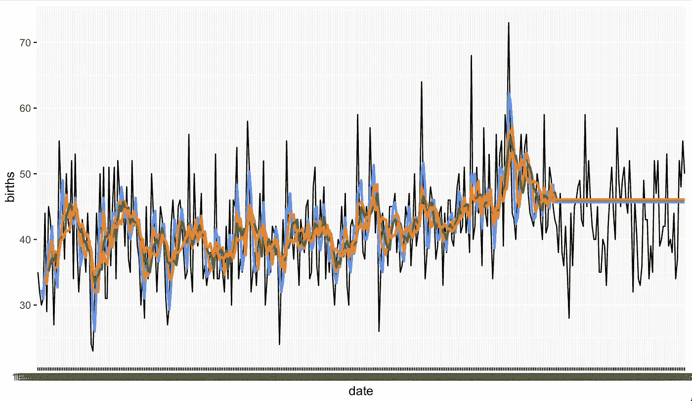
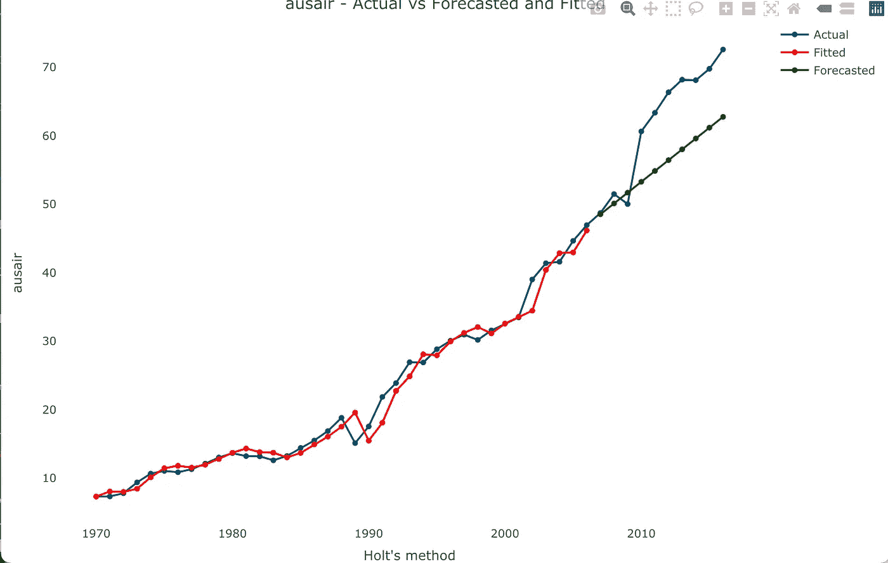
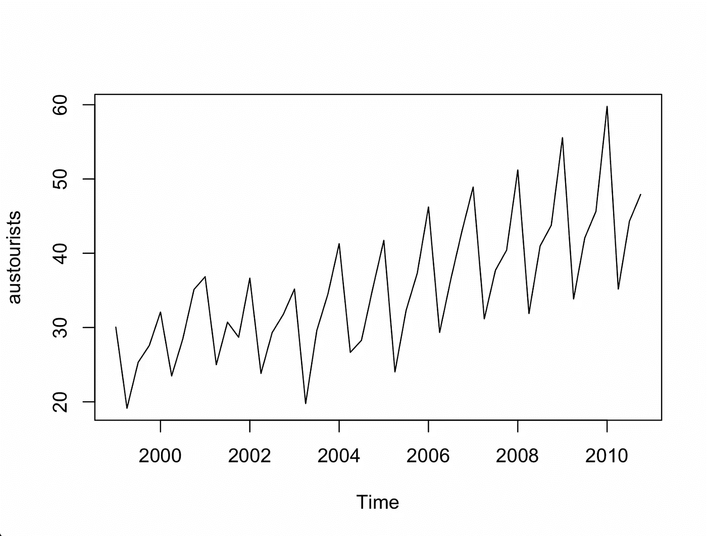

# R 中的时间序列分析:移动平均和指数平滑

> 原文：<https://blog.devgenius.io/time-series-analysis-in-r-moving-averages-and-exponential-smoothing-986f2b1a273?source=collection_archive---------1----------------------->

在我深入时间序列之前，我想花点时间把这篇文章中使用的代码归功于波格丹一世·阿纳斯塔西。他有一门 Udemy 课程，叫做 R 中的时间序列预测:一种脚踏实地的方法，在那里我学到了这段代码。他已经允许我使用这个密码。我强烈推荐他的时间序列课程:

阿纳斯塔西耶，b .(未注明)。*R 中的时间序列预测:一种脚踏实地的方法*。乌德米。检索于 2022 年 12 月 16 日，来自[https://www . udemy . com/course/time-series-forecasting-in-r-a-脚踏实地的方法/](https://www.udemy.com/course/time-series-forecasting-in-r-a-down-to-earth-approach/)

此外，我推荐下面这本书，我会在这篇文章中参考:

克里斯平河(2019)。*用 R 动手做时间序列分析:用 R* 进行时间序列分析和预测。打包。

# 移动平均线

移动平均是一个平滑函数，按时间顺序对过去和未来的观察值进行平均(Krispin，2019)。

居中移动平均数取一个选定的奇数移动平均数，并使用相邻值计算平均值。

在这项分析中，我将使用 1959 年加州每天的女性出生总数。

#居中移动平均值
dfb < - read.csv("每日-总-女性-分娩数-CA.csv "，header = T)

quartz()
ggplot(dfb，aes(date，births，group=1)) + geom_line()

此数据中没有趋势或季节性，因此适用于中心移动平均计算。

计算大小为 5、15 和 25 的移动平均值:

DFB $ ma5DFB $ ma15<-roll mean(DFB $ births，15，align = "center "，fill = NA)
DFB $ ma25<-roll mean(DFB $ births，25，align = "center "，fill = NA)

quartz()
gg plot(DFB)+
geom _ line(AES(date，births，group = 1))+
geom _ line(AES(date，ma5，group = 1)，color = "red "，size=1)

quartz()
gg plot(DFB)+
geom _ line(AES(date，births，group = 1))+
geom _ line(AES(date，ma15，group = 1)，color = "red "，size=1)

quartz()
gg plot(DFB)+
geom _ line(AES(date，births，group = 1))+
geom _ line(AES(date，ma25，group = 1)，color = "red "，size=1)

您可以放大数据的一部分。这里是 75 天，移动平均线为 5:

ggplot(dfb[25:100，]) +
geom_line(aes(date，births，group = 1))+
geom _ line(AES(date，ma5，group = 1)，color = "red "，size=1)

使用相同的数据，我现在想使用移动平均线预测每日出生人数，移动平均线位于窗口的末端。移动平均线可用于预测。最后计算的值成为未来的预测值。

使用移动平均数预测每日出生人数:

摘要(DFB)
#数据的长度是 365，我将对数据进行 80/20 分割，以创建训练和测试集

365/100 = 3.65 * 80 = 292

DFB _ trainDFB _ test<-DFB[293:365，] #.2

总结(DFB _ test)#长度 73

#使用窗口大小 3、5、7 和 10
ma3 _ train<-roll mean(DFB _ train $ births，3，align = "right "，fill = NA)
ma5 _ train<-roll mean(DFB _ train $ births，5，align = "right "，fill = NA)
ma7 _ train<-roll mean(DFB _ train $ births，7，align = "right "，fill= NA)
ma1

#测试集中的预测等于最后的平均值
#建立预测值的向量，使用参数 1，提取最后的值 73 次，因为测试集有 73 天
ma3 _ test<-rep(tail(ma3 _ train，1)，73)
ma5 _ test<-rep(tail(ma5 _ train，1)，73)
ma7 _ test<-rep(tail(ma7 _ train，1)，73)【T8

ma3 _ 测试# 45.66667
ma5 _ 测试# 46
ma7 _ 测试# 47.14286
ma10 _ 测试#46.1

#使用原始数据集中的估计出生数创建变量，这将包含训练集和测试集中的估计值
dfb$ma3 < - c(ma3_train，ma3 _ test)
DFB $ ma5<-c(ma5 _ train，ma5 _ test)
DFB $ ma7<-c(ma7 _ train，ma5 _ test)
DFB $ ma10<-c(ma10 _ train，ma10

#在同一个图表上绘制所有平滑后的序列
quartz()
gg plot(DFB)+
geom _ line(AES(date，births，group = 1))+
geom _ line(AES(date，ma3，group = 1)，color = "cornflowerblue "，size = 1)+
geom _ line(AES(date，ma5，group = 1)，color = "coral2 "，size = 1)+
geom _ line(AES(AES

#计算预测准确性的自定义函数

平均绝对值是测试集中观测值的预测误差绝对值的平均值。

#平均绝对值
compute _ Mae<-function(OBS，pred){
ABS diff<-sum(ABS(OBS—pred))
Mae<-ABS diff/length(pred)
return(Mae)}

测试集中的# compute MAE
#第一个参数是观察值的向量
#第二个参数是预测值的向量
compute _ MAE(DFB＄births，ma3 _ test)# 33.09589
compute _ MAE(DFB＄births，ma5 _ test)# 33.84932
compute _ MAE(DFB＄births，ma7 _ test)# 36.98434
compute _ MAE(DFB＄births

#平均误差
#创建平均误差函数
compute _ avg err<-function(OBS，pred){
diff<-sum(OBS—pred)
avg err<-diff/length(pred)
return(avg err)
}

#计算测试集中的平均误差
compute _ avg err(DFB＄births，ma3 _ test)#-18.42922
compute _ avg err(DFB＄births，ma5 _ test)#-20.09589
compute _ avg err(DFB＄births，ma7 _ test)#-25.81018
compute _ avg err(DFB＄births，ma10 _ test)#-20.5989

均方根误差根据预测值和观测值计算平均距离。

#创建函数并计算 RMSE
compute _ RMSE<-function(OBS，pred){
sq diff<-sum((OBS-pred))
RMSE<-(sq diff/length(pred))⁰.5
return(RMSE)
}

compute _ rmse(DFB＄births，ma3 _ test)# 18.36224
compute _ RMSE(DFB＄births，ma5 _ test)# 18.70865
compute _ RMSE(DFB＄births，ma7 _ test)# 20.06185
compute _ RMSE(DFB＄births，ma10 _ test)# 18.81709
#同样，最小的 RMSE 是三阶移动平均值

平均绝对百分比误差衡量预测的准确性。
准确率指标:
< 10%非常准确预测
10%-20%准确预测
20%-50%合理预测
> 50%不准确预测

#平均绝对百分比误差
#为平均绝对百分比误差创建函数，然后计算
compute _ mape<-function(OBS，pred){
percs<-sum(ABS((OBS—pred)/OBS))* 100
mape<-percs/length(pred)
return(mape)
}

compute_mape(dfb$births，ma3 _ test)# 87.75139
compute _ mape(DFB $ births，ma5 _ test)# 90.04174
compute _ mape(DFB $ births，ma7 _ test)# 99.09173
compute _ mape(DFB $ births，ma10 _ test)# 90.82414
#最低的是 ma3，但你可以看到预测非常

平均绝对标准误差也衡量预测的准确性。预测值的平均绝对误差除以原始预测的平均绝对误差。如果这些值小于 1，则预测优于简单的预测。

#平均绝对标准误差
#创建并计算平均绝对标准误差
compute _ mase<-function(OBS _ test，pred_test，OBS _ train){
ABS diff _ test<-sum(ABS(OBS _ test—pred _ test))
Mae _ test<-ABS diff _ test/length(pred _ test)
vect _ ABS diff _ train<-NULL
for(I in 2

compute_mase(dfb_test$births，ma3_test，DFB _ train $ births)# 0.7546234
compute _ mase(DFB _ test $ births，ma5_test，DFB _ train $ births)# 0.7685531
compute _ mase(DFB _ test $ births，ma7_test，DFB _ train $ births)# 0.834481
compute _ mase(DFB _ test $ births，ma5)

# 指数平滑法

简单指数平滑通过使用加权平均值来预测未来值，其中最近的观测值权重更大(Krispin，2019)。例如，当 alpha 级别为 0.8 时，第二个最近的观察值将乘以权重 0.16，即 0.8*0.2。下一个最老的观察值将被乘以权重 0.032，即 0.8*0.2，并且这种趋势继续到最老的观察值。较大的 alpha 值将赋予最近值更大的权重，而较小的 alpha 值将赋予旧值更大的权重。为了计算估计值，选择一个时间段(例如 3 个时间段),将值乘以它们的权重，然后将这些值相加得到估计值。简单指数平滑适用于没有趋势或季节成分的数据。

#简单指数平滑
要求(ggplot2)
要求(预测)

ggplot(dfb，aes(date，births，group = 1))+
geom_line()

#在测试集中创建训练和测试集
dfb_train < - dfb[1:292，]# . 8
DFB _ test<-DFB[293:365，]# . 2
ntest<-nrow(DFB _ test)
ntest # 73 天

#无趋势或季节性的加性误差
？ets()#模型详细解释

模型
#预测值
模型$拟合

#在测试集中进行预测，将置信水平设置为 0，点预测
预测< -预测(模型，h=ntest，水平= 0)
#ntest 是 73 天，测试集中的时段
预测#45.99809

#制作预测值的向量，并将其作为变量添加到我们的数据中
pred_ses < - c(模型$拟合，pred $均值)
pred _ ses
DFB $ pred _ ses<-pred _ ses
DFB $ pred _ ses

quartz()
gg plot(DFB)+
geom _ line(AES(date，births，group=1))+
geom _ line(AES(date，pred_ses，group = 1)，color="darkorange2 "，size = 1)+
geom _ vline(AES(xintercept = 292)，color="red "，size=0.8)

#计算准确性指标
准确性(pred，dfb_test$births)

#改变 alpha 等级并重新测试，只为对比不同的结果
模型< - ets(dfb_train$births，model = "ANN "，alpha = 0.7)

#预测值
模型$拟合

#在测试集中进行预测，将置信水平设置为 0，点预测
预测< -预测(模型，h=ntest，水平= 0)
#ntest 是 73 天，测试集中的时段
预测#43.94793

#制作预测值的向量，并将其作为变量添加到我们的数据中
pred_ses < - c(模型$拟合，pred $均值)
pred _ ses
DFB $ pred _ ses<-pred _ ses
DFB $ pred _ ses

quartz()
gg plot(DFB)+
geom _ line(AES(date，births，group=1))+
geom _ line(AES(date，pred_ses，group = 1)，color="darkorange2 "，size = 1)+
geom _ vline(AES(xintercept = 292)，color="red "，size=0.8)

#计算精确度指标
精确度(pred，dfb_test$births)

添加一个置信度。
模型< - ets(dfb_train$births，model = "ANN "，alpha = 0.2)

#在测试集中进行预测，将置信度设置为 0.95
pred<-forecast(model，h=ntest，level = c(0.95))
pred # 45.99809

绘图(预测)

强的松

霍尔特方法使用加权平均值，并且“基于使用两个平滑参数α和β估计最近的水平和趋势”(Krispin，2019 年，第 312 页)。水平由 alpha 计算，而趋势由 beta 计算。霍尔特方法适用于有趋势的数据。

#高级指数平滑

#霍尔特法
库(TSstudio)
库(fpp2)
？ausair
“年度航空乘客总数(百万)，包括在澳大利亚注册的航空公司的国内和国际乘客。1970–2016."

情节(澳大利亚)

#拆分数据但留出 10 年，创建训练和测试集
ausair _ split<-ts _ split(ausair，sample . out = 10)
ausair _ train<-ausair _ split $ train
ausair _ test<-ausair _ split $ test

？holt()
#Initial:用于选择初始状态值的方法。
#如果是最优的，使用 ets 优化初始值和平滑参数。
#如果简单，初始值被设置为通过对最初几个观察值进行简单计算获得的值。

ausair_model

ausair_model$model

accuracy(ausair_model, ausair_test)

test_forecast(ausair, forecast.obj = ausair_model, test = ausair_test)

autoplot(ausair_model)

#Holt method, second example

require(ggplot2)
要求(预测)
要求(润滑)
库(fpp)
数据(ausair)

#将 ausair 转换为数据帧
ausair _ df<-data . frame(ausair)
dim(ausair _ df)

绘图(ausair_df)

#分割训练和测试数据
ausair _ train<-ausair _ df[1:30，]
ausair _ test<-ausair _ df[31:40，]
ausair_test

#使用“ZZZ”时自动选择最优模型，可以选择自己的 alpha 和 beta 值
model _ ZZZ<-ets(ausair _ train，model = "ZZZ "，alpha = 0.999，beta = 0.0886)

plot(model _ zzz)
#分解采用 ETS(M，A，N)方法

型号 _ zzz $已安装

#测试集预测
预测 _zzz < -预测(模型 _zzz，h=10，级别= 0)
预测 _zzz
图(预测 _zzz)

#您可以更改预测区间
pred _ zzz<-forecast(model _ zzz，h=10，level = c(80，95))
pred _ zzz
plot(pred _ zzz)

精度(pred_zzz，ausair_test)

#尝试加性误差，加性趋势，无季节性
model _ aan<-ets(ausair _ train，model = "AAN "，alpha = 0.999，beta = 0.0886)
plot(model _ aan)

安装的型号

#测试集的预测
pred_aan < -预测(模型 _aan，h=10，级别= 0)
pred_aan
图(pred_aan)

精度(pred_aan，ausair_test)

霍尔特-温特斯法可用于既有趋势性又有季节性的数据。

#Holt Winters 方法、趋势和季节性
需求(预测)
需求(lubridate)
库(fpp)
库(TSstudio)

#austourists，1999-2010 年国际游客在澳大利亚的季度游客夜。
数据(澳大利亚游客)

情节(澳大利亚游客)

austourists_decom 剧情(austourists_decom)

#创建训练和测试数据集
aus tourists _ split<-ts _ split(aus tourists，sample . out = 12)
aus tourists _ split $ train
aus tourists _ split $ test

#为训练集
创建季节性时间序列 aus tourism _ train _ ts<-ts(aus tourism _ split $ train，freq = 4，start = 1999)
#数据是每季度一次的，因此频率设置为 4

#zzz 模型所以为我选择最优模型
model _ HW<-ets(aus tourist _ train _ ts，model = " ZZZ ")
summary(model _ HW)

预测预测

准确性(pred，austourists_split$test)

#预测国际游客未来每季度的游客住宿天数
pred_f < -预测(model_hw，h=12+12，level=0)
tail(pred_f$mean，12)

plot(tail(pred_f$mean，12))

当数据是多季节的时，可以使用函数 msts()。电力生产数据显示了年度和月度趋势。

#多季节时间序列的扩展指数平滑法

ggplot(ep，aes(mdy(DATE)，Value，group=1))+
geom_line()

ggplot(ep[1:24，]，aes(mdy(DATE)，Value，group=1))+
geom_line()

计数毫秒#月度和年度
计数毫秒

#建立模型
模型 _tbats < - tbats(cnt_ms)

model _ tbats $ fitted.values #模型中的估计值

型号 _tbats

精度(model_tbats$fitted.values，model_tbats$y)
#y 为实际值

#使用拟合值创建一个新变量
EP $ pred<-model _ tbats $ fitted . values
head(EP)

#plot 系列
库(gg plot 2)
gg plot()+
geom _ line(data = EP，aes(mdy(DATE)，Value，group = 1))+
geom _ line(data = EP，aes(mdy(DATE)，pred)，
color="dodgerblue4 "，size = 1)+
xlab(" DATE ")+
ylab(" Electricity ")

#未来两年的月度预测
pred_tbats < -预测(model_tbats，h=24，level = 0)
pred _ tbats＄平均值

#将预测添加到绘图中，使用预测创建第二个数据集

#创建日期向量
fdates<-seq(mdy(" 2–01–2018 ")，mdy(" 1–01–2020 ")，30)
fdates

#使用预测
未来<-as . data . frame(cbind(date = f dates，pred_f=pred_tbats$mean))
未来创建数据集

#date 不是日期格式，使用 as_date 函数
future $ date<-as _ date(future $ date)
future

# plot
gg plot()+
geom _ line(data = EP，aes(mdy(DATE)，Value，group = 1))+
geom _ line(data = EP，aes(mdy(DATE)，pred)，
color="dodgerblue4 "，size = 1)+
geom _ line(data = future，aes(date，pred_f)，
color="darkorange2 "，size=1)+
xlab("Date ")

也可以使用黄土的季节和趋势分解。使用 STLM，可以控制季节性和趋势性组件。

#STLM 模式

绘图(mstl(cnt_ms))

model_stlm
精度(model _ stlm $拟合，ep $值)

EP＄pred

# plot
gg plot()+
geom _ line(data = EP，aes(mdy(DATE)，Value，group = 1))+
geom _ line(data = EP，aes(mdy(DATE)，pred)，
color="dodgerblue4 "，size = 1)+
xlab(" DATE ")+
ylab(" Value ")

