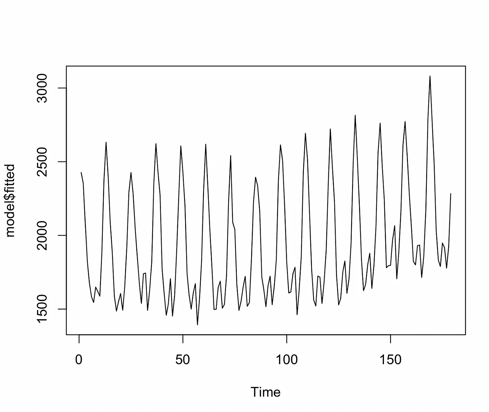
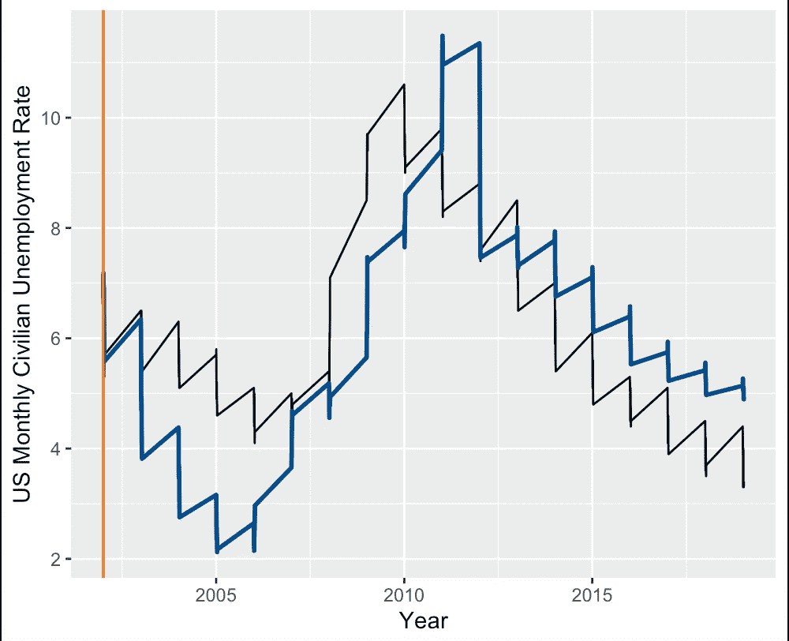

# R 中的时间序列分析:回归、自回归模型和神经网络

> 原文：<https://blog.devgenius.io/time-series-analysis-in-r-regression-autoregressive-models-and-neural-networks-c340720d06c6?source=collection_archive---------5----------------------->

在我深入时间序列之前，我想花点时间把这篇文章中使用的代码归功于波格丹一世·阿纳斯塔西。他有一门 Udemy 课程，叫做 R 中的时间序列预测:一种脚踏实地的方法，在那里我学到了这段代码。他已经允许我使用这个密码。我强烈推荐他的时间序列课程:

阿纳斯塔西耶，b .(未注明)。*R 中的时间序列预测:一种脚踏实地的方法*。乌德米。检索于 2022 年 12 月 16 日，来自[https://www . udemy . com/course/time-series-forecasting-in-r-a-脚踏实地的方法/](https://www.udemy.com/course/time-series-forecasting-in-r-a-down-to-earth-approach/)

# 回归

时间序列回归模型使用过去观察值的线性组合来预测未来观察值。我将展示趋势和季节性是如何被回归模型捕捉到的。

要求(ggplot2)
要求(lubridate)
要求(预测)
要求(fpp2)
要求(TSstudio)

ts_plot(美国天然气)

#转换为数据帧
us gas _ df<-ts _ to _ prophet(us gas)

dim(usgas_df)
.8 * 238

us gas _ trainus gas _ test<-us gas _ df[191:238，]

新测试新测试#48

绘图(美国天然气公司 _df$y)

#放大
图(usgas_df$y[1:24])

#似乎有每月的季节性成分

#建立模型
us gas _ train _ ts _ season<-ts(us gas _ train $ y，freq=12)
#freq = 12 以说明月份

model _ season#线性趋势分量、二次趋势分量和季节分量，如果要在趋势保持二次的同时使季节分量相乘，则添加 lambda = 0

型号 _ 季节

总结(型号 _ 季节)

pred_season 精度(pred_season，usgas_test$y)

us gas _ train $ pred _ train _ seasonus gas _ test $ pred _ test _ season<-pred _ season $均值

头(usgas_df)
头(usgas_test)

gg plot()+
geom _ line(data = US Gas _ df，aes(ydm(ds)，y，group = 1))+
geom _ line(data = US Gas _ train，aes(ydm(ds)，pred_train_season)，
color="dodgerblue4 "，size=1)+
geom _ line(data = US Gas _ test，aes(ydm(ds)，pred_test_season)，
color="dodgerblue4 "，size = 1

gg plot()+
geom _ line(data = US Gas _ df[191:238，]，aes(ydm(ds)，y，group = 1))+
geom _ line(data = US Gas _ test，aes(ydm(ds)，pred_test_season)，
color="dodgerblue4 "，size = 1)+
xlab(" Year ")+
ylab("美国每月天然气消耗量")

# 自回归模型

自相关测量数据与滞后的相关性，滞后是数据的延迟版本。例如，一阶滞后将被延迟一个周期，二阶滞后将被延迟两个周期。自相关和部分自相关函数可用于测量这些滞后。自回归过程值可以通过结合适当的滞后值由部分自相关函数来确定。例如，如果在第七个滞后有相关性，AR 等于 7 可能是一个好的选择。这可能需要一些尝试和错误。如果误差项具有模式，可以使用移动平均过程。MA 过程值可以通过参考自相关函数的滞后结果来确定。自回归和移动平均过程可以合并(ARMA)。值得注意的是，自回归模型要求时间序列是平稳的，这可以通过 Dickey-Fuller 检验来确认。如果数据碰巧不是静态的，可以使用差分法。如果包含滞后变量的差异，该模型是自回归综合移动平均(ARIMA)。

#自回归模型

# simulations
#创建 700 个值的二阶自回归模型
set . seed(7)
stat _ ts<-ARIMA . sim(list(order = c(2，0，0)，ar=c(0.4，0.3))，n = 700)
#定义阶向量，阶为 2，0 为差分度，0 为移动平均过程的阶
#只有一个二次的 ar 过程
plot(stat_ts

#模拟一个三阶过程
stat _ ts<-ARIMA . sim(list(order = c(3，0，0)，ar=c(0.3，0.2，0.1))，n = 700)
#定义阶向量，阶为 3，0 为差分度，0 为移动平均过程的阶
#只有一个三阶 ar 过程，一个三阶 ar 过程
plot(stat_ts)

#移动平均过程，过去误差项的线性组合
#可用于改进模型，如果误差项具有某些模式
stat _ ts<-ARIMA . sim(list(order = c(0，0，2)，ma=c(-0.1，0.1)，n = 700)
#第一个元素为 0，ar 过程不包括在此，差分度为 0，
# ma 过程为 2，然后用 ma 参数
定义系数

#模拟 ARMA 过程，(3，2)
stat _ ts<-ARIMA . sim(list(order = c(3，0，2)，ar=c(0.3，0.2，0.1)，MA=c(-0.1，0.1)，n=700)
#order 3 自回归过程，0 差分，2 移动平均过程，然后指定 ar 和 ma 的系数
plot(stat_ts)

#ARIMA，包含滞后变量的差分
stat _ ts<-ARIMA . sim(list(order = c(3，1，2)，ar=c(0.3，0.2，0.1)，MA=c(-0.1，0.1)，n=700)
#ar 过程 3，差分 1，ma 过程 2
quartz()
【plot(stat _ ts)
#模拟的时间序列不是平稳的，趋势不是恒定的

我现在将使用我在回归中使用的相同的美国天然气公司数据集，并应用 ARIMA 模型。

需求(预测)
需求(t 系列)
需求(ggplot2)
需求(lubridate)
需求(TSstudio)

#转换为数据帧
数据()
USgas
ts_plot(USgas)

usgas_df 头(usgas_df)
尾(usgas_df) #238 2

.75 * 238 #179

#创建训练和测试集
us gas _ train<-us gas _ df[1:179，]
us gas _ test<-us gas _ df[180:238，]
ntest<-nrow(us gas _ test)
ntest

#将训练集转换为时间序列
us gas _ train _ ts<-ts(us gas _ train $ y)

#平稳性测试
adf.test(usgas_train_ts，alternative = " stationary ")
# HO:>. 05 序列不平稳
#HA: < .05 序列平稳
# p 值为 0.01，序列通过平稳性测试

#如果有必要进行差分:
# us gas _ train _ ts _ diff<-diff(us gas _ train _ ts，differences = 1)

石英()
Pacf(us gas _ train _ ts)#用于 AR 过程
#13

石英()
Acf(us gas _ train _ ts)#用于并购过程
#22

#建立模型
？Arima()
模型< - Arima(usgas_train_ts，order = c(13，0，22)，method = c(" ML ")
# ML 法是最大似然，备选项是最小化条件平方和" CSS "

摘要(模型)

石英()
图(模型$拟合)

quartz()
图(模型$残差)

#对测试集
pred < - forecast(model，h=ntest，level=0)
accuracy(pred，usgas_test$y)进行预测

开发关闭()

us gas _ train＄train _ predus gas _ test＄test _ pred<-pred＄均值

负责人(美国气体测试)

gg plot()+
geom _ line(data = US Gas _ df，aes(ydm(ds)，y，group = 1))+
geom _ line(data = US Gas _ train，aes(ydm(ds)，train_pred)，
color="dodgerblue4 "，size=1)+
geom _ line(data = US Gas _ test，aes(ydm(ds)，test_pred)，
color="dodgerblue4 "，size = 1)+【中

回归的第一个例子在这种情况下做了更好的预测，但是我喜欢比较不同的测试结果。

# 神经网络

受大脑神经连接的启发，神经网络是一种黑盒机器学习方法，由输入层、一个或多个隐藏层和预测输出层组成，在隐藏层中进行求和和激活，直到预测误差低于指定阈值。

#神经网络
#nnetar()创建滞后变量，删除具有缺失值的行，缩放预测值，删除并稍后重新实现趋势和季节性
#参数 P，模型中包含的非季节性滞后的数量
#P，季节性滞后的数量，1 为季节性滞后，0 为非季节性滞后
#大小，隐藏层中的节点数量，默认为输入变量的数量加上 1
#重复次数，用不同的随机起始权重构建的网络数量，默认为 20，默认为

需求(预测)
需求(tseries)
需求(ggplot2)
需求(lubridate)
需求(TSstudio)

#转换为数据帧
data()
us gas
ts _ plot(us gas)

usgas_df 头(us gas _ df)
dim(us gas _ df)# 238 2

#创建训练和测试集
us gas _ train<-us gas _ df[1:179，]
us gas _ test<-us gas _ df[180:238，]
ntest<-nrow(us gas _ test)
ntest

#将训练集转换为时间序列
us gas _ train _ ts<-ts(us gas _ train $ y)

#建立神经网络
net<-nnetar(us gas _ train _ ts，repeats = 20)
#重复该过程 20 次，将通过平均 20 次结果得到预测

net$p #14 lags
net$P #0 季节性 lags，series not seasonal
net $ size # 8 隐藏层中的节点

plot(net $ fitted)
plot(net $ residuals)#没有前 14 个滞后的数据

#在测试集中进行预测
pred_net < - forecast(net，h=ntest)
pred_net$mean
准确性(pred_net，usgas_test$y)

usgas_df$pred 头(us gas _ test)# 2014–12–01

# plot
gg plot(US Gas _ df)+
geom _ line(AES(ydm(ds)，y，group = 1))+
geom _ line(AES(ydm(ds)，pred)，
color="dodgerblue4 "，size = 1)+
geom _ vline(AES(xintercept = ydm(" 2014–12–01 "))，color="darkorange2 "，size=.6)+
xlab

#前 14 个观察值没有预测，第一个回归示例再次明显优于神经网络

#第二个例子
usv Sales #美国每月汽车总销量

ts_plot(美国销售)

usvs _ dfhead(usvs _ df)
dim(usvs _ df)# 528 2

528*.75

#创建训练和测试集
usvs _ train<-usvs _ df[1:396，]
usvs _ test<-usvs _ df[397:528，]
ntest<-nrow(usvs _ test)
ntest

#将训练集转换为时间序列
usvs _ train _ ts<-ts(usvs _ train $ y)

#建立神经网络
net<-nnetar(usvs _ train _ ts，repeats = 20)
#重复该过程 20 次，将通过平均 20 次结果得到预测

net$p #18 lags
net$P #0 季节性 lags，series not seasonal
net $ size # 10 节点在隐藏层

plot(net $ fitted)
plot(net $ residuals)#没有前 18 个滞后的数据

#在测试集中进行预测
pred_net < - forecast(net，h=ntest)
pred_net$mean
准确性(pred_net，usvs_test$y)

usvs_df$pred 负责人(usvs _ test)# 2009–01–01

# plot
gg plot(usvs _ df)+
geom _ line(AES(ydm(ds)，y，group = 1))+
geom _ line(AES(ydm(ds)，pred)，
color="dodgerblue4 "，size = 1)+
geom _ vline(AES(xintercept = ydm(" 2009–01–01 "))，color="darkorange2 "，size = . 6)+
XL

#放大预测
ggplot(usvs_df[397:528，])+
geom_line(aes(ydm(ds)，y，group = 1))+
geom _ line(AES(ydm(ds)，pred)，
color="dodgerblue4 "，size = 1)+
geom _ vline(AES(xintercept = ydm(" 2009–01–01 "))，color="darkorange2

#最后一个例子
usun Rate #美国每月平民失业率

ts_plot(USUnRate)

# convert to data frame
usun _ df<-ts _ to _ prophet(usun rate)
head(usun _ df)
dim(usun _ df)# 864 2

864*.75

#创建训练和测试集
usun _ train<-usun _ df[1:648，]
usun _ test<-usun _ df[649:864，]
ntest<-nrow(usun _ test)
ntest

#将训练集转换为时间序列
usun _ train _ ts<-ts(usun _ train $ y)

#建立神经网络
net<-nnetar(usun _ train _ ts，repeats = 20)
#重复该过程 20 次，将通过平均 20 次结果得到预测

net$p #25 lags
net$P #0 季节性 lags，series not seasonal
net $ size # 13 隐藏层中的节点

plot(net $ fitted)
plot(net $ residuals)#没有前 25 个滞后的数据

#在测试集中进行预测
pred_net < - forecast(net，h=ntest)
pred_net$mean
准确性(pred_net，usun_test$y)

usun_df$pred 头(usun _ test)# 2002–01–01

# plot
gg plot(usun _ df)+
geom _ line(AES(ydm(ds)，y，group = 1))+
geom _ line(AES(ydm(ds)，pred)，
color="dodgerblue4 "，size = 1)+
geom _ vline(AES(xintercept = ydm(" 2002–01–01 "))，color="darkorange2 "，size=.6)+
xlab

#放大预测
ggplot(usun_df[649:864，])+
geom_line(aes(ydm(ds)，y，group = 1))+
geom _ line(AES(ydm(ds)，pred)，
color="dodgerblue4 "，size = 1)+
geom _ vline(AES(xintercept = ydm(" 2002–01–01 "))，color="darkorange2

