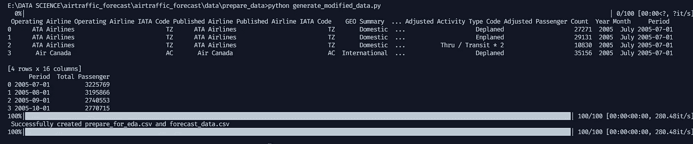

# 时间序列预测:空中交通乘客(时间序列端到端项目第一部分)

> 原文：<https://blog.devgenius.io/time-series-forecasting-passenger-air-traffic-time-series-project-part-1-da51d4e8520a?source=collection_archive---------3----------------------->

比较多种模型性能来预测臭名昭著的航空飞行乘客数据


艾萨克·史密斯在 [Unsplash](https://unsplash.com?utm_source=medium&utm_medium=referral) 上拍摄的照片

**项目目标**

在解决飞机乘客数据的时间序列预测问题时，各种方法(统计、最大似然、神经网络)性能的一般比较。

**项目结构**

```
airtraffic_forecast/
    data/
        utility.py
        original_data/
            Air_Traffic_Passenger_Statistics.csv
        prepare_data/
            generate_modified_data.py
            prepare_data.py
        ready_to_process_data/
            forecast_data.csv
            prepare_for_eda.csv

    modelling/
        forecast_model_ML.py
        forecast_model_NN.py
        forecast_model_statistical.py
        metrics.py
        start_modelling.py
        train_report_basemodel.py
        utilities.py
        model_output/
            KNeighborsRegressor.pkl
            LinearRegression.pkl
            NeuralProphet_hidden_layer3_epoch_3_weekly_seasonality12.pkl
            PassiveAggressiveRegressor.pkl
            RandomForestRegressor.pkl
            SARIMA_1,0,1_1,0,1,12__moving_avg_sqrt.pkl
            SARIMA_1,0,1_1,0,1,12__sqrt_ts.pkl
            SARIMA_1,0,1_1,0,1,12__ts_log.pkl
            SARIMA_1,0,1_1,0,1,12__ts_log_ewma.pkl
            SARIMA_1,0,1_1,0,1,12__ts_log_ewma_diff.pkl
            SARIMA_1,0,1_1,0,1,12__ts_log_moving_avg.pkl
            SARIMA_1,0,1_1,0,1,12__ts_moving_avg.pkl
            SVRegressor.pkl
            XGBRegressor.pkl
        model_performance/
            ml_model_result.csv
            nn_result.csv
            sarimax_result_.csv

    notebook/

        EDA.ipynb
        experiment.ipynb
        explore_ts.ipynb

```
```

**索引**

1.  正在准备数据集
2.  探索性数据分析

3.型号选择:

3.a .使用统计模型建模

3.b .使用机器学习模型建模

3.c .使用神经先知(神经网络)建模

4.结论

**准备数据集**

在此阶段，我们将清理数据集以匹配下一步流程(EDA)，涉及两个文件:

此阶段的目标是生成用于预测的 eda 数据和培训数据。

1.  prepare_data.py(扯皮步骤的源代码)
2.  generate_modified_data.py(包装所有争论步骤并输出两个新数据)

**prepare_data.py :**

**generate _ modified _ data . py:**

然后从命令行运行 generate_modified_data.py:

```
E:\DATA SCIENCE\airtraffic_forecast\airtraffic_forecast\data\prepare_data>python generate_modified_data.py
```



**探索性数据分析**

**建模**

由于此项目实施了模块化概念，因此稍后在模型培训中会用到几个文件:

1.  metrics.py(预测指标:RMSE、缅因州、MAPE)

2.utilities.py(包含平稳性测试、数据准备)

**使用统计模型建模**

在经典的统计模型中，我只使用 SARIMAX 模型。我用的是 fix 模型配置，order = (p=1，d=0，q=1)，季节性 order =(P=1，D=0，Q=1，s=12)。然而，由于数据不是静态的，因此需要进行数据转换。

**使用机器学习模型建模**

在这个概念中，我应该首先通过创建特征及其目标将时间序列任务转换为监督任务，我使用了几种方法:

1.  使用滞后数据集长度的数量(129 行)

2.使用时间特征，例如使用正弦和余弦(循环特征)

**使用神经先知模型建模**

我没有直接使用 NeuralProphet 对象进行拟合，而是创建了一个类来适应自定义输出(pd。DataFrame)来显示指标(RMSE、缅因州、MAPE)。

通过运行 start _ modelling.py 训练所有模型

```
E:\DATA SCIENCE\airtraffic_forecast\airtraffic_forecast\modelling python start_modelling.py --method statistical E:\DATA SCIENCE\airtraffic_forecast\airtraffic_forecast\modelling python start_modelling.py --method mlE:\DATA SCIENCE\airtraffic_forecast\airtraffic_forecast\modelling python start_modelling.py --method NN
```

结论

根据该模型的性能结果，**神经先知模型**和经典 **SARIMAX** (取决于哪种转换)在这三个指标中具有较低的误差。

**我的 Fullstack Timeseries 项目:**

**第一部分:** [**时间序列预测:航空客运(时间序列端到端项目第一部分)**](/time-series-forecasting-passenger-air-traffic-time-series-project-part-1-da51d4e8520a)

**第 2 部分:** [**使用 Dash 创建时间序列仪表板(时间序列端到端项目第 2 部分)**](https://medium.com/@fakhrirobi.fra/create-timeseries-dashboard-using-dash-timeseries-end-to-end-project-part-2-38f0319e952?source=your_stories_page----------------------------------------)

**第 3 部分:** [**使用 Fast API 和 Heroku 将预测模型部署为 API(时间序列端到端项目第 3 部分)**](/deploy-forecasting-model-as-api-with-fast-api-and-heroku-timeseries-end-to-end-project-part-3-34692d980c3?source=your_stories_page----------------------------------------)

完整的代码实现可在这里[获得。](https://github.com/fakhrirobi/airtraffic_forecast)

感谢您的关注。您可以通过我的 [LinkedIn](https://www.linkedin.com/in/fakhrirobi/) 联系我，或者您可以在此星/叉/关注我的 github 账户[。](https://github.com/fakhrirobi)