# Python 中的时间序列:数据操作

> 原文：<https://blog.devgenius.io/time-series-with-python-data-operations-f88b2e791aba?source=collection_archive---------3----------------------->

## 如何在 Python 中操作时间序列数据？


照片由 [Yiorgos Ntrahas](https://unsplash.com/@yiorgosntrahas?utm_source=unsplash&utm_medium=referral&utm_content=creditCopyText) 在 [Unsplash](https://unsplash.com/images/stock?utm_source=unsplash&utm_medium=referral&utm_content=creditCopyText) 上拍摄

时序数据是一种在一段时间内收集的数据，通常以固定的时间间隔收集。它通常用于金融、经济和气象等领域，并经常被分析以了解一段时间内的趋势和模式。

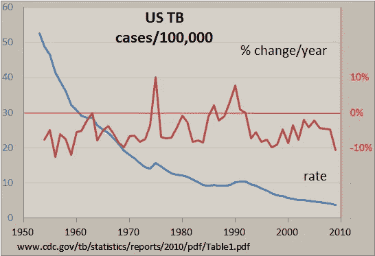

美国 1953-2009 年结核病发病率。[来源](https://en.wikipedia.org/wiki/Time_series)

Pandas 是一个强大而流行的 Python 开源数据操作库，特别适合处理时间序列数据。它提供了一系列工具和函数，使得加载、操作和分析时间序列数据变得容易。

在这篇博文中，我们将探索使用 Pandas 操作时间序列数据的一些关键技术。我们将涵盖诸如索引和切片时间序列数据，重采样和滚动窗口计算等主题，以及其他有用的功能。

# 数据类型

在 Python 中，没有专门用于表示日期的内置数据类型。然而，Python 标准库中的`datetime`模块提供了将日期作为`datetime`对象的工具，这些对象是存储日期和时间的数据类型。

```
import datetime

t = datetime.datetime.now()
print(f"type: {type(t)} and t: {t}")
#type: <class 'datetime.datetime'> and t: 2022-12-26 14:20:51.278230
```

日期通常以字符串的形式出现在我们处理的数据集或阅读的文件中。因此，我们需要用这些字符串格式进行`datetime`对象转换。

日期的可能字符串格式:

*   `YYYY-MM-DD`(如 2022-01-01)
*   `YYYY/MM/DD`(例如 2022 年 1 月 1 日)
*   `DD-MM-YYYY`(例如 2022 年 1 月 1 日)
*   `DD/MM/YYYY`(例如 2022 年 1 月 1 日)
*   `MM-DD-YYYY`(例如 2022 年 1 月 1 日)
*   `MM/DD/YYYY`(例如 2022 年 1 月 1 日)
*   `HH:MM:SS`(例如 11:30:00)
*   `HH:MM:SS AM/PM`(如上午 11:30:00)
*   `HH:MM AM/PM`(如上午 11:30)

`strptime`函数将一个字符串和一个格式字符串作为参数，并返回一个`datetime`对象。

```
string = '2022-01-01 11:30:09'
t = datetime.datetime.strptime(string, "%Y-%m-%d %H:%M:%S")
print(f"type: {type(t)} and t: {t}")
#type: <class 'datetime.datetime'> and t: 2022-01-01 11:30:09
```

格式代码:

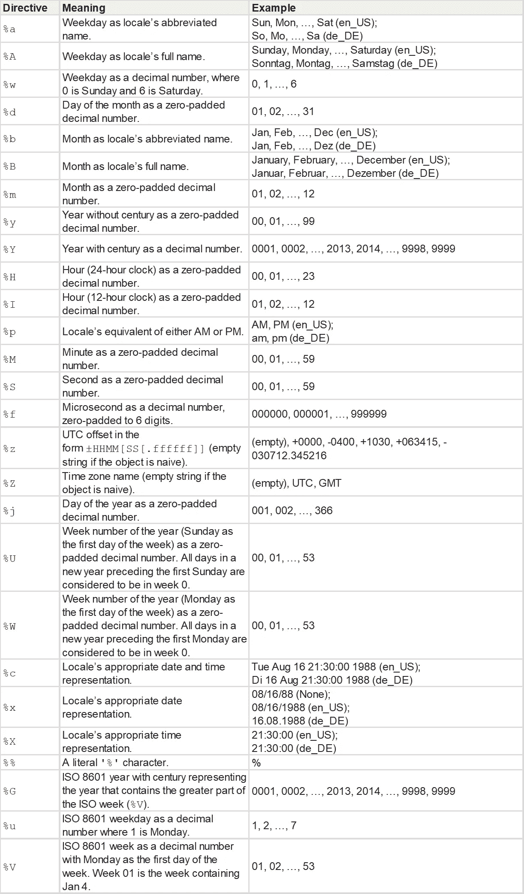

格式化代码列表。[来源](https://docs.python.org/3/library/datetime.html)

您还可以使用`strftime`函数将`datetime`对象转换回使用指定格式字符串的字符串表示。

```
t = datetime.datetime.now()
t_string = t.strftime("%m/%d/%Y, %H:%M:%S")
#12/26/2022, 14:38:47

t_string = t.strftime("%b/%d/%Y, %H:%M:%S")
#Dec/26/2022, 14:39:32
```

**Unix time** (POSIX time 或 epoch time)，是一种用单一数值表示时间的系统。它表示自协调世界时(UTC)1970 年 1 月 1 日星期四 00:00:00 以来经过的秒数。

Unix 时间和时间戳经常互换使用。Unix 时间是创建时间戳的标准化版本。通常，整数或浮点数据类型用于存储时间戳和 Unix 时间。

我们可以使用`time`模块的`mktime`方法将`datetime`对象转换成 Unix 时间整数。同样，`datetime`模块的`fromtimestamp`方法反之亦然。

```
#convert datetime to unix time
import time
from datetime import datetime

t = datetime.now()
unix_t = int(time.mktime(t.timetuple()))
#1672055277

#convert unix time to datetime
unix_t = 1672055277
t = datetime.fromtimestamp(unix_t)
#2022-12-26 14:47:57
```

我们可以使用`dateutil`模块的`parser`方法来解析日期的正式字符串，以获得日期时间对象。

```
from dateutil import parser
date = parser.parse("29th of October, 1923")
#datetime.datetime(1923, 10, 29, 0, 0)
```

## 熊猫

Pandas 提供了三种日期数据类型:

*   `Timestamp`或`DatetimeIndex`:它的功能类似于其他索引类型，但也具有时间序列操作的专门功能。

```
t = pd.to_datetime("29/10/1923", dayfirst=True)
#Timestamp('1923-10-29 00:00:00')

t = pd.Timestamp('2019-01-01', tz = 'Europe/Berlin')
#Timestamp('2019-01-01 00:00:00+0100', tz='Europe/Berlin')

t = pd.to_datetime(["04/23/1920", "10/29/1923"])
#DatetimeIndex(['1920-04-23', '1923-10-29'], dtype='datetime64[ns]', freq=None)
```

*   `period`或`PeriodIndex`:有开始和结束的时间间隔。它由固定的音程组成。

```
t = pd.to_datetime(["04/23/1920", "10/29/1923"])
period = t.to_period("D")
#PeriodIndex(['1920-04-23', '1923-10-29'], dtype='period[D]')
```

*   `Timedelta`或`TimedeltaIndex`:是两个日期之间的间隔。

```
delta = pd.TimedeltaIndex(data =['1 days 03:00:00', 
                                '2 days 09:05:01.000030'])
"""
TimedeltaIndex(['1 days 02:00:00', '1 days 06:05:01.000030'], 
               dtype='timedelta64[ns]', freq=None)
"""
```

在 Pandas 中，我们可以使用`to_datetime`方法将对象转换为`datetime`数据类型或进行任何其他转换。

```
import pandas as pd
df = pd.read_csv("dataset.txt")
df.head()

"""

  date       value
0 1991-07-01 3.526591
1 1991-08-01 3.180891
2 1991-09-01 3.252221
3 1991-10-01 3.611003
4 1991-11-01 3.565869
"""

df.info()

"""
<class 'pandas.core.frame.DataFrame'>
RangeIndex: 204 entries, 0 to 203
Data columns (total 2 columns):
 #   Column  Non-Null Count  Dtype  
---  ------  --------------  -----  
 0   date    204 non-null    object 
 1   value   204 non-null    float64
dtypes: float64(1), object(1)
memory usage: 3.3+ KB
"""

# Convert to datetime
df["date"] = pd.to_datetime(df["date"], format = "%Y-%m-%d")

df.info()

"""
<class 'pandas.core.frame.DataFrame'>
RangeIndex: 204 entries, 0 to 203
Data columns (total 2 columns):
 #   Column  Non-Null Count  Dtype         
---  ------  --------------  -----         
 0   date    204 non-null    datetime64[ns]
 1   value   204 non-null    float64       
dtypes: datetime64[ns](1), float64(1)
memory usage: 3.3 KB
"""

# Convert to Unix
df['unix_time'] = df['date'].apply(lambda x: x.timestamp())
df.head()
"""
  date       value    unix_time
0 1991-07-01 3.526591 678326400.0
1 1991-08-01 3.180891 681004800.0
2 1991-09-01 3.252221 683683200.0
3 1991-10-01 3.611003 686275200.0
4 1991-11-01 3.565869 688953600.0
"""

df["date_converted_from_unix"] = pd.to_datetime(df["unix_time"], unit = "s")
df.head()
"""
  date       value    unix_time    date_converted_from_unix
0 1991-07-01 3.526591 678326400.0 1991-07-01
1 1991-08-01 3.180891 681004800.0 1991-08-01
2 1991-09-01 3.252221 683683200.0 1991-09-01
3 1991-10-01 3.611003 686275200.0 1991-10-01
4 1991-11-01 3.565869 688953600.0 1991-11-01
"""
```

我们也可以用`parse_dates`参数在任何文件中声明日期列。

```
df = pd.read_csv("dataset.txt", parse_dates=["date"])
df.info()

"""
<class 'pandas.core.frame.DataFrame'>
RangeIndex: 204 entries, 0 to 203
Data columns (total 2 columns):
 #   Column  Non-Null Count  Dtype         
---  ------  --------------  -----         
 0   date    204 non-null    datetime64[ns]
 1   value   204 non-null    float64       
dtypes: datetime64[ns](1), float64(1)
memory usage: 3.3 KB
"""
```

最好将日期列作为数据集的索引。

```
df.set_index("date",inplace=True)

"""
            Value
date 
1991-07-01 3.526591
1991-08-01 3.180891
1991-09-01 3.252221
1991-10-01 3.611003
1991-11-01 3.565869
... ...
2008-02-01 21.654285
2008-03-01 18.264945
2008-04-01 23.107677
2008-05-01 22.912510
2008-06-01 19.431740
"""
```

Numpy 也有自己的 datetime 类型。特别是在计算大型数据集时，矢量化非常有用，应该使用。因此，我们可能想要利用`np.datetime64`数据类型。

```
import numpy as np
arr_date = np.array('2000-01-01', dtype=np.datetime64)
arr_date
#array('2000-01-01', dtype='datetime64[D]')

#broadcasting
arr_date = arr_date + np.arange(30)
"""
array(['2000-01-01', '2000-01-02', '2000-01-03', '2000-01-04',
       '2000-01-05', '2000-01-06', '2000-01-07', '2000-01-08',
       '2000-01-09', '2000-01-10', '2000-01-11', '2000-01-12',
       '2000-01-13', '2000-01-14', '2000-01-15', '2000-01-16',
       '2000-01-17', '2000-01-18', '2000-01-19', '2000-01-20',
       '2000-01-21', '2000-01-22', '2000-01-23', '2000-01-24',
       '2000-01-25', '2000-01-26', '2000-01-27', '2000-01-28',
       '2000-01-29', '2000-01-30'], dtype='datetime64[D]')
"""
```

# 功能

下面列出了一些可能对时间序列有用的函数。我们到达 series 对象的`dt`类，并以那种方式访问 datetime 方法。

```
df = pd.read_csv("dataset.txt", parse_dates=["date"])
df["date"].dt.day_name()

"""
0        Monday
1      Thursday
2        Sunday
3       Tuesday
4        Friday
         ...   
199      Friday
200    Saturday
201     Tuesday
202    Thursday
203      Sunday
Name: date, Length: 204, dtype: object
"""
```

## DataReader

`pandas_datareader`是`pandas`库的侧作之一。多亏了这个包，我们可以在一行代码中访问许多财务数据。你可以在这里找到文档。

*pip 安装 pandas-datareader*

```
from pandas_datareader import wb
#GDP per Capita From World Bank
df = wb.download(indicator='NY.GDP.PCAP.KD', 
                 country=['US', 'FR', 'GB', 'DK', 'NO'], start=1960, end=2019)

"""
                   NY.GDP.PCAP.KD
country       year                
Denmark       2019    57203.027794
              2018    56563.488473
              2017    55735.764901
              2016    54556.068955
              2015    53254.856370
...                            ...
United States 1964    21599.818705
              1963    20701.269947
              1962    20116.235124
              1961    19253.547329
              1960    19135.268182

[300 rows x 1 columns]
"""
```

## 范围

我们可以使用熊猫的`date_range`方法定义一个日期范围。

```
pd.date_range(start="2021-01-01", end="2022-01-01", freq="D")

"""
DatetimeIndex(['2021-01-01', '2021-01-02', '2021-01-03', '2021-01-04',
               '2021-01-05', '2021-01-06', '2021-01-07', '2021-01-08',
               '2021-01-09', '2021-01-10',
               ...
               '2021-12-23', '2021-12-24', '2021-12-25', '2021-12-26',
               '2021-12-27', '2021-12-28', '2021-12-29', '2021-12-30',
               '2021-12-31', '2022-01-01'],
              dtype='datetime64[ns]', length=366, freq='D')
"""

pd.date_range(start="2021-01-01", end="2022-01-01", freq="BM")

"""
DatetimeIndex(['2021-01-29', '2021-02-26', '2021-03-31', '2021-04-30',
               '2021-05-31', '2021-06-30', '2021-07-30', '2021-08-31',
               '2021-09-30', '2021-10-29', '2021-11-30', '2021-12-31'],
              dtype='datetime64[ns]', freq='BM')
"""

fridays  = pd.date_range('2022-11-01', '2022-12-31', freq="W-FRI")
"""
DatetimeIndex(['2022-11-04', '2022-11-11', '2022-11-18', '2022-11-25',
               '2022-12-02', '2022-12-09', '2022-12-16', '2022-12-23',
               '2022-12-30'],
              dtype='datetime64[ns]', freq='W-FRI')
"""
```

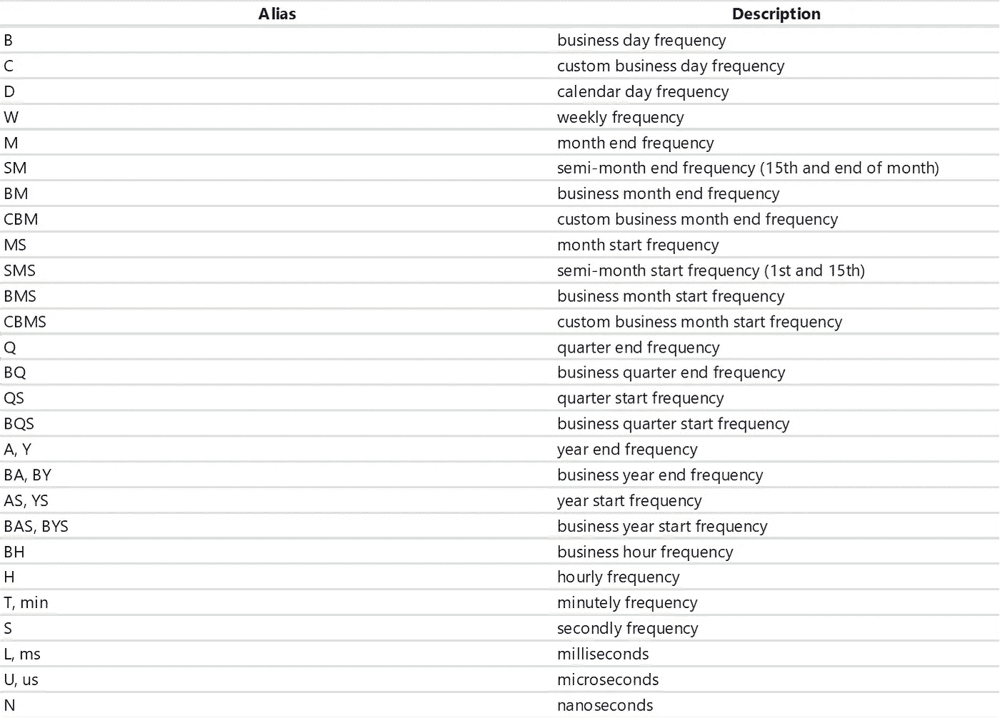

偏移别名表。[来源](https://pandas.pydata.org/docs/user_guide/timeseries.html#timeseries-offset-aliases)

我们可以使用`timedelta_range`方法逐步创建一个时间序列。

```
t = pd.timedelta_range(0, periods=10, freq="H")

"""
TimedeltaIndex(['0 days 00:00:00', '0 days 01:00:00', '0 days 02:00:00',
                '0 days 03:00:00', '0 days 04:00:00', '0 days 05:00:00',
                '0 days 06:00:00', '0 days 07:00:00', '0 days 08:00:00',
                '0 days 09:00:00'],
               dtype='timedelta64[ns]', freq='H')
"""
```

## 格式

我们可以用`dt.strftime`方法改变日期列的格式。

```
df["new_date"] = df["date"].dt.strftime("%b %d, %Y")
df.head()
"""
  date       value    new_date
0 1991-07-01 3.526591 Jul 01, 1991
1 1991-08-01 3.180891 Aug 01, 1991
2 1991-09-01 3.252221 Sep 01, 1991
3 1991-10-01 3.611003 Oct 01, 1991
4 1991-11-01 3.565869 Nov 01, 1991
"""
```

## 从语法上分析

我们可以解析 datetime 对象并获得日期的子成分。

```
df["year"] = df["date"].dt.year
df["month"] = df["date"].dt.month
df["day"] = df["date"].dt.day
df["calendar"] = df["date"].dt.date
df["hour"] = df["date"].dt.time
df.head()
"""
  date       value    year month day calendar   hour
0 1991-07-01 3.526591 1991 7     1   1991-07-01 00:00:00
1 1991-08-01 3.180891 1991 8     1   1991-08-01 00:00:00
2 1991-09-01 3.252221 1991 9     1   1991-09-01 00:00:00
3 1991-10-01 3.611003 1991 10    1   1991-10-01 00:00:00
4 1991-11-01 3.565869 1991 11    1   1991-11-01 00:00:00
"""
```

或者，我们可以重新加入他们。

```
df["date_joined"] = pd.to_datetime(df[["year","month","day"]])
print(df["date_joined"])
"""
0     1991-07-01
1     1991-08-01
2     1991-09-01
3     1991-10-01
4     1991-11-01
         ...    
199   2008-02-01
200   2008-03-01
201   2008-04-01
202   2008-05-01
203   2008-06-01
Name: date_joined, Length: 204, dtype: datetime64[ns]
"""
```

## 过滤

我们可以用`loc`的方法来过滤`DataFrame`。

```
df = df.loc["2021-01-01":"2021-01-10"]
```

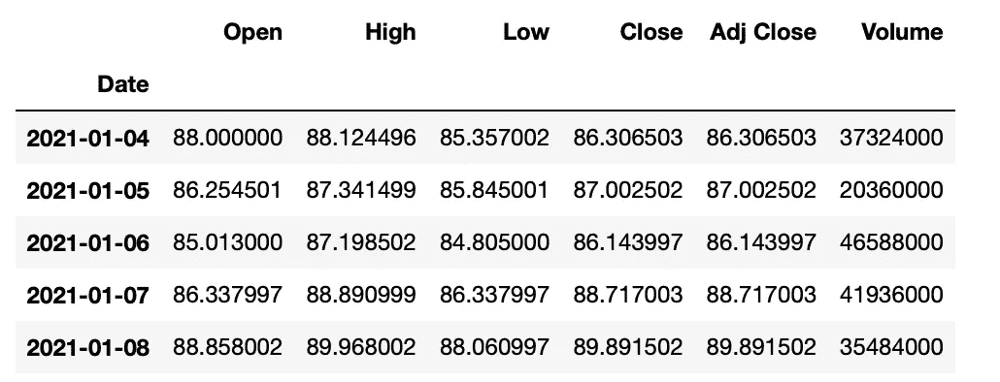

数据框。图片由作者提供。

`truncate`是另一种选择。

```
df_truncated = df.truncate('2021-01-05', '2022-01-10')
```

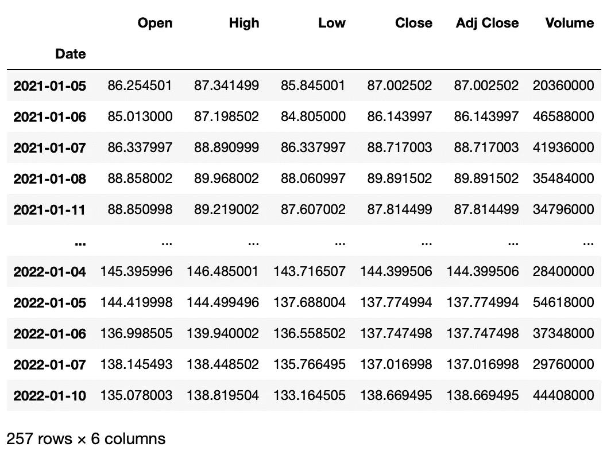

df _ 已截断。图片由作者提供。

# 操作

让我们看看如何对时间序列数据集中的值执行操作。

让我们创建一个股票数据集在例子中使用。为此，我们可以使用`yfinance`库。

```
#get google stock price data
import yfinance as yf
start_date = '2020-01-01'
end_date = '2023-01-01'
ticker = 'GOOGL'
df = yf.download(ticker, start_date, end_date)
df.head()

"""
Date       Open      High      Low       Close     Adj Close Volume     
2020-01-02 67.420502 68.433998 67.324501 68.433998 68.433998 27278000
2020-01-03 67.400002 68.687500 67.365997 68.075996 68.075996 23408000
2020-01-06 67.581497 69.916000 67.550003 69.890503 69.890503 46768000
2020-01-07 70.023003 70.175003 69.578003 69.755501 69.755501 34330000
2020-01-08 69.740997 70.592499 69.631500 70.251999 70.251999 35314000
"""
```

## 差异

`DataFrame`中一个元素与另一个元素之间的差异。

```
#subtract that day's value from the previous day
df["Diff_Close"] = df["Close"].diff()
#Subtract that day's value from the day's value 2 days ago
df["Diff_Close_2Days"] = df["Close"].diff(periods=2)
```

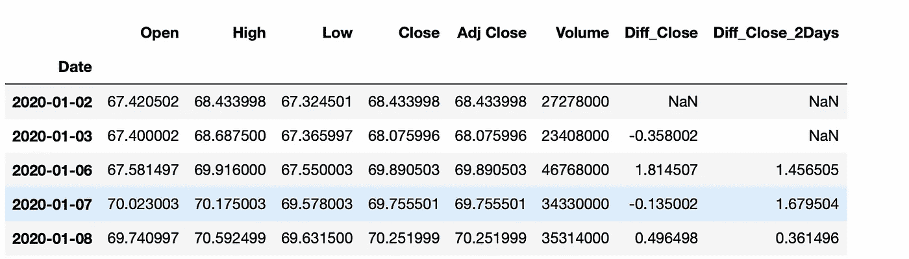

数据框。图片由作者提供。

## 累计总数

```
df["Volume_Cumulative"] = df["Volume"].cumsum()
```

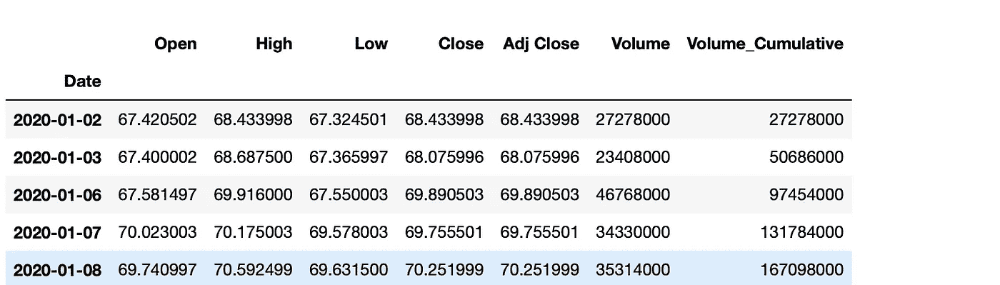

累积总和。图片由作者提供。

## 翻滚吧


女士们先生们:跛行 Bizkit。[来源](https://getyarn.io/yarn-clip/5a3f6f55-ac10-4729-b260-3689d793a356)

务必执行滚动窗口计算(移动平均)。

```
df["Close_Rolling_14"] = df["Close"].rolling(14).mean()
df.tail()
```

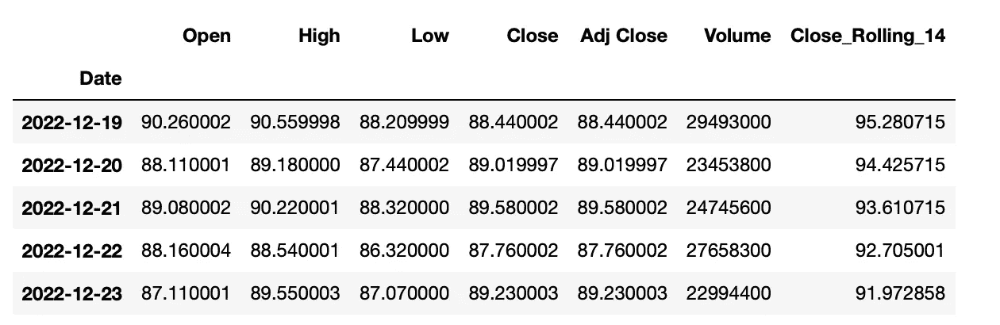

数据框。图片由作者提供。

让我们画出移动平均线。

```
import seaborn as sns
import matplotlib.pyplot as plt
fig = plt.figure(figsize = (14, 8))
ax = sns.lineplot(df.index,df["Close"])
ax = sns.lineplot(df.index,df["Close_Rolling_14"])
ax.set(xlabel='date', ylabel='Close Price', title='Google Stock Close Price & 14 Moving Average')
plt.show()
```

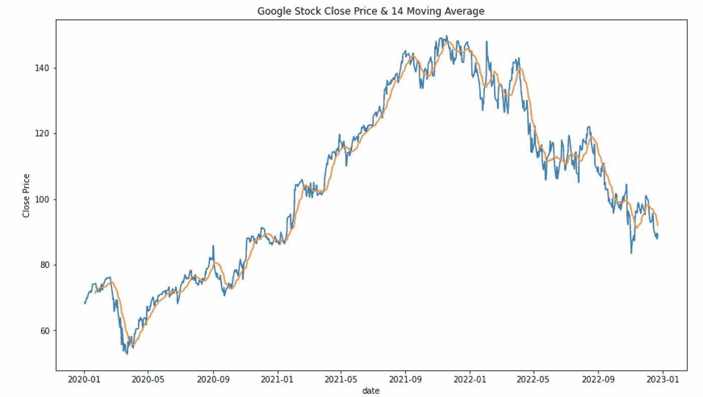

图片由作者提供。

参数:

*   **居中**:决定滚动窗口是否应该以当前观察为中心。
*   **min_periods** :窗口中产生结果所需的最小观察次数。

```
s = pd.Series([1, 2, 3, 4, 5])

#the rolling window will be centered on each observation
rolling_mean = s.rolling(window=3, center=True).mean()
"""
0    NaN
1    2.0
2    3.0
3    4.0
4    NaN
dtype: float64
Explanation:
first window: [na 1 2] = na
second window: [1 2 3] = 2
"""

# the rolling window will not be centered, 
#and will instead be anchored to the left side of the window
rolling_mean = s.rolling(window=3, center=False).mean()
"""
0    NaN
1    NaN
2    2.0
3    3.0
4    4.0
dtype: float64
Explanation:
first window: [na na 1] = na
second window: [na 1 2] = na
third window: [1 2 3] = 2
"""
```

## 改变

Pandas 有两种方法，`shift()`和`tshift()`，允许您以指定的频率倍数移动数据或时间序列的索引。`shift()`移动数据，而`tshift()`移动索引。

```
#shift the data
df_shifted = df.shift(5,axis=0)
df_shifted.head(10)

#shift the indexes
df_tshifted = df.tshift(periods = 4, freq = 'D')
df_tshifted.head(10)
```

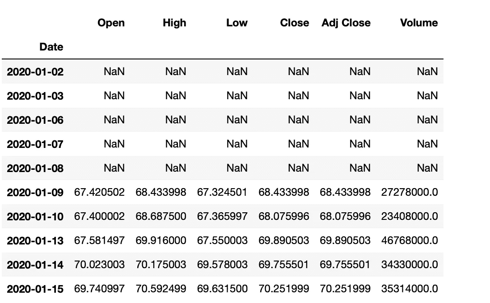

df _ shifted。图片由作者提供。

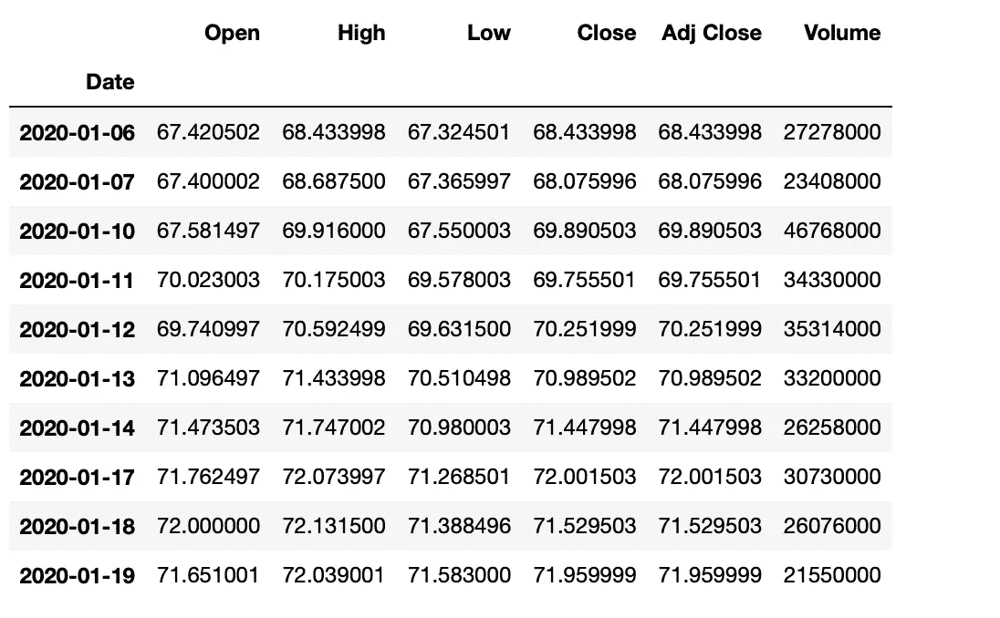

df _ 已转移。图片由作者提供。

## 时期

`dt.to_period`从日期创建周期。偏移量字符串必须传递到函数中。

```
df["Period"] = df["Date"].dt.to_period('W')
```

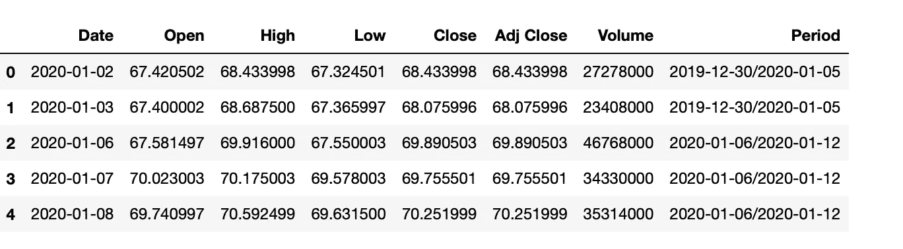

每周一次。图片由作者提供。

## 频率

`asfreq`方法用于将一个时间序列转换到一个指定的频率。

```
monthly_data = df.asfreq('M', method='ffill')
```

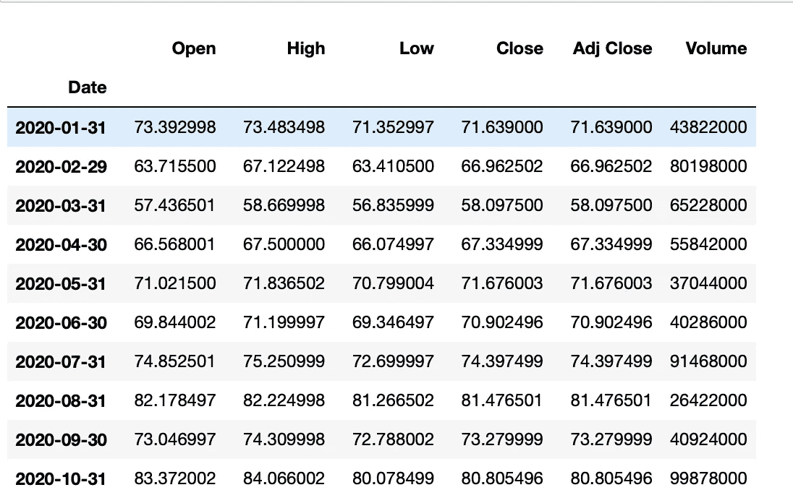

月度数据。图片由作者提供。

参数:

*   **freq** :数据转换的频率。这可以使用字符串别名(例如，`'M'`表示每月，`'H'`表示每小时)或`pandas`偏移对象来指定。
*   **方法**:转换频率时如何填写缺失值。这可以是一个字符串，如`'ffill'`(向前填充)或`'bfill'`(向后填充)。

## 抽样

`resample` 是一种很有用的方法，可以很容易地改变时间序列的频率并对其进行重采样。我们可以进行上采样(到更高的频率)或下采样(到更低的频率)。因为我们在改变频率，所以我们需要使用一个聚合函数(比如平均值、最大值等等。).

`resample`方法的参数:

*   **规则**:数据重新采样的频率。这可以使用字符串别名(例如，`'M'`表示每月，`'H'`表示每小时)或`pandas`偏移对象来指定。

```
#down sample
monthly_data = df.resample('M').mean()
#up sample
minute_data = data.resample('T').ffill()
```

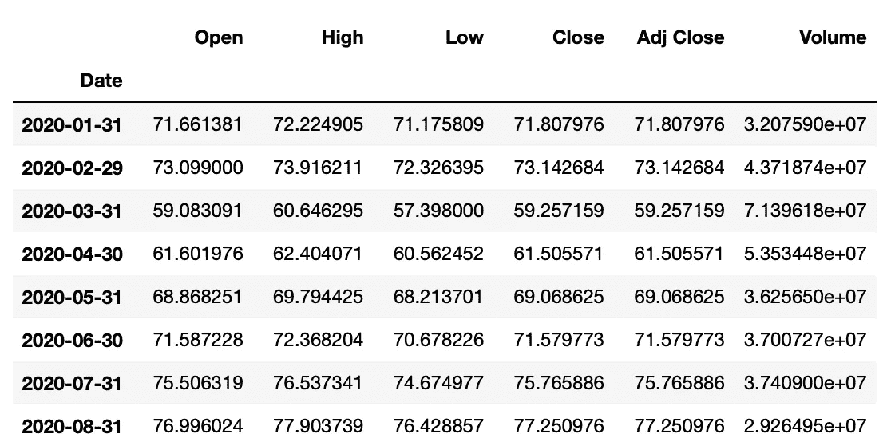

月度数据。图片由作者提供。

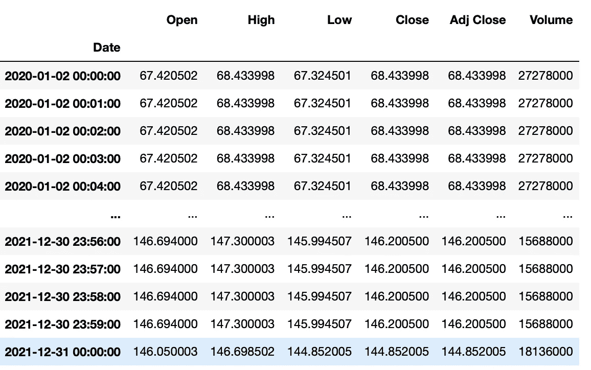

微小数据。图片由作者提供。

## 百分比变动

我们可以使用`pct_change`方法来计算日期之间的百分比变化。

```
df["PCT"] = df["Close"].pct_change(periods=2)
print(df["PCT"])
"""
Date
2020-01-02         NaN
2020-01-03         NaN
2020-01-06    0.021283
2020-01-07    0.024671
2020-01-08    0.005172
                ...   
2022-12-19   -0.026634
2022-12-20   -0.013738
2022-12-21    0.012890
2022-12-22   -0.014154
2022-12-23   -0.003907
Name: PCT, Length: 752, dtype: float64
"""
```

# 结论

总之，如果你要处理时间序列，你应该知道使这成为可能的基本操作，你应该能够使用快捷方式使你的工作更容易和更快。

在 Pandas 和 NumPy 等库的帮助下，可以对时间序列数据执行各种操作，包括过滤、聚合和转换。通过学习如何有效地使用这些库，您可以获得对数据的宝贵见解，并根据您的分析做出明智的决策。

感谢阅读。

# 阅读更多

[](https://python.plainenglish.io/how-to-plot-candlestick-chart-in-python-9dba1cea70e3) [## 如何用 Python 绘制烛台图？

### 用 Plotly 软件包实现蜡烛图

python .平原英语. io](https://python.plainenglish.io/how-to-plot-candlestick-chart-in-python-9dba1cea70e3) [](https://towardsdev.com/line-chart-in-python-matplotlib-seaborn-plotly-f576c630e97d) [## Python 中的折线图(Matplotlib、Seaborn、Plotly)

### 折线图在 Python 中的实现

towardsdev.com](https://towardsdev.com/line-chart-in-python-matplotlib-seaborn-plotly-f576c630e97d) [](https://medium.com/mlearning-ai/about-the-importance-of-data-in-machine-learning-ffa66657ee77) [## 关于数据在机器学习中的重要性

### 你一直想知道但不敢问的关于数据的一切

medium.com](https://medium.com/mlearning-ai/about-the-importance-of-data-in-machine-learning-ffa66657ee77) [](https://medium.com/@okanyenigun/optimization-of-pandas-performance-on-large-data-c4cbe6b1b064) [## Pandas 在大数据上的性能优化

### 提高熊猫包装性能的方法

medium.com](https://medium.com/@okanyenigun/optimization-of-pandas-performance-on-large-data-c4cbe6b1b064) [](https://awstip.com/how-fast-is-your-light-gbm-2d447b728130) [## 你的光 GBM 有多快？

### 为什么光 GBM 快？解释和实施

awstip.com](https://awstip.com/how-fast-is-your-light-gbm-2d447b728130) 

# 来源

[https://docs.python.org/3/library/datetime.html](https://docs.python.org/3/library/datetime.html)

[https://www . geeks forgeeks . org/how-to-convert-datetime-to-UNIX-timestamp-in-python/](https://www.geeksforgeeks.org/how-to-convert-datetime-to-unix-timestamp-in-python/)

[https://www . geeks forgeeks . org/how-to-convert-datetime-to-UNIX-timestamp-in-python/](https://www.geeksforgeeks.org/how-to-convert-datetime-to-unix-timestamp-in-python/)

【https://pandas-datareader.readthedocs.io/en/latest/ 

[https://pypi.org/project/yfinance/](https://pypi.org/project/yfinance/)

[https://pandas . pydata . org/pandas-docs/stable/reference/API/pandas。DataFrame.resample.html](https://pandas.pydata.org/pandas-docs/stable/reference/api/pandas.DataFrame.resample.html)

[https://pandas.pydata.org/docs/reference/api/pandas.DataFrame.rolling.html](https://pandas.pydata.org/docs/reference/api/pandas.DataFrame.rolling.html)

[https://numpy.org/doc/stable/reference/arrays.datetime.html](https://numpy.org/doc/stable/reference/arrays.datetime.html)