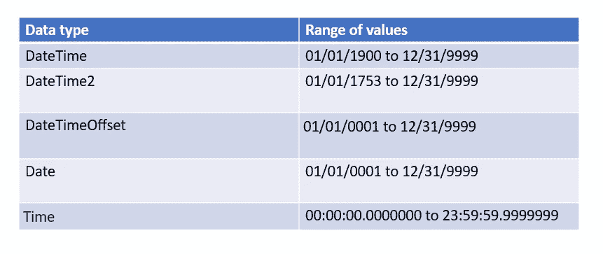

# 时区差异-日光-本地日期-Sql 日期-时间 API

> 原文：<https://blog.devgenius.io/time-zones-difference-daylight-local-date-sql-date-time-a-75c0c7e150c2?source=collection_archive---------16----------------------->

[乔恩·泰森](https://unsplash.com/@jontyson?utm_source=medium&utm_medium=referral)在[号航天飞机](https://unsplash.com?utm_source=medium&utm_medium=referral)上的照片

时区:

*   时区是基于地球每小时移动 15 度的事实。因为一天有 24 个小时，所以有 24 个标准时区。每个时区以 15 度为间隔计数，并在中心子午线两侧各延伸 7.5 度。

有些事情每个软件工程师都必须知道。所以**时区和使用日期**就是其中之一。

如何计算时区？

*   首先，我们必须检查时区是否属于本初子午线的西/东。如果它在本初子午线的东部，比如日本，它会在比格林尼治时间更早的时间。
    如果在巴西等本初子午线以西，时间会更晚。如果它在本初子午线
    的西边(如巴西)，那就是更晚的时间。
*   下一步是计算距离格林威治有多少时区。
*   让我们看一个例子。我会数阿根廷的布宜诺斯艾利斯。有 4 条线路可以到达布宜诺斯艾利斯。

*   因此，如果 GMT 的时间是 4:34，我将减去 4 个小时，得到布宜诺斯艾利斯的时间。时间是 0: 34。
*   因此，当我们谈论这个话题时，还有其他一些方面需要考虑。

1.  日光节约时间
2.  当地日期和时间
3.  SQL 日期和时间
4.  时间 API

# 日光节约时间

*   这个想法是乔治·哈德森提出的，目的是在夏天给人们更多的阳光。
*   每年有些国家在春季将时钟拨快，然后在秋季拨慢。但是世界上大多数国家都不参与这种情况。

*   与所有其他人类活动相比，通过将时钟向前移动一个小时，太阳看起来将会更晚升起和落下。

您可以通过下面的图像了解这是如何工作的。

*   三月底，北方的四月国家将他们的时钟提前一个小时，以推迟晚上的日落和早上的日出。
*   然后，在 10 月下旬，他们从晚上倒退了一个小时。然后是更多的早晨时间。

# 当地日期和时间

*   **本地日期时间:**

*   *Java . time . local datetime*类表示没有时区的日期和时间对象，

*   我们可以使用 *LocalDateTime* 来显示时间戳，而不使用时区/偏移参考。因此，在需要特定区域中的时间戳时，我们可以使用*zoneddattimes*实例。

*   让我们看看如何声明它。

我们可以通过两种方式创建 LocalDateTime。

1.  get-当前时间戳

*   now():这将生成当前本地日期时间。使用区域 id，我们可以传递它，并获得该特定区域的时间。

2.为指定值创建本地日期时间。

*   我们需要(年，月，日，小时，分钟，秒，纳秒)方法，然后将有可选参数重载方法。

# SQL 日期时间

*   当您尝试在 sql 中查询时，会遇到一些基本的日期和时间数据类型。

**java.sql.Date**

> 我们用这个来记年、月、日。(此处将排除时间)
> 
> 如果日期存储为自 01/01/1970 - 00:00:00 GMT 以来的毫秒数，则时间部分被标准化(设置为零)
> 
> 请记住， *java.sql.Date* 不存储任何时区信息

# 时间 API

