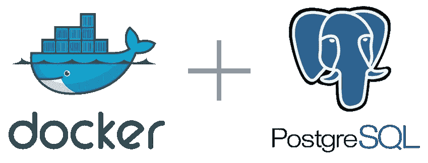

# 使用 PostgreSQL Docker 映像的提示和技巧

> 原文：<https://blog.devgenius.io/tips-and-tricks-to-using-postgresql-docker-image-1c799e4ee3b8?source=collection_archive---------4----------------------->

## 使用初始化脚本



本文是系列文章的第一部分

*   在这里找到第二部分: [Docker 与 Flyway 组合](https://tony-oreglia.medium.com/tips-and-tricks-to-using-postgresql-docker-image-80047673c9a5)

# PostgreSQL Docker 映像初始化脚本故障排除

在本文中，我将描述一些与为官方 [Docker Postgres 映像](https://hub.docker.com/_/postgres)设置初始化脚本相关的故障排除。

## 初始化脚本的用途是什么

初始化脚本可用于创建用户、创建表和设置权限。来自官方文档([此处为](https://hub.docker.com/_/postgres))“初始化脚本”部分—

> 如果您想在从此映像派生的映像中进行额外的初始化，请在`/docker-entrypoint-initdb.d`下添加一个或多个`*.sql`、`*.sql.gz`或`*.sh`脚本(如果需要，创建目录)。在入口点调用`initdb`来创建默认的`postgres`用户和数据库之后，它将运行任何`*.sql`文件，运行任何可执行的`*.sh`脚本，并在启动服务之前获取在该目录中找到的任何不可执行的`*.sh`脚本来做进一步的初始化。

# 设置正确的权限

首先要注意的是，脚本必须在本地机器上设置了可执行权限。Docker 从本地文件系统复制权限。

通过查看 docker PostGIS 容器日志，很容易确定您是否有此问题。为了跟踪 PostgreSQL 容器的日志，运行

`docker-compose logs --follow postgis`

如果您看到类似下面的内容，那么初始化脚本的权限应该更新为可执行:

```
postgis    | /usr/local/bin/docker-entrypoint.sh: running /docker-entrypoint-initdb.d/init.sh
postgis    | /usr/local/bin/docker-entrypoint.sh: /docker-entrypoint-initdb.d/init.sh: /bin/bash: bad interpreter: Permission denied
```

要使脚本可执行，使用`chmod`命令:

```
chmod +x migration/bin/init/init.sh
```

# 在新的 Docker 映像上重新运行初始化脚本

如果您正在创建一个新的 docker 映像并打算启动一个新的 DB，那么需要再次运行初始化脚本。但是，在这种情况下，为了让 Postgres 映像运行脚本，需要进行一些手动清理。

该文档指定了触发初始化脚本的条件。

> **警告**:只有当你用一个空的数据目录启动容器时，`/docker-entrypoint-initdb.d`中的脚本才会运行；容器启动时，任何预先存在的数据库都将保持不变。一个常见的问题是，如果您的某个`/docker-entrypoint-initdb.d`脚本失败(这将导致 entrypoint 脚本退出),并且您的 orchestrator 使用已经初始化的数据目录重新启动容器，那么它将无法继续运行您的脚本。

因此，如果要重新初始化数据库，删除任何现有的 Postgres 数据卷是很重要的。

通过运行以下命令查找现有的数据卷

```
docker volume ls -q
```

按名称查找卷，在我的例子中是

```
breadcrumbs_pg_data
```

如果它存在，运行以下命令将其删除

```
docker volume rm breadcrumbs_pg_data
```

如果出现错误:

```
Error response from daemon: remove breadcrumbs_pg_data: volume is in use - [d473cd3b40293fc1023f1108f2b09118a59df03950178fa24e1f55c636246da8]
```

然后通过容器 ID 移除指示的容器。在这种情况下:

```
docker rm d473cd3b40293fc102
```

请注意，这将删除数据库数据。小心，让这是你打算做的。

现在应该可以使用初始化脚本创建一个新的 Postgres 映像了。