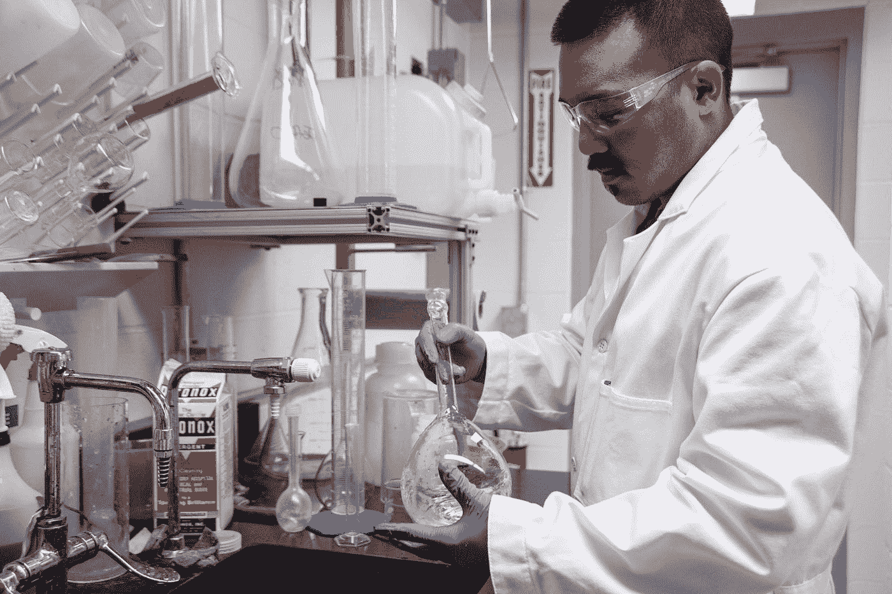

# 软件团队中自动化和测试的技巧

> 原文：<https://blog.devgenius.io/tips-for-automation-and-testing-in-software-teams-8e3fb289b578?source=collection_archive---------21----------------------->

佩里·格罗内在 [Unsplash](https://unsplash.com?utm_source=medium&utm_medium=referral) 上的照片

编写软件通常是团队工作。需要努力才能让团队有效率。

在这篇文章中，我们将看看是什么使得团队在自动化和测试方面有效。

# 网站生成

如果我们有自己的任务跟踪器或网站，那么我们必须确保那里的内容是最新的。

否则，人们可能会被过时的信息误导。

因此，这里的任何东西都应该通过自动生成我们喜欢的代码评审结果来保持最新。

那些不能自动更新的东西，比如手动测试的结果，将不得不手动更新。

有了更新的网站，每个人都可以从那里获得最新的信息，而不是在不同的地方寻找相同的信息。

这是 DRY 原则的另一个应用，它将所有信息放在一个中心位置。

每晚构建生成的任何信息也应该可以从一些网站上获得。

我们应该能够看到每夜构建的结果，并在一页的摘要中看到一切，包括任何构建警告、错误、状态、测试结果、性能统计、代码度量等等。

# 批准程序

可能需要批准程序才能继续工作。

我们可以使用像谷歌文档这样的网站来减轻分享这些文档的负担。

然后我们可以从这些文档中更新状态，这样我们就可以知道代码的哪一部分应该继续。

谷歌文档有自己的 API 来检查文本，所以我们可以用它来更新我们的代码，比如哪些可以继续，哪些部分需要审查。

此外，我们可以为审阅者设置一个网页来注册批准或拒绝。

该网站可以在一个地方向我们显示这些项目的状态，这样我们就不必寻找所有这些文档。

我们也可以用像 Google Docs API 这样的 API 来做这件事。

# 无情的测试

每个人都讨厌测试。开发人员通常在他们知道可能会出错的地方进行测试，并避免那些弱点。

这是一个糟糕的方法，因为我们避开了最有可能破裂的地方。

相反，我们应该尽早测试这些点，以避免以后这些点出现问题。

如果我们现在解决它们，我们以后的生活会更容易。

# 早点测试。经常测试。自动测试。

我们应该在编写代码的时候就测试它们。

如果我们有自动化测试，那就更好了。运行每一个构建的测试比坐在自己身上的测试计划更有效。

缺陷发现得越早，修复它的成本就越低。

所以，一个好的项目，测试代码可能比生产代码多。

编写测试代码所花费的时间是值得的。最终，从长远来看，编写和运行测试要便宜得多。

它们给了我们高度的信心，让我们相信某些东西工作正常。

# 在所有测试运行之前，编码还没有完成

直到所有测试运行并通过，一段代码才算完成。

在告诉任何人事情已经完成之前，我们应该检查所有的测试是否通过。否则，我们可能打碎了什么东西。

在 [Unsplash](https://unsplash.com?utm_source=medium&utm_medium=referral) 上[科学高清](https://unsplash.com/@scienceinhd?utm_source=medium&utm_medium=referral)拍摄的照片

# 测试什么

我们必须进行几种测试。它们包括单元测试、集成测试、验证测试、性能测试和可用性测试。

单元测试是测试一小部分代码的代码，包括函数、类和模块。

如果事情没有自己的工作，那么他们很可能不会一起工作。

因此，在我们进行下一组测试之前，我们应该确保单元测试通过。

接下来要运行的测试是集成测试，这些测试测试组成项目的子系统的一部分，并确保各部分能够相互协作。

这可能包括数据库交互和文件操作，这些可能会在单元测试中被嘲笑。

一旦这些都通过了，然后我们运行验证测试来检查我们已经建立的系统的部分是我们所需要的。

我们检查最终用户的用例，并检查它们是否满足需求。

接下来，我们运行一些性能测试，看看我们的应用程序消耗了多少计算机资源。这包括处理器使用率、内存使用率、磁盘带宽和网络带宽。

我们还需要检查不同的屏幕尺寸和设备，以确保在不同的屏幕上都能正常工作。

然后我们继续进行性能测试。我们要测试我们的应用程序使用了多少资源，以确保它不会太慢或资源密集型。

# 结论

在宣布应用程序完成之前，我们对它们进行了详尽的测试。

测试必须尽早且经常进行。有很多种测试要做，但大多数都可以自动化，让我们的生活更轻松，如果所有测试都通过了，我们就可以安心了。