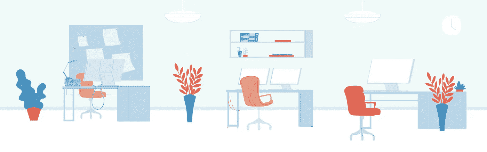
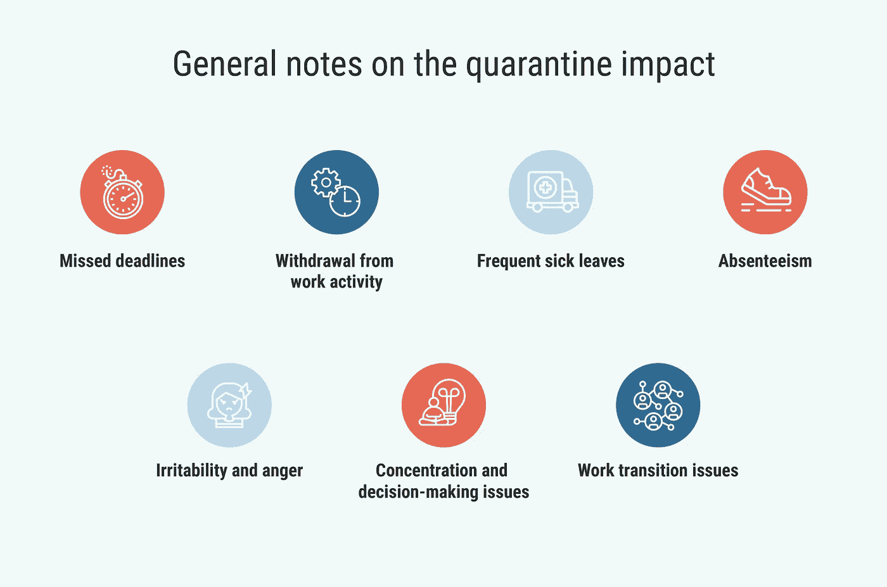
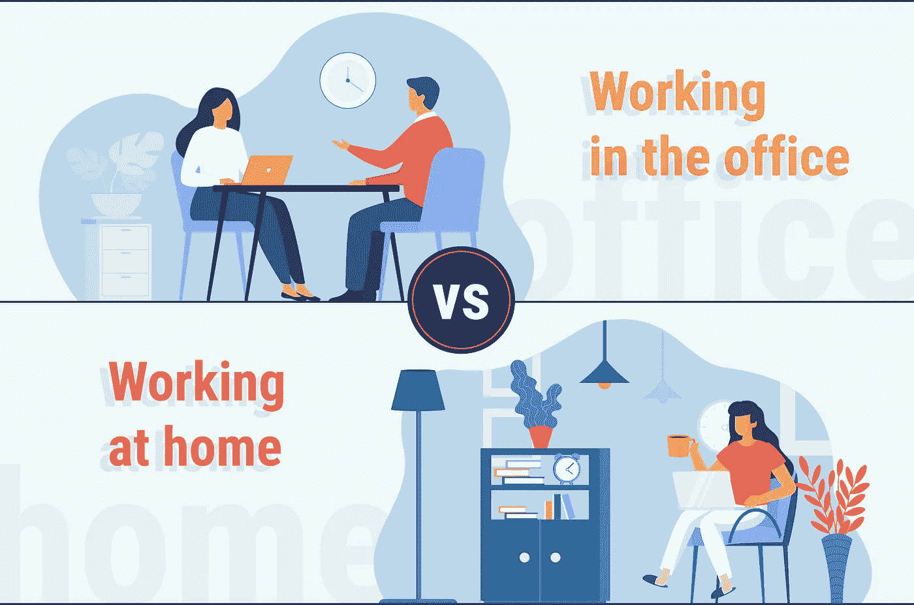

# 💡隔离后返回办公室的提示

> 原文：<https://blog.devgenius.io/tips-for-coming-back-to-the-office-after-quarantine-3cbf3c2020f5?source=collection_archive---------8----------------------->

## 我们关注的是回到办公室后的心理问题。看看给员工和经理的小建议。

强制隔离对员工的影响经常被比作宇航员从空间站回家时的感受:迷失方向成为需要应对的重大挑战之一。因此，在长时间的物理距离和在家工作后醒来并不像看起来那么简单。

然而，一些建议可以帮助你恢复正常。在这篇文章中，你会发现对员工和他们的经理都没有什么建议。虽然我们并不声称要重塑美国，但我们确实希望下面的信息会有用。

# 关于检疫影响的一般说明

正如我们之前提到的，主要的挑战——迷失方向——会导致各种各样的问题，主要影响员工的表现和生产力。那么，有什么迹象可以表明长期的孤立和在家工作对办公室事物的影响呢？以下是其中的一些:

无论你是自己面临这些问题的人，还是你注意到你的员工倾向于表现出隔离后迷失方向的迹象，这都是在两种情况下最小化它们的机会。下面有两个部分:一部分是给愿意回到正常绩效指标的员工的建议，另一部分是给希望帮助他们团队的经理的建议。

# 给员工的建议

毫不夸张地说，大多数员工都因为该回办公室了而感到明显的压力。这并不奇怪，因为习惯了悠闲的家庭办公室生活的人经常会感到沮丧。因此，这里有一些自助技巧，可以帮助你更顺利地适应环境:

# 调整你的睡眠时间表

在家工作会影响你的睡眠和清醒周期，这很自然。所以首先要做的就是把它正常化。只要每天在同一时间睡觉和醒来，你只需要几天时间就能回到游戏中。

# 对自己要有耐心

长期的隔离使最绝望的外向者变成了内向者，所以当回到办公室时，许多人对谈话的流畅感到焦虑。此外，办公室里的谈话会转移人们对工作的注意力，让他们更难集中注意力。需要理解的是，有这种感觉是完全可以的。对自己要有耐心，不要试图假装什么都没变。

# 寻求你的团队支持

永远记住，你不是唯一一个面临突然改变的工作环境带来的所有不便的人。你周围的很多人可能也有同样的感觉，所以你能对彼此做的最好的事情就是提供一些支持。

# 不要超载

在最初的两周，尽量不要让自己承受太多的任务。把注意力集中在最重要的事情上，不要因为这样做而自责。这将帮助你更快地适应这个过程，减少压力。

# 关注积极的一面

当你对不得不去办公室的事实感到不满时，提醒自己所有你错过的事情:无论是和同事一起喝咖啡还是愉快的谈话。尽情享受吧，记住篱笆那边的草总是更绿。

# 给经理的建议

回到办公室对经理来说更具挑战性，他们必须处理自己的适应问题，还应该以某种方式帮助他们的团队轻松度过这个复杂的时期。那么，经理们能做些什么来帮助员工更好地适应办公室生活呢？

# 制定计划并设定明确的期望

面对突如其来的疫情局势，提前计划几乎是不可能的，但是现在，你有这个机会。所以作为管理者你能做的第一件事就是确定资源，设定项目优先级，明确预期，这样你的团队就可以依靠你的领导，知道该期待什么。

# 与您的团队沟通

这不仅仅是重新建立沟通渠道，还包括确保所有员工拥有在办公室工作所需的一切。几个月的隔离改变了很多事情。就一些员工失去照顾孩子的机会而言)，所以作为经理，你需要知道你的团队成员面临什么障碍，以帮助他们找到解决方案，并以这种方式确保他们成功回归。另外，安排一个“欢迎回到办公室”的会议也是一个好主意。

# 增加一些灵活性

请注意，对于一些员工来说，隔离后回到办公室是一个非常大的变化。可能会有一些情况，当你的一些团队成员不能马上转移到办公室的时间表，所以在某段时间增加一些灵活性是一个好主意。考虑给你的团队提供一些选择:是一周几天还是每天在家工作几个小时。

# 设定现实的截止日期

当人们有压力时，他们会变得更难专注于任务和工作活动。这意味着他们的生产力会下降，直到压力减轻。所以，在为你重返办公室团队设定最后期限时，请记住这一点。

# 与您的团队分享共同的时间表

如果你想让你的团队从早上 9 点到下午 6 点在办公室工作，也要遵循这个时间表。你的团队将期待你的领导，并以你为榜样。

# 底线

2020 年对我们所有人来说都是充满挑战的一年。它充满了无数有意义和有影响的事件，使许多人面临一种适应障碍，其症状包括处理日常活动的困难，从社会支持中退缩，逃避上班等重要事情，睡眠问题，担忧等。很明显，所有这些对工作活动都有很大的影响，不应该被忽视。

出于这个原因，目前的职位几乎完全集中在回到办公室的心理问题上。我们真的希望在目前的情况下，理解我们周围的人正在经历的事情将有助于彼此更加支持和耐心。所以照顾好自己和身边的人，感谢阅读。

> 如果你坚持在家工作，你可能会发现我们的文章“[在家工作的技巧](https://emerline.com/blog/tips-for-working-from-home)”很有用。享受你的阅读！

*最初发表于*[T5【https://emerline.com】](https://emerline.com/blog/tips-for-coming-back-to-the-office-after-quarantine)*。*