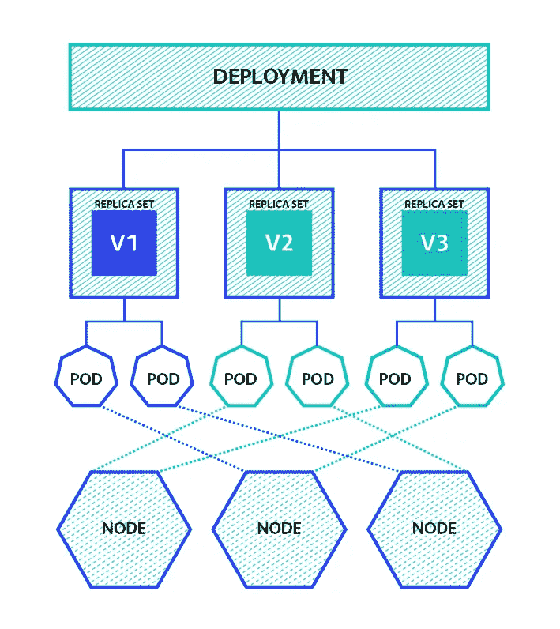

# 改进 Kubernetes 部署的技巧

> 原文：<https://blog.devgenius.io/tips-for-improving-kubernetes-deployment-d6188851a1b1?source=collection_archive---------12----------------------->


[来源](https://learnk8s.io/kubernetes-wallpapers)

Kubernetes 是一个开源系统，用于自动化部署、扩展和管理容器化的应用程序。它由谷歌在 2014 年创立，之后捐赠给了 CNCF(云计算原生计算基金会)。

Kubernetes 是一个古希腊词，意思是驾驶一艘船，在这种情况下，驾驶集装箱。今天，它是云社区中一个家喻户晓的词。它是云计算不可或缺的一部分。因此，使用它的开发人员必须了解针对 [Kubernetes 部署](https://komodor.com/blog/5-kubernetes-deployment-best-practices/)的改进策略。

不过，在我们深入研究这个问题之前，我们需要对 Kubernetes 和部署中涉及的东西有一个基本的理解。

[Kubernetes](https://kubernetes.io/docs/concepts/overview/what-is-kubernetes/) 是一个可移植、可扩展的开源平台，用于管理容器化的工作负载和服务。它是一个多容器管理解决方案，允许将容器分组到逻辑单元中，以便容器可以相互通信。它是用 Go 语言和 YAML 语写的。

# Kubernetes 的积木

## 容器

容器实例包括依赖项，如框架、代码、操作系统接口、系统库和执行应用程序所需的附加设置。由应用程序组成的容器可以作为一个现成的软件包工作，因为它满足了基本要求。

## 豆荚

它代表 Kubernetes 集群中的部署单元，可以容纳单个或多个容器。当容器在操作系统之上的物理机器上运行时，使用一个*单容器 pod* 。*当应用程序的运行依赖于其他应用程序/服务时，使用多容器 pod* 。

## 复制控制器

这是 Kubernetes 管理 pod 生命周期的关键特性之一。它确保所需数量的 pod 始终存在。它有助于创建、缩放和维护多个窗格，作为所需状态的一部分。如果 pod 崩溃，复制计数器会创建一个新的 pod。

## 复制集

[复制组](https://www.fosstechnix.com/kubernetes-replication-controllers-and-replica-sets/)类似于复制控制器。它们之间的关键区别是基于对选择器的支持。复制控制器支持“基于权益的选择器”，复制集支持“基于集的选择器”。

在*股权选择器*中，过滤条件是基于键和值，其中对象必须满足指定的标签值。在*基于集合的选择器中，*与它的对应物相比有更好的灵活性。它允许根据一组值过滤关键字。

## 部署

部署控制器是复制控制器的升级和更高版本。它管理副本集的部署。它们本质上是声明性的，为 pod 和副本集提供所需的信息/更新。在创建部署时，会自动为 pod 创建副本集。这些吊舱通过节点与其他吊舱相连。

```
**Deployment.yaml**apiVersion: apps/v1
kind: Deployment
Metadata:
 name: myapp-deployment
 Labels:
 app: myapp
Spec:
 replicas: 3
 Strategy:
 type: RollingUpdate
 rollingUpdate:
 maxSurge: 25%maxUnavailable: 25%
Selector:
 matchLabels:
 app: myapp
Template:
 Metadata:
 Labels:
 app: myapp
Spec:
 Containers:
 — name: myapp-container
 image: busybox
```

**服务**负责将 pod 暴露给其他 pod。入口负责向外界公开你的服务。

# Kubernetes 部署的改进策略



[来源](https://thenewstack.io/kubernetes-deployments-work/)

高效部署在服务器成本管理、提高基础架构利用率以及降低成本以充分利用环境设置方面发挥着至关重要的作用。

以下几点有助于您通过 Kubernetes 部署实现高性能目标。

## 根据您的应用程序需求定义部署资源

Kubernetes 自动化运行容器化工作负载和服务所需的操作工作的核心是将容器高效地调度到节点中。这可以通过指定资源限制来实现。

我们需要定义请求，并限制 CPU、内存和其他资源。因此，在部署描述符中定义资源需求可以让调度器更容易地确保每个资源都被分配给最佳可用节点，从而最大化运行时性能。

```
**Pod.yaml**Resources:
 Requests:
  memory: 1Gi
  cpu: 250m
 limits:
  memory: 2.5Gi
  cpu: 750m
```

## 实施污染和容忍

当我们处理大量的容器、标签或节点时，很难将特定的容器放置在特定的节点上。pod 相似性允许在一个节点上调度 pod，但是污点节点具有排斥一组 pod 的能力。对这些 pod 应用容忍，以便它们被调度到具有匹配污点的任何节点上。

污点和容忍作为反向节点选择器，有助于避免在不适当的节点上调度 pod。例如，在您希望仅允许通过某个节点计划备份作业的情况下，这可能很有用。它们让运营商能够非常精细地控制部署性能。

## Pod 优先级

[Kubernetes 调度程序](https://developer.ibm.com/articles/creating-a-custom-kube-scheduler/)持续监控集群中未绑定(未调度)的 pod。找到后，调度程序使用 pod 优先级来决定首先调度哪个。数值越高的数字表示优先级越高。优先级顺序有助于高效运行部署。

## Pod 和节点关联性

关联性允许在节点上分配单元。*节点关联*可用于确保特定节点用于托管特定 pod。 *Pod affinity* 可用于将两个 Pod 共同定位在同一节点上。

根据 pod 的资源需求及其在集群中的消耗情况，Kubernetes 调度程序可以很好地将 pod 放置在相关的节点上。然而，我们可能需要控制这些 pod 在节点上的调度。在这种情况下，可以使用 pod 亲和力。分析工作负载后，我们需要利用节点和单元关联性策略进行部署。

## 构建优化的图像

为了微调 Kubernetes 部署性能，拥有优化的映像非常重要。容器优化的图像将极大地减小容器图像的大小，这有助于 Kubernetes 更快地检索图像，并更有效地运行生成的运行容器。

## 在您的客户端附近部署 Kubernetes 集群

Kubernetes 集群部署位置在客户体验中起着重要作用，因为距离较远的位置会增加网络延迟。云提供商在世界各地拥有多个地理区域，允许系统运营商匹配 Kubernetes 集群部署的最终用户的位置，这有助于保持较低的延迟。

# 结论

Kubernetes 是每个云提供商服务的一部分，并将在一段时间内继续在微服务中发挥关键作用。因此，它是一个非常高效的[多容器管理](https://www.trustradius.com/container-management)编排工具，当您的部署按照您的需求进行结构配置时，它将提供开箱即用的性能。

我希望你觉得这篇文章很有见地。感谢您的阅读！