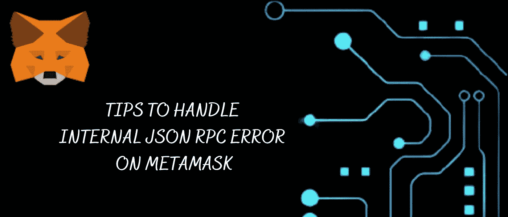
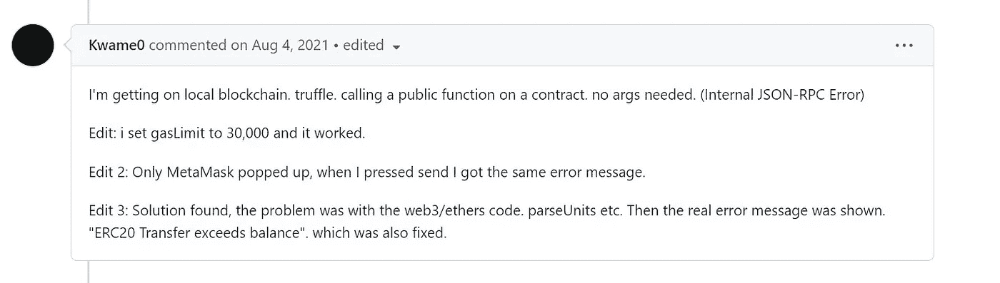
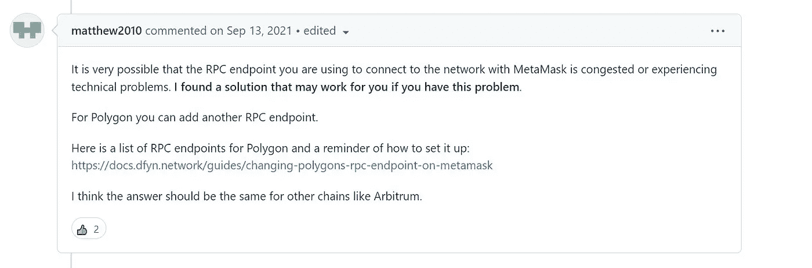
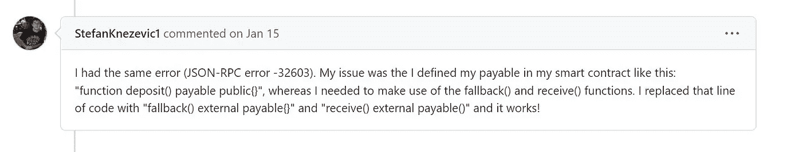
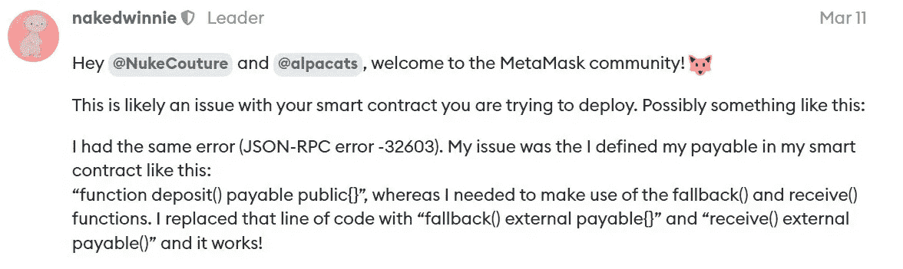
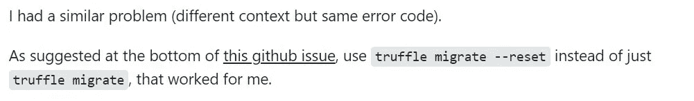

# 处理元掩码上的内部 JSON RPC 错误的提示-

> 原文：<https://blog.devgenius.io/tips-to-handle-internal-json-rpc-error-on-metamask-4fc103051a8a?source=collection_archive---------0----------------------->

内部 JSON 错误是一个 32603 错误，是元掩码中最常见和最重要的错误，发生的原因多种多样。

如果出现内部 JSON 32603 错误，这意味着元掩码在检测错误时遇到困难。

在这篇文章中，我们分享了 5 个最佳实践和 8 个可能的解决方案，可以帮助解决您的内部 JSON 32603，但是在我们开始这个主题之前，我们想解释一下 JSON 和 JSON RPC -

# JSON 是什么？

JSON 以能够更快传输数据的轻量级格式而闻名。

JSON 的完整形式是 JavaScript Object Notation，它将格式中的数据分解，直到变得易于处理。由于 JSON 是基于 JavaScript 的，当您试图理解它的数据元素时，您会发现不同的变量，如字符串、对象、布尔和空字符。

由于 JSON 有助于数据的轻松处理，数据被映射到一个允许不同编程语言的可管理的结构中。

JSON 是由道格拉斯·克洛克福特在 2000 年提出的，因此，它鼓励服务器通信和 Web 应用程序。

# JSON RPC 是什么？

JSON RPC 是 JSON 的一个进展，在全球范围内，JSON RPC 被认为是远程过程调用(RPC)协议。

JSON RPC 是一个新的协议，范围很窄。它通过在开发级别定义应用程序的任务，将不同的数据结构付诸实施。

对于快速开发或不复杂的事情，这是开发人员的理想选择。此外，JSON RPC 附带了以下 4 个指针

*   它反映了网络上与数据处理相关的限制。
*   由于它是轻量级的，处理数据更快，这两个特性使它适合以太坊节点。
*   JSON-RPC 协议可以利用 HTTPS 和套接字进行交互。
*   JSON RPC 协议是开发基于以太坊的解决方案的最佳选择。

此外，JSON RPC 有 2 个规范，JSON RPC 1.0 和 JSON RPC 2.0 -

*   JSON RPC 1.0 是一种点对点的通信方法。而且，它缺少名称参数和错误消息的解释，这导致了更多的麻烦。
*   另一个更新的非常先进的规范 JSON RPC 2.0 解决了之前版本 1.0 的问题。更新后的版本包括错误细节以及其他扩展。

# 元掩码上的内部 JSON RPC 32603 错误-

如果您在与其他网络交互时遇到内部 JSON-RPC 错误，那么下面的提示可以帮助您解决问题

1.确保您已经正确添加了网络。你甚至可以使用[链表](https://chainlist.wtf/)来添加你的自定义网络甚至令牌。

2.确保你持有足够的本地代币来支付汽油费。

3.确保您使用的是 MetaMask 的最新版本扩展。

# 自定义网络或侧链出现内部 JSON RPC 错误-

与侧链或自定义网络交互时出现内部 JSON RPC 错误，以下是解决内部错误的详细指南-

自定义网络或侧链是一种支持以太坊生态系统并与之兼容的技术。它允许用户在不同的网络之间转移加密资产/令牌。

元掩码对于以太坊生态系统至关重要，它允许用户在网络之间移动。

此外，在处理侧链时，有一些你应该避免的常见问题。我们将提供处理侧链所需的 6 个最佳实践。以下准则是一般准则。

# 侧链和定制网络的 5 个最佳实践-

## 1.做你的验证-

并非所有的定制网络都是安全的，因为它们提供更便宜、更快捷的交易；与 mainnet 相比，它们具有可靠性保证和不同的安全性。在迁移到定制网络之前分析风险。

你必须保持对网络提供商的信任，因为恶意的网络提供商可能会记录你的 IP 地址和网络活动，并谎报区块链的扣留交易和状态。

## 2.确保您拥有准确的客户网络信息-

您可以在[链表](https://chainlist.wtf/)上找到网络，您可以在 MetaMask 中自动添加该网络。您甚至可以手动将网络添加到 MetaMask，但除非您是软件开发人员，否则不建议您这样做。您可以在元掩码中手动添加一个[自定义网络](https://metamask.zendesk.com/hc/en-us/articles/360043227612)。

确保您验证了自定义网络的信息。您可以通过这篇“[验证指南](https://metamask.zendesk.com/hc/en-us/articles/360057142392)”来了解更多关于自定义网络的信息并进行分析。

## 3.利用已建立的桥梁在不同网络之间转移令牌-

MetaMask 不跟踪不同网络之间的事务。你需要了解不同的网络是如何进行交易的。你必须确保你信任网络运营商和任何以太坊地址。

## 4.避免直接从一个网络向另一个网络发送令牌-

如果您试图将令牌从一个网络/链发送到另一个网络/链，结果很可能是永久丢失加密资产。

自定义网络可能与以太坊生态系统兼容，但它们与以太坊主网不同。您的所有加密资产可能有相同的以太坊地址，但您的加密资产是特定于每个网络的，您需要自定义网络提供商的许可才能移动这些加密资产。

要移动您的加密资产，您将需要一个桥或门户来将您的资产从一个网络/链转移到另一个网络/链。

## 5.了解气体在不同网络中的使用情况-

当您与侧链网络/非以太坊网络交互时，交易费用始终以网络的原生加密货币支付。

例如，在币安，你必须向 BNB 支付汽油费。

您必须持有足够的本机加密令牌/资产，以用于您想要处理的任何交易。

# 解决元掩码上的内部 JSON RPC 32603 错误的 8 种可能解决方案-

内部 JSON RPC 32603 错误主要发生在创建智能合约时，这是由于 Ganache 的气体估计而发生的。

不，这个问题不能通过限制气体限制来解决，因为它已经被许多人试验过，但都失败了。

字节码在 Ropsten 和 Rinkeby testnet 上运行正常，但是在 Mainnet 上运行字节码时出现了问题。

甚至这个问题也不能通过改变不同的[RPC URL](https://www.reddit.com/r/0xPolygon/comments/pao5yz/anyone_facing_metamask_json_rpc_error/)来解决。

可以查看从不同论坛上截取的 8 个可能的解决方案截图，其内部 JSON RPC 32603 错误已经解决。

1.  下面截图来自 [Github](https://github.com/MetaMask/metamask-extension/issues/7286)

2.以下截图来自 [Github](https://github.com/MetaMask/metamask-extension/issues/7286)

3.下面截图来自 [Github](https://github.com/MetaMask/metamask-extension/issues/7286)

4.以下截图来自 [Reddit](https://www.reddit.com/r/Metamask/comments/m8ozlh/internal_jsonrpc_error_mobile/)

5.下面的截图来自[元掩码](https://community.metamask.io/t/error-32603-just-started-today-on-polygon/17778)

6.下面的截图来自 [Gitter](https://gitter.im/ethereum/remix?at=5a6d383f6117191e61bfcbc6)

7.下面截图来自[以太坊](https://ethereum.stackexchange.com/questions/37806/invalid-json-rpc-response-when-creating-contract/37818#37818)

8.下面截图来自[以太坊](https://ethereum.stackexchange.com/questions/37806/invalid-json-rpc-response-when-creating-contract/37818#37818)

# 结束语-

JSON RPC 错误伴随着许多错误，但是 32603 内部错误是其中一个重要的错误，可以使用 5 个最佳实践和 8 个可能的解决方案来解决。