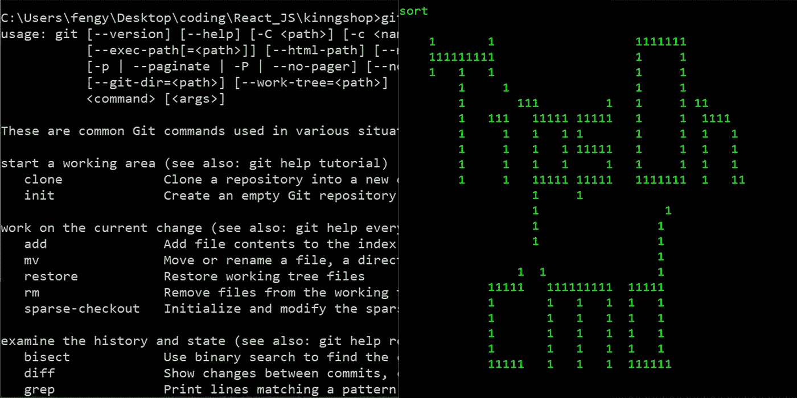
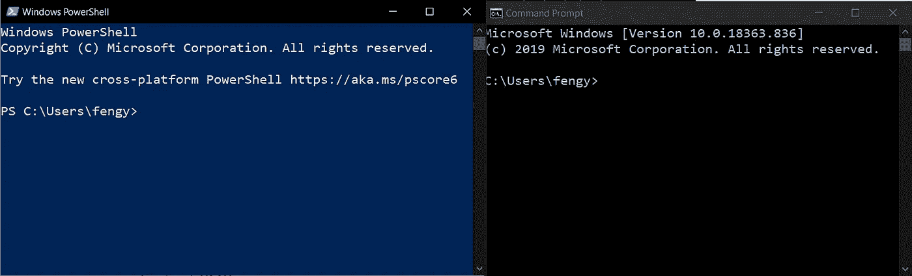
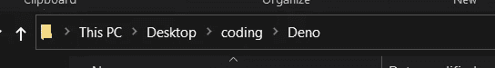
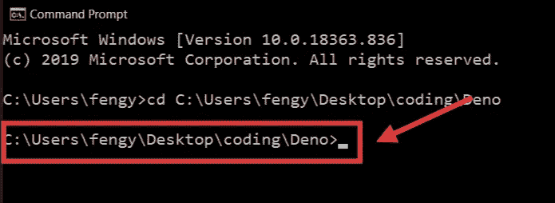
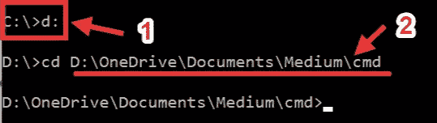
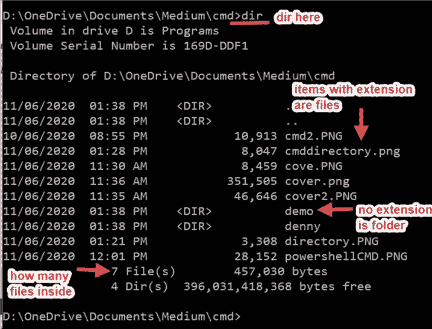
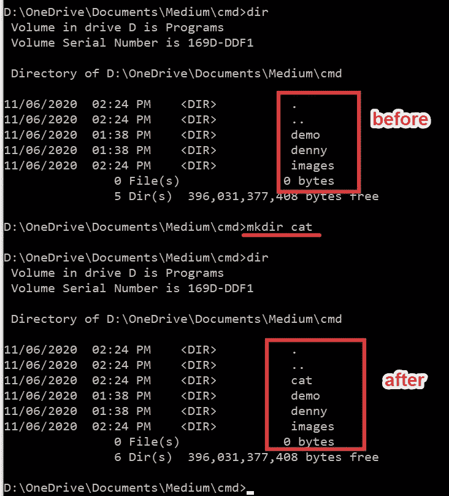
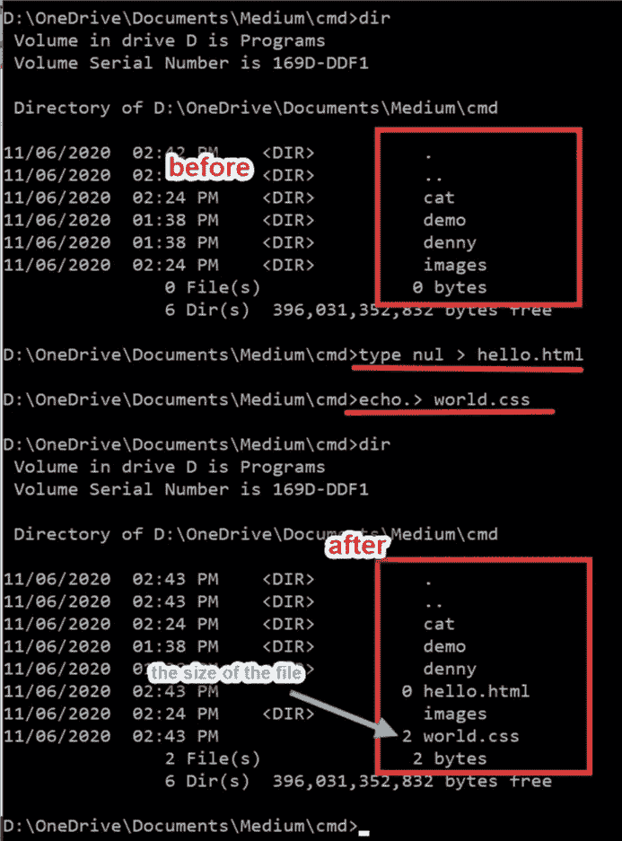

# 更好地了解命令提示符的技巧

> 原文：<https://blog.devgenius.io/tips-to-know-your-command-prompt-better-75bc218bbab3?source=collection_archive---------5----------------------->

## 探索一些有用的 CMD 命令。让 CMD 成为你的伙伴！



叶逢源的《我的 CMD》

多年来，你可能非常熟悉在电脑上安装程序、玩游戏和编辑媒体文件。然而，在您最终决定编码之前，您可能甚至不知道什么是命令提示符(CMD)。老实说，我在 5 岁生日时拥有了我的第一台 PC，其余时间我一直使用 PC，但去年当我开始编码时，我开始了解 CMD。这篇文章将向你展示我为初学者提供的一些基本的 CMD 技巧。



左:Powershell 右:CMD

# 好吧，你现在在问:那 Powershell 是什么？为什么给我看？

冷静下来，在我们进入 CMD 之前，我想先给你看看 Powershell。基本上它是 CMD 的新更新版本。所有可以在 CMD 上运行的命令，在 Powershell 上也可以运行。随意挑选你最喜欢的，即使它们在我们的日常实践中都是一样的，除非你想成为一名操作系统开发人员。

# CMD 是什么？

这是一台没有用户界面的电脑。此外，它就像我们对普通朋友说的行话一样。

CMD 可以做我们通常做的事情，比如创建新文件夹等等。一些命令将在以后的会话中共享。在我的日常编程中，我使用 CMD 与我的 GitHub 交互以进行推拉，也使用 CMD 为我的代码托管一个虚拟端口。

# 使用 CMD 时什么是重要的？

我认为目录是你应该在命令的其余部分之前检查的第一件事。目录是文件夹的位置。原因是您的 CMD 将遵循您的命令，并在您所在的当前目录中执行这些命令。如果你在错误的文件夹，你的 CMD 会告诉你文件没有找到或错误。



我电脑上的随机目录

这就是我们所熟悉的用户界面。



同一个目录在 CMD 上是什么样的

这是我们在 UI 上看到的同一个目录的外观。

每次当你第一次打开你的 CMD，目录将是你的电脑的基本目录。

它被称为根目录。

```
To change the directory, simply run **“cd your_directory”.**To cd back to the previous directory: **“cd ..”.**To cd another disk on your PC: “cd ..” multiple time until “C:\ >” and enter “d:”Too many folders? Don’t worry: **“cd the_directory_here”**A useful tip here, *tab autocomplete* is available and the tab will complete the file name with the first item in the ascending order list. For example, I have two folders: “denny” and “demo”, when I typed “d” and tab, “demo” will be the one be autocompleted.
```



1: cd 到另一个磁盘|| 2:带有完整目录地址的 cd

# 如果我忘记了我当前所在的文件夹，该怎么办？

检查文件浏览器你懒…哈哈，开玩笑的。有一个命令叫做**“dir”**可以快速查看你当前目录下有哪些文件夹或者文件。



dir 后显示的内容。

正如您所看到的，目录将总是在命令之后返回，您可以在那里进一步输入新的命令。

# 哦，亲爱的…那里有太多的线条，我怎么能把它们擦掉呢？

输入**“cls”。**

它只会清除你的 CMD 上的行，但是你仍然在同一个目录下:)

# 好吧…除了 cd 我们还能做什么？

记得我说过我们可以创建文件和文件夹吗？让我们试一试。

`command: **mkdir new_folder_name**`

我想在我的“denny”和“demo”旁边创建一个名为“cat”的新文件夹。



mkdir 之前和之后

新文件夹将创建在您所在的目录中。

# 那么，mkfile 是要创建一个新文件吗？

还不错但是再试试哈哈。

```
There are two commands for creating files:type and echo: they provide same functions.type message > file_name.extension **use “nul” instead of message for empty fileecho message > file_name.extension **use “.” instead of message for 1 empty line
```



新建文件~

如图所示，我创建了一个空文件和另一个空行文件，因此 world.css 的大小是 2 字节而不是 0 字节。

# 你有更多要分享的吗…这是相当多的…

别担心，其实都是我纯粹在 CMD 上用的命令。剩下的是那些与 Git 和 npm 相关的命令，NPM 用于 nodeJS。对于初学者来说，到这里应该足够了。当然，还有更多可以探索的，但并不是所有的都能在日常工作中帮助你。[文档链接在这里](https://docs.microsoft.com/en-us/windows-server/administration/windows-commands/windows-commands)，请随意查看。

# 最后一个问题！有可能改变颜色吗？我不是很喜欢黑白的…

哦，对了，差点忘了分享这个有用的提示。转到 CMD 上的顶部窗口栏，右键单击属性。您可以更改字体大小、颜色、布局等。有可能让它透明！！！

CMD 会是你很长很长一段时间的伙伴，直到你换成 Linux 或者 macOS。因此，请随意定制您的 CMD，让它成为您真正的伙伴。

# 额外收获:如何像文章封面那样借鉴 CMD？

```
In your CMD, type “@echo off” enterThen, pick your colour by “color 0a” the “0” is the black background and “a” is the light-green foreground. It is the classic hacker monitor colour haha. Feel free to pick any colours.“cls” before drawing.type “sort” and enter.Now you are free to go. Just your drawing pattern will become laser printing that you can only go one way to the right.Tip: by arrow **“↑”**, the previous line will be copied and pasted to your new line. Also, this feature is available on the normal CMD too!!!
```

# 感谢您的阅读。希望你对 CMD 有一个基本的了解，也希望我的建议能对你的日常工作有所帮助。

[](https://medium.com/@fengyuan.yap/what-are-code-editors-ide-37727d6b8060) [## 什么是代码编辑器和 IDE？

### 你是一个初学者，不知道在漫长的编码旅程中应该选择哪一个？在这里，我将分享…

medium.com](https://medium.com/@fengyuan.yap/what-are-code-editors-ide-37727d6b8060)