# 厌倦了现代网络？发现一些你今天仍然可以使用的“复古”协议

> 原文：<https://blog.devgenius.io/tired-of-the-modern-web-discover-some-retro-protocols-you-still-can-use-today-30bbca48d3f2?source=collection_archive---------0----------------------->

你厌倦了沉重的网页，浏览器弹出窗口，闪烁的横幅，N 因素认证，用户跟踪和分析？嗯，有一些协议在过去的 30 年里没有改变，你仍然可以尝试使用它们。

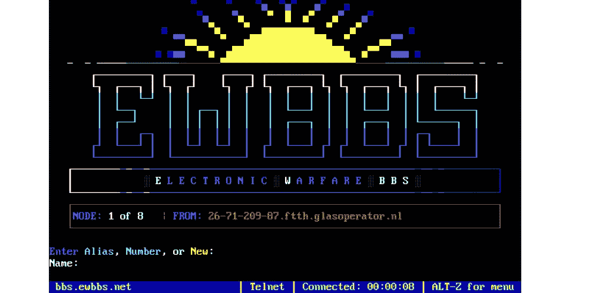

大约 30 年前，人们就是这样浏览网页的

让我们开始吧。

# 文件传送协议

与现代标准相比，FTP(文件传输协议)不仅“古老”，而且“古老”——第一个规范于 1971 年 4 月 16 日作为 [RFC 114](http://tools.ietf.org/html/rfc114) 发布。实际上，那时还没有互联网，计算机连接到 [ARPA](https://en.wikipedia.org/wiki/ARPANET) (高级研究计划局)网络，显然需要一个文件交换协议。当然，这个协议并不是一成不变的，它经历了很多改进，并且在 1985 年出版的“RFC 959”文档中写道“FTP 已经经历了多年的发展”。这个文档也有传输控制协议(TCP)和 Telnet 协议的内部链接，这些协议在 1985 年的“ARPA-Internet protocol handbook”中有描述(当时大多数人根本没听过“Internet”这个词)。

例如，FTP 今天可以用于远程服务器维护，但令人惊讶的是，公共匿名 FTP 也是可用的。我在谷歌上搜索了“公共 FTP 列表”，得到了一个网站【https://www.mmnt.net ，上面有一个相当大的公开 FTP 站点列表:

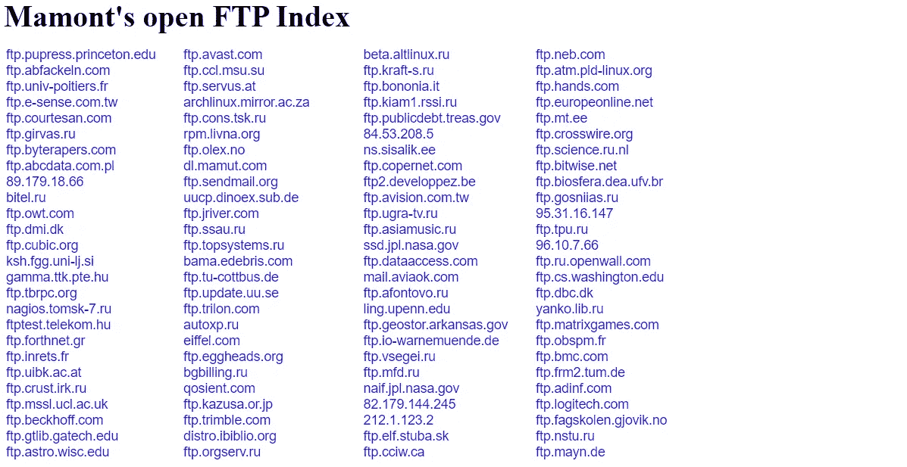

希望了解多年前它是如何工作的读者可以尝试使用命令行登录 FTP。我尝试了第一个链接，它真的有效:

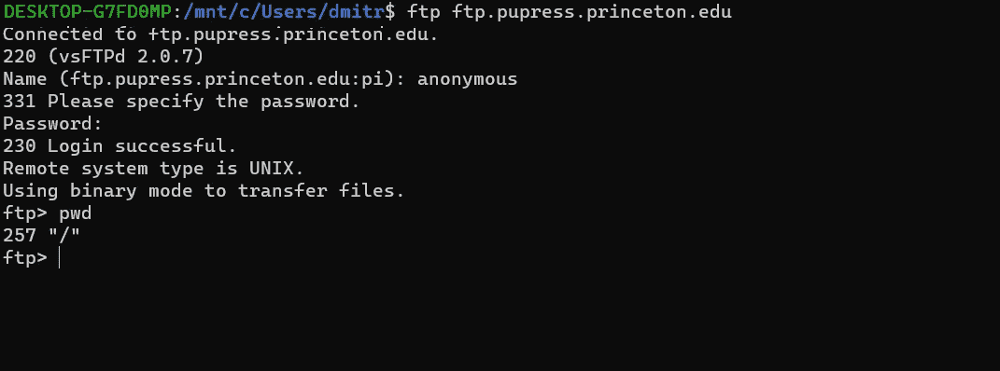

当然，使用任何现代的 FTP 客户端都要容易得多，像 [FAR Manager](https://www.farmanager.com/index.php?l=en) 或 [Midnight Commander](https://midnight-commander.org/wiki) 这样的东西将更加“符合”那个时代，并且也将给出如何使用老式文本用户界面的想法:

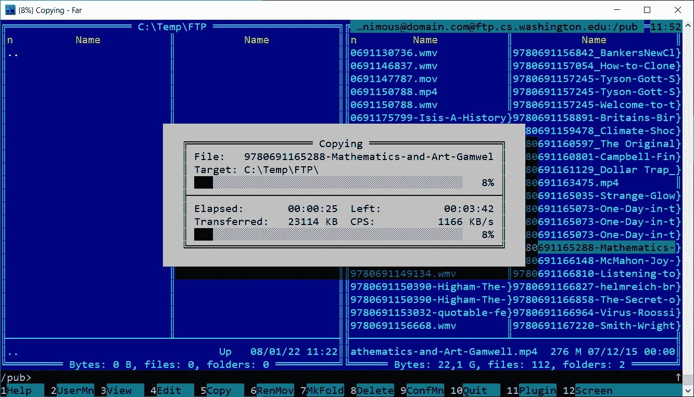

普林斯顿的 FTP 显然是为学生设计的，我从“大学出版社”下载了一些文件，读起来也很有趣:


同样的书显然可以通过“现代”方式[使用网站](https://press.princeton.edu/books/hardcover/9780691165288/mathematics-and-art)获得，但使用文本用户界面浏览文件列表可以很好地展示多年前人们是如何获得这些文件的。

# 公告板系统

早在 70 年代，ARPA 的科学家和工程师们就已经有了上网的可能性，但这对于普通的计算机用户来说仍然是不可能的。对数百万人来说，*公告板系统*是连接家用电脑和其他机器以及交换文件和信息的最基本的方式。为什么是“初级”？通常 BBS 只是一台连接到家庭电话线的电脑。顺便说一下，第一个调制解调器实际上是使用标准电话听筒的声学耦合:


图片来源【https://en.wikipedia.org/wiki/Acoustic_coupler 

显然，与任何其他电话呼叫的情况一样，这个连接在某一时刻只能被一个用户占用，其他人只能得到“占线”信号，不得不等到线路再次空闲。速度从 80 年代的 300 比特/秒到 90 年代的 57600 比特/秒不等，通话通常只能在本地进行，否则电话费可能会很高。因为许多 BBS 位于家中，他们的服务通常只在晚上可用，例如早上 0 点到 7 点——如果你想查看邮件、下载或上传文件，你必须早起，这在今天看起来很奇怪。另一方面，访问通常是完全免费的。成功登录后，可以使用文本界面阅读邮件、下载或上传文件。这看起来令人惊讶，还不错——特殊的格式和所谓的 [ANSI 转义码](https://en.wikipedia.org/wiki/ANSI_escape_code)允许创建一个相当复杂的 UI。顺便说一下，这些转义序列今天仍然被现代计算机支持——例如，Linux 和 Mac 用户可以尝试输入以下命令:


后来，提供对 BBS 的访问成为一个更大的业务，在那里提供不同的服务，从软件档案到“成人”内容。


来源 PC 杂志 1993

而且有趣的是知道有些 BBS 今天还在运营。当然，它不再是一个企业了，他们得到了爱好者的支持。最初，家用电脑大多使用电话线作为调制解调器连接，现在这就容易多了——使用 IP 连接可以从世界任何地方访问 BBS。

从技术上来说，任何 telnet 客户端都可以连接到现代 BBS，但在我看来，免费开源的 SyncTerm 看起来最好——它基于文本的用户界面提供了最“真实”的用户界面。就像 90 年代一样，在拨论坛之前，我们得找到最新的[论坛列表](http://www.synchro.net/sbbslist.html)，现在网上已经有了。我随机选择了“阿米加城市论坛”，不需要调制解调器，我只需要输入 *syncterm amigacity.xyz* 命令:

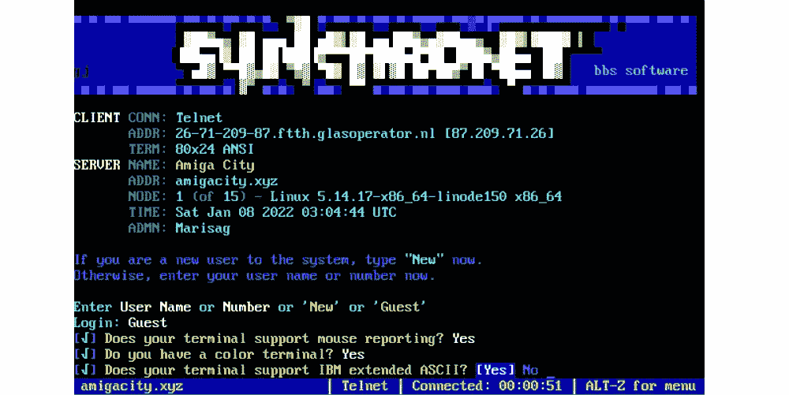

正如我们所看到的，BBS 提供了阅读消息、列出文件的文本界面，我甚至可以访问“电子邮件”——一种 90 年代的高科技:

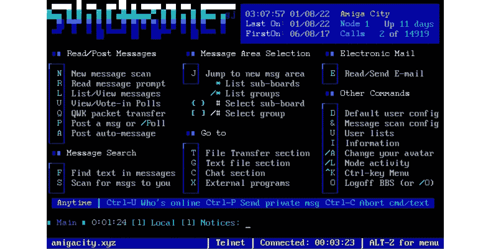

让我们检查文件部分:

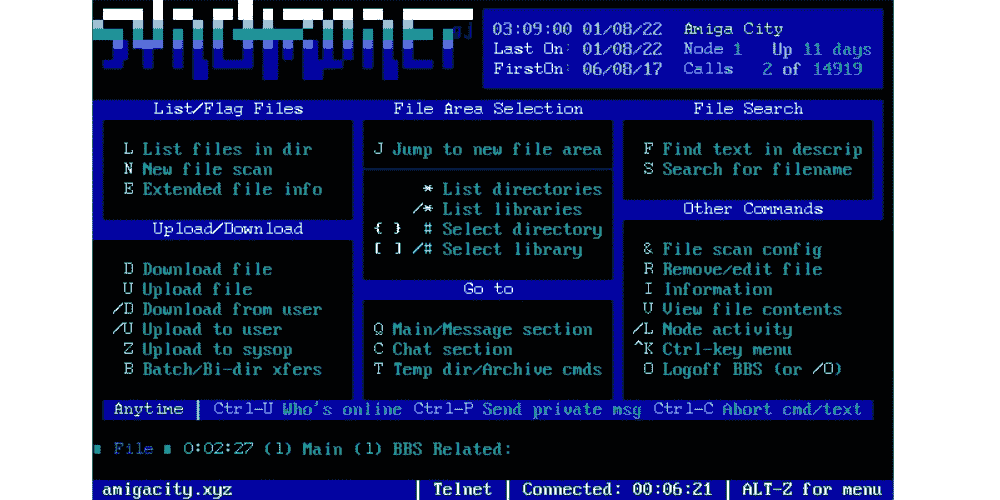

我可以从网上下载一些文件，我选择了 ZMODEM 协议来下载文件:

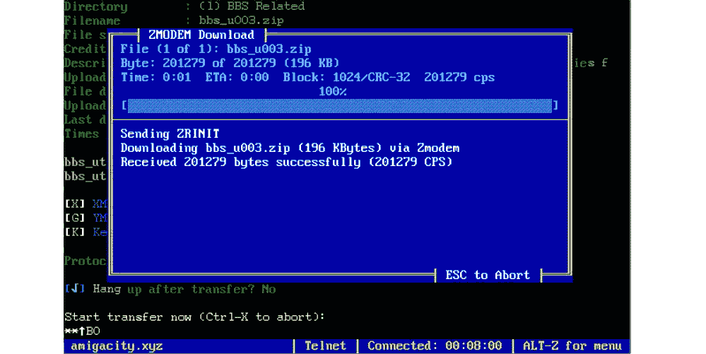

下载可能需要一些时间——现在显然更快了，但在真正的调制解调器上，速度大约是每秒 1-3 千字节(对于 2000 年及以后出生的人，我要重复一遍——千字节而不是兆字节；)，有时下载软件或游戏可能需要几个小时。

我也可以上传我自己的文件到 BBS 上——我决定上传一份我的[媒体文章](/nude-pictures-on-early-retro-pcs-was-it-possible-3434b5c0447e):

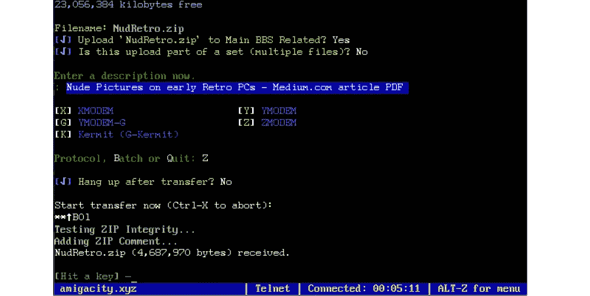

最后，在断开与 BBS 的连接后，我可以检查我下载的文件。在 90 年代，大多数电脑都没有多任务处理——只有在关闭终端程序后，我才能检查我得到了什么文件。嗯，在存档中有一些 Perl 和文本文件，我不知道它是什么，也不知道我是否需要它们:

```
-rwxrwxrwx 1   1893 Feb  4  2018 Announce.txt
-rwxrwxrwx 1   1521 Feb  4  2018 FilePost.txt
-rwxrwxrwx 1    447 Feb  4  2018 FilePostBottom.txt
-rwxrwxrwx 1  35147 Feb  4  2018 LICENSE
-rwxrwxrwx 1   1786 Feb  4  2018 README.md
-rwxrwxrwx 1 115994 Feb  4  2018 README.pdf
-rwxrwxrwx 1   1143 Feb  4  2018 bbs_announce.md
-rwxrwxrwx 1  24780 Feb  4  2018 bbs_announce.pdf
-rwxrwxrwx 1   1572 Feb  4  2018 bbs_announce.pl
-rwxrwxrwx 1   1096 Feb  4  2018 file_announce.md
```

这在今天看起来可能很愚蠢，但是大约 30 年前，这正是互联网出现之前人们交换文件的方式。

# 谷佛

在 90 年代初，更多的计算机能够连接到网络上。虽然可以通过 FTP 下载和浏览文件，但显然需要一种特殊的工具来搜索和读取数据。并制定了所谓的“互联网地鼠协议”。在 [RFC1436](https://datatracker.ietf.org/doc/html/rfc1436) 协议规范中，我们可以看到许多至今仍在使用的术语——TCP/IP 连接、客户机-服务器模型等。简单地说，Gopher 是一种简单的基于文本形式的“早期 web”协议，针对低速连接进行了优化。

事实上，Gopher 的活跃时间并不长，它是在 1991 年推出的，其受欢迎程度在 1994 年开始下降:

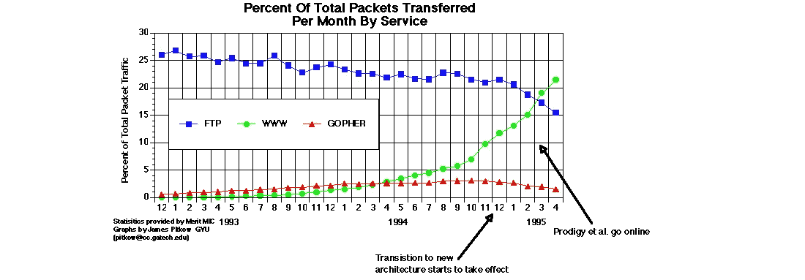

来源[https://ils.unc.edu/callee/gopherpaper.htm](https://ils.unc.edu/callee/gopherpaper.htm)

不仅有技术问题，还有法律问题 Gopher 服务器许可不是免费的(它在 2000 年才根据 GNU 许可重新许可)。但是计算机也变得更加强大，人们选择了更加“花哨”的网页，而不是纯文本网页。有趣的是，Windows 95 中的 Internet Explorer 能够打开 Gopher 链接:

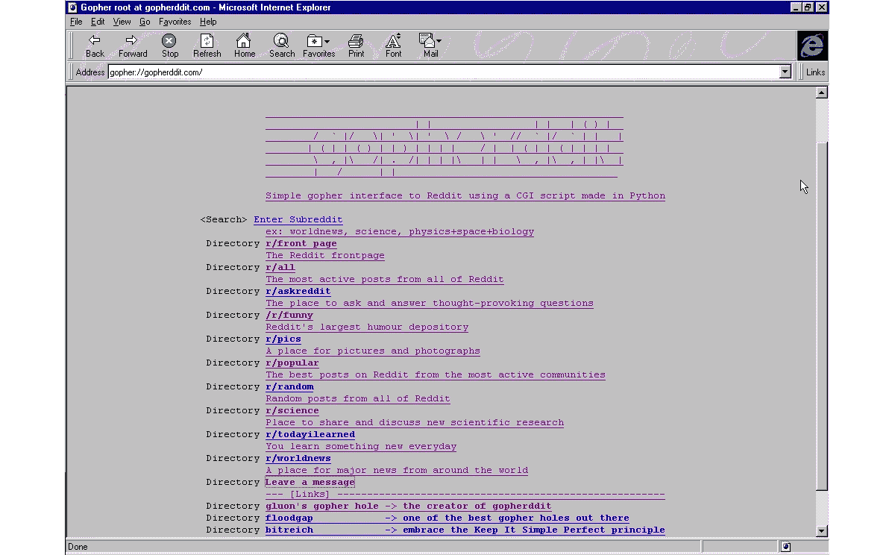

但是在 Windows XP 中，这个功能已经不存在了:

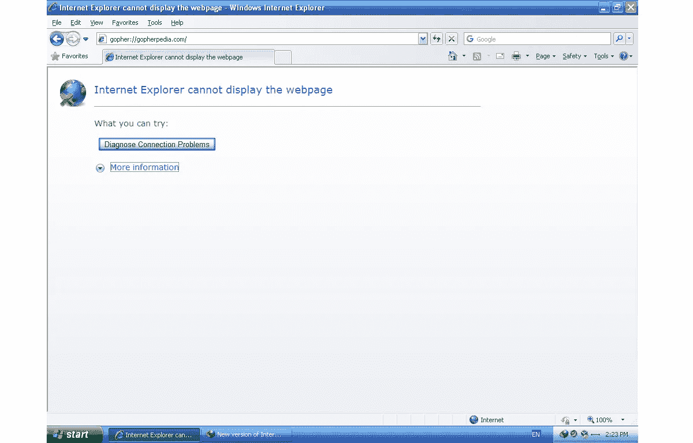

但是同样，一些地鼠服务器现在仍然受到狂热爱好者的支持，免费的客户端可以从 https://github.com/jankammerath/gophie/releases 页面下载。

例如，我们可以打开*gopher://gopherddit . com:70*页面，该页面提供对 Reddit 组的访问:

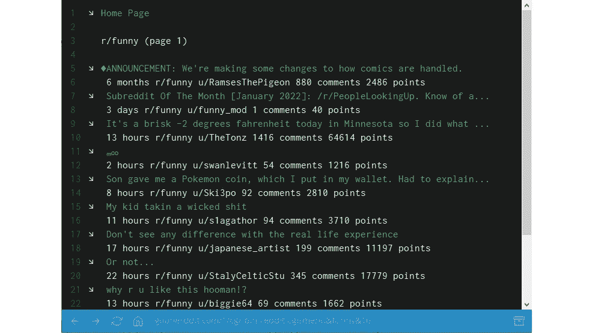

使用*gopher://gopher edia . com:70*地址，我们可以阅读维基百科:

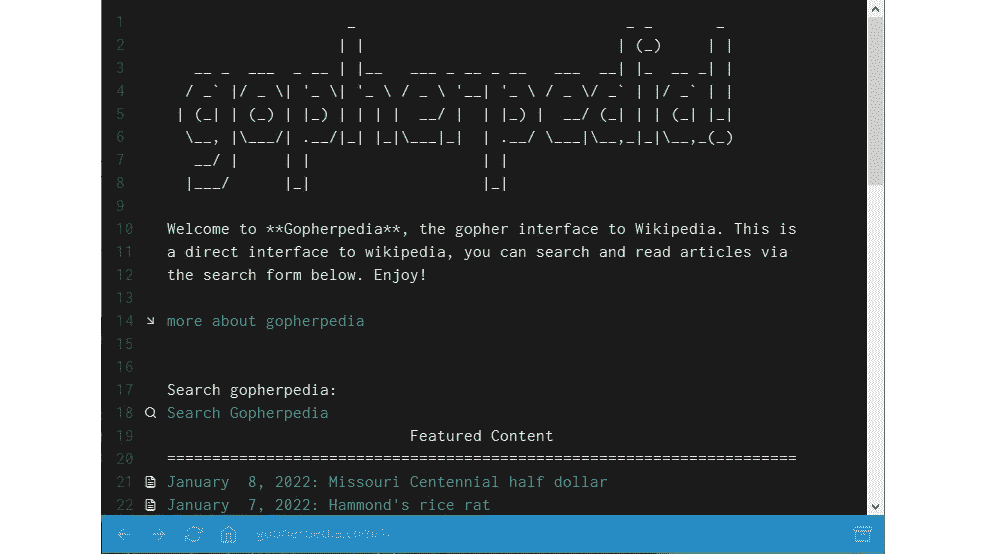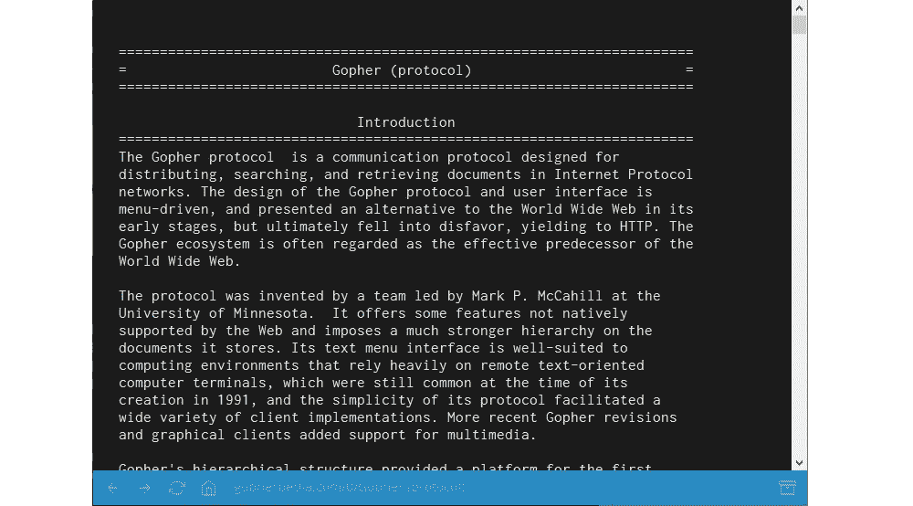

对了，即使不安装专门的客户端，也可以使用 curl 命令查看 gopher 页面，比如命令*curl gopher://gopherddit . com*会显示主页面内容。

# 因特网中继会谈

内部网中继聊天系统创建于 1988 年，不同的 IRC 服务器今天仍然活跃，免费的客户端应用程序可用于不同的平台。

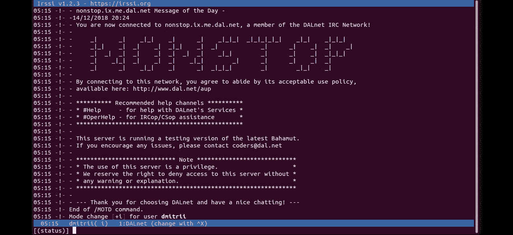

使用 IRC，可以连接到不同的服务器，并加入公共或私人频道。许多命令，如"*/服务器连接"*或"*/加入"*，可以通过命令行输入，而[完整列表](https://en.wikipedia.org/wiki/List_of_Internet_Relay_Chat_commands)实际上相当长。根据维基百科，2003 年多达 1000 万用户同时使用 IRC，如今这个数字明显下降，但是这个系统仍然存在:

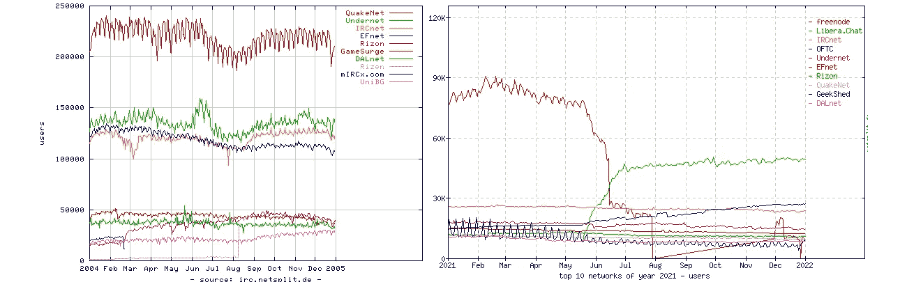

来源[https://netsplit.de/networks/top10.php](https://netsplit.de/networks/top10.php)

# **新闻组**

新闻组是另一种“古老”的服务，流行于上个世纪的“前互联网”时代。该系统提供对公共“谈话组”的访问，组名使用特殊的层次结构，例如，在“comp.lang.c”组中，每个人都可以讨论关于 C 编程语言的话题。群体可能完全不同，从*谈资.政治.动物*到*杂项.孩子.怀孕*。每个人都可以发布消息，其他小组成员可以阅读消息，如果需要，还可以回复。不仅从技术角度，而且从社会角度来看，这种与志趣相投的人交谈的能力实际上是有帮助的。

令人惊讶的是(再次:)，大约 30 年后，一些新闻组服务器仍然可用，也可以安装 Windows、OSX 或 Linux 的客户端。但是我能找到的大多数服务器都不是免费的，它们只提供 7 到 14 天的免费试用期。另一方面，通过[https://groups.google.com](https://groups.google.com/)界面可以看到许多谈话群组，正如我们所看到的，即使在今天，同一个“comp.lang.c”群组仍然有一些新消息:

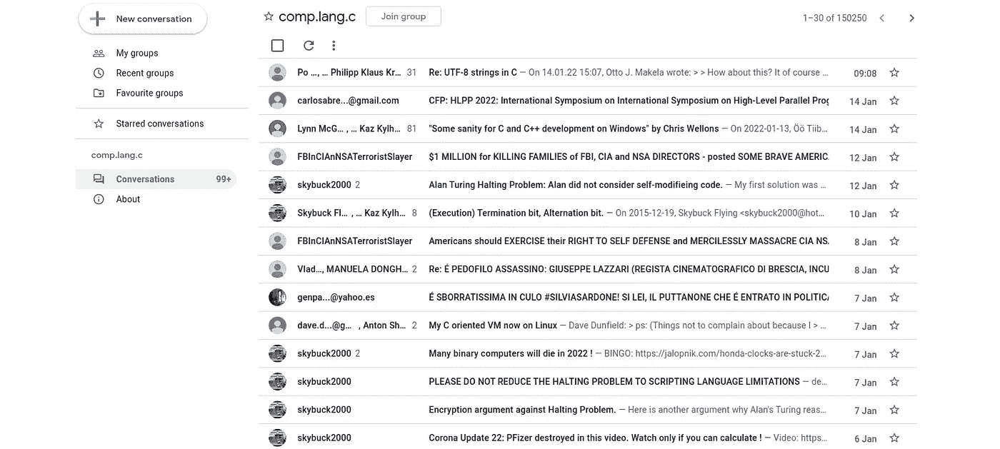

当然，两周内大约有 20 条消息——这比 Reddit 上的少多了，但是，它仍然有效。

顺便说一下，在谈话小组中，甚至可以交换文件。使用特殊的编码，这些文件可以被转换成文本形式，可以像普通邮件一样发送。每个消息的大小显然是有限的，所以文件应该分成几个部分。例如，我将 JPEG 文件编码成 3 条消息:

**消息#1**

```
To medium.readers.all, share part 1/3begin 664 xaa
M_]C_X``02D9)1@`!`0```0`!``#_VP!#``4#!`0$`P4$!`0%!04&!PP(!P<'
M!P\+"PD,$0\2$A$/$1$3%AP7$Q0:%1$1&"$8&AT='Q\?$Q<B)"(>)!P>'Q[_
MVP!#`04%!0<&!PX("`X>%!$4'AX>'AX>'AX>'AX>'AX>'AX>'AX>'AX>'AX>
M'AX>'AX>'AX>'AX>'AX>'AX>'AX>'A[_P``1"`"``(`#`2(``A$!`Q$!_\0`
M'P```04!`0$!`0$```````````$"`P0%!@<("0H+_\0`M1```@$#`P($`P4%
M!`0```%]`0(#``01!1(A,4$&$U%A!R)Q%#*!D:$((T*QP152T?`D,V)R@@D*
M%A<8&1HE)B<H*2HT-38W.#DZ0T1%1D=(24I35%565UA96F-D969G:&EJ<W1U
M=G=X>7J#A(6&AXB)BI*3E)66EYB9FJ*CI*6FIZBIJK*SM+6VM[BYNL+#Q,7&
MQ\C)RM+3U-76U]C9VN'BX^3EYN?HZ>KQ\O/T]?;W^/GZ_\0`'P$``P$!`0$!
M`0$!`0````````$"`P0%!@<("0H+_\0`M1$``@$"!`0#!`<%!`0``0)W``$"
M`Q$$!2$Q!A)!40=A<1,B,H$(%$*1H;'!"2,S4O`58G+1"A8D-.$E\1<8&1HF
M)R@I*C4V-S@Y.D-$149'2$E*4U155E=865IC9&5F9VAI:G-T=79W>'EZ@H.$
MA8:'B(F*DI.4E9:7F)F:HJ.DI::GJ*FJLK.TM;:WN+FZPL/$Q<;'R,G*TM/4
MU=;7V-G:XN/DY>;GZ.GJ\O/T]?;W^/GZ_]H`#`,!``(1`Q$`/P#KMK.0.2<U
M'X@?9HD\2GHG)J2_O(["%&<@/(P"BJ^OACHMPYZF//Z5\DG[R9^H1CJF>6V3
M'R,Y/6MC2F.VL'3Y`8,9[UN:9@1]:]>KUN:Q1L*W'7FG[N!5="#CYJEVM\H/
MRESQN-<RBWL6[1U8KR`':6YH1@<_-5ZRTF*ZD&^YP/51FM;_`(0\2`FSOVW=
MA*F5/XCI^56Z<NIQU,;0@[-_@<S(>>IJM?`/"16CJ^G7NE7'E:A"8]WW)`<H
M_P!#_3K67=2*(\9II-,Z(N-2-XNYN^#IVGLC!)_`<`UN21J`,$UR?A20A967
M&`U=*9\KN)^M<]>'O:&3BTS0T+4WTO5(KD_ZO.U_]TUG_%W0OL6JQ^(;,;K2
M_P`"4CD+)C@_0C^55[FXR,*.*['PA+;>)/#EWX6U`_,8SY;'KCL1[[@XK](http://twitter.com/XK)&,G3
MDIKYG)B(.DU673?T/)H@6;&>M<;XQ\9-:7/V'0I_](3(DN4.=O8JOO[TGQ)U
MF\T74KSPK;2`75NYBNID/3'\*GZ=?RKSYSM143/'!/K7T.$PBDO:3VZ?YDU\
M2K<L#VWQ!K+:MXPM8XW/V>"7`P>&:NW\2'&[@3](http://twitter.com/3)$?\\_Z5Y/HW&JVAV\>:.:]6
M\0?\B]-GIY?]*\7$TU"4(H]).[1Y#I0_<?CUK<T_E.M8.E/F$X!(R:Z#1XY9
MYHK:!2TLTBQH/]IC@?J:[ZPH.VI?:?R%R,F0_<P>0?7\*2S8JRKG<P].U0ZG
MM76+N")]T<,IC0GN%.,_CUK0T]8XQE^6(S@]OK6,-%<=5\R-73R\;JV,#COQ
M7?Z.X>.,#+R,,[0/\_G7#:+93ZE*L@;R+16P92.7_P!T=_K7H.DB*VB$=LNP
M?Q.>6/U]:O?<\''\NRW-.;2[:^M6M=1BCDA<8,9&<_CV/N*\>^*GA>3PE<PW
M-JTTVD76%224@M%)W1B`.O4'Z^E>S6\J'C[QS@D]*L30VE_9RV5_;QW%K,I2
M2)URK`UJDCS,/BZF&GS+;JCP7P&RRQ3G&1FC5]<33/$MMIUQQ%=*=I]".U:.
MF^'Y?"WB;5-$)=X(W$EK(_62%N5/X<@^X-<!\8[:]O?$>E6>EPS7%_(2((H5
MRY/'05C"DJF(<'_6A]4Z\?8JJMK'I!`XQTKG?'GC&;PC8(VER^7K%PI$##&8
MEZ%^?R'O]*]"\&>!-8N/#MFVKWUO%J&P;D0;DSC[N[/)]P,>A-?+WBF_O-2\
M37UYJ7[NX25HO*SD1!21M'TQ58/!<]1\^R_$YZN/HU(N--W9F2O-)/)//*\L
M\K%Y9&.68DY))[DFNI\$>#I=?N8VGW1608&9UZE?[J^Y]>U9/A?1KC7=8AL;
M;@,=TDF.$0=6/\A7T/X=TRWTJQBA@C"QHN$4]?\`>/N:]7%XCV,++=G#&-W?
MH><Z7M.HVX])!TKU378Q_P`(S.3U\K^E>7:+$/[5ASU#`UZKK@'_``CD_P#U
MQ/\`*OG,6_WD3W7]GU/%=+^6#..]=A\.5\_Q;IT9(&QGFR?5(V<?J!7&Z828
M.>/F/\Z[3X4-&/'EC%*1B6*9%S_>\MC_`"!KLQ/PR]&3-VI-^11U2VEM-6D,
MA(+R%@3W-:NG0+(GF3L?)_NC_EH?YXJ_XXMX(]2=6B8^1-AC_"01T_E56*1E
MP[@>;C(4]$'^-9TIN<$PG*ZT.HTJYV.HDPN/NKT50/\`/2MM+EB,,VT=?0G_
M``^E<#-JB6,!=G56'5GZ`_IS_*LJR\=>8MV9)[@3](http://twitter.com/3);E1&(A\KDGE26Q@_0UV4L
M+4J*\4>3B803NSV"TU#`VJRY'13TQ5I;X0!F9]['DY[#^E>(/\2[QKV'3=.T
M-[B\F8JJB3A<`$D^P!!)Z>_>O6?#EG/-9PW6IA5F9%9XPQ(5B,D#/;/<\^PH
7J49T/C/-J4Z;UN7]0A&MQ*C)L9&!CFT`
`
end
```

**消息#2**

```
To medium.readers.all, share part 2/3begin 664 xab
MF6`[CZ?ITJ?2-!TK3IVN8+6-[IUVO,PW.P]"WI[#`^M6X@HR-V$'..[@KG](http://twitter.com/KG)-?\
M?:3IDSV&F13:IJ&W"I;KE%)'!+=/RS625WS=3&+JU(^QA>W8ZK^VM/L7NKB[
MN55;.%I923]U54LV/H*^%KZYDU"_FNG4^9<SM,PQW8DG]37L?Q2\47.G>%KW
M1[V>/^W=554>WBY^R6Q.YB[=W?&,>A)XR,\#\+M&_M;Q+"TL.;>V'G.<<'G"
MK^)KTL(N2FYR.JCAU3EH>E_"GPRFD:3]IF0_:KL+)+N'*KCY4_K7;."30D1C
MBV]^IIC,17DUJCJR<F=]UT/,K23R]3MRO>0"O5=7&?#LQ'_/'^E>1VY/]H6Q
M/`\U?YUZ]J8_XIN4C_GC_2N7%KWHL]63^'U/#=*W&$^S&MK2II[.YAU&U(%Q
M:RK-&2,C(.<'V[5EZ3_JF.,?,:W]&B:X_<1X)9L__7-=];1LN"3C9G=?$BXM
MFGTVZCV"6ZMUNO+S]T,!MR>^.?U]JXC6-5M])M?/F?+OG8I/+-C/..G0_3%+
M?Z[`+9Y+I9M^G-]AB62/:9"N2-O/(YP#QQBO,=7GGN;U;J[D&99)5;8,#;M4
M=,CNS8/ISS71E^";C[VR/.JUXT8**=V7-1U>;56MYI;B1X=Y$F]L%1CIQ[#D
M^F*JZ0E^-5CTB&&1YX79B@CW*6R09#^@!Y[8YJCI[.+[@O](http://twitter.com/O)&A\P2[!%C+,QX"8
M]3DC/J*]^^%OA!=#LH]5U"*$7MSM,\A&!A4Y;V'!/XY[X'JU\1'#P5M^B/-?
MO-N1;^%_ABTT+3WU*YM3YTC;P'P6#<`Y/?E1Q[9ZUW-H9+FXVIG@Y:N/U'Q1
MIUH6@'F_9!*3]HC4-G<3V!W`=><=C77>&+VSE@5[21)8F7>K+W%>'B*SG-S?
M4/JDU#FD<?\`'5K_`$_0[._%W.M@DA%S`G"R=P6]0,=#Q7$ZYX[E\.>"[*;2
MK:*2\OMRP328*PJO4X_C()P,\>QZ5Z5\:]8T.X\$WVCS3B2]9,I!&-S`^_8?
MC7SHQ>\^'.F[R0UE?S0\][@R](http://twitter.com/R)*1_Z":Z,-"-6'+-:)FL(\D$TK;HYV^FN)Y9+F
M[G>>YN7+RRNV69CR237M7P:TG[!I:32IM:Y`F8GK_L#\LG\:\DT>P_M77[6P
M&=CR!&([+U;]`:^CM,[@BATZ](http://twitter.com/BATZ)-/+"@@'`[#H!^5:XZIRP4.X1[HT)/FXJK,H`.
M*;*I0@PR$>QJM-<21@^<O'J*\J,6]AIJ^IY0\PCU*S7S/^6Z=_>O<+]-WA>0
MC_GC_2OG)KAQJUB)#UN4'ZBOHNZ8GPS(,<>3_2HS"'+RGK<W-;U/%=+MG>WD
M$(,DI+;4W8WGG`R>!FMI/$=GX9T":QE*7.LRS?N5MXR5C+*/OOU<*,\*.M9V
MDS&STB>\#[6`8JNP;B<XX)_GS]*S8D-QXEAD:X:5]ZJ7G<L22&.%[CN<G].:
M]S"8&->[J;'%C\4Z=E$R[QK^X\1G[9=^;>R@,SHP?:"Q^1.3@#GWR?IC+\8(
M+7698P4D@GA4A5_A^4#]"M1RR79\4,8IF$TLI3?MP".W'ICG&*U]>LC>Z?IN
MF?:&NM>DD9BJ*7(0G.'/]T*0002`%->C.K"FE!*QYL82D^=FY\#_``U+KFOG
M7+]8_L]GG:\BX#$#!9OUY/7#<Y%>C^.;B?QCI;Z7HUW+;6,>=LJ\&X8'.3WV
M^[@_](http://twitter.com/_)'TQQ7C'6(/#WAW3?`FBN1/<1+/J4B\8BZK%GU8#<V/7'<UV'A.<11QD<#
M`.*\'%5).:J/KMZ'IX+#JI>;^SM_G_D8N@?#[2X-)U%;R"\.H-*DEK<Y*BWV
M=0&!R=V?3\J[GX<_:?)U*.(K]JBM'>'</EWXX)%6=4OH_P"SI'&!\O-5_AM/
MN\4M$5VBYA9!^(KFE5=5KF.AP<</4:7F>.^.]`DMM/GEGDN[W5&N#,]W,?N(
M`<KG/.2?0=*Q=$0-\.=19CGRKN*0_5ED_J!7HGQ:O([;1;R4D;G78ON2<5Y[
MX<0S^#?%5B.76UM[E<?[#.3_`#%>GAZDIP;?='-B81BE8N_!?31=:S/?N`1$
MGEK_`+S<D_\`?(_6O9W?YL=`!7%_!S3EL_"J73(0USF8?0\#_P`='ZUUL['G
M'2N#%3]I5?D8+W4%Q<"->N:N66@:A?[9;AOLT+=`1\Q'TJ3P=IHOK]KV9=T,
M!PH/1G_^M7H,5KE0TG)[+7!5Q#IRY*>YA5J6W/D#06AN_$%@KJ'7S@?UKZ'N
M%QH,XQ@"+BOF_P"'I,NO1G?[@QD](http://twitter.com/QD)$#U.17TE,^[P[(2,DPYKJS-<LHQ/6ISYDF
MNYX7-E/#]U+(Y5FE3:3T`\P#)]CSCZ>U9>GW,CZH[JC31Q.9"W\1S\I?Z8Q@
M=A[DYM:IJ`;35@<K([O+-*K?Q[-P4>F!A>/8CO4/@A[1;&ZCNB\8'V>,R+DE
M0YW'/I\P7\B*^GP,>6!Y68U+S]"?4M$;7[Q'TVV,UWJ7E@)DJ()%(RV>[@4C](http://twitter.com/4C)"
MCL=QQZUT5]#IWP^O(]3C3[1K:J8I&<@+YK``0@#@*O5L=``,[@FK_](http://twitter.com/FK_)`(9DAT2\
MBOKU?+C$JB6Z`W,,?,&49X4X_,5YCXQUN7Q#J\MSY;1VT;$01ELE06Y9CW=C
MR3W/L!6&)A*55Q^SU_R,J33@B+1[B2\\1)J-_*\\]TTIEE<Y+,5)S_\`6]J]
MDT&1?*C9#P5XKPZRG$3HP4Y1MWZ'_&N^\'^(8B8;*>79(!A=W>O-Q].3M)=#
7W<MJ1C>#ZGI;:C9&-K6>6,/M^968`X,`
`
end
```

**信息#3**

```
To medium.readers.all, share part 3/3Dear all, look at this JPG it's nice.begin 664 xac
M5OP\GABP5]3.J1K=C>%42G[V!CIU.,UE16@U)D9&CW`?>IOC&\E\.^&YKJ:2
M&4Q@")%C"Y<G:,]SR:\^G%MV.FNH<K7-8\Q^+FK"_P!>BTJ)LQVY#28_OGM^
M`_G4/@I<Z_J6G*/EO=,EA`]2"I'Z9_.N4B\ZZOA/<,S33S98D\DL>?YUW/@.
M'_BO].R/O><"?^V)_P`*]J<52AR+HF>-S>TO-GJVEVZ66DV]K&N$B0(?![5XU--[F<YJYZ)X`M0N@028X;+GW)-=.
MB97I5#P=#Y7A32PZX9K=6(^HJU?WEM9Q-+<W,=O$O+,[!0/Q->;M-M]SSJK=
M2=D?'^I^&;CPM>0:M92^=:NZ*#]6'6O>HR9/#^74L'@^Z#C/MFO'K"YDOOV?
M_.<[Y8)U7<3D@"0?TKV2W(/AA""<FW!'Y5ZV:W4HWWO_`)'KX*HY0L^C/G;Q
MI/(GBU=*GDC2.U#1S%$Q'$2`2$`YV@*I'<G)[YINA3P6,K0.\,JWT8CN55N`
MV<*4SC/)&>PYYXK&\42%_%&ILBX>2Y?.2!C#?UQ1J31PK:+"WF)#:KEL8#DE
MMP^GS>QXKZ6E[L4>=47,['I/AR\^W;K6SN9(HE5%RS?-)MY+$GUY'(QCJ.M<
M9XJT^*UOC<VUJ;:VNYUQ#SB/YLC'H"`>/56`X%:G@>[-S?6T?R)<&7S)!G;O
MBR0Q!]B/KS]:M^-UAN[.Z2WNX[J>;54NA%&1YD0C0J5*YR,[L\#^'WS6E?57
M,*7N5+(\^AC;>".H;;^==KX$LXFN[B.\MXY6CVLOF+G`8`YYKEK:QFGU86*H
MT;R3`E6'*_7\Z]*T*T\GQ5=`'(2VB4\<`C/],5X^-JI1MY'NX*DW+F\SK]+4
M6Z*8H8XR>`%0"NML]&T;6=->TUVRAO$DZAQ@CW!'(KEH3L<`_A72Z+<8*Y->
M)[25[IG5C:5X61Y]\0_@O+I</]O>$I9KNUMV\V>QD^:55'),9'WL>AY]S7*^
M`)UNO%L,D9!V1S,&';Y-O\VKZIT24>6IS7A&J^%4\.?''6A;1>7875DMW;*!
MPOFR98#Z/&W'H17H0Q,JE-\^]CP\/4M)P9//8W-N";6Z=2.Q.:S9[G6)1)"\
M22L`-H'5R3C%=#=-P=M=%\,=#M]2>?4KL%O*E5(D[$]<_P`JYYUO9T^8W<H[
MRV.Q\2ZW;>%_"DFJ7P*Q6T`Q&GWB<`!0/7-?,7C#4]9\9ZL^HZO)(MHI_<V:
MN=B>F>Q;UKU?X_ZM]KO;70X6S%"_F38/5NP_#K7F$SHC,5/[J/A0.Y[FL\N@
MDN?JS7#X=1I\\NI+\/K&YD^#6O6D\3(\,C2!&'48!KUW2W+>$HW)P!:[@G](http://twitter.com/G)\JX
M'X,23^(/".NV89%,4`5B>-Q(/^%=UIK*G@-VDR0MFV><<;:TS5N4DGO<SP3L
MYKS1\S^)RH\3W[QJJ;YFR2/N$G)Q[\U1EQ]E#J!P-OS>F*EG:2^U*XG?#/)(
M6)'8YK1TRSA,D<5R@2"8RY8_>"X4!OS)_(U]/!:)')-ZW-'P=YEPC?V?/&E_
M%\ZPRH-LL7&X#N3GGCGD^M9?B[4,RPVLD(%S;D^9.?O2@JI7\`.,]<8]*N:=
MY>F7T#W2`^6`S#CG:=C`>HX#`^YK-O-*NK[Q%)&`Q61]XE8[[@P](http://twitter.com/P)]<CJ<YS[TZ
MTU&%WL31IN531;FYX"MA#'+KFH/MCC7@MV`KO_!\4LD,NIW$922\?S`C=53&
M%!]\`5C:/X>C$<7VZ9[E8B&2(@+&I]=HZGW-=?:G:NWL*^5Q-=3DVNOY'U6'
MH.$4GT+4HZ,!6CID^&`!Q5.+#+[@U](http://twitter.com/U))#&R."#Q7)<NJE*-F>B^&[D,JJ37-_':
M.YM=*L=;TZ./[0LOV:1V'1&!8?AD?^/58T"X*.N21^-;7CFS_MGP#JMFJ[I?
MLYEB'?>GSJ/S7'XUU46FM3Y:M'V-=/H?/]QXY^P*%U;3W`Z-)'S7L/P];[';
MC67N#!I367VS#-C((X8^G&:\6MK*#5(@)EWD#+*16EXLU'5[WPS:Z1+.+;3;
M:(0K&GR^;C^\>^*K%T554:<='U.Z-%S3:V,SQ%XA;Q%KU[=P96-Y&97/0+_>
M_+I67J5S]GTQKB,'`&V,>I]:996;W#1:=9H%1B&ED_O#V]JJ>)[I9KV/2]/'
4F&(8P/6O1HT8TTHK9#J57*R1_]D`
`
end
```

读者可以自己解码这张图片，它会了解到许多年前文件共享是如何工作的，那时像 Dropbox 或 Google Drive 这样的服务还没有发明出来。

# 结论

测试这些协议是如何工作的很有趣，不仅仅是出于怀旧的原因(我在 90 年代自己也在使用 BBS 和新闻组),也是从技术的角度。许多年前发明的一些想法，经过一些改变，今天仍然可以使用，了解背景可以让我们更好地理解它们。值得一提的是，即使在“前互联网”时代，人们也可以上网、参加公共谈话小组、交换文件等等。旧的 Web 要小得多，安全性也差得多，但它是一个由工程师、科学家和 it 专业人员组成的更加封闭的社区，对其他用户的“信任度”可能比今天高得多。但这可能是另一个故事的主题。

你在 80 或 90 年代用过哪些服务？写在评论里。

在第二部分[中，我描述了 Gemini 协议，它是 Gopher 的现代替代品。对计算机历史感兴趣的人也可以阅读其他文章:](/tired-of-the-modern-web-try-the-gemini-protocol-ba847f102fe6)

*   [视窗 95](https://dmitryelj.medium.com/windows-95-how-does-it-look-today-feda837922d9)
*   [Windows 1.0、2.0、3.0](https://uxdesign.cc/windows-1-0-2-0-and-3-0-how-does-it-look-today-12c2231db21f)
*   [MS-DOS](https://debugger.medium.com/you-can-still-use-an-ms-dos-laptop-in-2021-d43fa10a8211)
*   苹果麦金塔电脑
*   [CP/M](https://dmitryelj.medium.com/the-1979-cp-m-os-how-does-it-look-like-today-be7caf13da6c)

感谢阅读。