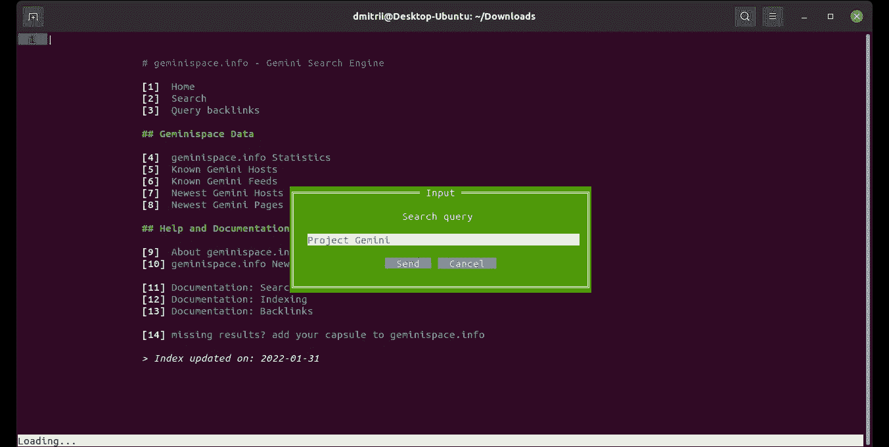
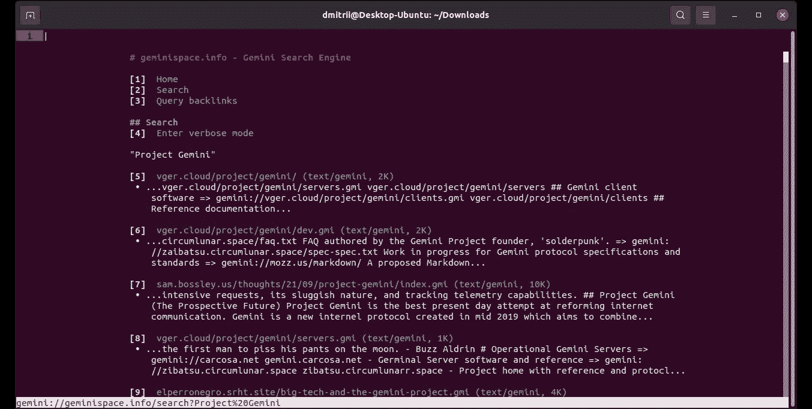
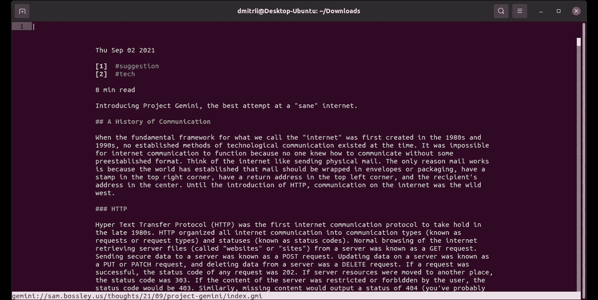
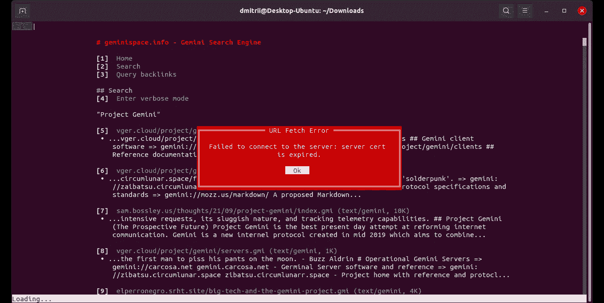
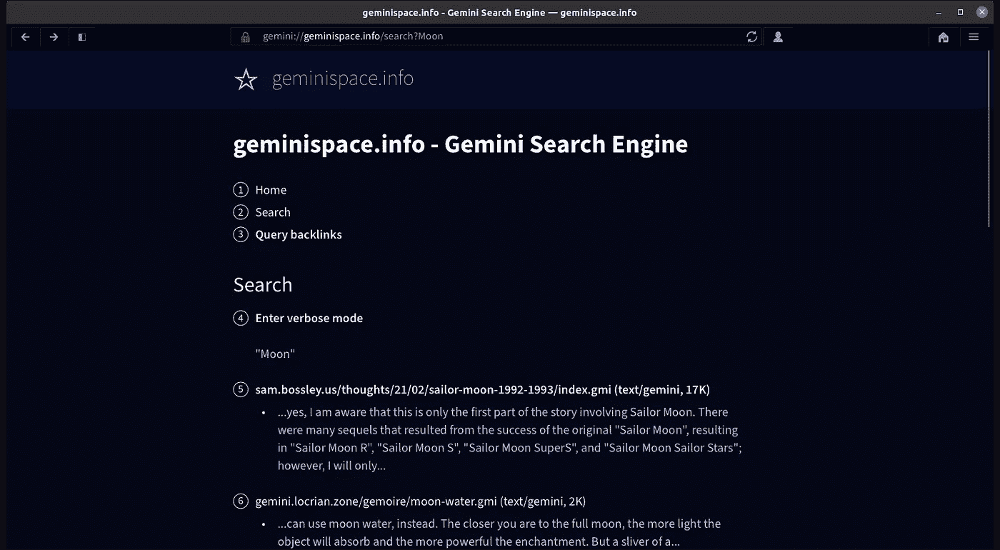
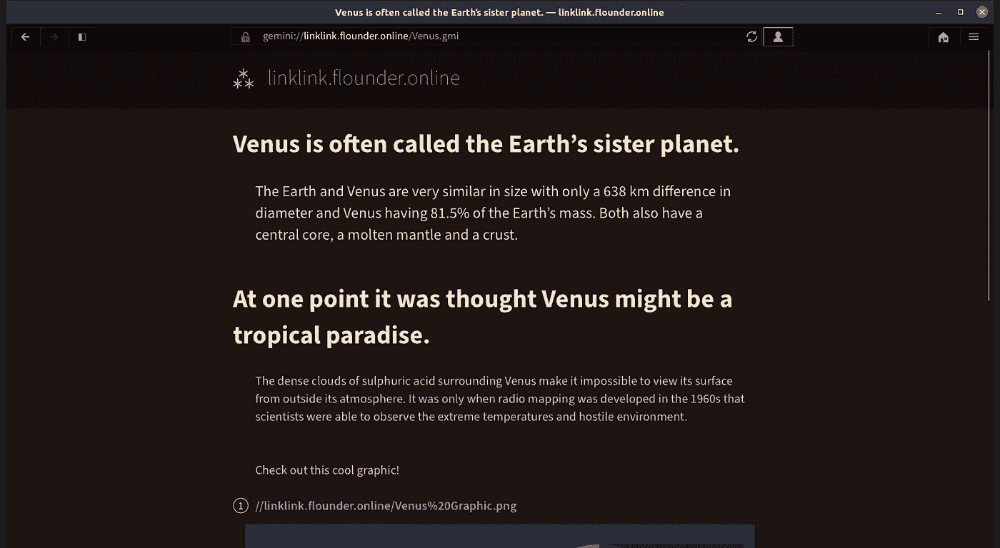
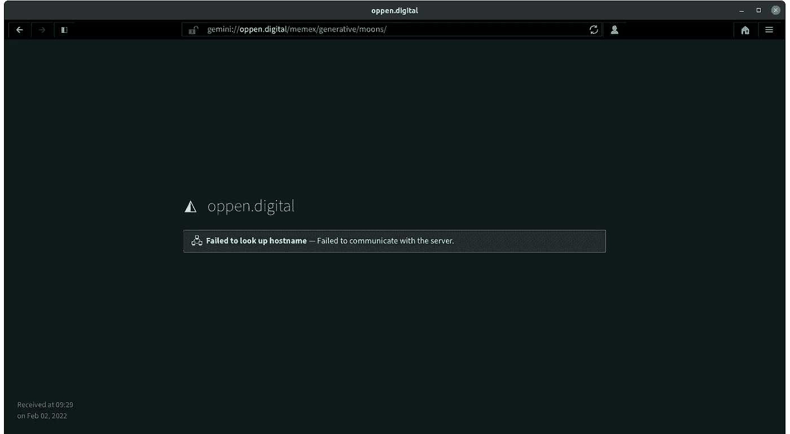
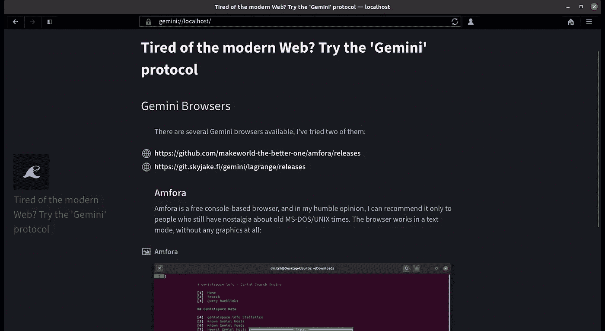
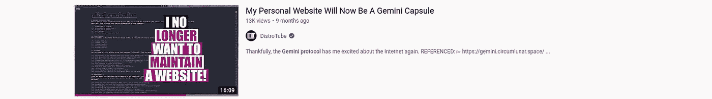
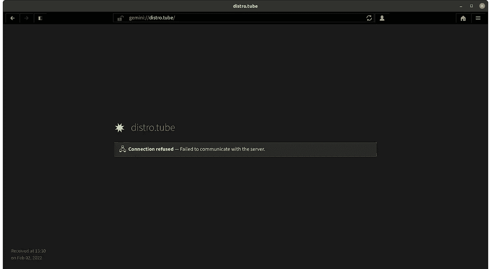

# 厌倦了现代网络？试试“双子座”协议

> 原文：<https://blog.devgenius.io/tired-of-the-modern-web-try-the-gemini-protocol-ba847f102fe6?source=collection_archive---------0----------------------->

## 简单的纯文本协议能在 21 世纪流行起来吗？让我们把它弄清楚

在发布了第一部分关于你今天仍然可以使用的“复古”协议的故事后，许多读者推荐尝试 Gemini 协议。嗯，绝对值得一试，就这么办吧。

# 双子座是什么

Gemini 是一个相对较新的(该项目始于 2019 年)互联网协议。主要的想法是使通信协议尽可能简单，具有清晰和安全的设计，没有沉重的页面和在浏览器中运行的大量脚本。真的可以这样吗？让我们试一试，看看进展如何！但是在进一步阅读这篇文章之前，我强烈推荐阅读[的第一部分](/tired-of-the-modern-web-discover-some-retro-protocols-you-still-can-use-today-30bbca48d3f2)，以便更好地理解启发双子开发者工作的一些想法。读者也可以访问项目官方页面[https://Gemini . circuit lunar . space](https://gemini.circumlunar.space/)。顺便说一下，这个项目中的许多名字(CAPCOM、Spacewalk、Lunar 等)都取自 NASA 的[项目 Gemini](https://en.wikipedia.org/wiki/Project_Gemini) 。对我来说，这看起来有点混乱，因为这个项目本身与美国宇航局、天文学或远距离通信没有任何共同之处，但如果你喜欢太空和太空计划，无论如何都可以很有趣。

在我们开始之前，一个小小的免责声明:我与 Gemini 项目没有任何关系，这篇文章也不是广告。我只是试了一下，其他用户都可以，下面写的都是我自己的看法。

让我们开始吧。

# Gemini 浏览器

双子座是互联网协议，所以可以访问基于双子座的网站，但要先安装浏览器。有几种可用的浏览器，我试过其中两种。

## Amfora

Amfora 是一款免费开源的基于控制台的浏览器，以我的拙见，我只能把它推荐给那些对旧的 MS-DOS/UNIX 时代仍有留恋的人。浏览器以文本模式工作，没有任何图形:



好的一点是，如果你的鼠标或触控板坏了，这不是问题——你根本不需要在这个浏览器中使用鼠标。打开“geminispace.info”页面后，我们可以使用搜索引擎并获得搜索结果。看起来有点类似于谷歌搜索，但在纯文本模式下:



要打开链接，只需输入其编号，页面将会打开:



一些页面不工作，显示“证书已过期”错误:



我不确定为什么证书是必需的，而不是可选的，但是好吧，协议就是这样设计的。至少，浏览器本身是可以工作的，说实话，我对一个基于文本的浏览器并没有抱太大的期望。

## 拉格朗日

我们试试另一款浏览器——[拉格朗日](https://gmi.skyjake.fi/lagrange/)，也是免费开源的。嗯，与纯文本模式相比，它看起来要好得多:



浏览器及其页面的“简约”设计看起来很不错，文本阅读起来也很容易和舒服:



对我来说，最有趣的是许多双子座网站几乎立即打开的*感觉*——这是我在使用“普通”网站时从未见过的。当你点击链接并立即得到结果时，这是一种“奇怪”的感觉，这真的很酷。这里没有 CSS，在我看来，所有的页面看起来都很整洁——实际上页面所有者没有办法用草率的字体或格式做出糟糕的设计。

唉，不是所有的页面都能打开:



总的来说，搜索工作得很好，但可用页面的数量不是很大，这是可以理解的，该项目本身不是一个“官方”的互联网标准，它只是由志愿者和社区支持。

# Gemini Web 服务器

在我们尝试了 Gemini 浏览器之后，让我们看看它是如何“在引擎盖下”工作的，并运行我们自己的本地 Gemini 服务器。我用过 [Agate](https://github.com/mbrubeck/agate) 服务器，它也是免费开源的，二进制文件可以从 [GitHub 页面](https://github.com/mbrubeck/agate/releases)下载。不需要安装，我们只需要解压缩文件并使其可执行:

```
wget [https://github.com/mbrubeck/agate/releases/download/v3.2.2/agate.x86_64-unknown-linux-gnu.gz](https://github.com/mbrubeck/agate/releases/download/v3.2.2/agate.x86_64-unknown-linux-gnu.gz)
gunzip agate.x86_64-unknown-linux-gnu.gz
chmod +x agate.x86_64-unknown-linux-gnu
```

现在，让我们向服务器添加一些内容。我将使用这篇文章中的文本作为例子。我已经创建了" *index.gmi"* 文件，它通常是一个纯文本标记语言文件:

```
# Tired of the modern Web? Try the 'Gemini' protocol

## Gemini Browsers

There are several Gemini browsers available, I've tried two of them:

=> https://github.com/makeworld-the-better-one/amfora/releases
=> https://git.skyjake.fi/gemini/lagrange/releases

### Amfora
Amfora is a free console-based browser, and in my humble opinion, I can recommend it only to people who still have nostalgia about old MS-DOS/UNIX times. The browser works in a text mode, without any graphics at all:

=> Amfora.png Amfora

### Lagrange
Let's try another browser - Lagrange, which is also free and open source. Well, compared to a pure text mode, it looks much better:

=> Lagrange.png Lagrange
```

正如我们所见，结构非常简单，没有自定义字体，没有 CSS，没有脚本，横幅或计数器，只有纯文本。我还在同一个文件夹里保存了两张截图。现在我可以运行服务器了:

```
./agate.x86_64-unknown-linux-gnu --hostname localhost --content .
```

然后我可以打开 Lagrange 浏览器，在地址栏中输入“localhost”名称，看到结果:



Gemini 协议的完整规范可以在[在线](https://gemini.circumlunar.space/docs/specification.gmi)找到，另一个页面示例是[包含在](https://github.com/mbrubeck/agate/blob/master/content/index.gmi)Agate 服务器本身中。

在网上运行一个真正的 Gemini 服务器并在那里发布这样的文章是很好的。但是，唉，托管和域名系统需要钱，它不是免费的，我不确定我自己支付专用服务器的费用是否合理，而几乎没有人使用它。但也许这是值得一试的，至少一年的实验，如果你想看到结果，写下评论。

# 结论

测试双子座协议并看看它是如何工作的，这很有趣。总的来说，我必须承认“简约的网络”的想法，没有缓慢的脚本，用户跟踪，弹出横幅等，真的很酷，我喜欢它。双子座的浏览器运行速度很快，页面几乎可以立即打开，没有任何延迟。它也很容易创建双子座格式的页面，相比 HTML 和 CSS，不需要特定的知识。有趣的是，这些文本看起来很好，浏览器中的格式很好，很整齐。这个方案值得尝试吗？答案绝对是“是的”，很高兴看到网络在理论上如何工作。

另一方面，这个想法可行吗？老实说，我不确定。目前的功能太有限了。例如，如果有可能在双子座浏览器中阅读邮件就好了——甚至在 30 年前 BBSes 就允许这样做。搜索结果也非常有限，只是因为 Gemini 服务器的数量很少，但这是“先有鸡还是先有蛋”的问题——没有服务器就没有用户，没有服务器就没有用户。最后但并非最不重要的一点——没有脚本、没有广告和金钱化的网络的想法是一个很好的乌托邦，但是谁会为这些服务器付费呢？我可以运行我自己的双子座服务器，并在那里发表文章，但如果我不会得到任何东西回来，我的热情支付托管账单将很快耗尽。这不仅仅是我的观点，在这篇文章的准备过程中，我发现了一个很有前景的视频“我的个人网站现在将成为双子座胶囊”:



这段视频差不多一年前出版，得到了很多喜欢和评论。太好了，我想，让我们检查一下，应该不错。唉，我只有这个:



无论如何，拥有一个简单的基于标记的协议的想法是很好的，也许有一天标准浏览器会支持 Gemini 或者类似的东西。至少，切换到最简单的页面视图的可能性，优化阅读，没有饼干，横幅和弹出窗口，听起来不错。会发生吗？老实说，我有一个疑问，但让我们看看。