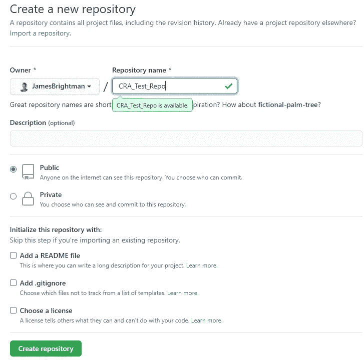
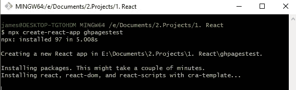
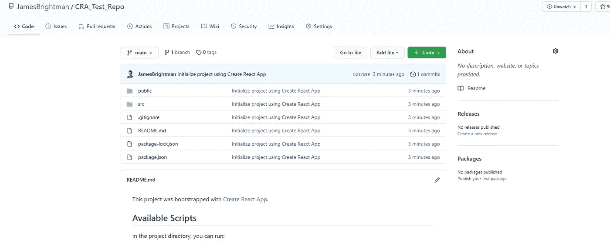
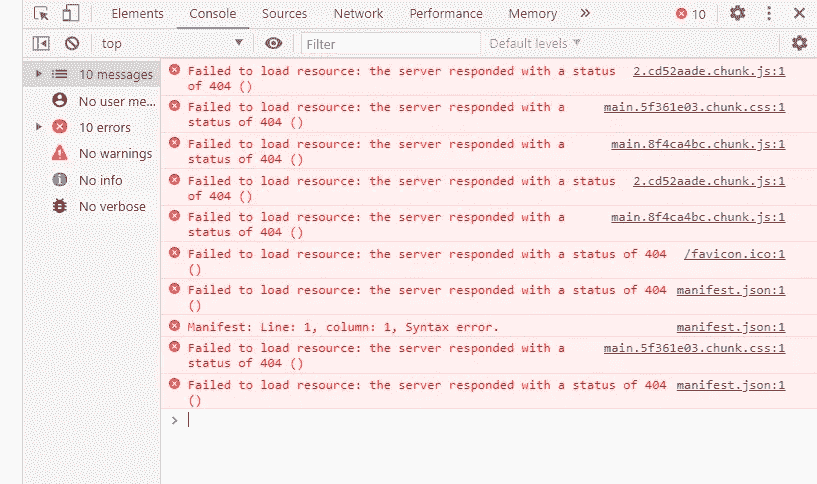
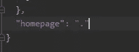

# TLDR:将 Create-React-App 部署到 Github 页面

> 原文：<https://blog.devgenius.io/tldr-deploying-create-react-app-to-github-pages-141892a6a449?source=collection_archive---------5----------------------->

## 从 CRA 到 Github 页面只需 3 分钟

## 1.创建 Github Repo

没有 GitHub repo 我们就没有 GitHub 页面，所以让我们创建一个空白的。

你可以让一切保持标准。

## 2.创建一个 CRA 项目

现在让我们想要的项目出现在我们的 Github 页面上。运行`npx create-react-app __project-name-here__`并等待一段时间，以便安装所有的 npm 软件包。最后，你会有一个香草 CRA 项目。

这可能需要一段时间…

## 3.安装 gh-pages 包

运行`npm i gh-pages`。好，下一步。

## 4.承诺你的回购

因为我们根本不在乎在默认 CRA 中更改代码，所以我们可以将它直接提交给我们的空白回购。运行以下命令；

`git remote add origin [https://LINK_TO_YOUR_REPO](https://LINK_TO_YOUR_REPO)`

`git branch -M main`

`git push -u origin main`

你所有的现在都将在你的回购中。

我们的 CRA 现在在回购，神奇。

## 5.部署到 Github 页面

现在是大事件。首先在本地 CRA 目录中运行`npm run build`，这将为我们提供一个可服务的构建文件夹。
下一次运行`gh-pages -d build`。这告诉 gh-pages 将构建目录发布到您当前的 repo。它还为 master 创建了一个名为 gh-pages 的独立分支。

## 6.1 陶醉于你的优秀

转到你的回购选项，滚动直到你看到一个 Github 页面的网址——点击它应该会带你到你托管的 CRA。一切正常，唷。

**或**

## 6.2 绝望地哭泣

有时你可能只看到一个白屏和这个错误；

您需要做的就是将这一行添加到`package.json`文件中；

`"homepage": "."`。

推动这个新的变化，你现在应该在第 6.1 步

如果您喜欢这篇文章或觉得它有用，请随意。或者，你可以在 Medium [*这里*](https://jamesmbrightman.medium.com/membership) *支持我或者给我买一杯* [*咖啡*](https://ko-fi.com/jamesbrightman) *！非常感谢所有的支持。*