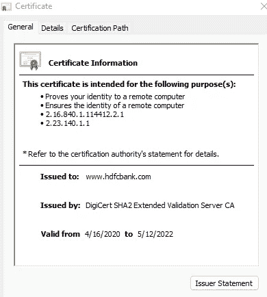
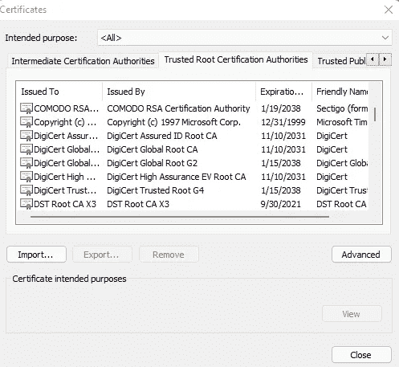

# TLS 和相互 TLS

> 原文：<https://blog.devgenius.io/tls-and-mutual-tls-e00d47eb647b?source=collection_archive---------6----------------------->

**安全通信的基础知识**

作者照片

当我们在互联网(或类似互联网的媒体)上做任何活动时，我们基本上都在发送和接收数据。

这些数据可以以原始格式传输，任何用户都可以读取(从二进制转换后)。这有点像过去的“明信片”。但是如果你想让任何人都不能阅读它，我们必须加密数据。

## 对称加密:

在这种情况下，共享密钥用于加密和解密数据。任何有密钥的人都可以解密加密的数据。

该方法实现简单，占用计算资源少，速度快。另一方面，共享加密密钥是一个挑战。

## 不对称加密:

在这种情况下，加密密钥和解密密钥是不同的。用公钥加密的数据可以只用私钥解密，反之亦然。

它很复杂，需要更多的计算资源，并且比对称加密慢。优点是它非常安全。

# 传输层安全性:

我们举个简单的例子。我想转账，为此我需要从我的桌面登录我的银行账户。我连接到银行，输入客户 id 和密码等敏感信息。

> 如果我与银行的沟通渠道不安全，这些信息可能会泄露。为了确保这种情况不会发生，需要解决以下问题

1.  所有信息都被加密了。
2.  加密应该是健壮的和强有力的，这样除了预期的系统之外没有人能解密它——在这个例子中是银行服务器。
3.  信息被发送到银行服务器，而不是任何伪装成银行服务器的系统。

> TLS(传输层安全性)是实现这一切的最流行的方法之一。
> 
> 下面是 TLS 如何工作的鸟瞰图。

1.  当我们在浏览器中键入服务器地址时，就与服务器建立了连接。

2.当初始连接建立后，客户端向服务器发送一个客户端问候。

3.Client hello 基本上是通知服务器客户端希望使用 TLS 进行安全通信。它分享了 TLS 版本的细节，它支持的加密机制。这被称为共享密码套件。

> 密码套件包含以下信息(以下列表为示例值，并非详尽无遗):

*   **协议** : TLS 1.3，TLS 1.2
*   **密钥交换** : RSA，DHE，ECDHE，ADHE
*   **Auth** : RSA，ECDSA
*   **密码** : AES，GCM
*   **MAC** : SHA，MD5

4.服务器查看客户端支持的选项，并通知客户端它将使用什么协议/机制。因此客户端和服务器都同意在进一步通信中使用加密选项。

5.服务器还向它发送一个公共证书。简单地说，服务器有一个公钥和一个私钥。私钥安全地存储在服务器上，不会被共享。公钥需要共享。

> 服务器的公共证书包含以下信息

*   服务器的公钥和
*   证书颁发机构(CA)的详细信息及其有效性。
*   CA 是客户端和服务器信任的相互信任的第三方。想要使用 TLS 的域的所有者可以连接到 CA。验证域后，CA 将使用其私钥对服务器的公钥进行签名(加密)。下图显示了公共证书 CA 和有效性

公共证书:点击浏览器上的锁状符号查看证书

6.客户端接收公共证书。浏览器(如 chrome)或移动操作系统已经加载了可信 CA 的公钥。它使用 CA 公钥来读取证书并提取服务器的公钥。此外，CA 证书确认了服务器的身份。

chrome 中的可信 CA 列表。

7.客户端使用服务器公钥(在步骤 6 中获得)来加密“预主密钥”。它将加密的密钥发送到服务器。

8.服务器用自己的私钥解密，并向客户端确认能够解密。

9.客户端和服务器都使用这个“预主密钥”来计算“共享密钥”。

> 请注意，此密钥从不通过网络传输。基于商定的预主密钥和密码套件选项，该密钥是独立生成的(并且是相同的)。
> 
> **该“共享密钥”或“会话密钥”随后用于加密所有进一步的数据交换(对称加密)。**

上面是一个高层次的概述——每个步骤都有细节，而且都很复杂。作为一个用户，甚至作为一个开发者，这些细节大部分是由 API 的提供者抽象出来的。

# 相互传输层安全性(MTLS):

在 MTLS，还有一个核实客户身份的额外步骤。因此，在步骤 6 之后，客户端将其由 CA 颁发的公共证书发送到服务器。那么服务器

*   验证客户端的身份。
*   CA 和证书有效性。
*   它还检查撤销列表(CA 共享的撤销证书列表)。

> 需要注意的重要一点是，mTLS 与客户端身份验证没有任何关系。因此，用户可能会被要求输入他的名字和密码来验证他，但这并不涉及或 MTLS 的一部分。
> 
> mTLS 中的客户端验证是关于验证服务器/浏览器/应用程序)。

这就是为什么在 mTLS 范例中我们很少使用像客户端和服务器这样的词。

## 为了进一步阅读

 [## 真实世界密码术

### Amazon.com 的真实世界密码学。*符合条件的优惠可享受免费*运输。真实世界密码术

www.amazon.com](https://www.amazon.com/Real-World-Cryptography-David-Wong/dp/1617296716/ref=sr_1_11?crid=1G8037912LC06&keywords=encryption&qid=1642838663&s=books&sprefix=enryption%2Cstripbooks-intl-ship%2C297&sr=1-11&asin=1617296716&revisionId=&format=4&depth=1) 

**对于系统设计，机器学习博客在介质上遵循**[**anantech . ai**](https://smverma.medium.com/)**。**