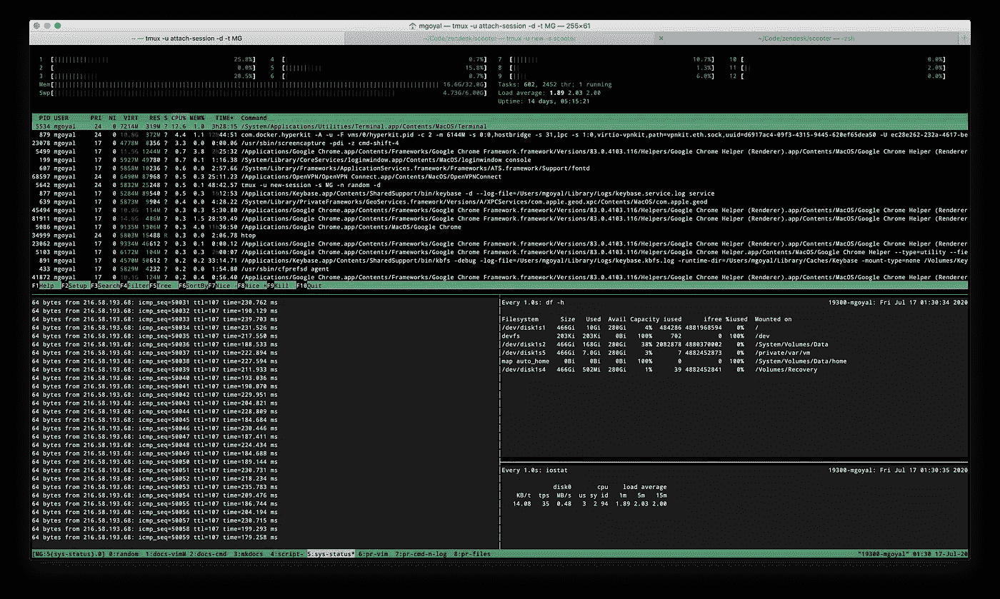

# tmux——出色的终端多路复用器

> 原文：<https://blog.devgenius.io/tmux-an-awesome-terminal-multiplexer-62609c6916bb?source=collection_archive---------1----------------------->



[我为什么需要它？](#87d3)
[什么事？](#7756)
∘ [Tmux 安装](#d9f6)
∘ [Tmux 配置](#0176)
∘ [Tmux 版本、帮助和前缀](#a715)
∘ [Tmux 服务器](#d744)
∘ [Tmux 会话](#349e)
∘ [Tmux 窗口(标签)](#70e1)
∘ [Tmux 窗格](#d1f8)
∘ [复制](#6f42)

# 我为什么需要它？

不用跟踪许多窗口，使用`tmux`来创建、组织和导航它们。

在远程服务器上使用`tmux`的一个最大好处是，如果你的互联网连接由于任何原因中断了，`tmux`会话会保留在服务器上，你可以再次连接。

另一个很大的好处是，`tmux`允许您分离和重新连接会话，这样您就可以让您的终端会话在后台运行，以后再恢复它们。

# 这是什么？

它是一个软件应用程序，可用于多路复用几个虚拟控制台，允许用户在单个终端窗口或远程终端会话中访问多个独立的终端会话。对于从命令行界面处理多个程序，以及将程序从启动程序的 Unix shell 中分离出来，这是非常有用的。

## Tmux 安装

***安装 tmux(在 OSX):***

```
brew install tmux
```

但是，你需要最新版本，以便在 tmux 中更流畅地滚动。

```
brew remove tmux
brew install tmux --HEAD
```

***安装 tmux(在 Ubuntu 中):***

如果你使用默认回购(`sudo apt-get install tmux`)安装，你很可能会得到非常旧的版本(如 2018 年 2 月 Ubuntu 14.04 上的 1.8 版本)，它有`CTRL-b + [`滚动等问题。

因此，使用源代码安装(在 Ubuntu 14.04、16.04 上):

```
sudo apt-get -y remove tmuxsudo apt-get install wget tar libevent-dev libncurses-devVERSION=2.6 && mkdir ~/tmux-src && wget -qO- https://github.com/tmux/tmux/releases/download/${VERSION}/tmux-${VERSION}.tar.gz | tar xvz -C ~/tmux-src && cd ~/tmux-src/tmux*./configure && make -j"$(nproc)" && sudo make installcd && rm -rf ~/tmux-src
```

重新启动以使更改生效:

```
tmux -V
```

参考:[https://blog . Nate Todd . com/compilating-tmux-2-6-on-Ubuntu-16-04/](https://blog.natetodd.com/compiling-tmux-2-6-on-ubuntu-16-04/)

您可能会遇到这样的情况:您需要在一台您没有 root 访问权限的机器上拥有`tmux`(比如在远程服务器上)。在这种情况下，下面的脚本可以派上用场:

## Tmux 配置

***设置 tmux 加载~/。bash _ 简介:***

似乎在每个会话中 tmux 都运行`~/.bashrc`。但是在 OSX，`~/.bashrc`没有多大意义。因此，错过了会话配置和`$PATH`设置。作为一种变通方法，我们可以创建`~/.bashrc`并将设置插入其中，然后将`source ~/.bashrc`插入`~/.bash_profile`。

但是万一你用的是`zsh`，那么你就可以轻松获得 Mac 和 Ubuntu 之间的一致性。

## Tmux 版本、帮助和前缀

***tmux 前缀:***

由于我们的程序(如`vim`或`top`)是在`tmux`中运行的，我们需要一种方法来告诉 tmux 我们输入的命令是针对`tmux`的，而不是针对底层应用程序的。`CTRL-b`组合就是这么做的。我们必须在每个 tmux 命令前面加上这个组合键，需要注意的是，我们不会同时按住所有这些键，而是首先同时按下`CTRL-b`，释放这些键，然后立即按下我们要发送到 tmux 的命令的键。*所以* `***PREFIX***` *就是* `***CTRL-b***`的意思。

您也可以将前缀密钥发送到*嵌套的 tmux 会话*。例如，如果您在 tmux 客户机或本地机器中，并且在您的一个窗格中 SSH 到远程机器，在 remove machine 上，您可以像平常一样通过`tmux attach`连接客户机。要将前缀密钥发送到机器的 tmux 客户端，而不是您的本地客户端，*再次点击前缀*。

***列出预定义的按键:***

`PREFIX ?`

*`***PREFIX ?***`*，获取所有预定义的* `*tmux*` *键绑定以及这些触发的相关命令的列表。**

****检查版本:****

```
*tmux -V*
```

*注意:在旧版本(如 1.8)中，滚动有问题。*

***Tmux 帮助:***

```
*man tmux
tmux list-commands*
```

**您可以通过*`***PREFIX***`***+***`***:***`*提示符(例如*`*PREFIX*`*+*`*:*`*->*`*list-sessions*`*)从 tmux 会话内作为 tmux 内部命令运行* `***tmux list-commands***` *中列出的任何命令(例如* `*tmux list-sessions*` *)。**

## *Tmux 服务器*

**一个* ***服务器*** *持有多个会话。一个* ***会话*** *是一个容纳 windows 的容器。一个* ***窗口*** *就是 tmux 在你面前打开时你看到的。* ***窗格中的*** *都是端子中的端子。**

*当`tmux`启动时，您通过[插座](http://0.0.0.0:8000/concepts_linux_and_networking.html#socket-statistics-ss)连接到服务器。您在 shell 中看到的只是一个客户端连接。*

*`tmux`用作*客户端-服务器模式*，但是*服务器为你分叉到后台*。当您正常使用`tmux`时，服务器启动并通过客户端连接。*

*tmux 的服务器部分是您的会话保持活动的方式，即使当您的客户机分离时也是如此。您可以从 SSH 服务器分离 tmux 会话，稍后重新连接。您可以分离 tmux 会话，在 Linux/BSD 中停止您的 X 服务器，并在 TTY 或新的 X 服务器中重新连接您的 tmux 会话。*`*tmux*`*服务器不会离开，直到所有会话都关闭。***

***服务器默认名称为* `***default***` *，作为* [*套接字*](http://0.0.0.0:8000/concepts_linux_and_networking.html#socket-statistics-ss) *存储在* `*/tmp*` *中。*通过设置`TMUX_TMPDIR`环境变量，可以覆盖存储该文件的默认目录。**

***我们可以通过*检索活动客户端连接列表**

```
**tmux list-clients**
```

## **Tmux 会话**

**会话是驻留在服务器实例中的最高级别的实体。服务器实例在启动新实例时被分支到后台，并在重新附加会话时重新连接到。您与 tmux 的交互将至少运行一个会话。**

**一个会话包含一个或多个窗口。活动窗口旁边会有一个`*`符号。**

*****创建未命名会话:*****

```
**tmux new-session# ortmux new# ortmux**
```

***只需键入* `*tmux*` *即可创建一个新的未命名(用某个数字自动命名)会话。***

*****创建命名会话:*****

```
**tmux new-session -s the_session_name# ortmux new -s the_session_name**
```

***`*tmux new -s <session_name>*`*是首选方式。这里* `***s***` *的意思是“会话名”。****

*****重命名当前会话:*****

**如果不命名会话，就很难跟踪会话包含的内容。有时，您可能会忘记您已经打开了一个项目，尤其是如果您的机器已经运行了几天、几周或几个月。**

***用* `***PREFIX $***` *重命名一个会话，但用* `***PREFIX ,***` *重命名一个窗口(tab)。*状态栏将被暂时提示到文本字段中，以允许更改会话名称。**

*****在后台创建新会话:*****

```
**tmux new -s the_session_name -d**
```

***注意末尾的* `***-d***` *选项，该选项分离已创建的会话。***

*****分离当前会话:*****

**`PREFIX d`**

***使用* `***PREFIX d***` *分离现有会话。***

*****列出已有的会话:*****

```
**tmux list-sessions# ortmux ls**
```

***要列出所有已有的会话，执行* `***tmux ls***` *。***

*****检查给定名称的会话是否存在:*****

***如果你正在编写* `*tmux*` *的脚本，你会想看看一个会话是否存在。* `***has-session***` *如果会话存在将返回一个* `***0***` ***退出代码*** *，但是如果会话不存在将报告一个* `***1***` ***退出代码*** *和* ***打印一个错误*** *。***

**举个例子，**

```
**tmux has-session -t MG; echo $?                  # 0
tmux has-session -t does_not_exist; echo $?      # 1**
```

**这里，`-t`代表目标会话。**

*****附加命名会话:*****

```
**tmux attach -t the_session_name**
```

**注:此处`t`表示“目标会话”。**

**这将我们置于“会话名称”tmux 会话中。**

*****附加到最后一个 tmux 会话:*****

```
**tmux attach# ortmux a**
```

***您可以使用* `***tmux a***` *连接到上一个 tmux 会话，然后使用* `***PREFIX s***` *很容易从一个会话切换到另一个会话，您也可以使用* `***PREFIX w***` *切换到该会话中的特定窗口(选项卡)。***

*****切换到另一个现有会话:*****

**`PREFIX s`**

***您可以使用* `*PREFIX s*` *交互式切换到一个会话。这里的* `*s*` *是会话的意思。***

**它列出了可供选择会话列表。**

**注意:使用`s`切换会话，使用`w`切换标签。**

**我们可以在 tmux 中切换会话:**

*   **`PREFIX` + `(`:将连接的客户端切换到之前的会话**
*   **`PREFIX` + `)`:将连接的客户端切换到下一个会话**
*   **`PREFIX` + `s`:从会话列表中为连接的客户端交互选择会话**

*****退出会话:*****

**`exit`或`CTRL-d`**

***关闭当前会话的所有标签页，使用* `*exit*` *或* `*CTRL-d*` *退出当前会话。***

*****杀死会话:*****

**我们可以为一个会话中的所有窗口键入`exit`(不带引号)来销毁该会话，但是我们也可以使用`kill-session`命令终止会话。**

```
**tmux kill-session -t the_session_name**
```

**这对于会话中的程序挂起的情况很有用。**

## **Tmux 窗口(选项卡)**

**Windows 支持窗格。它们驻留在会话中。它们也有布局，可以是许多预设尺寸之一，也可以是通过调整窗格大小定制的尺寸。**

***所有会话开始时至少有一个窗口(标签)打开。在那里，你可以随意创建和删除窗口。***

**窗口索引是`tmux`用来确定排序的数字。第一个窗口的索引是`0`，除非您在配置中通过`base-index`设置它。**

**就像会话一样，窗口也可以有名称。给它们贴上标签有助于记录你在里面做了什么。**

**注意:在 Tmux 中，窗口(选项卡)实际上是指窗口，但我们更愿意称它们为选项卡，以免与 Vim 混淆。**

*****创建和命名窗口:*****

***使用* `***PREFIX c***` *(此处* `***c***` *意为“创建窗口(tab)”)从* `*tmux*` *内创建一个新窗口。您可以使用* `***PREFIX ,***` *快捷键来重命名窗口。注意我们用* `***PREFIX $***` *重命名一个会话，但是我们用* `***PREFIX ,***` *重命名一个窗口(tab)。***

**像这样创建一个窗口(选项卡)会自动使新窗口(选项卡)成为焦点。从这里，我们可以启动另一个应用程序。此窗口(选项卡)的名称会根据当前运行的应用程序而改变，因为我们在创建它时从未给它一个默认名称。让我们给这个窗口(选项卡)一个合适的名字。**

*****切换窗口:*****

***移动窗口有四种方式:***

*   ***通过* `***PREFIX p***` *(* `*p*` *表示上一个)* `***PREFIX n***` *(* `*n*` *表示下一个)*进行迭代**
*   ***`***PREFEX b***`之间切换 *(* `*b*` *表示后退)两个窗口之间****
*   ***从* `***PREFIX w***` *显示的列表中交互选择窗口(此处* `*w*` *为窗口)。注意:使用* `*s*` *切换会话，使用* `*w*` *切换窗口(tab)。***
*   ***通过窗口索引，如* `***PREFIX 1***` *、* `***PREFIX 2***` *，直接进入特定窗口。默认情况下，tmux 中的窗口(选项卡)都有一个编号，以* `*0*` *开头。我们可以用* `*PREFIX 0*` *快速跳转到第一个窗口(tab)。***
*   ***用* `***PREFIX '***`提示窗口索引(对大于 `*9*` *的索引有用)***
*   ***使用* `***PREFIX f***` *(* `*f*` *表示查找)*通过名称查找，也可以切换到特定的窗口(选项卡)**

*****重新排序窗口:*****

**窗口也可以通过`**move-window**`及其相关快捷方式逐个重新排序。它的一般语法是:**

```
**tmux move-window [-s window_moving_from] -t window_moving_to# if source is not specified, then it is assumed to be current window
# the target window must not be already occupied**
```

**您可以使用`**movew**`作为`move-window`的快捷方式。**

**举个例子，**

```
**tmux movew -t2         # move current window to number 2
tmux movew -s2 -t1   # move window 2 to window 1**
```

***提示输入索引移动当前窗口的快捷方式是* `***PREFIX .***` *(然后是* `***<N>***` *)。即先按下* `*PREFIX .*` *然后提供新的窗口(tab)号(那个窗口(tab)号应该还没有)。***

**在一个`tmux`会话中同时运行多个命令是可能的，也是非常常见的。我们可以用窗口(标签)来组织这些，这类似于图形终端模拟器或 web 浏览器中的窗口(标签)。**

*****使用命名的第一个窗口(选项卡)创建新会话:*****

**`**tmux new -s the_session_name -n the_window_name**`**

***这里，通过使用* `***-n***` *标志，我们告诉 tmux 给窗口(tab)命名，这样我们就可以很容易地识别它。***

**注:此处`**n**`表示“窗口名”。**

**注意:我更喜欢在创建窗口(选项卡)后给它命名。**

*****将当前窗格移动到新窗口(tab):*****

**方式一:`PREFIX !`**

**方式二:先按:`PREFIX :`，再敲`break-pane`。**

*****列表窗口(或标签页):*****

```
**tmux list-windows [-t target_session]**
```

***`*list-windows*`*列出给定目标会话的所有窗口(默认为当前会话)。****

*****关闭或关闭一个窗口(tab):*****

***要关闭一个窗口(tab)，我们可以在窗口(tab)的提示中键入* `*exit*` *或* `*CTRL-d*` *。***

**或者，我们可以使用`PREFIX &`，在关闭窗口(tab)之前，它会在状态栏中给出一条确认消息。如果我们接受，我们的前一个窗口(选项卡)将成为焦点。要完全关闭 tmux 会话，我们必须关闭所有窗口(选项卡)。**

**在当前窗口中使用命令行，您可以终止一个窗口，如下所示:**

```
**tmux kill-window**
```

**另一件事，当脚本或试图从外面杀死窗口，使用窗口索引的目标。举个例子，**

```
**tmux kill-window -t2**
```

## **Tmux 窗格**

**窗格是封装外壳的[伪终端](https://en.wikipedia.org/wiki/Pseudoterminal)(例如 Bash、Zsh)。它们位于一个窗口内。**

**在 tmux 中，我们可以垂直或水平分割窗口(标签)。**

*****垂直分割:*****

```
**PREFIX %split-window -v**
```

***在 tmux 会话中，按* `***PREFIX %***` *，标签页将从中间分开，并在新窗格中启动第二个会话。此外，焦点将移动到这个新窗格。***

***例如，***

```
**# spitting window with id `0` of session named `session_name` vertically with
# 50% width and running `watch iostat` on newly created pane (that is, pane
# with id `1` if window was not split before
tmux split-window -t session_name:0 -v -p 50 'watch iostat'
# bring focus back on pane 0 from pane 1tmux select-pane -t session_name:0.0**
```

***用于选择窗格的格式* `*<session_name>:<window_number>.<pane_number>*` *(带入给定的窗格焦点)。***

***注意:***

*   ***对于目标窗口，拆分将发生在当前聚焦的窗格上***
*   ***给定命令在新创建的面板上运行***
*   ***新创建的窗格自动获得焦点***
*   ***要聚焦一个特定的窗格，使用* `*tmux select-pane*` *命令***
*   ***命令与*命令一起传递`*split-window*`命令不应该退出；如果它退出，相应的窗格将不复存在**
*   ***使用* `[*tmux send-keys*](http://0.0.0.0:8000/linux_regex_vim_tmux_git.html#the-send-keys)` *命令向 id 为*T5 的窗格发送密钥**
*   ***一旦用初始命令启动，tmux 不提供向窗格添加额外进程的方法。由初始命令进程(通常是一个 shell)来为该终端提供作业控制。***

***参考文章* [*tmux 脚本百分比问题*](https://davidtranscend.com/blog/tmux-script-percentage-issue/) *。***

*****水平分割:*****

```
**PREFIX "split-window -h**
```

***按下* `***PREFIX "***` *(双引号)会将当前窗格水平分成两半。***

*****从一个窗格移动到另一个:*****

```
**# move to another pane using arrow keys
PREFIX up_arrow/down_arrow/left_arrow/right_arrow# select next pane in the current window
PREFIX o# move to previously active pane
PREFIX ;**
```

***要循环浏览窗格，按* `***PREFIX o***` *。我们也可以使用* `***PREFIX***` *，然后用上下左右键来移动窗格。***

**如果你喜欢`Vi` (hjkl)，把这些添加到你的配置中:**

```
**# hjkl pane traversal
bind h select-pane -L
bind j select-pane -D
bind k select-pane -U
bind l select-pane -R**
```

*****放大一个窗格:*****

***要放大一个窗格，导航至该窗格并执行* `*PREFIX z*` *。再次按下* `*PREFIX z*` *可以取消缩放。***

*****调整大小窗格:*****

***可通过窗口布局和* `*resize-pane*` *在窗口内调整窗格尺寸。调整快捷键大小:***

```
**Prefix M-Up             resize-pane -U 5
Prefix M-Dow            resize-pane -D 5
Prefix M-Lef            resize-pane -L 5
Prefix M-Rig            resize-pane -R 5
Prefix C-Up             resize-pane -U
Prefix C-Dow            resize-pane -D
Prefix C-Lef            resize-pane -L
Prefix C-Rig            resize-pane -R**
```

*****窗格布局:*****

**您可以使用 tmux 的几种默认窗格布局:**

*   **`even-horizontal`从左到右水平堆叠所有窗格**
*   **从上到下垂直堆叠所有窗格**
*   **`main-horizontal`在顶部创建一个较大的窗格，在下方创建较小的窗格**
*   **`main-vertical`在屏幕左侧创建一个大窗格，并在右侧垂直堆叠其余窗格**
*   **`titled`在屏幕上均匀排列所有窗格**

**快捷键`**PREFIX <SPACE>**`切换窗口布局。这些是自动调整窗格比例的预设配置。特定的修饰可以通过调整窗格大小来完成。**

**要重置布局的比例(如在分割或调整窗格大小后)，必须再次运行布局的`**tmux select-layout**`。**

**我们可以通过按下`PREFIX spacebar`循环浏览这些布局。**

*****清单窗格:*****

***可使用* `*list-panes*` *命令列出给定目标窗口(默认为当前窗口)的窗格:***

***目标窗口可以以* `*<session_name>:<window_number>*` *(如果传递了会话名)或* `*%<window_number>*` *(当前会话)的格式传递。***

```
**tmux list-panes [-t target_window]**
```

**举个例子，**

```
**tmux list-sessions
# 11: 1 windows (created Thu Jun 27 10:33:22 2019)
# 12: 1 windows (created Thu Jun 27 10:41:09 2019) (attached)
# 2: 1 windows (created Mon Jun 24 10:15:33 2019) (attached)
# MG: 8 windows (created Mon Jun 24 10:10:36 2019) (attached)tmux list-windows -t MG
# 0: random (1 panes) [236x55] [layout c45d,236x55,0,0,0] @0
# 1: docs-vim- (1 panes) [236x55] [layout c45e,236x55,0,0,1] @1
# 2: docs-cmd* (1 panes) [236x55] [layout c45f,236x55,0,0,2] @2 (active)
# 3: script (1 panes) [236x55] [layout c460,236x55,0,0,3] @3
# 4: sys-status (4 panes) [236x55] [layout 9ffb,236x55,0,0[236x24,0,0,4,236x30,0,25{78x30,0,25,5,78x30,79,25,6,78x30,158,25,7}]] @4
# 5: pr-vim (2 panes) [236x55] [layout 73d2,236x55,0,0{118x55,0,0,8,117x55,119,0,19}] @5
# 6: pr-cmd-n-log (2 panes) [236x55] [layout 6f96,236x55,0,0{117x55,0,0,9,118x55,118,0,10}] @6
# 7: pr-files (2 panes) [236x55] [layout 1bf2,236x55,0,0{117x55,0,0,11,118x55,118,0,12}] @7tmux list-panes -t MG:4
# 0: [236x24] [history 0/10000, 0 bytes] %4
# 1: [78x30] [history 9846/10000, 3708072 bytes] %5
# 2: [78x30] [history 6/10000, 1214 bytes] %6
# 3: [78x30] [history 0/10000, 0 bytes] %7 (active)**
```

*****关闭窗格:*****

**我们可以像退出终端会话或 tmux 标签一样关闭窗格:我们只需在窗格中输入`exit`。**

**也可以用`PREFIX x`干掉一个窗格。像这样杀死一个窗格对于窗格卡住或者你不能再与它交互的情况是非常好的。**

*****向所有窗格发送命令:*****

***开始同步:***

```
**PREFIX :
# `setw` is alias for `set-window-option`
# `set` is alias for `set-option`
# `set` is used to set global options
setw synchronize-panes on
clear history**
```

***停止同步:***

```
**PREFIX :
setw synchronize-panes off**
```

## **Tmux 中的复制模式、滚动和搜索**

*****在 tmux 内滚动:*****

```
**PREFIX [**
```

***按* `***PREFIX-[***` *进入* ***复制模式*** *然后你可以使用你常用的导航键(如向上箭头或 PgDn)左右滚动。按* `***q***` *或* `***ESC***` *退出滚动模式。***

*****在 tmux 历史滚动屏幕中搜索:*****

**要在`tmux`历史缓冲区中搜索当前窗口(tab)，按`PREFIX-[`进入**复制模式**。然后用`**?**`向后搜索**或用`**/**`向前搜索**。******

*****偏好:我比较喜欢用* `***PREFIX-[***` *再用* `***/***` *，再用* `***N***` *向上滚动。*****

*******复制粘贴:*******

****我们可以输入`PREFIX-[`进入**复制模式**，然后按`SPACEBAR-KEY`触发选择模式，您可以使用箭头键调整选择。选择完成后，按`ENTER-KEY`复制所选文本。稍后可使用`PREFIX-]`粘贴复制的文本。****

****对于类似复制粘贴的`vi`,将以下内容添加到您的 tmux 配置文件中:****

```
****set-window-option -g mode-keys vi
bind-key -t vi-copy 'v' begin-selection
bind-key -t vi-copy 'y' copy-selection****
```

## ****Tmux 插件管理器****

****参考:[https://github.com/tmux-plugins/tpm](https://github.com/tmux-plugins/tpm)****

*******插件:***`***tmux-better-mouse-mode***`***:*******

****这个插件的灵感来自于“David Verhasselt”在 tmux 中让滚动更好的工作。****

****参考:[https://github.com/NHDaly/tmux-better-mouse-mode](https://github.com/NHDaly/tmux-better-mouse-mode)****

*******新增和安装新插件的步骤:*******

1.  ****用`set -g @plugin '...'`语句向`~/.tmux.conf`添加新插件。****
2.  ****按下`**PREFIX + I**`(大写`I`，如 Install)来获取插件。****
3.  ****按`**PREFIX + U**`(大写`U`)更新所有插件****

## ****Tmux 命令模式****

****到目前为止，我们已经使用组合键创建了选项卡和窗格，但是那些键绑定实际上只是带有一些预设选项的 tmux 命令的快捷键。****

****我们可以通过两种方式执行 tmux 命令:从终端本身或者从 tmux 状态栏中的“命令区”执行。****

*******进入命令模式:*******

****`PREFIX :`****

****要进入命令模式，请在运行的 tmux 会话中按下`PREFIX :`(冒号)。状态栏会改变颜色，我们会得到一个命令提示符，指示我们键入命令。****

****例如，您可以通过发出`source /path/to/config.conf`来重新加载 tmux 配置。或者，您可以通过命令行获得与`tmux source-file /path/to/config.conf`相同的结果。****

## ****Tmux 格式****

****`tmux`提供了一个最小的模板语言和一组变量来访问关于`tmux`环境的信息。****

*****格式通过* `*-F*` *标志指定。替换变量包含在* `*#{*` *和* `*}*` *中，例如* `*'#{session_name}'*` *。详情请查看* `*man tmux*` *的* `***FORMATS***` *章节。*****

****举个例子，****

```
****tmux list-windows -F "#{window_id} #{window_name}"tmux list-panes -F "#{pane_id} #{pane_current_command} #{pane_current_path} #{cursor_x},#{cursor_y}"tmux list-panes -F "pane: #{pane_id}, window: #{window_id}, session: #{session_id}, server: #{socket_path}"tmux list-windows -F "window: #{window_id}, panes: #{window_panes} pane_id: #{pane_id}"****
```

## ****Tmux 样式****

*****`*tmux*`*提供了各种选项来指定界面各方面的颜色和属性。例如，* `*status-style*` *为状态行。另外，可以在格式选项中指定嵌入样式，如* `*status-left-format*` *，将它们括在* `*#[*` *和* `*]*` *中。查看* `***STYLES***` *段的* `*man tmux*` *。******

## ****`send-keys`****

*****`*tmux*`*允许发送按键，包括* `*Ctrl*` *经* `*C-*` *或* `*^*` *(alt (Meta))经* `*M-*` *，以及特殊按键名称。这里有一个特殊键的列表:*`*Up*`*`*Down*`*`*Left*`*`*Right*`*`*BSpace*`*`*BTab*`*`*DC*`*(删除)*`*End*`*`*Enter*`*`*Escape*`*`*F1*`**************

*****如果特殊键不匹配，定义的行为是将它作为字符串逐个字符地发送到窗格。*****

*****如果一个窗口有多个窗格，那么传递的命令将被发送到第一个窗格(即 id 为* `***0***` *的* ***窗格)。*******

*****关于* `*-t <target_window>*` *检查、* [*列表窗格*](http://0.0.0.0:8000/linux_regex_vim_tmux_git.html#tmux-panes) *部分的详细格式。*****

****举个例子，****

```
**tmux send-keys -t MG:3 'cal'           # send `cal` command (without hitting ENTER) to 3rd window of session named 'MG'tmux send-keys -t MG:3 'C-c'           # cancel the commandtmux send-keys -t MG:3 'cal' 'Enter'   # seind `cal` command and hit ENTER**
```

## ****Tmux 最佳实践****

****对一个项目/问题/任务相关的东西使用一个 tmux 会话。在该会话中，您可以有多个选项卡和面板。****

****使用`tmux a`连接到最近的会话，然后使用`PREFIX s`跳转到其他会话。****

****可以使用类似于下面的命令来启动带有自定义选项卡的 tmux 会话:****

```
**# Creating a session on development server with 10 default windows and name `session_01`tmux new -n shell\; neww -n 01\; neww -n 02\; neww -n 03\; neww -n 04\; neww -n 05\; neww -n 06\; neww -n 07\; neww -n 08\; neww -n 09\; rename session_01tmux new -n nvim\; neww -n nvim-default\; neww -n command\; neww -n console\; neww -n shell\; neww -n server-default\; neww\; neww\; neww\; neww -n logs-default\; rename session_zendesk_01tmux new -n shell\; neww -n shell\; neww -n shell\; neww -n nvim-frontend\; neww -n nvim-mediator\; neww -n nvim-scribe\; neww -n nvim-lc\; neww -n nvim-web\; neww -n nvim-tasks\; neww -n logs-default\; neww\; neww\; rename session_zopim_01**
```

******这里有一些相关的有趣故事，你可能会觉得有帮助:******

*   ****[Vim/neo Vim+Silverlight+CTags——组成一个牛逼的编辑器](https://medium.com/@goyalmunish/vim-neovim-silverlight-ctags-make-up-an-awesome-editor-49f3980b575d)****
*   ****[正则表达式—备忘单](https://medium.com/@goyalmunish/regex-regular-expressions-demystified-e98fe98707e0)****