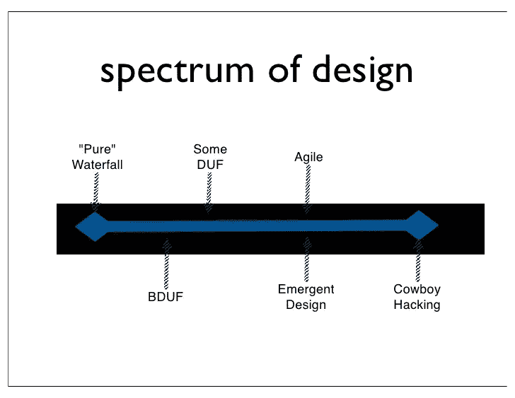
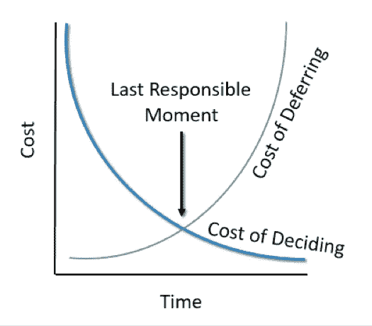

# 决定还是不决定，这是个问题

> 原文：<https://blog.devgenius.io/to-decide-or-not-to-decide-thats-the-question-f186d5858aba?source=collection_archive---------8----------------------->

何时决定使用最后责任时刻原则

[http://whyyoudo . it/hamlet-uncovered-country-death-no-traveller-returns/](http://whyyoudo.it/hamlet-undiscovered-country-death-no-traveller-returns/)

在我作为开发人员的经历中，我学到了使项目成功的最重要的事情之一是选择正确的时机做出重要的决定。

**过早优化**就是很好的例子:

> 真正的问题是程序员在错误的地方和错误的时间花了太多的时间担心效率；过早的优化是编程中所有罪恶(或者至少是大部分罪恶)的根源。
> T5【唐纳德·克努特】

为了避免过早优化这样的问题，我们应该开始培养[最后负责的时刻](http://books.google.co.il/books?id=HkXX65VCZU4C&lpg=PA411&ots=2Hqzjfoi5O&dq=A%20strategy%20of%20not%20making%20a%20premature%20decision%20but%20instead%20delaying%20commitment%20and%20keeping%20important%20and%20irreversible%20decisions%20open%20until%20the%20cost%20of%20not%20making%20a%20decision%20becomes%20greater%20than%20the%20cost%20of%20making%20a%20decision.&pg=PA411#v=onepage&q=A%20strategy%20of%20not%20making%20a%20premature%20decision%20but%20instead%20delaying%20commitment%20and%20keeping%20important%20and%20irreversible%20decisions%20open%20until%20the%20cost%20of%20not%20making%20a%20decision%20becomes%20greater%20than%20the%20cost%20of%20making%20a%20decision.&f=false) (LRM)，精益开发原则定义为:

> *不做不成熟决定的策略，而是延迟承诺，保持重要且不可逆转的决定开放，直到不做决定的成本大于做决定的成本。*

最后责任时刻原则帮助你降低成本。

## 软件设计

什么时候是决定你的软件如何成型的正确时刻？

在瀑布方法中，您将基于从涉众那里收集的需求生成系统的高级设计。这些在项目开始时做出的决定将在很久以后实施(大设计先行(BDUF))。在此期间，我们的涉众可以更改需求。因此，在最开始时基于这些需求做出的那些决策现在是无用的，但它们是有成本的。他们让开发团队来实现事情是一种现在很难修复的方式。这通常会产生变通办法(技术债务)或意外延迟。

[紧急设计尼尔·福特](https://www.slideshare.net/ThoughtWorks/neal-ford-emergent-design-and-evolutionary-architecture)

## 紧急设计

> BDUF 以其最优秀的稻草人形式，体现了象牙塔中的架构师创建设计工件，将它们放入地板上的一个洞，让倒霉的编码人员不加修改地实现。在非实体的形式中，这种设计方法在编码开始之前努力尝试发现一切有趣的东西。这是一个设计软件的预测性、主动性模型。
> 
> 紧急设计不是二元状态。你不能肯定地说你的设计是 100%敏捷或者 0%敏捷；它存在于光谱上[尼尔·福特](https://www.ibm.com/developerworks/library/j-eaed19/index.html)

一些敏捷团队避免应用 BDUF(预先大设计)，但是他们通常实践 DUF(预先设计)。当团队在没有足够的底层代码健康信息的情况下开始将故事分割成子任务时，我意识到了这一点。

紧急设计是应用敏捷方法的结果，基本上由**最后负责时刻**定义。在敏捷中，你应该在工作的时候定义与功能或整个系统相关的代码的架构/设计。不是在开始的时候，也不是在结束的时候，而是在我们开发新功能的时候。您将需要测试来验证您的更改没有影响其他功能，可能您将需要重构它以使我们的功能适应我们的代码，创建新的抽象，等等。这听起来像 TDD:

> 当我们为一个类编写单元测试时，我们在语法和语义层面上都定义了它的接口。[精益软件开发](https://effectivesoftwaredesign.com/2014/03/27/lean-software-development-before-and-after-the-last-responsible-moment/)

TDD 是一种在**最后负责的时刻**设计我们代码的技术。我们可以说 TDD 是敏捷方法的结果。

我不是说我们不应该做 BDUF 或 DUF，只是说这些方法有风险，我们需要将这些风险最小化。最大的风险之一是停止遵循[**YAGNI 原则**](https://en.wikipedia.org/wiki/You_aren%27t_gonna_need_it) 和花费时间工作和维护无用的东西。因此，在项目或要实现的特性的最开始所做的决定必须最小化。如果风险非常低，则**最后责任时刻**不适用。

## 除了发展，还有生活

其他决策呢，比如什么时候开会，团队讨论，什么时候测试新方法？。在我看来，在这些情况下，牢记“最后负责任的时刻”是一个很好的原则。[频繁而有效的反馈](https://www.thoughtworks.com/insights/blog/5-ways-faster-and-more-effective-feedback)是识别问题的最佳工具之一，这些问题可以作为我们采取行动做出决策的触发因素。另一个可以帮助我们识别最后责任时刻的工具是[紧急重要矩阵](https://www.groupmap.com/map-templates/urgent-important-matrix/)。

**最后负责任的时刻**是成本最小化的点，所以作为总结，我认为我们应该在每种情况下重点识别它。

[https://timelessagility.com/the-last-responsible-moment/](https://timelessagility.com/the-last-responsible-moment/)