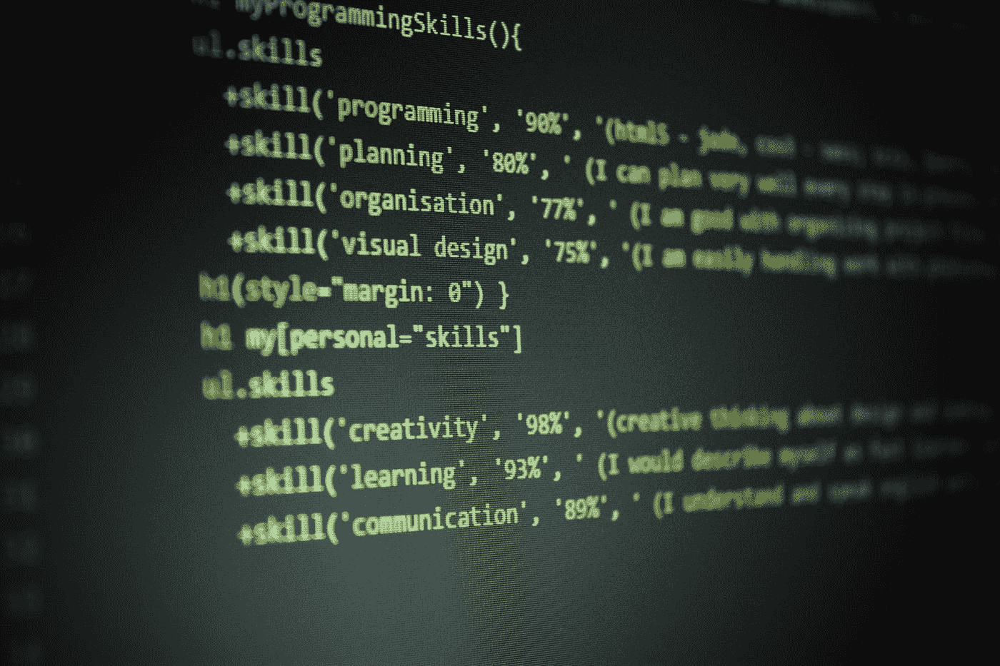

# 要变得更好，做真正的事

> 原文：<https://blog.devgenius.io/to-get-better-do-the-real-thing-9ac8a47f5cec?source=collection_archive---------8----------------------->

## [从我的网站发布](http://www.tobiolabode.com/blog/2020/10/25/to-get-better-do-the-real-thing)

由[布兰科·斯坦切维奇](https://unsplash.com/@landb?utm_source=medium&utm_medium=referral)在 [Unsplash](https://unsplash.com?utm_source=medium&utm_medium=referral) 上拍摄

我不打算撒谎；我没有花太多时间在机器学习项目上。由于大学的工作。虽然这可能是一个合理的理由。这仍然意味着我的机器学习技能不会变得更好。所以很快我就应该开始优先训练一些模特。

最近我看了莱克斯·弗里德曼和乔治·霍兹的播客。至少可以说，霍兹是一个非常古怪的人。但是一个非常迷人的人。这使得播客非常有趣。在自助建议方面。他说他提不出好的建议。特别是对于一般性的问题。用他自己的话说“我如何变得擅长做事情？”他说，“多做(这件事)”。

当他被问到如何成为一名更好的程序员时。他只是回答说做了 20 年编程。他说了很多次，如果你想学习一项技能，你必须去做。当谈到自助时，他说那些书往往是无用的。人们想听的东西。不是真正的努力工作。

# 请做真实的事情

这让我想起了我最喜欢的博客作者之一斯科特·扬的一篇文章。题目为“[做实事](https://www.scotthyoung.com/blog/2020/05/04/do-the-real-thing/)”。这与上面的观点相呼应。去擅长某件事。你想做真正的事。一次又一次。替代品不算。他举了自己语言学习历程的例子。如果他想更好地用他正在学习的外语说话。然后，他必须对以英语为母语的人说外语。学习词汇或阅读会有帮助。但是他仍然需要做这个活动。

同样的事情也适用于提高我的机器学习技能。尽可能多做模型。你一定会好起来的。当你在谷歌上左顾右盼时。

一路上捡起制作深度学习项目的一般流程。获取数据，清理数据。选择模型。训练模型。测试模型。调试模型。然后发布模型。将通过做这件事来学习。

# 我想学习的机器学习技能

这就是为什么我想开始一个新项目。但是我不知道我的深度学习项目要建什么。

我喜欢绿茶对乌龙茶的项目。我觉得这很有创意。我喜欢做它。即使在让模型工作的许多挫折之后。我学会了如何使用 Pytorch。我可能会在未来的项目中用到它。

我可能会花更多的时间来扩展绿茶对乌龙茶的模型。比如把它转换成物体检测模型。或者出版它让公众可以使用它。像 stream lit 这样的服务。或者用 flask 制成的定制前端。或者转换成手机 app。虽然这些选择看起来不错。

我想尝试一些新的东西。所以我想尝试一个新项目。最近我一直在考虑尝试一些简单的东西。就像猫和狗的图像分类器。我想这样做的原因。是因为我想找个借口去试试新的 FastAI 图书馆。当他们用 Pytorch 重新建造它的时候。所以能看到有什么改变会很好。并且习惯再次尝试 fastai。

GANs 仍然在地平线上。我总能找到甘斯。很有意思。但是每次我试图实现它们，我总是失败。所以我觉得我的前提条件不具备。所以很快我可能会尝试做一个 GAN。

也像我之前很多博文里提到的。我们需要学习如何向更广泛的公众实现模型，而不仅仅是把它保存在我们的笔记本里。我没有遵循我自己的建议。所以我想花时间使用像 stream lit 这样的东西。或者为我的一个 ML 项目开发一个 API 前端。我认为在 ml 社区中 ML 管道的生产阶段教得不够。所以我想信守诺言。并开始了解制作本身。比如 ML-Ops 以及软件工程和机器学习的基本融合。

现在我在想，学习这些技能的最好方法之一就是为科技公司工作。因为你需要向更广泛的公众发布。该模型需要足够有效，用户可以得到结果。但是我还没有那个闲心。我的项目必须算数。

# 阅读有所帮助，但直觉来自行动

回到手头的话题。这些都是我想学的领域。需要通过实践来学习。获得第一手经验后，你会对这个话题有一种直觉。并且可以用这些知识生产有形的东西。进一步巩固你的技能。仅仅阅读它就会让你对这个话题有一个高层次的认识。这很好。不是每一个主题你都需要了解它的来龙去脉。但是深刻的理解可以帮助你朝着你的目标前进。然后做做实事的枯燥工作是必须的。