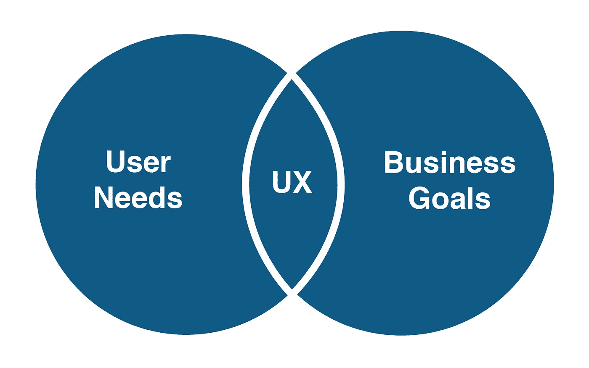

# 帮助你:告诉我问题

> 原文：<https://blog.devgenius.io/to-help-you-tell-me-the-problem-5d0e024e6c4b?source=collection_archive---------6----------------------->

当你去看医生时，你经常会遇到一个问题，为了让他可以帮助你并开出治疗处方，他需要通过一组**问题**来诊断问题，并请求一组分析和 x 光来更准确地确定问题。

> 医生的问题有时可能会令人尴尬，并有一些隐私，但我们必须回答，因为这符合我们的最佳利益。

另一方面，也有一些人去找没有问题的医生或隐瞒问题以回避问题，并要求进行全面检查，希望通过检查发现问题。这种扫描的结果往往是:你没有问题，一切都很好，你得到的是一套毫无帮助的笼统报告。

# 问题出在哪里？

这里的问题不是**的全面检查**，问题是缺乏与医生的合作！你对医生越诚实，你就有助于准确地发现/识别问题，并减少测试、x 射线、诊断时间和成本。

# 医生和用户体验有什么关系？

医生是用户体验设计师最好的类比！

# 我能帮什么忙？

了解数字产品/服务的目标和目标受众对于改善用户体验至关重要。

通常，当数字产品/服务的所有者联系并寻求帮助并询问问题时，他否认存在问题，没有分享关于产品/服务、问题、用户群、访问者统计的足够信息，并且不回答向他提出的问题！
**有什么可以帮忙的吗？**

好吧，让我告诉你有助于你的产品/服务在市场上具有竞争力和成功的两点:

1.  **解决问题**改进你的产品/服务；以便它能够实现其目标并与目标用户群兼容。
2.  **了解目标用户/客户**细分市场；以适合他们需求和期望的方式向他们提供产品/服务。

这需要更多地了解产品/服务、问题、用户/客户群和竞争对手；因此，我在这方面提出几个问题:

*   有用户体验问题的迹象吗？
*   你能告诉我更多关于你在这个平台上遇到的问题吗？比如某段时间买家少，订阅者注册低的访客多。
*   告诉我，你想提高或实现什么？
*   你的竞争对手是谁？
*   你能分享今年或过去三个月的访客分析/统计吗？(分析访客统计数据，及早发现问题)
*   给我看一个愤怒的顾客的反应样本
*   等等…

# 我要一个全面的现场检查。

有人可能会来，他想对他的网站进行全面检查，因为他听说他的一些同事检查了他的网站，并喜欢它。

**第一:**正如我在前面几段提到的，不咨询专科医生(用户体验设计师)而选择全面检查，往往是没有用的，也许是浪费时间和金钱。就我个人而言，如果我认为提供这项服务对顾客没有帮助，我很抱歉。

**第二:**我在这里并不是说全面检查(对网站进行审查/评估)没有用，而是说如果没有合作和共享足够的信息(回答前面段落中提出的问题)，全面检查就不太可行。这就像在公园里寻找一个孩子的玩具，所以如果我们获得足够的信息，我们可以将任务限制在公园的一部分。举个例子，如果孩子的家长配合我们，告诉我们游戏是在公园正门右侧丢的，这样可以帮助我们更快的找到，省去了我们很多力气，而不是在整个公园寻找。

**第三:**为特定地点/应用提供的解决方案就像一张处方。它不适合应用于其他或类似的网站，因为它可能会导致适得其反的结果，因为每个数字产品(网站、应用程序、系统、平台等)或服务都有其希望通过访问实现的目标。对于特定的用户群，这些目标因产品/服务的不同而不同，对于目标用户群，他们的兴趣和期望也不同，那么**我们如何对他们应用相同的公式呢？！。**

# 与品牌/品牌所有者打交道。

一些品牌/品牌的插图

[品牌](https://www.investopedia.com/terms/b/brand.asp):这是区分专家的标志，无论他们是个人还是公司，也有助于将他们为受众提供的服务与竞争对手区分开来，它包括徽标、邮件、网站、在平台/社交网络上的存在以及其他东西。

我理解披露一些产品/服务信息的谨慎，尽管其中许多信息没有被列为秘密，但这并不意味着你信任任何人，当与自由职业者打交道时，选择拥有品牌/个人品牌和专业声誉的人，这是在用户体验/客户体验领域多年来建立的。

# 结论。

你与用户体验设计师的合作，并向他提供足够的关于产品/服务、问题、目标受众和访问者统计的信息，将有助于改善你的数字产品/服务的用户体验，并为你节省大量的时间、精力和金钱。

此外，你与在改善网站和应用程序的用户体验方面拥有品牌和良好声誉的个人或公司打交道，将增加你成功的机会，并超越竞争对手。