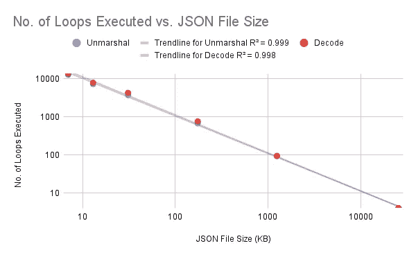
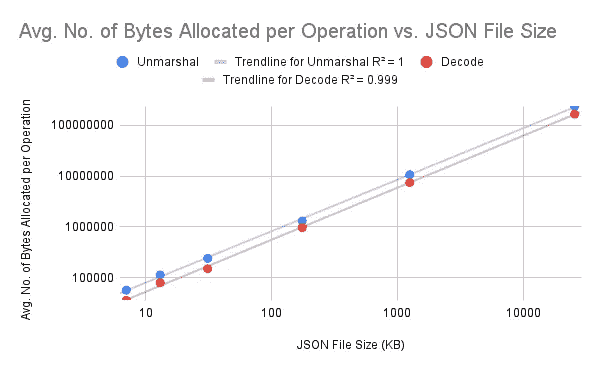
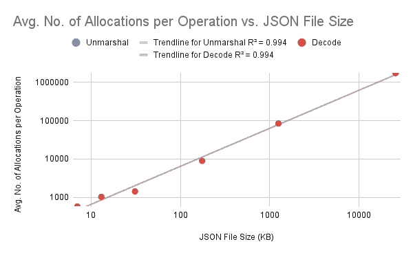

# 解组()还是解码()？解释了 Go 中的 JSON 处理

> 原文：<https://blog.devgenius.io/to-unmarshal-or-to-decode-json-processing-in-go-explained-e92fab5b648f?source=collection_archive---------1----------------------->

如果你像我一样，想学习后端开发，你可能曾经遇到过 JSON 处理。JSON 是一种非常流行的在前端和后端之间传输数据的格式。因为它是现代 web 开发中如此重要的特性，Go 在其`encoding/json`包中添加了对 JSON 的支持。

问题是做事的方式并不只有一种。如果您过去看过一些教程，您可能已经注意到人们使用不同的函数来处理 JSON。有人用`Marshal`和`Unmarshal`，有人用`Encode`和`Decode`。你应该用什么？哪个更好？在这篇博文中，我将尝试解释这两种方法之间的区别，以及何时应该使用其中一种。尽情享受吧！

# 但是首先，让我向您展示这两种方法。

有两种方法可以读写 JSON。这段代码片段将帮助您理解如何使用这两种方法。第一，`Marshal`和`Unmarshal`:

```
func PrettyPrint(v interface{}) (err error) {
    b, err := json.MarshalIndent(v, "", "\t")
    if err == nil {
        fmt.Println(string(b))
    }
    return err
}func TryMarshal() error {
    data := map[string]interface{}{
        "1": "one",
        "2": "two",
        "3": "three",
    }
    result, err := json.Marshal(&data)
    if err != nil {
        return err
    } err = PrettyPrint(result)
    if err != nil {
        return err
    } return nil
}func TryUnmarshal() error {
    myFile, err := os.Open("test.csv")
    if err != nil {
        return err
    }
    defer myFile.Close() data, err := io.ReadAll(myFile)
    if err != nil {
        return err
    } var result map[string]interface{}
    json.Unmarshal([]byte(data), &result) err = PrettyPrint(result)
    if err != nil {
        return err
    } return nil
}
```

在`TryMarshal`中，我创建了一个`map[string]interface{}`来保存一些数据。然后我传给了`Marshal`。

在`TryUnmarshal`中，我读取了一个文件，并将其转换成字节片`data`。该`data`被传入`Unmarshal`，后者将结果存储在一个`map[string]interface{}`中。

`PrettyPrint`只是格式化输出使其看起来更好。

现在我们来看看`Encoder.Encode`和`Decoder.Decode`。

```
func TryEncode() error {
    data := map[string]interface{}{
        "1": "one",
        "2": "two",
        "3": "three",
    }
    err := json.NewEncoder(os.Stdout).Encode(&data)
    if err != nil {
        return err
    } return nil
}func TryDecode(path string) error {
    myFile, err := os.Open(path)
    if err != nil {
        return err
    }
    defer myFile.Close() var result map[string]interface{}
    json.NewDecoder(myFile).Decode(&result) return nil
}
```

代码看起来与前面的例子非常相似。`TryEncode`类似于`TryMarhsal`,`TryDecode`类似于`TryUnmarshal`。这里唯一的区别是`Encode`和`Decode`是`Encoder`和`Decoder`类型的方法。

`NewEncoder`接受`io.Writer`接口并返回一个新的`Encoder`类型。`NewDecoder`接受`io.Reader`接口并返回一个新的`Decoder`类型。对于这个例子，我为`NewEncoder`传入了`os.Stdout`，为`NewDecoder`传入了`myFile`(属于`os.File`类型)。

既然我们知道了如何使用这些函数，我们就可以深入了解这两种方法的不同之处。

# 封送()和解封送()

让我们来看看它们的实现:

```
func Marshal(v any) ([]byte, error) {
    e := newEncodeState() err := e.marshal(v, encOpts{escapeHTML: true})
    if err != nil {
        return nil, err
    }
    buf := append([]byte(nil), e.Bytes()...) encodeStatePool.Put(e) return buf, nil
}func Unmarshal(data []byte, v any) error {
    var d decodeState
    err := checkValid(data, &d.scan)
    if err != nil {
        return err
    } d.init(data)
    return d.unmarshal(v)
}
```

你需要知道的是:

*   `Marshal`接受任意值(`any`是`interface{}`的包装器)并将其转换成字节片。
*   `Unmarshal`获取一个字节片，对其进行解析，并将结果存储到`v`。

另外，看看`Marshal` **如何将所有的字节**存储到一个字节片`buf`中。这意味着`Marshal` **需要在内存**中保存所有数据才能工作。这可能会占用大量内存。`Unmarshal`有类似的问题，因为它接受一个完整的字节片作为输入。

# NewEncoder()。Encode()和 NewDecoder()。解码()

下面是 Encode()和 Decode()的代码:

```
func (enc *Encoder) Encode(v any) error {
    if enc.err != nil {
        return enc.err
    }
    e := newEncodeState()
    err := e.marshal(v, encOpts{escapeHTML: enc.escapeHTML})
    if err != nil {
        return err
    } e.WriteByte('\n') b := e.Bytes()
    if enc.indentPrefix != "" || enc.indentValue != "" {
        if enc.indentBuf == nil {
            enc.indentBuf = new(bytes.Buffer)
        }
        enc.indentBuf.Reset()
        err = Indent(enc.indentBuf, b, enc.indentPrefix, enc.indentValue)
        if err != nil {
            return err
        }
        b = enc.indentBuf.Bytes()
    }
    if _, err = enc.w.Write(b); err != nil {
        enc.err = err
    }
    encodeStatePool.Put(e)
    return err
}func (dec *Decoder) Decode(v any) error {
    if dec.err != nil {
        return dec.err
    } if err := dec.tokenPrepareForDecode(); err != nil {
        return err
    } if !dec.tokenValueAllowed() {
        return &SyntaxError{msg: "not at beginning of value", Offset: dec.InputOffset()}
    } n, err := dec.readValue()
    if err != nil {
        return err
    }
    dec.d.init(dec.buf[dec.scanp : dec.scanp+n])
    dec.scanp += n err = dec.d.unmarshal(v) dec.tokenValueEnd() return err
}
```

这里的代码比较长，但请记住以下几点:

*   `Encode`和`Decode`是`Encoder`和`Decoder`类型的方法，它们是通用接口`io.Writer`和`io.Reader`的包装器。
*   `Encode`和`Decode` **流式传输数据，而不是一次存储所有数据**。有一个缓冲区供`Encode`和`Decode`读写，直到所有数据处理完毕。

# 好吧…那我应该用哪一个呢？

好问题！我很想知道这两种方法之间的性能差异，所以我写了一个测试并对它们进行了基准测试。请注意，测试的任何打印都已被禁用。

这个测试是为`Unmarshal`和`Decode`设计的，因为通常你不会自己写大量的 JSON 数据，但是从服务器接收大量的 JSON 数据是可能的。你仍然可以期待`Marshal`和`Encode`的类似结果，因为它们基本上是它们的伙伴函数的反序。

下面是测试代码:

```
func BenchmarkTryUnmarshal(b *testing.B) {
    for i := 0; i < b.N; i++ {
        err := TryUnmarshal("file.json")
        if err != nil {
            b.Fatalf("error: %v", err)
        }
    }
}func BenchmarkTryDecode(b *testing.B) {
    for i := 0; i < b.N; i++ {
        err := TryDecode("file.json")
        if err != nil {
            b.Fatalf("error: %v", err)
        }
    }
}
```

`"file.json"`是我们的实验变量。这些将是每次运行的不同大小的 JSON 文件。前五个 JSON 文件来源于 [JSONPlaceholder - Free 伪 REST API](https://jsonplaceholder.typicode.com) 。最后一个 JSON 文件(最大的一个)来源于主 JSON-iterator/test-data GitHub 中的 [test-data/large-file.json。](https://github.com/json-iterator/test-data/blob/master/large-file.json)

这是用于测试的架构。

```
goos: linux
goarch: amd64
pkg: example.com/jsonExperiment
cpu: Intel(R) Core(TM) i7-7700K CPU @ 4.20GHz
```

这是基准数据。

## 解组

## 译



我们可以在这里看到一些模式:

*   `Decode`始终比`Unmarshal`使用更少的内存。然而，这并没有太大的区别。
*   其他的都没那么大区别。
*   当您处理大型 JSON 文件时，内存使用似乎成了一个问题，但是一个服务器不太可能会收到这么大的 JSON 数据。我用最后一个例子来推动它。

# 结论

性能上的差异相当小，所以我认为在决定采用哪种方法时，性能不应该成为成败的因素。更合理的考虑方式是看你使用的是什么数据格式。例如，看看这个片段。

```
func Homepage(w http.ResponseWriter, r *http.Request){
    type pageData struct {
        visited time.Time
        message string
    }
    homepageData := pageData{time.Now(), "Welcome!"}
    json.NewEncoder(w).Encode(&homepageData)
}func main() {
    http.HandleFunc("/", Homepage)
    log.Fatal(http.ListenAndServe(":8080", nil))
}
```

这是一个简单的例子，展示了一个 API 在 Go 中的样子。对`/`端点的任何请求都将触发该代码运行`Homepage`控制器，该控制器创建一个`pageData`的实例，并使用`NewEncoder(w).Encode(&homepageData)`对其进行编码。`w`实现了`io.Writer`，所以使用`Encode`更方便，预计在`io.Writer`上使用。你可以从技术上把这个结构转换成字节片，然后使用`Marshal`。但是当你不需要的时候为什么要多走一步呢？

要点是，你不应该太担心性能，直到它成为一个问题。相反，你应该选择一个在给定时间内最容易使用的解决方案。如果有一个字节片要处理，使用`Marshal`和`Unmarshal`。如果有`io.Writer`或`io.Reader`，使用`Encode`和`Decode`。

感谢您的阅读！这对我来说是一个有趣的话题，我想进行一些实验。如果你喜欢这些类型的帖子，请在评论中告诉我！你可以在 [Dev.to](https://dev.to/jpoly1219/to-unmarshal-or-to-decode-json-processing-in-go-explained-5870) 和[我的个人网站](https://jpoly1219.github.io)上阅读这篇文章。