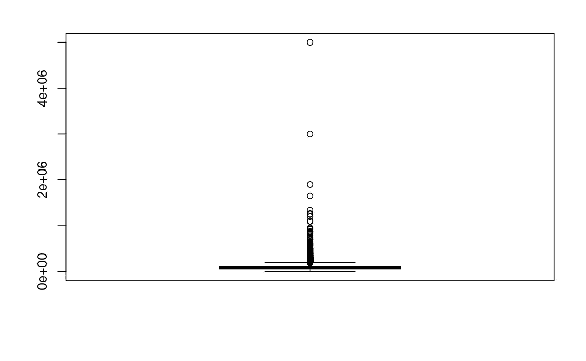

# 离群值太多？— Winsorization

> 原文：<https://blog.devgenius.io/too-many-outliers-winsorization-6f120e7e8257?source=collection_archive---------1----------------------->


照片由 unsplash 拍摄

在为机器学习准备数据的过程中，您经常会遇到值与其他值分离的特征，我们称之为离群值。这些值是大多数模型的痛点，因为它们对异常值很敏感。嗯，回归算法，如稳健回归，XGBoost 回归和其他一些被称为是“稳健”的离群值，但我意识到，可能不是这样，当我们有相当多的离群值。现实生活中的数据可能会很乱，而且真的很乱。我偶然发现了这样一个数据，在清理和准备机器学习时，我意识到目标变量有相当多的异常值，这促使我到处研究如何处理它。

通常，在处理异常值时，建议采用两种主要方法。

*   用平均值或中值估算这些值。
*   删除有异常值的记录或变量。
*   规范化您的数据(不太频繁)。

上面提到的技术听起来都不适合解决我的数据中的异常值。现在，这里有一个关于数据的简介。

askamanager.org 正在进行一项薪资调查。
表格中问的主要问题是你挣多少钱，以及一些更多的细节，比如哪个行业、年龄、工作经验等。这些细节被收集到一个谷歌表单中，我就是从这个表单中获得数据的。

我想做一些回归模型来预测给定预测因素的工资，如经验年限、性别、教育水平和其他特征。经过一番检查后，我意识到目标变量(年薪)有如此多的异常值。我想现在你对我们正在处理的案子有足够的背景了，对吧？酷！

说够了，现在让我们把手弄脏吧！

## 加载库

```
library(data.table)
```

然后是数据

我为这个数据做了一篇关于数据清理的文章，在这里查看。因此，我将只加载清理过的数据，这样我们就可以直奔主题了。

```
salarydata <- fread("./data/salary_data_cleaned.csv")
```

## 数据检查

直方图或箱线图不仅有助于显示数据的分布，还有助于显示异常值。
让我们选择其中一个，看看我们的目标变量是如何分布的。

```
boxplot(salarydata$annual_salary)
```



好吧，好吧，希望你现在明白我说的这么多离群值是什么意思了，嗯？我的意思是，他们不是两个，三个，四个甚至十个，所以我们用中间值或平均值估算他们，如果你喜欢的话。也请记住，我们处理的是工资问题。向收入远高于正常水平的同事提交申请是正常的，他们可能很多，这是正常的:)

现在让我们考虑一下现有的选择。

1.使用中位数/平均值进行估算。如果我们谈论的是 3 或 4 个值，那么这可能是一种妥协，而不是太多的值，因为这会误导机器学习算法。想象一下，一群提交的人来自 x 行业，有超过十年的经验，他们的收入远远高于正常水平，那么我认为让机器知道如果有人来自 x 行业，并且他们有超过十年的经验，你会赚得更多，这将是一件好事。如果我们将这些值减少到中值/平均值，情况可能就不一样了。

2。删除具有异常值的记录。
—有时由于测量或记录错误会出现异常值，丢弃这些异常值是可行的，但从我们的数据来看，这很可能不是错误的结果。因此，在这种情况下，删除它们听起来不太好，而且，我认为这将导致信息的丢失，而这些信息可能对机器的学习很重要。

3。正常化。
—我对标准化的理解是，它将值缩放到一个范围内，比如说 0-1，这实质上意味着极值仍然位于 0.9 的极值，而其他值位于 0.000 的极值。这并没有真正解决异常值问题！

这就是我们对 winsorization 概念的理解。
根据维基百科，该术语被定义为通过限制统计数据中的极值来减少可能的虚假异常值的影响的统计变换，换句话说，我们用不太极端的值替换极值。

幸运的是，有一个库可以让我们的工作变得更加简单！

```
library(DescTools) # want to use the winsorize functionwinsorized.data <- salarydata[,.(winsorized.salary = Winsorize(annual_salary))]boxplot(winsorized.data$winsorized.salary)
```


哇！太神奇了吧。无论如何，我们的数据看起来好多了，至少我们可以看出这个图是一个箱线图:)
因此，本质上，Winsorize 函数所做的是用我们数据的第 95 个分位数值替换极值。嗯，虽然这是一个减少，但这比用中间值/平均值来代替要好得多。而且，我们的机器仍然会学习到来自行业 x 的有超过十年经验的人确实倾向于挣得更多，因为更多的不是实际数据的水平。

参考资料:

[https://cxl.com/blog/outliers/](https://cxl.com/blog/outliers/)

[https://www.r-bloggers.com/2011/06/winsorization/](https://www.r-bloggers.com/2011/06/winsorization/)

[https://en.wikipedia.org/wiki/Winsorizing](https://en.wikipedia.org/wiki/Winsorizing)