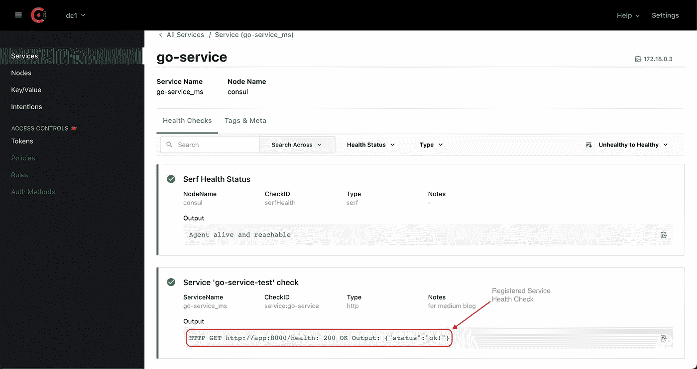

# 工具使用咨询服务发现和 KV 存储进行微服务

> 原文：<https://blog.devgenius.io/tooling-go-microservices-with-consul-service-discovery-and-kv-store-2c52bcdf4fd4?source=collection_archive---------4----------------------->

Consul 的核心是一个服务网络解决方案。它提供了服务网格解决方案、网络配置自动化、服务发现、简单的键值存储等。在本文中，我们将关注服务配置的键值存储(KV store ),以及 consul 的核心特性之一，服务发现。总之，我们正在用 Consul 覆盖一个必不可少的微服务工具。


服务注册和分布式配置/咨询和运行

# TL；速度三角形定位法(dead reckoning)

[](https://github.com/by-sabbir/consul-kv-discovery) [## GitHub-by-sab Bir/consul-kv-discovery

### 此时您不能执行该操作。您已使用另一个标签页或窗口登录。您已在另一个选项卡中注销，或者…

github.com](https://github.com/by-sabbir/consul-kv-discovery) 

拿到密码就跑

```
❯ docker compose up -d --build
```

这应该会在`localhost:8500`处显示 Consul UI，如果您浏览[此链接](http://localhost:8500/ui/dc1/services/go-service_ms/instances/consul/go-service/health-checks)，该 UI 应该如下所示。



使用健康检查咨询服务发现

如果您对如何构建您的代码并使其为生产做好准备更感兴趣，让我们深入…

我们将首先从一个整体的`main.go`文件开始，然后将它分解成几个部分来创建一个惯用的 go 项目。首先，我们需要启动咨询服务。让我们为此创建一个`docker-compose.yml`文件，

此外，我们需要添加服务器配置，从`[conf/server.json](https://github.com/by-sabbir/consul-kv-discovery/blob/master/conf/server.json)`

```
❯ mkdir conf/ && curl -o conf/server.json [https://raw.githubusercontent.com/by-sabbir/consul-kv-discovery/master/conf/server.json](https://raw.githubusercontent.com/by-sabbir/consul-kv-discovery/master/conf/server.json)
```

现在，我们准备启动 consul 服务器，

```
❯ docker compose up -d consul
```

让我们专注于应用程序，我们将做出一些设计决策-

*   首先，我们希望这个包能被所有的微服务使用。
*   应用程序启动时应该注册服务。(应该首先失败，但为了简单起见，我们忽略这一点)
*   我们希望使用 KV store 作为外部依赖管理器，如服务主机和端口、API 版本，而不是安全配置 ie、密码管理器、API 密钥、客户端机密等。

我们的项目结构应该是这样的，

```
.
├── cmd
│   └── server
├── conf
├── internal
|   └── api
└── pkg
    └── consul
```

对于咨询服务交互，我们将使用`pkg`目录而不是`internal`，因为我们希望这可以作为 [go 标准项目布局](https://github.com/golang-standards/project-layout)的一部分，供其他开发者和服务重用。

现在，创建一个新文件`pkg/consul/service-discovery.go`

这是一个相当简单的代码，只包含两个函数

*   `NewClient` —为给定地址启动新的 consul API 客户端
*   `Register` —使用给定的名称和预定义的标签注册服务以咨询服务发现。

对于产品，标签对于在 Consul UI 中快速搜索服务非常重要。一旦服务被注册，监控服务健康将是 consul 服务器的工作，行`30-34`表示 consul 服务器将每 30 秒检查一次服务的健康。

我们已经完成了服务发现。现在跟领事 KV Store 讨论一些动态配置。

为了整合 Consul KV，让我们稍微查看一下[文档](https://pkg.go.dev/github.com/hashicorp/consul/api#Client.KV)，以便更好地了解情况。从文档中，我们可以看到，

```
func (c *[Client](https://pkg.go.dev/github.com/hashicorp/consul/api#Client)) KV() *[KV](https://pkg.go.dev/github.com/hashicorp/consul/api#KV)
```

因此，`KV`是一个指向`*api.Client`结构的指针接收器。我们已经有了一个返回`*api.Client`的方法`NewClient`，并且我们已经从该方法启动了一个客户端，如果我们为 KV Store 创建一个单独的存储库，我们可以重用该客户端。让我们这样做…创建一个文件`pkg/consul/kv-store.go`并粘贴以下行—

函数`NewKVClient`重用我们的`ConsulClient`并返回一个 KV 客户端。对于我们的用例，我们只创建了 Get 和 Put 功能，假设商店的所有键和值都是`string`。因为我们将只读取现有配置并创建/更新一个。

最后是集成解决方案的时候了，Go 提供了一个非常强大的函数来实例化`init()`，这个函数只运行一次，在包内任何其他函数之前运行。我们可以定义多个`init()`,但它们都将按顺序运行一次，且只运行一次。我们将利用这一特性，因为 Consul 服务器将定期进行服务健康检查。

让我们编写足够的代码在 Consul 中注册服务，

如果您运行`main.go`并进入控制台，粘贴以下内容—

```
❯ curl -X GET [http://127.0.0.1:8500/v1/catalog/services](http://127.0.0.1:8500/v1/catalog/services)
```

它应该会输出类似这样的内容—

```
{“consul”:[],”go-service_ms”:[“golang”,”microservice”]}
```

让我们清理一下`main.go`文件。我们希望设计尽可能可重用的 consul 功能，我们通过使用 go 约定成功做到了这一点。但是实例化服务会因人而异。例如，一个人可能需要使用 AWS S3 服务，另一个人可能需要使用 AWS 密钥空间。因此配置可能因服务而异。在这种情况下，我们需要一个目录来实例化 consul 集成。让我们创建一个文件`pkg/consul/kv-store.go`并粘贴以下内容

> 注意:结构`ServiceDefinition`应该由`viper`或任何`os`环境变量解析器填充。

因此，我们的`main.go`文件变得更清晰，代码库也更易于管理。但是不要忘记在前面输入包装“`_`”作为[匿名占位符](https://go.dev/ref/spec#Blank_identifier)。确保`init()`功能运行一次。

```
_ “github.com/by-sabbir/consul-kv-discovery/internal/consul”
```

现在，如果我们运行整个码头工人作曲，它应该像这样输出——

```
❯ docker compose logs -f appapplication  | 2022/10/08 21:07:40 service registered:  go-service
application  | 2022/10/08 21:07:40 apigw baseUrl:  **apigw.example.com**
```

我们已经成功地从 KV 商店获得了信息，让我们来看看新的钥匙——


获得并赋予咨询公司关键价值

要获取新创建的密钥，请`go-service`提出以下请求——

```
❯ curl -X GET [http://127.0.0.1:8500/v1/kv/go-service](http://127.0.0.1:8500/v1/kv/go-service)
```

它应该像这样输出查询——

```
[
   {
      "CreateIndex" : 17,
      "Flags" : 0,
      "Key" : "go-service",
      "LockIndex" : 0,
      "ModifyIndex" : 17,
      "Value" : "MC4wLjAuMDo4MDAw"
   }
]
```

该值是原始消息的`base64`编码版本。

我们现在能够发现领事的 go 服务。此外，配备必要的工具，以读取和写入领事千伏商店。