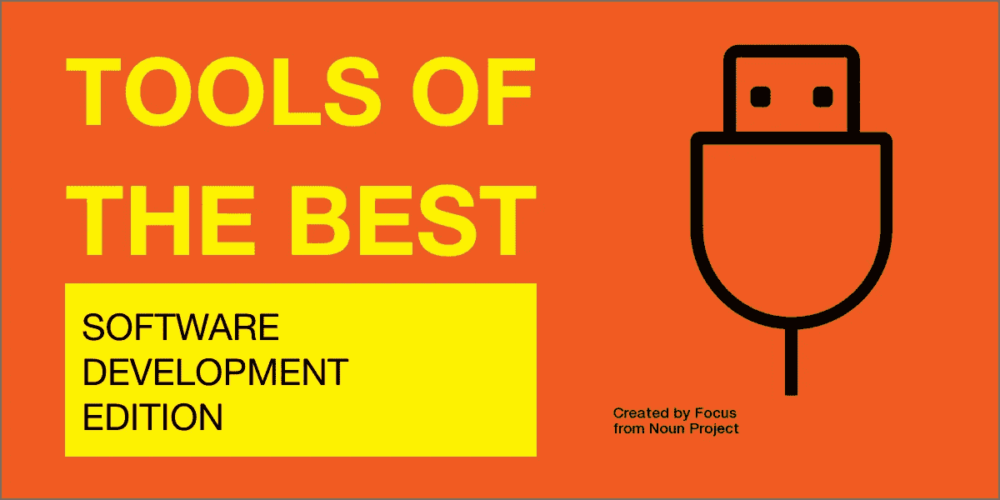

# 最佳工具:软件开发版

> 原文：<https://blog.devgenius.io/tools-of-titans-software-development-edition-22e9b12764ef?source=collection_archive---------19----------------------->

> ***产品团队成立的那一天，进度落后，超出预算。***
> 
> *唐·诺曼*

我们经常会遇到这样的情况:在学习了有用的信息后，我们还没来得及付诸实践就忘记了。

以下是我根据过去几年从我所学习的书籍、文章和课程中收集的笔记收集的建议、想法和主意。

这些笔记涵盖了多个领域，因为幸运的是，在过去的十年里，我担任过不同的角色。

很大一部分要点是通用的，但重点仍然是从头到尾做 web 项目。

此外，根据项目的规模，有些项目可能不合适或不适用。

由于我在这里收集了一些业内精英的想法和观点，我部分借用了 Tim Ferriss 和他的巨著[Titans 的工具](https://toolsoftitans.com/)的标题。

# 内容

**创意
设计** :
*基础创意
*技术技巧和窍门
*可访问性
**架构
项目工作** :
*认知偏见和心智模型
*沟通
*招聘
**开发** :
*重构
**安全**

# **想法**

*   一次产生很多想法。不要停留在一两个想法上。
*   无论在什么情况下，都要有创造力。不要批评想法，不管是你的还是别人的。即使是疯狂的想法，通常看起来明显是错误的，也可能包含某种创造性的想法。将想法产生的阶段与想法评估的阶段分开。不要过早放弃想法。
*   产生想法的时间有限会导致过度专注，在这种情况下，更容易将想法产生和评估的阶段分开，因为没有时间进行评估。
*   有时，您可以添加限制或删除现有的限制来更改流程。

干扰创造力的恐惧:

*   恐惧似乎很愚蠢。
*   害怕坏主意。
*   害怕自己做错了事情。评估人们如何工作不应该基于他们是否按照你的方式去做，而应该基于他们的方式有多有效。如果一个人做了某件事并成功了，不要试图重新训练他们。
*   对未知的恐惧。
*   害怕不喜欢别人做某件事。
*   害怕自己没有自己想象的那么好。
*   害怕冒名顶替综合症(你知道的比别人少)。

# 设计

这一节对我来说是最难的，因为我不是专业的设计师，但同时也是最有用的一节，因为这是这种格式的价值体现的地方。当你能够浏览要点，在设计讨论中变得更有效率，或者将想法应用到你自己的项目中。

## 卑鄙的想法

*   请记住，尽管技术日新月异，但人类的行为并没有改变得那么快。我们 20 年前的行为方式仍然适用。例如，参见最新的报告【人们如何在线阅读】([https://www.nngroup.com/articles/how-people-read-online/](https://www.nngroup.com/articles/how-people-read-online/))。
*   使用设计而不是功能规范，这只会产生一致的错觉。人们阅读一篇文章，理解它是不同的。
*   在过程开始时不要注意细节。由大变小。从设计和布局开始。它们比代码更容易修改。在设计中，从震中开始。
*   事物的可启示性和反可启示性必须显而易见。
*   当启示和反启示难以察觉时，我们必须用能指来补充对象。
*   相关的元素应该放在一起。将控件和重要信息放在需要的地方。
*   反馈应该是即时的:哪怕是十分之一秒的延迟都会让人紧张。如果拖延时间太长，人们通常会放弃，去做别的事情。
*   如果反馈太多，会比反馈太少更令人烦恼。如果我们听到太多的信息，我们会全部忽略或关闭所有内容。这意味着我们很可能会错过真正重要的信息。
*   删除所有错误消息。而是为用户提供帮助和指导。确保您可以通过工具提示立即解决问题。
*   不要指望人们会在短期记忆中保存任何东西。通常，当出现问题时，计算机系统会显示一条包含重要信息的消息，当一个人想要阅读这条消息时，这条消息就会从屏幕上消失。
*   避免算法以同样的方式开始，然后变得不同。员工越有经验，就越有可能成为这种失误的牺牲品。只要有可能，就应该规定算法，使它们从一开始就彼此不同。
*   在测试阶段，采访 5 个独立的人/团体就足够了，以获得充分的审查。你可以从其他队员开始。测试时使用开放式问题。
*   不要收集你现在不用的不必要的信息。
*   人们经常选择第一个满意的选项，而不是寻找最好的选项。我们对事物如何运作的想法往往是错误的，所以当我们理解了事物如何运作时，我们不会去寻找替代的解决方案，即使当前的方案是不好的。
*   像艺术家一样偷窃。利用这些网站获取灵感:([运球](https://dribbble.com)、 [pinterest](https://www.pinterest.com) 、 [pttrns](https://pttrns.com/) )。

标准化是绝望者的一个基本原则:当任何其他解决方案似乎都不可能时，就用同样的方式设计一切，这样人们就可以一劳永逸地学到一些东西。例如:

*   左上角有一个标志。
*   购物篮、视频等的熟悉图标。

减少错误的方法:

*   使用户正在使用的元素更加可见。改变对象的外观，使其更引人注目:增加它或改变它的颜色。
*   为您的操作添加“撤销”功能。
*   添加合理性检查。

## 技术提示和技巧

*   考虑设计中的正常、空和错误状态。空的状态给人的第一印象，所以很重要。
*   实现一个明暗主题。
*   不要对输入表单域设置太严格的限制。尤其是在名字上。如果可能的话，让用户自己决定如何拼写他的名字。并且不要因为不遵守虚构的规则和限制(格式化字段等)而受到惩罚。).如果可能，请自动设置表单格式。
*   可点击的东西一定要明显。不要对链接、按钮和不可点击的标题使用相同的颜色。使访问链接和未访问链接之间的区别可见。
*   使用清晰的标题和副标题将内容分成几个部分，这样用户可以浏览内容以获取信息。
*   不要让标题在两个文本块之间浮动，它应该更靠近文本块。
*   保持段落简短。通过删除所有无关紧要的单词和句子来缩短文章。使用简单的语言。
*   使用列表。突出关键词。这使得眼睛能够聚焦于最重要的信息。
*   你可能不需要在主页上放一张大图片。当人们明白这个网站是关于什么的时候，它的规模会让他们烦恼。那些已经知道你不需要的人。
*   光来自天空。阴影是告诉人脑我们在看什么用户界面元素的无价线索。
*   先黑后白。在添加颜色之前进行灰度设计简化了视觉设计中最复杂的元素，并迫使您关注元素的间距和布局。
*   加倍你的空白。要让 UI 看起来有设计感，就要增加很多呼吸空间。
*   只使用好的字体。
*   考虑可访问性问题。在目前的情况下，大量不太熟悉计算机的人不得不使用比以前多得多的计算机。

## 易接近

*   将文本增加到 200%,检查你的产品是什么样子的。
*   检查对比度。浏览器知道如何告诉你对比度不够。您也可以在操作系统中启用高对比度模式。
*   添加 alt 属性。
*   正确使用标题。不要跳过尺寸。
*   检查表单域的标签。
*   跟踪键盘内容的可用性。

你可以在这里看到更多细节:

*   [a11yproject.com](https://a11yproject.com/checklist/)
*   [wai-aria-practices](https://www.w3.org/TR/wai-aria-practices)

# 体系结构

> ***如果你觉得好的建筑很贵，那就试试差的建筑。***
> 
> 布莱恩·福特和约瑟夫·约德

*   不要在新项目中制作复杂的架构，因为它不仅耗时长且昂贵，而且如果你最初的想法和计划不符合需求，很难快速调整想法和改变产品。
*   开发一种基于领域模型的语言，用于程序员与专家的交流。
*   将程序分成几个层次，并将它们相互隔离。领域的知识应该只在一个层次上。GUI 与业务规则无关，所以在它们之间划一条线。数据库对 GUI 来说无关紧要，所以在它们之间画一个界限。数据库与业务规则无关，因此它们之间应该有一个界限。
*   数据库不是数据模型。数据库是软件的一部分。数据库是一种提供数据访问的实用工具。从体系结构的角度来看，这个实用程序无关紧要，它是一个低级的细节——一种机制。
*   用户界面是一个细节。Web 是一个用户界面。也就是说，网络是一个细节。作为一名架构师，将这样的细节置于核心业务逻辑之外。
*   确保模块之间的连接性较低，而模块内部的连接性可以高于外部。
*   如果在程序开发过程中，专家不理解简化方案中的一些技术细节，或者您不理解专家的描述，这是一个信号，表明您可能在该领域存在知识缺口。如果不做任何改变，架构将会失败。
*   给类和方法起一个合适的名字。如果你需要研究它的实现来理解一个对象是如何工作的，那么封装的意义就丧失了。
*   从数学中获取灵感。输入对象的数学运算。它可以改善架构，给代码带来美感。
*   坚持简约主义。

肯特·贝克的策略是:

*   首先让它工作。如果它不起作用，你就会失业。
*   那就弥补吧。组织代码，以便当您需要更改或理解某些内容时，您和其他人可以理解和开发它。
*   最后，要快。组织代码以获得所需的性能。

# 项目工作

> 如果你不担心，你就需要担心。如果你担心，你不需要担心。
> 
> *雷伊·达里奥*

*   使用这些指标来跟踪产品开发。在指标数量上找到平衡是很重要的。不应该有太多的问题来使它变得便宜和快速，但是足够发现问题。3-4 个指标可能就足够了。如果你的度量接近 100%，它可能值得改变。但是不要忘记沟通，指标只是数字。
*   请记住，在没有数据的情况下，人们的反应与拥有无用数据时不同。当没有具体数据时，正确使用先验概率；当存在无用数据时，先验概率被忽略。
*   如果出现问题，使用“5 个为什么”技巧来了解原因。你应该通过不断深入问题来问“为什么”，找到真正的原因。确定谁对结果负责。如果结果很差，是因为一个人缺乏技能还是行动计划中的错误？
*   你可以用成本、时间、质量和规模来管理一个项目。每个人都应该看到并理解这些变量以及它们之间的关系，以便做出好的决策。管理变量的最佳方式是通过规模。所以，坚持你的预算和时间计划，但要牺牲规模。砍掉一半的思路，然后看剩下的，再做一遍。你越轻，你就越容易改变。
*   从小预算开始——它专注于最重要的任务，带来独创性。
*   轻装上阵，它能让你快速适应。尽量不要依赖供应商、专有格式和固定的路线图。
*   不解决不存在的问题。对于每一个新任务，试着找到一种更快更便宜的方法来实现它。保持简单:明天可能永远不会到来，或者等到明天到来的时候，我们会知道解决问题的最好方法。不要为你不需要的灵活性买单。 [YAGNI](https://en.wikipedia.org/wiki/YAGNI)
*   考虑雇佣测试人员。测试人员的成本远低于开发人员。
*   学会对想法说不。考虑实施的隐性成本。
*   不要把人过多地限制在流程上，让他们自己想办法解决问题。让他们犯错误。你甚至可能把廉价的错误纳入预算。分析这些错误是很重要的，这样你就不会经常重复它们。在大多数情况下，人们想要做一份出色的工作，经理就是要帮助他们做到这一点。错误是开发过程中很自然的一部分。每个人都有权利和责任去理解重要的事情。
*   避免设置，它们是要付出代价的。
*   迈着小步继续前进。使用迭代过程来改进产品。尽快测试您的解决方案，在最终发布之前不要复制。一个不满足所有条件的原型可能已经很有用了，可以和专家或其他团队一起测试它。
*   学习并确保团队也学习。虽然一个人最终可能在某个领域达到最高水平，但挑战对他或她来说并不容易:奥林匹克运动员发现他的运动和新手一样具有挑战性。不要指望你的员工定义自己的盲点，并对其进行补偿。
*   玩是为了赢，而不是输。不要用文书工作和计划来掩盖这一点，这不是你的错。
*   为自己的行为负责。
*   一周工作 40 小时(5 小时)可以让你变得高效和专注。避免连续两周加班。
*   记住商业和发展的平衡。每个人都应该对自己的部分负责，并为另一方服务。
*   仅详细计划当前版本或迭代。你推迟计划的时间越长，你拥有的数据就越多，你对下一步的预测就越准确。
*   时间不是负值，所以时间误差总是在右边累积。这就是不对称。这就是为什么我们在做计划的时候经常会随着时间出错。
*   紧急问题并不比战略问题更重要。有时候少意味着多，我们应该经常扔掉不必要的和无关紧要的信息，专注于关键的事情。记住帕累托 20/80 原则。
*   紧迫感是我们扭曲世界认知的主要原因之一。当我们处于紧急压力下时，我们会做出糟糕的分析决策。你总是需要观察和测量数据。
*   问题日志对公司来说是一个很好的工具:员工写下所有的问题、重要性和责任。这有助于理解原因。
*   痛苦+分析=进步。接受最好的动机带来的僵硬。
*   你需要培养的最重要的技能之一是，在你不擅长的领域向有能力的人寻求建议。
*   做出假设和提出问题并不等同于批评，所以不要这样看待它们。
*   同时评估变化率、目标水平以及它们之间的关系。如果情况有所改善，但变化率很低，那么在足够的时间内目标将无法实现。
*   要做出有效的决策，在一般层面上理解大多数事情就足够了。
*   通过评估与推迟决策的成本相关的额外信息的重要性来确定优先级。
*   首先，做你必须做的事情，然后做你喜欢的事情。不要被明亮的小饰品分散注意力，也不要忘记你日常工作背后的机制。
*   不重要的事情可能没有足够的时间，但总比重要的事情没有足够的时间好。您可以使用艾森豪威尔矩阵，通过按紧急程度和重要性划分任务来确定优先级。
*   任何任务都应该根据其成功完成的概率和优先级来评估。
*   如果你组织了一次会议，管理讨论。
*   确定集体决策的个人责任范围。一个非人称的“我们”是一个明显的暗示，这个人试图避免承认一个错误。
*   安装一个窃听器。在编写新代码之前，尝试修复错误。
*   通常你必须改变产品，即使它已经运行良好，以保持用户的兴趣。

请记住，认为新代码会比以前的代码更好的想法可能非常荒谬。旧的代码已经被使用，被测试，并且许多错误被修复。记住，你丢掉了项目中的知识。考虑您想要重写代码和其他解决方案的主要原因:

*   架构问题——可以通过整个团队验证的仔细重构来解决。
*   性能问题—通常 1%的变化会导致 99%的增长。
*   丑陋的代码——可以通过接受格式标准、设置自动格式、git-hooks 等方法解决。

在展示你的产品时，像素很重要，每个人都会把注意力放在屏幕上。让它尽可能的漂亮。但是如果你能在界面中显示未完成的部分，让它们看起来像是未完成的。

*   如果你给一个非程序员看一个看起来 100%完整的屏幕，他会认为整个产品差不多准备好了。
*   如果你给一个非程序员看一个在最终版本中看起来比预期差很多的屏幕，他会认为整个产品差很多。

## 认知偏差和心理模型

有许多认知偏见以及心理模型。他们中的许多人在 Kahneman，Cialdini 等书中都有描述。了解它们的存在将有助于避免决策中的一些错误或改进产品设计。下面是我认为与文章最相关的几个例子。

*   避免关联事件偏差。我们经常高估联合事件的可能性，这些事件必须同时发生。一系列相关事件发生的概率低于任何单个事件发生的概率。因此，我们冒着严重低估实现目标所需的时间、金钱和努力的风险。
*   沉没成本谬误——人们不理性地坚持一项活动的倾向，因为他们已经在这项活动上花费了时间和/或金钱，这项活动没有达到他们的预期。沉没成本谬论解释了为什么人们看完他们不喜欢的电影，在餐馆吃完饭即使他们已经吃饱了，继续持有表现不佳的投资，在他们的衣柜里放着他们从来没有穿过的衣服。
*   框架效应——一种认知偏差，在这种情况下，人们根据特定选择的呈现方式(损失或收益)以不同的方式做出反应。

## 通信

*   不要隐瞒直到团队做出最后的管理决策，即使这些决策对他们来说是不愉快的。
*   不要谈论任何你不敢当面告诉他的事情。

管理讨论:

*   在演讲过程中不要批评，给每个人比如说 2 分钟不间断的发言时间。
*   积极倾听。
*   演讲结束后，在队列中为每个人确定一个提问的位置。因此，他们会知道他们将有机会提问并专注于讨论。
*   寻找不同意这些提议的人。
*   让沉默者参与进来。

## 雇用

*   不要雇佣或雇佣越晚越好。评估你是否可能不做某事或减少功能。
*   如果你正在招聘，你会喜欢少数更有才华的人，而不是大量平庸的人。这样会降低沟通成本。
*   3 到 5 人的小组在实践中是最有效的。
*   正如布鲁克斯定律所说，给一个后期的软件项目增加人力会让它变得更晚。
*   想一想你在寻找一个具有什么价值观、能力和技能的员工。这里单词的顺序很重要。
*   假设大部分人不变。
*   更喜欢通才。多任务团队成员让你更快地适应变化的条件。
*   在其他条件相同的情况下，选择一个有才华的作家。这些人通常思维更清晰，沟通更好。
*   把你的团队想象成一个体育经理:没有人拥有成功所需的所有技能，但每个人都必须在某方面做得更好。所以，多分析自己失败的地方，加强自己。如果你招的人和领导的优点和缺点都一样，那就更有可能导致一个负面的结果。候选人经验的多样性增加了他们给项目带来新想法的机会。
*   寻找知道如何完成项目的人。
*   面试的时候，应聘者必须表现出自己会写代码。

注意行动，而不是言语。一个指标可能是开放源码项目的存在。可能还有其他指标:

*   对编程充满热情。
*   对新的语言和技术感兴趣，因为这可能会显示出对职业的兴趣。
*   使用低级技术的技能。

一个面试例子:

*   引言。你关于自己、公司、职位的简短故事。在这里，你可以向候选人保证你关心解决问题的过程，而不是实际的答案。
*   就他/她以前的经历提出开放式问题。有时候更深入细节。你可以让他们用简单的词语描述一些复杂的事情，以此来判断考生理解的真实程度。注意候选人谈论自己经历时的激情。
*   给出简单的编程任务。这里你要注意任务执行的速度。这可能是一个人以后如何解决实际任务的良好指标。
*   继续更复杂的事情。
*   候选人提问部分。

# 发展

> ***我不是伟大的程序员；我只是一个习惯很棒的好程序员。***
> 
> *肯特·贝克*

*   代码库是我们生活的地方，我们的目标是让它适合我们自己以及生活在那里的所有其他人。当我们写代码时，我们的目标不是完成它并继续前进，我们的目标是使它可持续，适合团队居住。
*   你可以把自己当成一个软件写手，而不是软件工程师。“写作”比“工程”更适合用来比喻我们大部分时间所做的事情。写作是关于清晰和以清晰易懂的方式呈现信息，以便任何人都能理解。
*   编写测试并使代码尽可能简单。这样，您可以降低变更的成本，避免过度设计，并专注于当前的问题。测试给你即时的反馈。
*   引入每 N 天更新依赖项的实践。可以是一周一次，也可以是一个月几天。
*   设置部署流程，让您轻松完成部署。这将允许您测试产品并快速获得反馈。有了负面反馈，你可以很容易地回滚更改。
*   自动化流程(从故障中恢复、日常操作等。)，因为你不是系统中最可靠的组件。

设置 linters 来执行自动代码检查，自动格式化。这将简化所有团队成员的工作。在代码审查阶段，这将允许您关注业务逻辑，而不是编码风格。此外，您可以设置代码分析器并获得代码质量检查或关于不安全代码的警告。你可以看看 [lefthook](https://github.com/Arkweid/lefthook) 和[beautiful](https://prettier.io/)(或者任何其他你喜欢的类似工具)，根据语言的不同，这些工具:

*   CSS: [stylelint](https://stylelint.io/user-guide/usage/cli)
*   JS: [eslint](https://eslint.org/docs/user-guide/formatters/#checkstyle)
*   Ruby: [rubocop](https://github.com/rubocop-hq/rubocop) ， [breakman](https://github.com/presidentbeef/brakeman)
*   仙丹:[混合格式](https://hexdocs.pm/mix/master/Mix.Tasks.Format.html)，[信条](https://github.com/rrrene/credo)，[索博](https://hexdocs.pm/sobelow/readme.html)
*   [超级棉绒](https://github.com/github/super-linter)——各种棉绒的简单组合

使用验证器:

*   可访问性: [a11y-checker](https://github.com/Muhnad/a11y-checker)
*   HTML 验证:[validator.w3.org/nu](https://validator.w3.org/nu/#textarea)
*   结构化数据:[search.google.com/structured-data/testing-too](https://search.google.com/structured-data/testing-tool/u/0/)l

## 重构

*   测试使重构变得更加容易。
*   一小步一小步地前进，在每一步之后运行测试。
*   重构可以在添加额外功能之前立即完成。这样可以让你理解代码，让代码变得更好。
*   总是试着把代码留在身后，比它在你面前时更好。不要让代码变得更糟。
*   在重构期间，不要花太长时间为函数/变量选择名称。选择一个你想到的，当你选择了最好的选项时改变它。
*   在大多数情况下，您可能会忽略重构期间的性能(例如，将一个周期分成几个)。重构后，如果出现性能问题，请修复它们。
*   重构是你的工作。不要征求许可，而是征求建议。作为专业人士，这就是你的工作方式。
*   总是确保测试在该落下的时候落下。

# 安全性

*   注意存储库中敏感数据的存储。不要打开存放。有时候一个框架可以解决这个问题，比如[Ruby On Rails]([https://guides . Ruby On Rails . org/security . html # environmental-security](https://guides.rubyonrails.org/security.html#environmental-security))或者【凤凰】(【https://hexdocs.pm/phoenix/deployment】T5)。html)。或者你可以选择不同的方法，比如[git-secret]([https://git-secret.io/](https://git-secret.io/))。
*   保护好服务器的基本安全。例如，如果您有几台服务器，您可以查看本文中的提示[我在服务器上的前 10 分钟](https://jacyhong.wordpress.com/2016/06/27/my-first-10-minutes-on-a-server-primer-for-securing-ubuntu/)和在组合器上的讨论。要么你可以自动化服务器部署，为你喜欢的系统创建/找到配方: [ansible](https://www.ansible.com/use-cases/security-automation) ， [chef](https://docs.chef.io/quick_start/) 或者别的什么。

检查您是否考虑了最常见的安全错误。例如，您可以浏览列表[owasp.org/www-project-top-ten](https://owasp.org/www-project-top-ten/)并检查:

*   您已经处理了代码中缺少注入的问题:SQL、NoSQL 等。
*   请确保身份验证未被破坏并且正常工作。
*   检查公共域中是否没有敏感数据和 API。
*   在安全配置方面没有犯任何错误，例如:更改了默认密码，正确配置了防火墙(特别是对于那些使用 docker 的人)。
*   照顾好 XSS。
*   已配置的依赖关系更新流程，以防其中出现漏洞。例如，github 发送不同语言的依赖漏洞报告。如果您实现了上述定期更新依赖项的实践，这一点也可以得到缓解。
*   设置系统的日志记录和监控

# 结论

关键的事情是要记住项目和过程是不同的，所以要让实践适应你的过程。你不应该把上述视为绝对真理。这只是一种让你错过更少细节的方法，尤其是在与你只是偶尔遇到的事物互动时。

# 参考

*   领域驱动设计:解决软件核心的复杂性。
*   [极限编程由肯特·贝克解释](https://www.amazon.com/Extreme-Programming-Explained-Embrace-Change-ebook/dp/B00N1ZN6C0/ref=sr_1_1?dchild=1&keywords=extreme+programming+explained&qid=1591601094&s=books&sr=1-1)。
*   [重构:改进现有代码的设计](https://www.amazon.com/Refactoring-Improving-Existing-Addison-Wesley-Signature/dp/0134757599/ref=sr_1_1?crid=3IIZD4P8V7T4B&dchild=1&keywords=refactoring+martin+fowler&qid=1592029328&sprefix=refact%2Caps%2C273&sr=8-1)马丁·福勒著。
*   罗伯特·马丁的《干净的架构:软件结构和设计的工匠指南》
*   Basecamp 的[变得真实](https://basecamp.com/books/getting-real)。
*   唐·诺曼的《日常用品的设计:修订扩展版》。
*   《不要让我思考，重温:网站可用性的常识方法》,作者 Steve Krug。
*   汉斯·罗斯林的真实。
*   [思考，快与慢](https://www.amazon.com/Thinking-Fast-Slow-Daniel-Kahneman/dp/0374533555)通过丹尼尔·卡内曼。
*   [原理:生活与工作](https://www.amazon.com/Principles-Life-Work-Ray-Dalio/dp/1501124021/ref=sr_1_1?crid=UDCY46K21HEN&dchild=1&keywords=principles+ray+dalio&qid=1593018663&s=books&sprefix=principles+ray+%2Cstripbooks-intl-ship%2C275&sr=1-1)雷伊·达里奥著。
*   [反脆弱:从无序中获得的东西](https://www.amazon.com/Antifragile-Nassim-Nicholas-Taleb-audiobook/dp/B00A2ZIZYQ/ref=sr_1_1?crid=22HNMN623XRDD&dchild=1&keywords=nassim+nicholas+taleb+antifragile&qid=1593018695&s=books&sprefix=nassim+nicholas+taleb+ant%2Cstripbooks-intl-ship%2C290&sr=1-1)纳西姆·尼古拉斯·塔勒布。
*   Eric Ries 为精益创业布道。
*   Erik D. Kennedy 的 7 条创造华丽 UI 的规则。
*   [创造力:产生更多更高质量的想法](https://www.linkedin.com/learning/creativity-generate-ideas-in-greater-quantity-and-quality)作者 Stefan Mumaw。
*   莎拉·梅的宜居代码。
*   [软件上的乔尔](https://www.joelonsoftware.com)
*   [Kalzumeus 软件](https://www.kalzumeus.com/)
*   蒂姆·费里斯秀
*   [大卫·海涅迈尔·汉森访谈](https://evrone.com/dhh-interview)