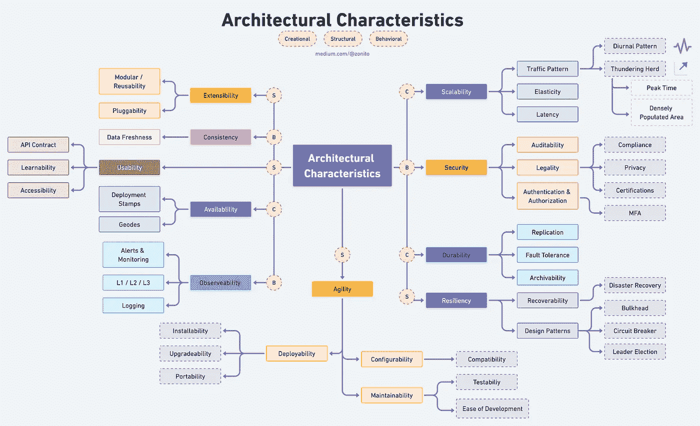

# 十大体系结构特征/非功能性要求，带备忘单

> 原文：<https://blog.devgenius.io/top-10-architecture-characteristics-non-functional-requirements-with-cheatsheat-7ad14bbb0a9b?source=collection_archive---------0----------------------->

想象一下你正在买车。里面需要哪些必备的功能？一辆车应该把一个人从 A 点送到 b 点。但是我们也检查它的安全性、舒适性、可维护性、易维修性或更好的里程。你也可以寻找电动版本或更好的速度。为什么？限制交付主要功能时可能出现的意外情况，即把一个人从 A 点带到 b 点。

类似地，就像汽车、摩托车或房子一样，软件也有其非功能性需求，称为“架构特征”。无论是网站、手机还是桌面应用；它应该有一套质量属性来满足最终用户的需求。

# 架构特征/非功能性需求

简而言之，功能需求定义了一个系统应该做什么，就像在汽车的情况下，把一个人从 A 带到 B，而非功能需求规定了一个系统应该如何。

这是 NFR 的整体小抄:

高清:[https://imgur.com/a/HzPp8s0](https://imgur.com/a/HzPp8s0)

这十大架构特征涵盖了大规模项目的大部分方面。您不需要在您的项目中容纳所有内容；挑最本质的，敲出来。本文并没有提供这些 nfr 的解决方案，而是让您知道在设计系统时需要考虑哪些方面。
让我们了解他们每一个人:

# 可扩展性:

随着用户或请求数量的增加，系统执行和操作的能力。可伸缩性可通过机器的水平或垂直伸缩或简单地附加自动伸缩组来实现。

**流量模式**:了解系统的流量模式。产生尽可能多的机器是不划算的，即使它没有被充分利用。

*   **日变化模式**:某一地区的交通流量在早上增加，晚上减少。
*   **全球/区域**:应用程序的区域大量使用。
*   许多用户都在请求资源，但是只有几台机器可以服务于突发的流量。这些可能发生在**高峰时间**或**人口密集区域**。

**弹性**:能够快速产生一些机器来处理突发流量，并在需求减少时适度收缩。

**延迟**:尽快满足请求的能力。这还包括优化算法和在用户附近复制系统，以减少请求的往返。谷歌搜索平均需要 400 毫秒。

# 有效性

它以正常运行时间的百分比来衡量，定义了系统正常运行的时间比例。可用性受系统错误、基础设施问题、恶意攻击和系统负载的影响。

**部署标记**:部署应用组件的多个独立副本，包括数据存储

**Geodes** :将后端服务部署到一组地理节点中，每个节点可以为任何地区的任何客户端请求提供服务。

# 展开性

可扩展性衡量扩展系统的能力和实现扩展所需的工作量。扩展可以通过添加新功能或修改现有功能来实现。该原理在不损害当前系统功能的情况下提供增强。

**模块化/可重用性**:可重用性，加上可扩展性，允许技术转移到另一个项目，减少开发和维护时间，以及增强可靠性和一致性。

**可插拔性:**能够像在微内核架构中一样轻松地插入其他组件。

# 一致性

一致性保证了每次读取都返回最近的写入。这意味着在执行每个操作后，数据在所有节点上都是一致的，因此所有客户端同时看到相同的数据，无论它们连接到哪个节点。一致性提高了**数据的新鲜度**。

# 跳回

系统可以优雅地处理意外和恶意故障并从中恢复。检测故障并快速高效地恢复对于保持弹性是必要的。

**可恢复性**:准备过程和功能使您能够在意外变更后将服务返回到初始运行状态。意外更改包括应用程序的软或硬删除或错误配置。

*   **灾难恢复**:灾难恢复(DR)由最佳实践组成，旨在防止或最大限度地减少灾难性事件导致的数据丢失和业务中断——从设备故障和局部停电到网络攻击、民事紧急事件、犯罪或军事攻击以及自然灾害。

**设计模式**:

*   **隔板**:将应用程序的元素隔离到池中，这样，如果一个失败，其他元素将继续工作。
*   **断路器**:当连接到远程服务或资源时，处理可能需要不同时间来修复的故障。
*   **领导者选举**:通过选举一个实例作为负责管理其他实例的领导者，协调分布式应用程序中一组协作任务实例所执行的动作。

# 可用性

可用性可以被描述为一个系统为其用户提供一个安全、有效、高效地执行任务并享受体验的条件的能力。它是指定的消费者在量化的使用环境中，使用软件实现量化目标的有效、高效和满意的程度。

**可访问性**:使软件对具有最广泛特征和能力的人可用。这包括失聪、失明、色盲等用户。

**可学性**:用户学习如何使用软件有多容易？

**API 契约**:对于内部团队来说，理解 API 契约有助于轻松插入任何系统。

# 可观察性

可观察性是收集关于程序执行、模块内部状态和组件间通信的数据的能力。为了提高可观察性，使用各种日志记录和跟踪技术和工具。

**日志**:每个请求中生成不同类型的日志:事件日志、事务日志、消息日志和服务器日志。

**警报&监控**:准备监控仪表板，创建 SLI(服务水平指示器)并设置关键警报。

**L1 / L2 / L3** :为 L1 / L2 设置随叫随到支持流程。L1 支持包括与客户互动。L2 支持管理由 L1 发送给他们的票证，并帮助排除故障。L3 是最后一道支持线，通常由解决技术问题的开发团队组成。

# 安全性

程度软件保护信息和数据，以便人们或其他产品或系统具有与其授权类型和级别相适应的数据访问程度。这一系列特征包括*机密性*(数据仅被授权访问的人访问)*完整性*(软件防止对软件或信息的未授权访问或修改)*不可否认性*(可以证明动作或事件已经发生)*责任性*(可以追踪用户的用户动作)，以及*真实性*(验证用户的身份)。

**可审计性**:审计追踪跟踪系统活动，以便当安全漏洞发生时，可以确定漏洞的机制和程度。远程存储审计跟踪，在那里它们只能被附加，可以防止入侵者掩盖他们的踪迹。

**合法性**:

*   **合规性**:遵守 GDPR、CCPA、SOC2、PIPL 或 FedRamp 等数据保护法。
*   **隐私**:对公司内部员工隐藏交易的能力(加密交易，因此即使数据库管理员和网络架构师也看不到)。

**认证**:确保用户身份的安全要求。

**授权**:安全需求，确保用户只能访问应用程序中的某些功能(通过用例、子系统、网页、业务规则、字段级别等)。).

# 持久性

持久性是软件的可用性和满足用户较长时间需求的解决能力。

**复制**:涉及共享信息以确保冗余资源之间的一致性，从而提高可靠性、容错性或可访问性。

**容错**:它是一种属性，使系统在其某些组件出现一个或多个故障的情况下能够继续正确运行。

**可归档性**:一段时间后，数据是否需要归档或删除？(例如，客户帐户将在三个月后被删除或被标记为过时，并存档在二级数据库中以供将来访问。)

# 灵活

当描述一个当代的软件方法时，它已经成为今天的流行语。一个准敏捷团队可能是一个得心应手的团队，能够适应对变化的反应。修改是软件开发高度丰富的东西。

**可维护性**:应用变更和增强系统的难易程度如何？—表示开发人员可以修改软件以改进、纠正或适应环境和需求变化的有效性和效率程度。

*   可测试性:开发人员和其他人测试软件的容易程度
*   **开发的容易程度**:开发者可以在不引入缺陷或降低现有产品质量的情况下修改软件的程度

**可部署性**:提交部署时间后，将代码投入生产的时间。

*   **可安装性**:易于在所有必要的平台上安装系统。
*   **可升级性**:能够在服务器和客户端上轻松/快速地从该应用程序/解决方案的先前版本升级到新版本。
*   **可移植性**:系统需要在多个平台上运行吗？(比如前端需要针对 Oracle 和 SAP DB 运行吗？

**可配置性**:最终用户可以很容易地改变软件配置的各个方面(通过可用的接口)。

*   **兼容性**:一个产品、系统或组件在共享相同的硬件或软件环境时，能够与其他产品、设计或成员交换信息并执行其所需功能的程度。

# 结论

现在，您已经熟悉了 NFRs 或架构特征，您可能会考虑哪一个将适合您的项目需求。或者可能在每个项目中都需要它们。那么，如何在您的项目中采用这些特性呢？

一旦你得到了功能需求，试着找出系统中的瓶颈，它可能会给基本功能增加障碍。以及如何找到瓶颈？试着回答几个这样的问题:

*   该系统能否在 100M / 1B 用户群中运行？
*   我的系统能处理 10，000 个并发请求吗？
*   我是否以安全的方式处理数据？
*   我可以在不影响现有工作特征的情况下轻松添加更多特征吗？
*   还有更多…

这些问题中的一些可以帮助识别瓶颈或性能较差的区域，它们是提高系统整体可靠性的潜在起点。

我错过了什么吗？如果是，请在评论中分享你的想法来丰富这篇文章。

就这样，我结束了这次学习；我希望你今天学到了一些新东西。请与更多的同事或朋友分享。最后，考虑成为[中等会员](https://zonito.medium.com/membership)。谢谢大家！