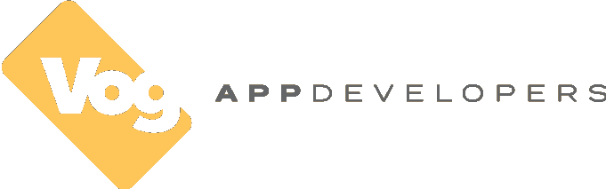

# 十大定制软件开发公司

> 原文：<https://blog.devgenius.io/top-10-custom-software-development-companies-fc62534e3bb2?source=collection_archive---------28----------------------->

几乎每个企业都想开发自己的软件，而且每年都很难找到合适的定制软件开发公司。它拥有您需要的技术专业知识，符合您的预算，值得您信赖。

我们准备了一份前 10 名定制软件开发公司的名单，以帮助您做出最佳和最快的选择来开发您的数字项目或定制移动/web 应用程序。

# 头号网络大师

> “他们真的很擅长把我的想法变成程序。” |在线教育平台 CEO

成立时间:2008 年|公司规模:250+ |国家/地区:波兰

Netguru 制造数字产品，让人们以不同的方式做事。作为一家公司，他们为顶级初创公司、财富 500 强公司和知名品牌提供数字产品，通过软件和产品设计帮助他们解决现实问题。他们的客户改变了人们办理银行业务、听音乐、学习语言和租赁自行车的方式。Netguru 产品已经在 TechCrunch、Business Insider 和 Product Hunt 上出现。

# 排名第二的 Developex

> *“在一家公司里找到他们这样水平的技术资源和优秀的客户服务是不寻常的。”*汽车之家技术公司总经理| Raili McIvor

成立时间:2001 年|公司规模:300+ |国家/地区:乌克兰

developerx——一个软件专业人员团队，拥有 19 年的历史和丰富的软件开发和产品开发经验。

Developex 通过雇佣和指派合格的团队来为客户的项目提供开发服务。他们的使命和最终目标是提供最有效的软件开发团队。他们相信他们的经验、方法和最重要的人，使他们成为您定制软件开发项目的最佳选择。

# #3 近代的

> *“所有交付都是按计划高质量完成的。”*Egain International 团队负责人| Christofer Olsson Kedborn

成立时间:2005 年|公司规模:50–249 |国家/地区:波兰

neo tropic 是那些想要创新的人的技术伙伴。接触顶级软件工程师，启动您的项目，并开始构建您的成功案例。

无论你是想制造一个新产品，开发一个现有的产品，还是将人工智能引入你的业务，Neoteric 都会帮助你。你可以在任何需要的时候和开发你产品的开发人员交谈，感觉就像他们坐在隔壁一样——即使是在不同的时区。

# #4 扫描

> 高水平的技术技能和出色的沟通技巧给我留下了深刻的印象软件解决方案提供商总经理

成立时间:2000 年|公司规模:250–999 |国家/地区:白俄罗斯

Scand 是一家定制软件开发公司，位于东欧中心的白俄罗斯明斯克。20 多年的 IT 经验，为全球数百家客户成功实施了 600 多个项目，拥有 250 多名经验丰富的工程师。

该公司提供外包服务，主要专注于软件应用和产品开发。NET、Java、PHP、C/c++等技术。

# 排名第五的 GoodCore 软件

> *“我从头到尾都很开心。”*golf catch 创始人|迈克·海斯

成立时间:2005 年|公司规模:50–249 |国家/地区:英国

GoodCore 为初创企业和成熟企业提供软件开发服务。他们的团队以敏捷的方式工作，并提供了卓越的性价比。创新的功能丰富的应用程序、定制的操作软件等等。

GoodCore 提供了一个协作的固定成本和有时间限制的发现阶段，以帮助您从设计和技术角度完善您的想法和要求。

# #6 缩放焦点

> *“两个团队之间的沟通和协作从一开始就非常成功。”*阿尔奇诺数字有限公司项目和运营经理| Peter van 't Hoogerhuys

成立时间:2012 年|公司规模:250–999 |国家/地区:保加利亚

ScaleFocus 是一家全球 IT 解决方案交付中心，致力于通过软件创新推动客户成功。他们在云运营、数据管理、智能自动化和数字化转型领域打造卓越的技术。ScaleFocus 成立于 2012 年，其愿景是成为东欧最具创新性的软件解决方案公司。如今，他们持续发展，专注于 IT 咨询服务以及 IT 和数字业务转型软件平台的开发。

# #7 祭坛. io

> *“他们有一个非常广泛和强大的专业网络，非常关心人们。”*数据仓库高级专家项目经理| Peter Müller

成立时间:2015 年|公司规模:10–49 |国家/地区:葡萄牙

Altar.io 是一家屡获殊荣的产品和软件开发公司，致力于在 Web、移动和云领域提供端到端的 IT 服务。从开始，UX/用户界面设计，开发到软件部署。祭坛已经成功地帮助世界各地的企业家和商业领袖破坏他们的行业。

# 排名第八的达纳韦罗公司。

> *“Danavero Inc .在快速转型方面做得非常好。我肯定会再次与他们合作。”*贸易路线| Aidan Slack-Watkins 首席执行官

成立时间:2015 年|公司规模:50–249 |国家/地区:加拿大

Danavero Inc .是一家经验丰富的软件开发、工程和咨询解决方案提供商，致力于客户业务流程的改进和持续成功。Danavero 开发团队拥有不同的技术和经验，他们与客户一起完成任何困难的任务。对于开发过程，他们使用敏捷和 Scrum 方法。Danavero 提供网站、web 应用程序和 CMS 开发，利用他们的全球经验并遵循最佳实践。

# #9 Vog 应用开发者

> “他们努力工作，聪明，善于沟通。”西福蒂眼睛游戏有限公司首席执行官|顿切尔·德尼兹

成立时间:2012 年|公司规模:10–49 |国家/地区:加拿大

Vog App Developers 是一家创意开发公司，致力于开发强大的 iOS 和 Android 移动应用、定制软件应用和企业软件。Vog 是一家自豪的加拿大公司，开发定制的软件应用程序，用于确定成本优先级、分析和降低风险、降低故障率、监控进度、最大化回报、优化流程和提高运营效率。在 Vog，他们与一个由 iOS、Android 和 Web 开发人员组成的优秀团队，以及渴望交付高效可靠软件的项目经理和项目协调员一起工作。

# # 10 Itransition

> “我对团队估算项目时间表的效率印象深刻。”供应链高级信用控制员&物流供应商

成立时间:1998 年|公司规模:1000–9999 |国家/地区:美国

Itransition 是一家值得信赖的全球软件开发公司，拥有 20 多年的专业经验。他们为来自 30 多个国家的客户提供全方位的软件咨询和开发服务。2000 多名不同的 IT 专业人员拥有强大的技术技能和业务知识以及成熟的方法，使他们能够有效地处理任何规模和复杂性的软件项目。

编辑了顶级定制软件开发公司的列表后，我们已经收集了所有的细节来为您选择最佳的合作伙伴。现在你可以选择任何一家符合你的业务要求并且在你预算范围内的公司。