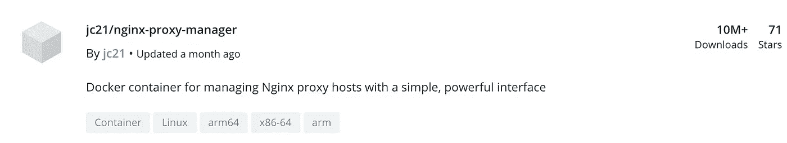

# 开发中绝对程序员的 10 大 Docker 容器

> 原文：<https://blog.devgenius.io/top-10-docker-container-you-never-know-to-use-2a63569f1a18?source=collection_archive---------13----------------------->


# 1.NGINX

Nginx(发音为“engine-x”)是一个用于 HTTP、HTTPS、SMTP、POP3 和 IMAP 协议的开源反向代理服务器，以及一个负载平衡器、HTTP 缓存和一个 web 服务器(源服务器)。Nginx 项目从高度关注高并发性、高性能和低内存使用开始。它是在类似 BSD 的 2 条款许可下授权的，可以在 Linux、BSD 变体、Mac OS X、Solaris、AIX、HP-UX 以及其他*nix 版本上运行。它还有一个用于 Microsoft Windows 的概念验证端口。

```
docker run --name nginx -v /some/content:/usr/share/nginx/html:ro -d nginx
```


[https://hub.docker.com/_/nginx](https://hub.docker.com/_/nginx)

# 2.便携式集装箱

***Portainer*** 是一个轻量级的管理 UI，允许你**轻松**管理你的 Docker 主机或者 Swarm 集群。

***Portainer*** 旨在像使用时一样**简单**部署。它由一个可以在任何 Docker 引擎上运行的容器组成(支持 Docker for Linux 和 Docker for Windows)。

***Portainer*** 允许你管理你的 Docker 栈、容器、图像、卷、网络等等！它与*独立 Docker* 引擎和 *Docker Swarm* 兼容。

```
$ docker volume create portainer_data
$ docker run -d -p 9000:9000 -p 8000:8000 --name portainer --restart always -v /var/run/docker.sock:/var/run/docker.sock -v portainer_data:/data portainer/portainer
```


[https://hub.docker.com/r/portainer/portainer](https://hub.docker.com/r/portainer/portainer)

# 3.Gitlab

GitLab 社区版是开源和免费的——这个版本已经过时，不再受 GitLab 支持。最新图片请看[https://hub.docker.com/r/gitlab/gitlab-ce](https://hub.docker.com/r/gitlab/gitlab-ce)。

```
docker run --detach \   
--hostname gitlab.example.com \   
--publish 443:443 --publish 80:80 --publish 22:22 \   
--name gitlab \   --restart always \   
--volume $GITLAB_HOME/config:/etc/gitlab \   
--volume $GITLAB_HOME/logs:/var/log/gitlab \   
--volume $GITLAB_HOME/data:/var/opt/gitlab \   gitlab/gitlab-ce:latest
```


[https://hub.docker.com/_/gitlab-community-edition](https://hub.docker.com/_/gitlab-community-edition)

# 4.设计者

Composer 是 PHP 中的依赖管理工具，用 PHP 编写。它允许你声明你的项目所依赖的库，它将为你管理(安装/更新)它们。

你可以在我们的官方文档中阅读更多关于 Composer 的内容。

```
$ docker run --rm --interactive --tty \
  --volume $PWD:/app \
  composer install
```


[https://hub.docker.com/_/composer](https://hub.docker.com/_/composer)

# 5.NGINX 代理管理器

这个项目是一个预建的 docker 映像，使您能够轻松地转发到您在家里或其他地方运行的网站，包括免费的 SSL，而不必了解太多关于 Nginx 或 Letsencrypt 的信息。

```
docker run -d \
    --name=nginx-proxy-manager \
    -p 8181:8181 \
    -p 8080:8080 \
    -p 4443:4443 \
    -v /docker/appdata/nginx-proxy-manager:/config:rw \
    jlesage/nginx-proxy-manager
```



[https://hub.docker.com/r/jlesage/nginx-proxy-manager](https://hub.docker.com/r/jlesage/nginx-proxy-manager)

# 6.关系型数据库

MySQL 是世界上最流行的开源数据库。凭借其成熟的性能、可靠性和易用性，MySQL 已成为基于 web 的应用程序的领先数据库选择，涵盖了从个人项目和网站，通过电子商务和信息服务，一直到包括脸书、Twitter、YouTube、Yahoo！还有很多。

有关 MySQL 服务器和其他 MySQL 产品的更多信息和相关下载，请访问[www.mysql.com](http://www.mysql.com/)。

```
$ docker run --name some-mysql -e MYSQL_ROOT_PASSWORD=my-secret-pw -d mysql:tag
```


[https://hub.docker.com/_/mysql](https://hub.docker.com/_/mysql)

# 7.詹金斯

詹金斯持续集成和交付服务器。

这是一个全功能的 Jenkins 服务器，基于长期支持版本[http://jenkins.io/](http://jenkins.io/)。

如需每周发布，请查看`[jenkinsci/jenkins](https://hub.docker.com/r/jenkinsci/jenkins/)`

```
docker run --name myjenkins -p 8080:8080 -p 50000:50000 -v /var/jenkins_home jenkins
```


[https://hub.docker.com/_/jenkins](https://hub.docker.com/_/jenkins)

# 8.雷迪斯

Redis 是一个开放源代码、网络化、内存中的键值数据存储，具有可选的持久性。是用 ANSI C 写的，Redis 的开发是今天 Redis 实验室赞助的；在此之前，它是由 Pivotal 和 VMware 赞助的。根据 DB-Engines.com 的月度排名，Redis 是最受欢迎的键值存储。Redis 这个名字的意思是远程字典服务器。

```
$ docker run --name some-redis -d redis
```


[https://hub.docker.com/_/redis](https://hub.docker.com/_/redis)

# 9.RABITMQ

RabbitMQ 是实现高级消息队列协议(AMQP)的开源消息代理软件(有时称为面向消息的中间件)。RabbitMQ 服务器是用 Erlang 编程语言编写的，构建在用于集群和故障转移的开放电信平台框架上。用于与代理交互的客户端库可用于所有主要的编程语言。

```
$ docker run -d --hostname my-rabbit --name some-rabbit rabbitmq:3
```


[https://hub.docker.com/_/rabbitmq](https://hub.docker.com/_/rabbitmq)

# 10.超文字传输协定常驻程式(Hyper Text Transfer Protocol Daemon)

Apache HTTP Server，俗称 Apache，是一个 Web 服务器应用程序，它在万维网的最初发展中发挥了重要作用。最初基于 NCSA HTTPd 服务器，Apache 的开发始于 1995 年初，在 NCSA 代码的工作停滞后。Apache 很快取代 NCSA HTTPd 成为占主导地位的 HTTP 服务器，并且自 1996 年 4 月以来一直是最流行的 HTTP 服务器。

> [*wikipedia.org/wiki/Apache_HTTP_Server*](http://en.wikipedia.org/wiki/Apache_HTTP_Server)

```
$ docker run -dit --name my-apache-app -p 8080:80 -v "$PWD":/usr/local/apache2/htdocs/ httpd:2.4
```


[https://hub.docker.com/_/httpd](https://hub.docker.com/_/httpd)

最少设置的 docker。