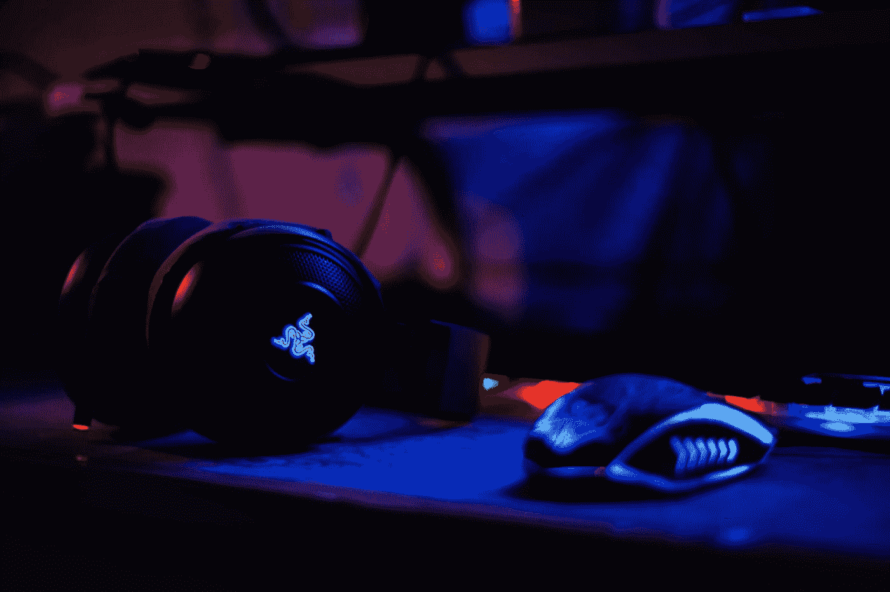
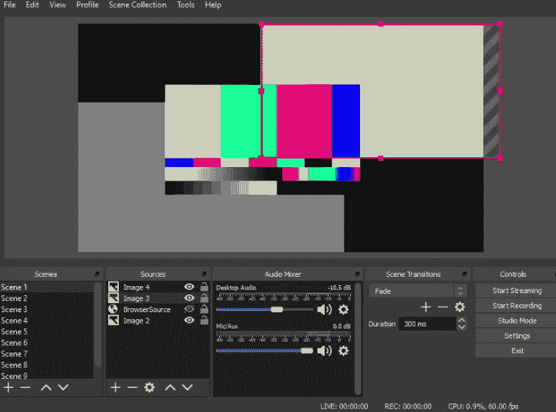
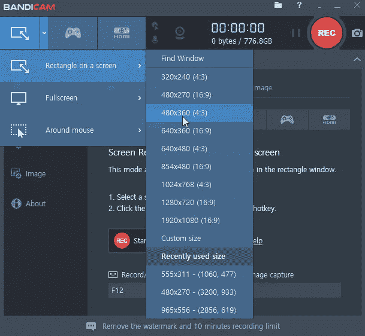
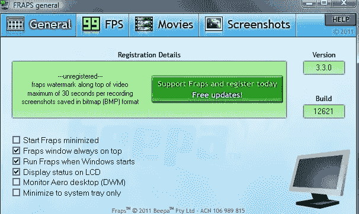
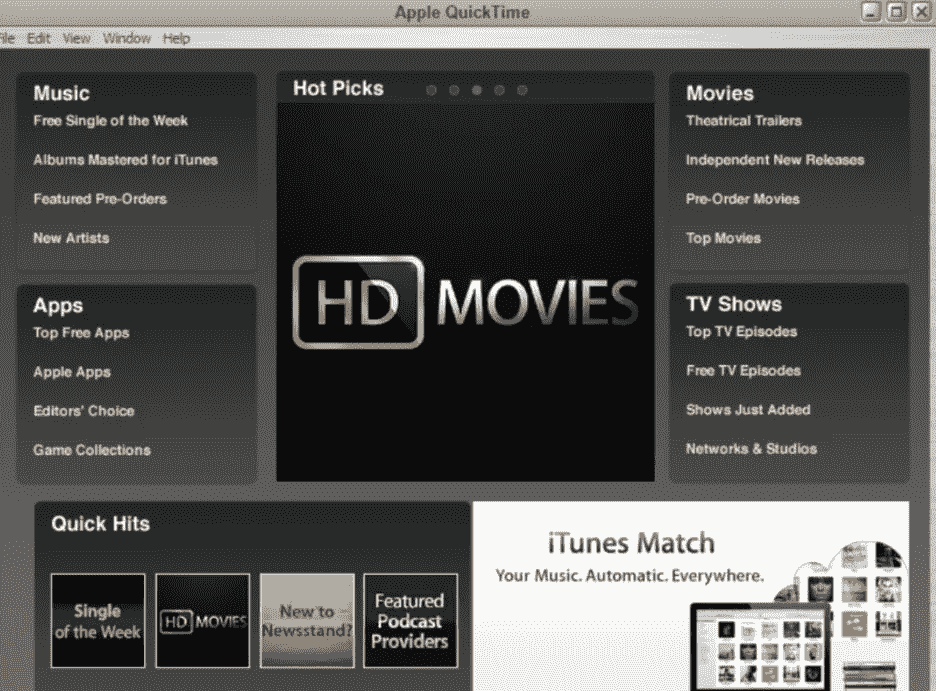
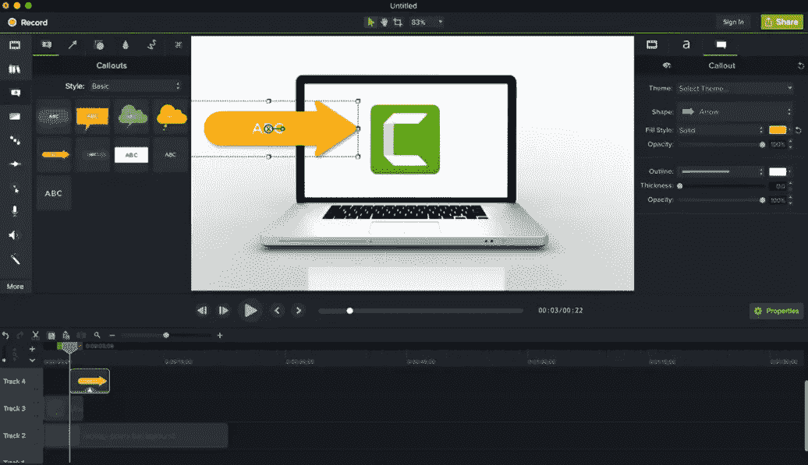
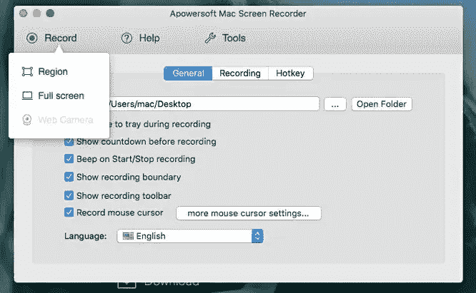

# PC 顶级游戏录制软件:Win & Mac

> 原文：<https://blog.devgenius.io/top-10-game-recording-software-for-pc-win-mac-4f470cf566ad?source=collection_archive---------7----------------------->

做 YouTube 或任何其他项目的视频录制并不总是一个容易的项目，你需要指导以获得最佳结果。我在这里告诉你，你需要这些程序中的哪些程序才能在 PC 或 Mac 上录制游戏。我已经多次使用这些程序，我知道根据你的需要向你推荐什么。让我们从 PC 的游戏录制软件开始吧。

照片由 [Unsplash](https://unsplash.com?utm_source=medium&utm_medium=referral) 上的[法兹利·沙阿](https://unsplash.com/@fazlyshah?utm_source=medium&utm_medium=referral)拍摄

# 最佳游戏录制软件

照片由[卡斯帕·卡米尔·鲁宾](https://unsplash.com/@casparrubin?utm_source=medium&utm_medium=referral)在 [Unsplash](https://unsplash.com?utm_source=medium&utm_medium=referral) 上拍摄

你可能已经听说过其中的一些程序，但请记住它们更有效的用途。然后做出最吸引你的选择。

**1。开放式广播软件**

OBS 是一个流行的免费开源软件，可供专业人士和初学者使用。它简单直观的控制有助于用户进行令人印象深刻的视频录制以及实时流媒体功能。

您可以在您的 Linux、Mac 以及 Windows 系统上轻松下载该软件，因为它与所有这些顶级平台兼容。

该软件的一些令人难以置信的功能是:

*   高性能型实时音频和视频记录以及混合能力。
*   几乎没有直观的混音器，以及帮助快速过滤噪音的过滤器。它可以提高增益，同时抑制不需要的信号元素。
*   所有用户配置都是高级的，可以毫不费力地调整资源属性。

**2。Bandicam**

这是一个为游戏玩家设计的轻量级但直观的屏幕记录器。它有助于轻松录制高质量的桌面屏幕。用户还可以选择录制其桌面屏幕的特定部分，以创建令人印象深刻的教程。

Bandicam 的一些最受欢迎的特征是:

*   Bandicam 游戏捕获工具有足够的能力来记录游戏，与 fraps 一样，或者一些专业人士认为它甚至比 Fraps 更好。
*   与所有其他竞争软件相比，Bandicam 的视频文件通常较小。
*   用户可以享受连续 24 小时的录制。它也可以在自动完成记录设备的帮助下完成。
*   该软件程序允许录制 4K 超高清类型分辨率的视频，文件大小高达 3840 X 2160。
*   您可以直接录制游戏，进行网络摄像头录制，使用 HDMI 连接进行录制，或者直接使用 PC 屏幕控制。

**3。Fraps**

它被公认为是 Windows 平台的通用应用程序。用户可以在 OpenGL 和 DirectX 图形技术的帮助下录制令人印象深刻的游戏视频。

Fraps 推出了一个新版本，这使得游戏录制更加容易。这可能是大多数专业人士喜欢它的最重要的原因。

几个突出的特点是:

*   它可以帮助用户在录制游戏视频时获得每秒一帧的完整信息。
*   这是一种实时先进的录音软件，可以捕捉音频以及视频与惊人的质量。使用 Fraps 创建的教程在游戏世界中更受欢迎，因为这里的帧速率也可以在 1 到 120 fps 的范围内定制。

# Mac 最佳游戏录制软件排行榜

[自由股](https://unsplash.com/@freestocks?utm_source=medium&utm_medium=referral)在 [Unsplash](https://unsplash.com?utm_source=medium&utm_medium=referral) 上的照片

Mac 用户没有 PC 用户那么多选择，但他们肯定有办法从他们的机器上录制游戏。以下是你能在苹果电脑上使用的最好的软件。

**1。QuickTime**

QuickTime 也是一款流行的 Mac 录音软件。您可以轻松地为所有视频添加动态解说。

QuickTime player 提供的一些最佳功能有:

*   您可以在 Mac 平台上立即录制、播放、编辑、共享音频和视频文件。
*   它拥有所有先进的视频播放控制，如调节音量，快进，倒带，暂停，播放。
*   它还支持高级编辑功能，如翻转、旋转、删除、粘贴、复制、剪切、分割和修剪等。
*   你可以在 YouTube、隔空投送等社交媒体平台上直接分享视频，也可以通过短信或电子邮件分享。
*   它还允许用户将视频直接传输到 Apple TV。

**2。卡姆塔西亚工作室**

另一个流行的游戏录制软件是 Camtasia Studio，它支持 Mac 平台，具有直观的控制功能。专业人士说，这是一个很好的，易于使用的游戏记录工具。

它提供了一个非常顺利和轻屏幕录制。所有的视频都可以通过添加音乐和照片进行修改。您可以从多轨道类型的时间轴中受益，以拥有一个简单的视频录制设备，其中很少附加的虚拟效果包括绘图工具和视频模糊能力。

这款软件的完整版可从其官网获得，付费 299 美元。

**3。Apowersoft Mac 屏幕记录器**

Apowersoft Mac Screen Recorder 是一款拥有所有高级录制功能的专业工具。它有一个智能任务调度器，电源视频转换器，等等。游戏玩家可以享受在系统的整个屏幕上或屏幕的定制位置上工作的快速截屏功能。如果你需要一个简单的网络摄像机记录，那么 Apowersoft 可以帮助你轻松设置。

关于这款游戏录制软件工具，最值得一提的是它的画中画录制功能，可以与网络摄像头配合使用，生成令人惊叹的图像。

