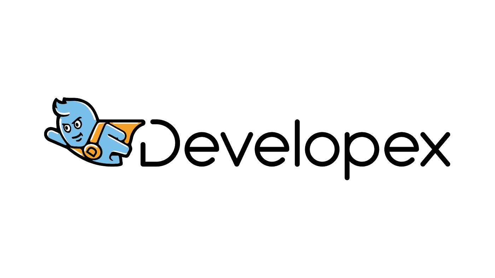

# 十大移动应用开发公司

> 原文：<https://blog.devgenius.io/top-10-mobile-app-development-companies-f46c9fce244?source=collection_archive---------42----------------------->

现在，移动应用服务于各种目的，智能手机用户的数量逐年增加。因此，为你的业务投资一个移动应用程序可能有助于吸引更多的客户，并让更多的人看到你的产品。

为了帮助您寻找可靠的合作伙伴，我们挑选了最能满足贵公司需求的顶级移动应用开发公司。

**# 1**[米奎多 ](https://www.miquido.com/about-us)

“他们积极进取的态度让我们觉得他们是我们内部团队的一员。”投资管理技术公司国家主管

成立时间:2011 年|公司规模:250+ |国家:波兰

Miquido 是一家人工智能软件设计和开发公司，擅长构建人工智能应用程序和网络服务。他们已经为音乐和视频流、电子商务、金融科技或医疗保健提供了 110 多种解决方案。

[**#2 Developex**](https://developex.com/)

*“他们之所以成功，是因为他们高度的诚信和对质量的高度承诺。”*Metric Insights 首席执行官| Marius Moscovici

成立时间:2001 年|公司规模:300+ |国家/地区:乌克兰

Developex 在所有现有平台的定制移动开发领域拥有卓越的专业知识。多年的经验，70 多个成功完成的移动项目，在聚集有效的移动开发团队方面的丰富经验，以及针对每个特定客户需求的定制方法，使他们成为您下一个移动项目的良好选择。

[**#3 Promatics 技术**](https://www.promaticsindia.com/about-us/)

Promatics 如此迅速地理解了我的需求，这给我留下了深刻的印象 event mploy 总监| Lisa Price

成立时间:2008 年|公司规模:250+ |国家/地区:印度

Promatics Technologies 是一家领先的网络和移动应用开发公司。作为一个由 100 多名开发人员组成的经验丰富的团队，我们通过非常成熟和优化的参与和交付模型，为 web 和移动应用程序开发流程奠定了坚实的基础。

**#4** [**三叶草工作室**](https://clover.studio/approach/)

“他们一直在努力寻找改进的方法，让我们的产品更好。”社交平台首席执行官

成立时间:2008 年|公司规模:50+ |国家/地区:克罗地亚

Clover Studio 专注于企业或初创企业产品的创新移动和网络解决方案，拥有超过 10 年的行业经验。他们是您的技术合作伙伴，是一个虚拟团队，利用在 70 多个项目中获得的知识，为您的企业提供最佳应用。

[**#5 橙软**](https://orangesoft.co/about)

*“他们非常灵活，能适应我们有时相当不寻常的需求和情况。”*康巴多首席执行官|迈克尔·森德

成立时间:2011 年|公司规模:250+ |国家:白俄罗斯

Orangesoft 使用专注于构建 Orangesoft 的最新技术创建出色的移动和网络应用程序，orange soft 是一个由 80 多名开发人员、设计师、分析师、策略师和 QA 工程师组成的聪明团队，他们不仅提供高效的应用程序，还创新商务人士的思维方式。

**#6** [**敏捷应用精灵**](https://www.nimbleappgenie.com/)

“项目的每一步，我都很放心，一切都在他们的掌控之中。”韦德地产首席执行官|纳撒尼尔·韦德

成立时间:2017 年|公司规模:50+ |国家:英国

Nimble AppGenie 在移动和 web 应用程序开发方面拥有超过 4 年的丰富经验，是全球公认的屡获殊荣的移动应用程序开发公司。Nimble AppGenie 致力于通过提供一流的解决方案和利用最新技术来提高您的用户参与度和品牌认知度，从而满足客户的需求。

**# 7**[**Ars Futura**](https://arsfutura.com/about)

他们的灵活性、沟通能力，最重要的是，他们的技术水平给我们留下了深刻的印象创始人之一，伪造者|亚历山大·诺伦

成立时间:2013 年|公司规模:50+ |国家:克罗地亚

Ars Futura 是一家位于克罗地亚萨格勒布的设计和开发机构。他们将定制的高质量产品带入生活。他们的服务范围从移动和网络开发、产品管理、设计到商业咨询。Ars Futura 作品兼收并蓄，来自物联网、医疗保健、游戏、通信和商业解决方案等行业。

[**【8 # merix studio**](https://www.merixstudio.com/about/)

“我们现在能够在几天内推出新产品。”市警察局长，陋居

成立时间:1999 年|公司规模:250+ |国家/地区:波兰

Merixstudio 的主要专长是交付高质量、高性能的网络应用和跨平台移动应用。根据客户的需求，他们可以在端到端产品开发中为客户提供支持，或者无缝扩展他们的内部工程师团队。

**#9** [**昆比**](https://www.koombea.com/about/)

随着时间的推移，他们已经成为战略盟友，而不仅仅是服务提供商 Nauty360 首席执行官

成立时间:2007 年|公司规模:250+ |国家/地区:美国

Koombea 是一家软件开发公司，专门为初创企业和企业构建世界级的移动、web 和混合应用程序。他们一直在使用自己定制的敏捷开发来打造创新的数字体验

**#10** [**辣椒实验室**](https://chililabs.io/en/about-us)

*“与 Chili Labs 合作开发一款应用程序是我迄今为止最棒的经历。”*清醒梦初创公司创始人|汤姆·扬科维奇

成立时间:2015 年|公司规模:50+ |国家:拉脱维亚

Chili Labs 的每一个人和每一件事都受到对移动应用、可穿戴设备、人工智能、增强现实和所有其他最新技术的热情的驱动。我们的核心使命是在与我们合作的优秀公司之间建立多年的牢固关系。

现在你可以选择任何一家符合你的业务要求并且在你预算范围内的公司。