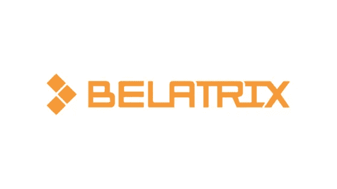
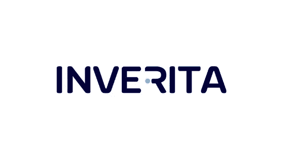
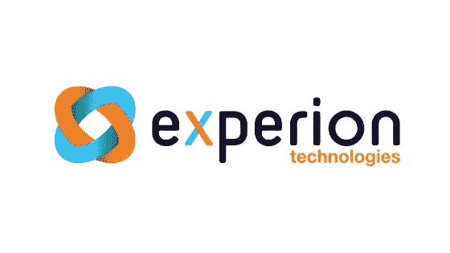
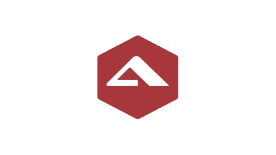
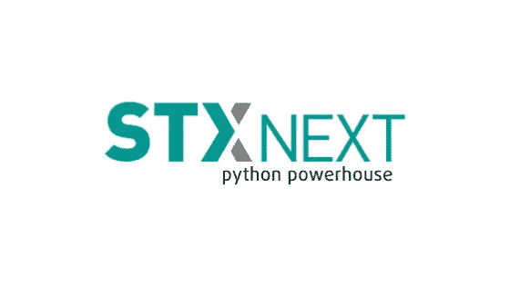
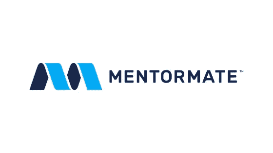
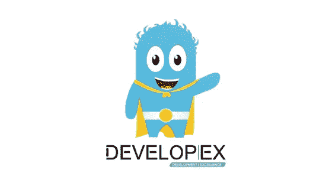
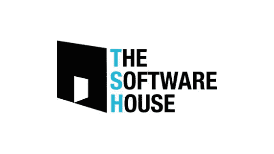
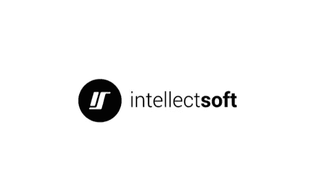

# 十大离岸软件开发公司

> 原文：<https://blog.devgenius.io/top-10-offshore-software-development-companies-78e67b80895a?source=collection_archive---------4----------------------->

随着软件和移动应用的兴起，组织的数字化存在至关重要。此外，企业如何跟上数字化时代是他们面临的最大挑战之一。保持竞争力的最佳方式是不断重新开发现有软件或创建最新的解决方案。它允许公司拥有不间断的强大的数字存在。

我们选择了顶尖的离岸软件开发公司来帮助您寻找合作伙伴。

## [**#1 贝拉特里克斯**](https://www.belatrixsf.com/about-us/)

“他们非常尊重我们的要求，并继续妥善管理项目。”Mutare 软件产品开发总监| Brian McDonald

成立时间:2003 年|公司规模:700+ |国家:阿根廷

通过在阿根廷、秘鲁和哥伦比亚的工程中心， [Belatrix](https://www.belatrixsf.com/about-us/) 为财富级公司和新兴风险投资公司提供软件开发解决方案。这家软件开发公司提供端到端软件和移动应用开发服务，即软件开发和测试、云服务、咨询和 UX。该公司的成功案例包括金融科技、媒体和娱乐、医疗保健、高科技、能源和其他行业的项目。敏捷方法和设计思维模式是帮助减少客户资源的主要公司实践。

## [**#2 inVerita**](https://clutch.co/profile/inverita)

"不管我们有什么问题，他们总能想出解决办法."爱国者运输公司运营经理| Roman Zabolotovskyy

成立时间:2015 年|公司规模:100+|国家:乌克兰

[inVerita](https://clutch.co/profile/inverita) 成立于 2015 年，是一家基于价值观的定制软件公司，总部位于利沃夫。该公司非常注重构建 web。NET/Node.js/JavaScript)、移动解决方案(Flutter、Native、React-native)、QA，以及为客户提供团队扩展服务。最重要的是，inVerita 重视与员工和客户的关系，并拥有多年的客户。他们的第一批客户之一埃里克·艾特尔(Eric Eitel)说:“他们的公司文化健康、定义明确，员工有个性、正直。”inVerita 为各种行业提供软件开发服务，包括零售、教育、金融科技、医疗保健、物流等。

## [**#3 实验**](https://www.experionglobal.com/?utm_source=themanifest.com&utm_medium=referral&utm_campaign=directory)

"他们非常愿意做出额外的努力，使我们的合作关系能够成功。"制药公司信息技术副总裁

成立时间:2006 年|公司规模:550+ |国家/地区:印度

自成立以来，该公司已获得行业认可，并为全球 130 多家金融、零售、供应链和医疗行业的客户提供服务。Experion 提供的主要服务包括应用开发和维护、独立验证、应用现代化、技术咨询、开发运维、商业智能和分析。

## [**#4 阿尔托罗斯**](https://www.altoroslabs.com/?utm_medium=cpc&utm_source=clutch&utm_campaign=dtbl_software_development_clutch_general_search_acq&utm_content={adgroupid}&utm_term={keyword}&match={matchtype}&device={device})

"他们技术娴熟，掌握最新技术."OneSpan | Jean-Philippe Cavallo R&D 总监

成立时间:2001 年|公司规模:400+ |国家:阿根廷

成立于 2001 年的[公司](https://www.altoroslabs.com/?utm_medium=cpc&utm_source=clutch&utm_campaign=dtbl_software_development_clutch_general_search_acq&utm_content={adgroupid}&utm_term={keyword}&match={matchtype}&device={device})为各种规模的多个行业制造创新产品。他们专注于定制软件开发和产品开发、云原生开发、区块链解决方案、人工智能和机器学习。该公司在为金融和医疗保健行业提供定制金融软件解决方案以及广泛的技术堆栈方面拥有业经验证的专业知识。

## [**#5 像素蜡笔**](https://www.pixelcrayons.com/)

"他们对工作的奉献精神非常突出。"Medisoft 公司项目经理| Ruchika Aggarwal

成立时间:2004 年|公司规模:500+ |国家/地区:印度

总部位于印度的一家屡获殊荣的 IT 咨询和外包公司提供定制软件开发服务、移动应用程序开发和 web 开发服务。该公司还专门从事电子商务开发、产品工程、机器学习、DevOps 解决方案和聊天机器人开发。 [Pixelcrayons](https://www.pixelcrayons.com/) 为医疗保健、旅游、银行、教育和媒体提供软件开发服务。

## [**#6 STX 下一个**](https://stxnext.com/?utm_source=clutch&utm_medium=referral&utm_campaign=developers-poland)

"他们使得软件开发过程更加透明和可预测."研究公司数字产品主管

成立时间:2005 年|公司规模:350+ |国家:波兰

[该公司](https://stxnext.com/?utm_source=clutch&utm_medium=referral&utm_campaign=developers-poland)使用 Python Django、Flask、Twisted、Angular、ReactJS、React Native 等为各行各业的客户提供全栈 web 开发和跨平台移动应用解决方案。在他们提供的服务中，您会发现原型制作、发现研讨会和解决方案架构等独立服务。

## [**#7 曼托玛特**](https://mentormate.com/?utm_source=clutch.co&utm_medium=platinum-sponsor&utm_campaign=clutch&utm_content=company-profile)

" MentorMate 从一开始就能够准确地为作品报价."blackriver.cc 创始人兼首席执行官| Eric Lynn

成立时间:2001 年|公司规模:250+ |国家:保加利亚

这家保加利亚软件开发公司主要专注于战略咨询、用户体验、云服务、web 和移动开发以及质量保证。寻求长期合作关系的小型和大型企业都可以依靠该公司提供的稳定方法。Mentormate 的投资组合包括为制造业、生活方式、农业、教育、医疗保健和金融行业开发的项目。

## [**#8 Developex**](https://developex.com/)

“在一家公司中发现他们的技术资源水平和出色的客户服务是不寻常的。”汽车技术公司总经理| Raili McIvor

成立时间:2001 年|公司规模:300+ |国家/地区:乌克兰

拥有 18 年的历史和丰富的开发经验，[developerx](https://developex.com/)在世界各地拥有许多客户和合作伙伴。该公司提供 UI/UX 开发服务、移动应用程序开发、桌面和 web 应用程序开发服务、嵌入式软件开发。开发人员在消费电子软件、游戏控制软件、音频和 PC 外围设备方面也有很强的技能和专业知识。

## [**【9 号软件屋**](https://clutch.co/profile/software-house)

“没有软件公司，我们就无法向客户交付高质量的工作。”部门主管，敬业度百分比|亚当·库珀

成立时间:2012 年|公司规模:150+ |国家:波兰

软件公司位于波兰格利维采，是一家软件开发机构，专门为中小型企业开发定制软件(Node.js，Javascript)。到目前为止，这家开发公司的投资组合中有 100 多个不同的项目。

## [**#10 智软**](https://clutch.co/profile/intellectsoft)

"他们是一家专业的、成熟的公司，拥有企业背景和核心开发团队."投资发展总监| Sam Prasad

成立时间:2007 年|公司规模:200+ |国家/地区:乌克兰

这家公司帮助财富 500 强公司和其他国际客户开发定制软件解决方案。Intellectsoft 主要专注于认知计算、去中心化应用、物联网、卓越客户体验和 AR/VR。Intellectsoft 在美国、英国和东欧设有办事处和工程中心，为汽车、金融科技、建筑、医疗保健、零售和保险行业提供服务。

# **总结**

我们编制了一份离岸软件开发公司的名单，这些公司为不同类型的企业和领域方向提供高质量的软件开发服务。通过访问这些公司的网站，您将能够找到每个供应商的更多详细信息。祝您选择最适合您业务的产品！