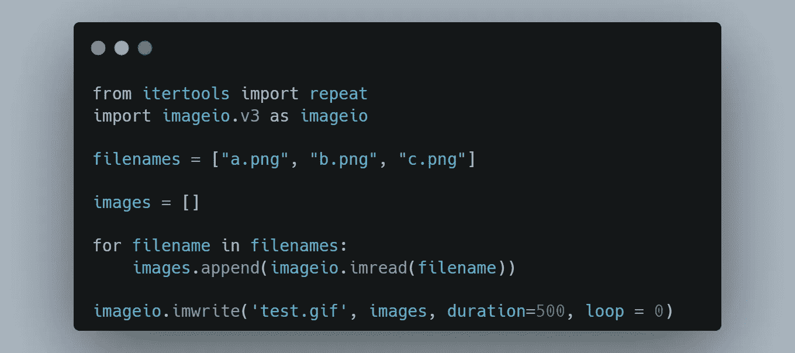

# 实现工作自动化的 10 大 Python 代码

> 原文：<https://blog.devgenius.io/top-10-python-code-to-automate-your-work-2293f9b4b2e2?source=collection_archive---------9----------------------->

在 [Unsplash](https://unsplash.com?utm_source=medium&utm_medium=referral) 上 [Sai Kiran Anagani](https://unsplash.com/@anagani_saikiran?utm_source=medium&utm_medium=referral) 拍摄的照片

Python 是最流行的语言之一。所有程序员都喜欢它的简单性和易读性。

以下是**让你的工作自动化的 10 大 Python 代码**——找一份你喜欢的工作！

1.  **Gif 创作。(** [**源代码**](https://gist.github.com/alexmurphas8/10c0cb503f5c2f914b27029a93cc9b72) **)**

> pip3 安装映像 io
> https://pypi.org/project/imageio/

**→ Imageio** 是一个 python 库，它提供了一个简单的接口来读写各种图像数据，包括动画图像、体积数据和科学格式。它是跨平台的，运行在 Python 3.5+上，易于安装。

**2。获取位置信息(** [**源代码**](https://gist.github.com/alexmurphas8/de056ef9bb4fcbda1031517afd1c21bd) **)**

> *pip3 安装地质球* [https://pypi.org/project/geopy/](https://pypi.org/project/geopy/)

→ **Geopy** 是一个 python 库，使用第三方地理编码器和其他数据源，Python 开发人员可以轻松定位全球各地的地址、城市、国家和地标的坐标。

输出:→

**3。将视频文件转换成 Gif (** [**源代码**](https://gist.github.com/alexmurphas8/2930e78be3417743b9c20cb13a7d51cc) **)**

> pip3 安装 https://pypi.org/project/moviepy/电影
> T43

→ **MoviePy** 是一个用于视频编辑的 python 库:剪切、拼接、标题插入、视频合成

**4。生成图像验证码** [**(源代码)**](https://gist.github.com/alexmurphas8/46e70e302d4a916640a38d42ec7c328d)

> pip3 安装验证码
> https://pypi.org/project/captcha/

→生成音频和图像验证码的验证码库。

输出:→

**5。图像水印** [**(源代码)**](https://gist.github.com/alexmurphas8/ac549f641ceef7dd349e08a6b66abd23)

> pip3 安装枕头
> https://pypi.org/project/Pillow/

→ Python 图像库(PIL 的扩展)是 Python 语言事实上的图像处理包

**6。网址缩写** [**(源代码)**](https://gist.github.com/alexmurphas8/9406e97e51791c2abceadf58fb3bb855)

> pip3 安装 pyshorteners
> [https://pypi.org/project/pyshorteners/](https://pypi.org/project/pyshorteners/)

→一个简单的 URL 缩短 API 包装器 Python 库。

输出:→

[https://tinyurl.com/2mmgrnp7](https://tinyurl.com/2mmgrnp7)

7。桌面通知( [**源代码**](https://gist.github.com/alexmurphas8/0ea1cf9303cd05392bc5e35803bcd812) **)**

> pip3 安装 plyer
> https://pypi.org/project/plyer/

→ Plyer 模块用于访问硬件的功能。

输出:→

**8。截图(** [**源代码**](https://gist.github.com/alexmurphas8/68ac0a1a3c9b29f6f4e5888ee0a064d2) **)**

> pip3 安装 PyAutoGUI
> [https://pypi.org/project/PyAutoGUI/](https://pypi.org/project/PyAutoGUI/)

→它有助于截图和自动按键和鼠标点击编程。

**9。打开网页浏览器(** [**源代码**](https://gist.github.com/alexmurphas8/9fc4fac5e4c987c9e04aa6ae884c2bb0) **)**

→用于启动和远程控制网络浏览器的界面。

**10。解压文件(** [**源代码**](https://gist.github.com/alexmurphas8/b2bad3b502da751a6fb52c77d1901cd3) **)**

→压缩或解压缩文件。

## 如果这篇文章有帮助，请点击拍手👏按钮几下，以示你对作者的支持👇

请在[媒体](https://medium.com/@alexmurphyas8)上关注我，我会像上面一样发布有用的信息。

如果这篇文章对你有帮助，请鼓掌👏这篇文章。

insta gram→【https://www.instagram.com/alexmurphyas8/ 

推特→【https://twitter.com/AlexMurphyas8 

如果我做错了什么？让我在评论中。我很想进步。