# 提高 Android 项目构建速度的 10 大技巧

> 原文：<https://blog.devgenius.io/top-10-tips-to-improve-the-build-speed-of-your-android-projects-8526bcf97cd4?source=collection_archive---------0----------------------->

Android 项目开发速度慢意味着产品质量低。这种感觉类似于开着车在路上不停地撞一个又一个减速带。更快的开发速度对于获得对生产力至关重要的动力是必不可少的。但是如何提高 android 项目的开发速度呢？

答案很简单——实施我们在这篇博客中建议的技巧，你可以将开发构建时间增加四倍。这不过是一套 Android 最佳实践。为了展示实践的效果，我们将使用[谷歌的圣诞老人追踪器](https://santatracker.google.com/) Android 项目作为指导示例。但是在我们讨论技巧之前，请记住构建时间取决于项目特征和构建环境。

说到构建环境，有三种类型的构建场景，如下所示:

*   完整版本(干净的汇编调试版本)
*   增量构建:Java 变更(方法实现中的一行 Java 变更)
*   增量构建:资源更改(简单的添加或移除字符串资源)

# 提高 android 项目构建速度的最佳实践

# 技巧 1:使用最新的 Android Gradle 插件

我想给的第一个建议是使用最新的 Android Gradle 插件。android 团队努力修复所有错误，提高性能，并在每个新版本中添加新功能。所以你要确保你用的是最新版本的 Gradle。

结果

据从旧的 Gradle 插件 2.2.0 转换到 3.0-alpha1 的人说，他们注意到 38%的 Java 变化，16%的资源变化，和 25%的完整构建。

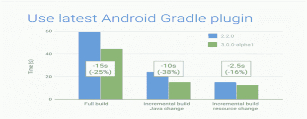

# 技巧 2:避免遗留的多索引

如果您的应用程序超出了 64K 方法的引用限制，您将需要一个 multidex。但是在您开始使用 multidex 之前，让我警告您，如果您的 minSDKVersion 低于 21，这意味着您将使用遗留版本。这会显著降低构建时间。如果你使用 Android Studio 2.3+那么它会自动避免这一点。

结果

使用 multidex 可以将构建时间从完全构建减少大约 5 秒，从增量 Java 更改减少大约 8 秒，并且增量资源不会发生任何更改。

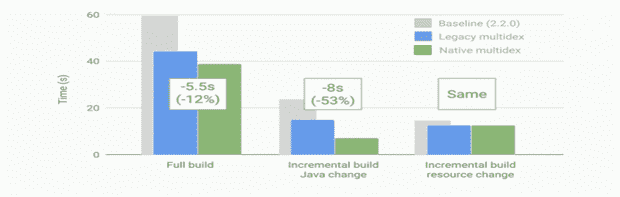

# 技巧 3:禁用多 APK

如果你想提高你的 android 构建时间，那么你可能想在你的开发构建中禁用多 APK。您可以通过使用领域特定语言(DSL)中的 Split 块来暗示这一点。当您创建多个 SDK 时，不需要定义维度，因此您在开发构建中不再需要多 APK。

但是，您不能直接从分割块中禁用多 APK 生成，因为该块对于包括生产和开发在内的所有构建变体都是全局的。您可以通过定义一个名为 devBuild 的属性来正确地做到这一点。如果 Gradle 看到属性并能够设置 splits.abi 和 splits。密度为假，那么你再也不用担心多 APK 代了。

结果

与其他建议类似，这个建议也将对整个构建时间产生良好的影响。

# 技巧 4:包含最少的资源

现在，如果你想改进你的 android 构建时间，那么我建议你应该减少你在 android 开发项目中打包的资源。默认情况下，系统会在您的应用程序或应用程序用来定义的库中添加每种语言和屏幕密度的资源。

在这里，如果你的 android 应用程序支持所有语言和屏幕密度，你将浪费大量的构建时间。在开发阶段，你几乎不会用到这些资源。

借助 resConfigs 关键字来解决这个问题，并定义在开发构建期间需要使用的语言和屏幕密度。例如，假设我们要使用英语；

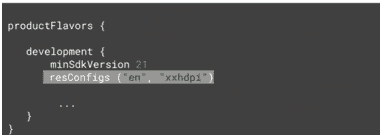

结果

根据试运行，在开发构建期间使用这种实践，您可以在全盲测试中节省 6 秒，在 Java 更改中节省 1.5 秒，在资源更改中节省 2 秒。

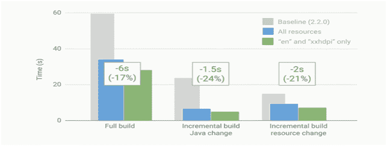

# 技巧 5:禁用 PNG 处理

我的下一个建议是也禁用 PNG 处理。要制作一个小的 APK，你的应用程序将压缩 PNG 以最小化它的大小。这是默认设置。现在，你可能会说，为什么禁用这样一个好东西，当它在你的 APK 发布时是有益的，那么我给你的答案是，它对开发构建没有好处。您可以使用我们在本文技巧 3 中讨论的相同属性来避免 PNG 崩溃。当 Gradle 看到该属性时，它会将 aaptOptions.cruncherEnabled 设置为 false。

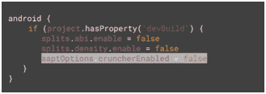

结果

当您禁用 PNG 处理时，它不会对 Java 更改和资源更改产生太大影响，但是它确实将整个构建时间减少了 9 秒。我不需要告诉你这种改善有多显著。

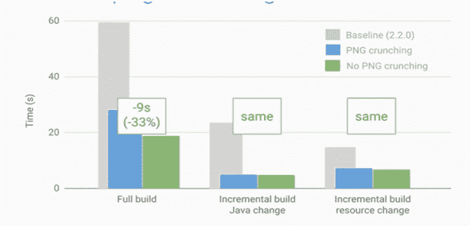

# 提示 6:使用即时跑步

Android Studio 2.0 提供即时运行，但它只能在 API 21 或更高版本中工作。但这并不意味着您可以将应用程序的 min SDK 设置得比这个低。这仅仅意味着运行即时运行的设备需要是 API 21 或更高版本。

现在，您可以使用 Android Studio 的几个按钮来控制应用程序重启的次数，如下所示:

*   Run 用于部署所有更改并重启应用程序。
*   应用更改用于更改您的资源和代码更改。您也可以使用它来仅重启活动，而不重启整个应用程序。

结果

在运行 Instant Run 之后，资源更改和 Java 更改减少了 3 秒，而在完整构建中减少了 7 秒。

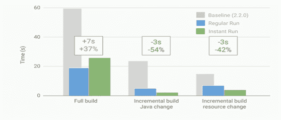

# 技巧 7:避免不经意的改变

虽然我不建议这样做，但有必要向您的 android 开发人员暗示这个技巧。您应该尽一切可能避免对项目进行不经意的更改。

程序员为了避免不经意的更改，会使用当前的日期时间作为应用程序的版本代码。因此，您将在每次构建时获得一个唯一的 ID，当质量保证团队发现一个 bug 时，他们可以知道它的具体构建。

虽然这听起来像是一件好事，但它确实迫使 android 开发人员对每个版本进行更改。结果呢？增加了 android 开发构建时间。但是，仍然可以看到程序员执行这种做法，以避免由于代码中发现的一些错误或病毒而导致的重大挫折。

# 技巧 8:不要使用动态版本的 Gradle

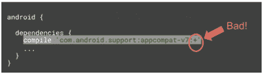

Gradle 提供了一种更舒适的方式，让你在(+)符号的帮助下使用最新版本的库。但是强烈建议您不要使用各种依赖关系的动态版本。现在，你使用它们不是很理想吗？

如果你使用动态版本，那么 Gradle 必须每 24 小时寻找任何给定库的最新版本。这应该会增加您的依赖性解决时间。这可能会对您的 android 应用程序的性能产生负面影响。因此，您需要做的是不要使用加号，而总是使用特定的依赖版本。

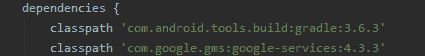

# 技巧 9:注意记忆

你的项目的特点很重要。每当你开始一个新的 android 项目，Android Studio 都会给 grad le 1.5 千兆字节的内存。对于开发构建来说，这既是一件好事，也是一件坏事。要解决这个问题，你必须在 Gradle.properties 文件中调整应用程序的设置，并选择对你的 android 应用程序有利的设置。

# 技巧 10:启用梯度缓存

如果我告诉你，你现在可以缓存每个任务的所有输出，会怎么样？是的，借助一种叫做梯度缓存的新的缓存机制，这是可能的。现在不要把它与 Gradle 2.3 中发布的构建缓存 Android 混淆，因为它只能缓存 pre-dex 外部库。

虽然 Gradle caching 有同样的高级机制，但它不仅适用于最后一次构建，还适用于您之前处理过的每一次构建，而且适用于任何位置。启用 Gradle 缓存也将启用分布缓存，因此当您更改本地分支或功能分支时，您可以加快 android 应用程序的构建时间。

但是如何执行 Gradle 缓存呢？如果你问，那么只需在你的 gradle.properties 文件中设置 org.gradle.caching=true。

结果

它对 Java 更改没有影响，但是它会稍微加快资源更改 0.5 秒，并通过减少 7 秒对完整构建产生巨大影响。

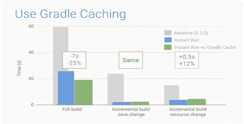

# 综合结果

看起来我们已经完成了。但是在我们离开之前，我需要你检查一下我在这个博客中向你建议的所有建议的集体结果。当我们综合这些结果时，我们得到了 3 倍的完整构建速度、12 倍的增量 Java 更改速度和 3 倍的增量资源更改速度。

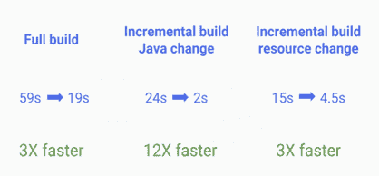

# 结论

在这篇博客中，我试图提供一些简单而有效的技巧和实践，你可以遵循它们来加快 android 项目的开发。我希望它们对你很有帮助。如果你认为你还有更多这样的建议，或者对我们在这里讨论的内容有任何疑问，那么请在下面的评论部分分享它们。我将感谢您的反馈。

## 更多相关链接:

[顶级安卓开发公司](https://medium.com/top-software-companies/top-android-app-development-companies-378c1f33e74e)

[顶级企业 App 开发公司](https://medium.com/top-software-companies/top-enterprise-app-development-companies-ec9d861094ba)

[顶级 ReactJS 开发公司](https://medium.com/top-software-companies/best-react-development-companies-693617a9bd25)

[顶级 AngularJS 开发公司](https://medium.com/top-software-companies/best-angular-development-companies-46ec6a03394d)

[顶级 NodeJS 开发公司](https://medium.com/top-software-companies/best-angular-development-companies-46ec6a03394d)

[英国顶级移动应用开发公司](https://medium.com/top-software-companies/top-mobile-app-development-companies-in-the-united-kingdom-f8dc0d83bc44)