# 提高生产力的 10 大 VS 代码扩展

> 原文：<https://blog.devgenius.io/top-10-vs-code-extensions-to-improve-your-productivity-856caba2b4fa?source=collection_archive---------1----------------------->

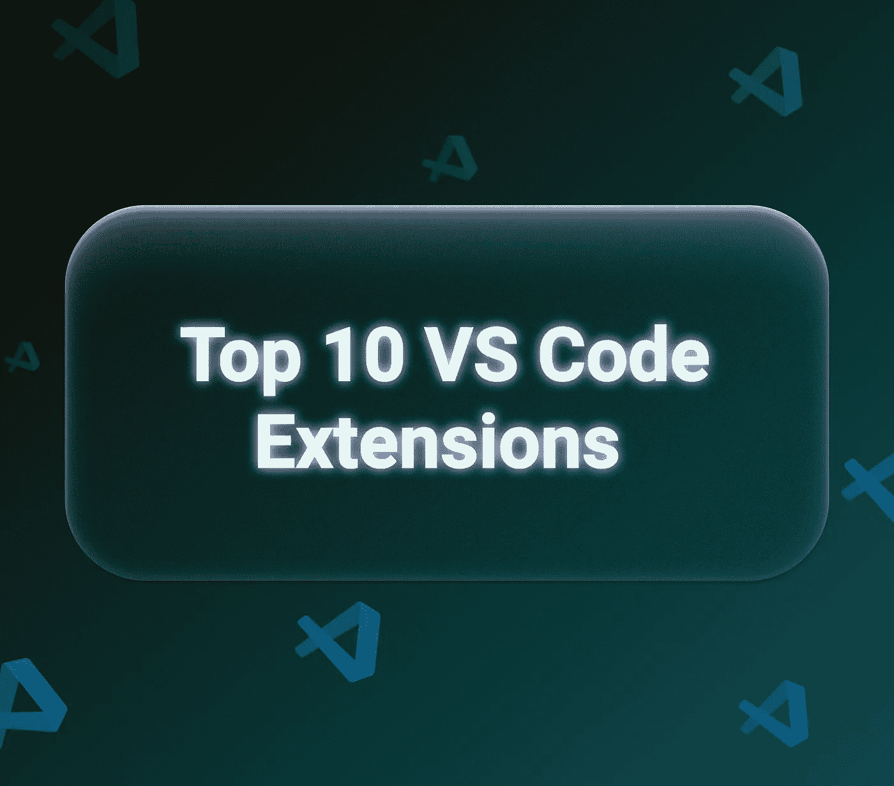

[Visual Studio Code](https://code.visualstudio.com) 是最受欢迎的代码编辑器之一。许多开发人员更喜欢它，因为它易于使用，并且包含许多有用的扩展，可以轻松优化您的工作。

有用的插件可以帮助你在编写代码时减少错误，并显著减少你的工作时间。要安装扩展，你需要去“扩展”标签，并使用搜索找到你需要的插件。

下面我编译了一些流行和有用的 VS 代码插件来提高你的工作效率。

## [Git 镜头](https://marketplace.visualstudio.com/items?itemName=eamodio.gitlens)

GitLens 扩展了 Visual Studio 代码中内置的 git 功能。该扩展具有大量的功能和灵活的设置。一键即可逐行获取作者、注释等信息。

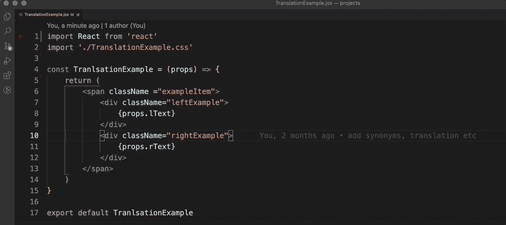

## [**自动重命名标签**](https://marketplace.visualstudio.com/items?itemName=formulahendry.auto-rename-tag)

这个插件自动重命名成对的标签。

例如，如果您需要将`<button>`标签更正为`<a>`，我们可以更改第一个—开始—标签，第二个标签将自动更改。

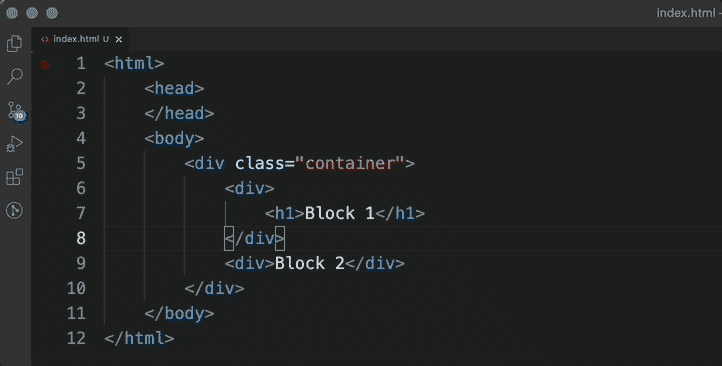

一个非常有用的插件，特别是对于布局设计者。

## [**美化**](https://marketplace.visualstudio.com/items?itemName=HookyQR.beautify)

扩展功能是将一个没有空格和制表符的难看的文件(其中每个标签紧跟在前一个标签之后)变成一个可读性更好、更漂亮的文件。

要使用此分机，您首先需要按 F1。然后在行中写上“美化”并从列表中选择——代码会自动更正。

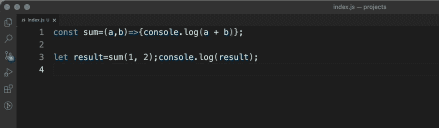

## [**括号对上色器 2**](https://marketplace.visualstudio.com/items?itemName=CoenraadS.bracket-pair-colorizer-2)

此扩展为每对群组提供了不同的颜色，您可以快速轻松地找到想要的群组。

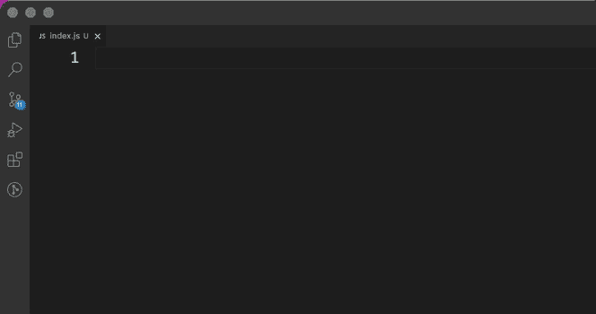

## [**直播服务器**](https://marketplace.visualstudio.com/items?itemName=ritwickdey.LiveServer)

VS 代码的 Live 服务器插件允许你在修改 js，css，html 代码后重新加载页面。

安装后，右下角会出现一个按钮“Go Live”。点击按钮

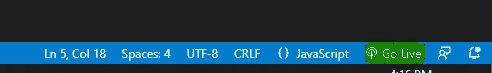

按“上线”按钮激活“服务器上线”模式。

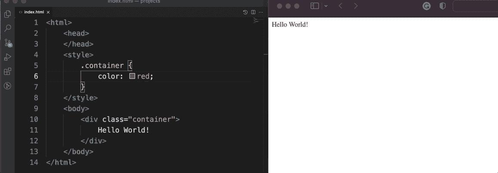

## [CSS 窥视](https://marketplace.visualstudio.com/items?itemName=pranaygp.vscode-css-peek)

在处理 HTML 时显示一个 CSS 弹出窗口。这简化了工作，并允许您不必在大型 CSS 文件中的许多类中搜索所需的属性。

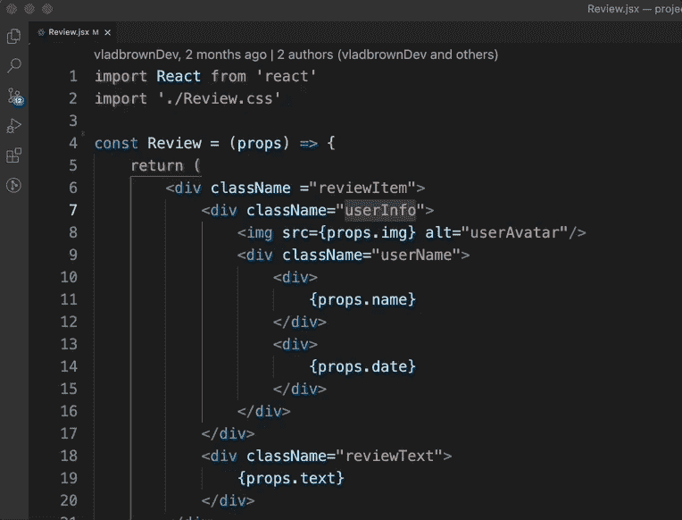

## [**导入成本**](https://marketplace.visualstudio.com/items?itemName=wix.vscode-import-cost)

允许编辑器显示导入包的大小。该扩展为此使用了`webpack`和`babel-webpack-plugin`。

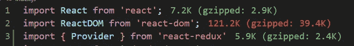

## [更好的评论](https://marketplace.visualstudio.com/items?itemName=aaron-bond.better-comments)

有助于在代码中创建更清晰的注释。该扩展允许您将注释分为以下类别:

*   警报
*   问题
*   托多斯
*   突出

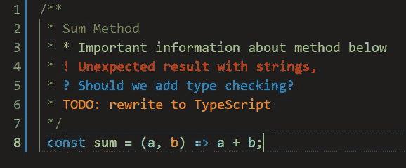

## [**代码拼写检查器**](https://marketplace.visualstudio.com/items?itemName=streetsidesoftware.code-spell-checker)

扩展的目的是检查常见错误并减少误报的数量。适用于驼峰式复合词。

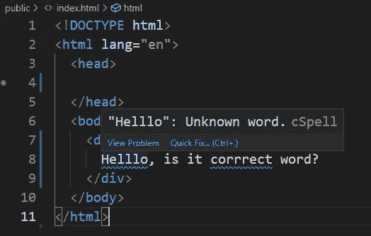

## [**Polacode**](https://marketplace.visualstudio.com/items?itemName=pnp.polacode)

允许你用自定义的字体和主题截图代码。

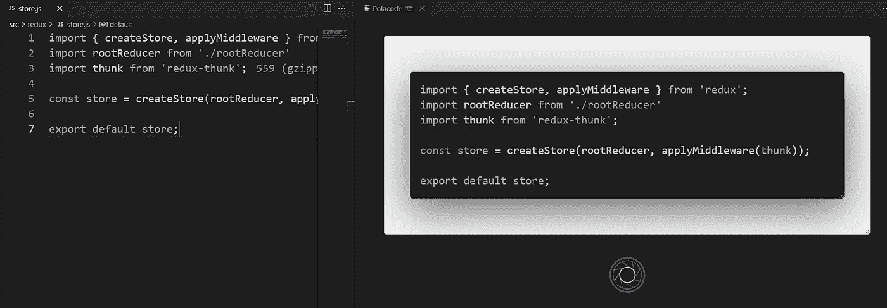

这就是全部，如果你使用了我没有包括在列表中的其他扩展，请随意写在评论中

# 学到了新东西？

如果你喜欢这篇文章，可以 [**给我买杯咖啡**](https://www.buymeacoffee.com/stasoz) 我写下一篇文章的时候再喝:)

*更多内容请看*[*blog . dev genius . io*](http://blog.devgenius.io)*。*