# 2022 年最值得阅读的 12 本 Javascript 书籍

> 原文：<https://blog.devgenius.io/top-12-javascript-books-to-read-in-2022-282dc630e0dc?source=collection_archive---------6----------------------->

如果你已经学过 HTML 和 CSS，现在想学一门编程语言，我推荐你学 **JavaScript** 。

JavaScript 是前端开发的领军人物之一。**此外，它是最好学的编程语言之一。**学习 Javascript 有几种方法，其中有书籍。

书籍是学习几乎任何东西的好方法，包括编程语言。因此，这里列出了适合任何技能水平的开发人员(包括编程新手)的 12 本最佳 JavaScript 书籍。

# 1.JavaScript:权威指南

[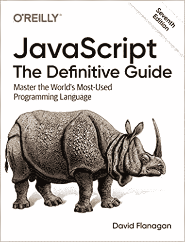](https://amzn.to/3a2xffF)

> JavaScript 是一种网络编程语言，如今比任何其他编程语言都被更多的软件开发人员使用。近 25 年来，这本畅销书一直是 JavaScript 程序员的最佳指南。第七版进行了全面更新，涵盖了 2020 版的 JavaScript，新的章节涵盖了类、模块、迭代器、生成器、承诺、异步/等待和元编程。你会发现从头到尾都有启发性和引人入胜的示例代码。

[链接到亚马逊](https://amzn.to/3a2xffF)

# 2.**你不知道的 JS 书系列**

[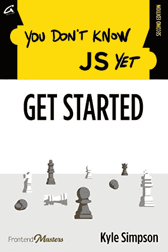](https://www.amazon.com/-/pt/dp/B084DFZ6GW/ref=sr_1_1?keywords=you+don%27t+know+js+yet&qid=1660877272&sr=8-1)

> 似乎从来没有像现在这样广泛地渴望一种更好的方法来深入学习 JavaScript 的基础知识。但是有了上百万的博客、书籍和视频，你该从哪里开始呢？不要再看了！全球最畅销的“你不知道 JS”系列丛书又出了第二版:“你还不知道 JS”。所有 6 本书都是全新的，重写后涵盖了 2020 年及以后 JS 的方方面面。《入门》为你未来的旅程做准备，首先调查这种语言，然后详细说明你还不知道的 JS 系列的其余部分如何指导你更深入地了解 JS。

[链接到亚马逊](https://www.amazon.com/-/pt/dp/B084DFZ6GW/ref=sr_1_1?keywords=you+don%27t+know+js+yet&qid=1660877272&sr=8-1)

# 3.雄辩的 Javascript

[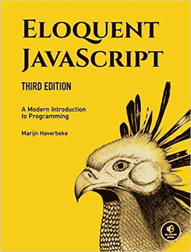](https://www.amazon.com/-/pt/dp/1593279507/ref=sr_1_1?keywords=eloquent+javascript&qid=1660877375&sprefix=eloquent+j%2Caps%2C180&sr=8-1)

> JavaScript 是几乎所有现代网络应用的核心，从 Twitter 这样的社交应用到 Phaser 和 Babylon 这样的基于浏览器的游戏框架。尽管 JavaScript 对于初学者来说很容易掌握和使用，但它是一种灵活、复杂的语言，可以用来构建全面的应用程序。
> 
> 这本备受期待并经过彻底修改的雄辩 JavaScript 第三版深入 JavaScript 语言，向您展示如何编写漂亮、有效的代码。它已经过更新，以反映 Java 脚本和 web 浏览器的当前状态，并包括了关于类符号、箭头函数、迭代器、异步函数、模板字符串和块范围等特性的全新材料。还增加了大量新的练习来测试你的技能并让你保持在正确的轨道上。

[链接到亚马逊](https://www.amazon.com/-/pt/dp/1593279507/ref=sr_1_1?keywords=eloquent+javascript&qid=1660877375&sprefix=eloquent+j%2Caps%2C180&sr=8-1)

# 4.**有效的 JavaScript**

[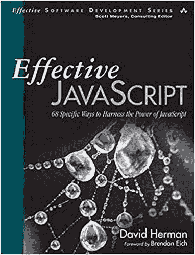](https://www.amazon.com/Effective-JavaScript-Specific-Software-Development/dp/0321812182/ref=as_li_ss_tl?dchild=1&keywords=effective+javascript&qid=1596643399&sr=8-1&linkCode=sl1&tag=daolf-20&linkId=6ce7d0eb8edca69387226b2ba70b6324&language=en_US)

> 为了真正掌握 JavaScript，您需要学习如何有效地使用该语言灵活、富于表现力的特性，以及如何避免其缺陷。无论您编写 JavaScript 代码有多长时间，有效的 JavaScript 都将有助于加深您对这种强大语言的理解，因此您可以构建更加可预测、可靠和可维护的程序。作者大卫·赫尔曼凭借其在 ECMA JavaScript 标准化委员会的多年经验，以前所未有的方式阐明了该语言的内部工作原理，帮助您充分利用 JavaScript 的表现力。
> 
> 这本书反映了 JavaScript 标准的最新版本，提供了经过充分验证的技术和最佳实践，您将在未来几年中依赖它们。

[链接到亚马逊](https://www.amazon.com/Effective-JavaScript-Specific-Software-Development/dp/0321812182/ref=as_li_ss_tl?dchild=1&keywords=effective+javascript&qid=1596643399&sr=8-1&linkCode=sl1&tag=daolf-20&linkId=6ce7d0eb8edca69387226b2ba70b6324&language=en_US)

# 5.**JavaScript 忍者的秘密**

> 比以往任何时候，网络是所有类型的应用程序的通用平台，JavaScript 是网络的语言。如果你对 web 开发很认真，做一个像样的 JavaScript 程序员是不够的。你需要像忍者一样——隐身、高效，并做好一切准备。这本书告诉你怎么做。

[链接到亚马逊](https://www.amazon.com/Secrets-JavaScript-Ninja-John-Resig/dp/1617292850/ref=as_li_ss_tl?_encoding=UTF8&qid=1596669830&sr=8-1&linkCode=sl1&tag=daolf-20&linkId=c720b6d3ff2c793b7fbb276d97599bb9&language=en_US)

# 6. **JavaScript 模式**

[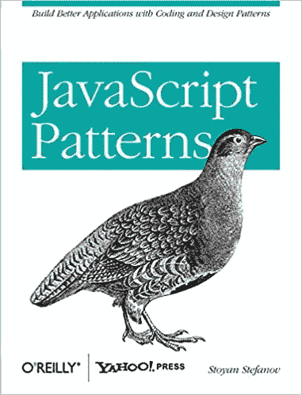](https://www.amazon.com/JavaScript-Patterns-Better-Applications-Coding/dp/0596806752/ref=as_li_ss_tl?dchild=1&keywords=javascript+patterns&qid=1596643572&sr=8-1&linkCode=sl1&tag=daolf-20&linkId=e2a8a4a0f51f1f05a8fae2cd9ed3d44c&language=en_US)

> 用 JavaScript 开发应用程序的最佳方法是什么？这本书通过大量的 JavaScript 编码模式和最佳实践来帮助你回答这个问题。如果您是一名经验丰富的开发人员，希望解决与对象、函数、继承和其他特定于语言的类别相关的问题，那么本指南中的抽象和代码模板是理想的选择——无论您是使用 JavaScript 编写客户端、服务器端还是桌面应用程序。
> 
> 由 JavaScript 专家 Stoyan Stefanov——资深雅虎！作为 YSlow 2.0 的技术人员和架构师，网页性能优化工具— JavaScript 模式包括实现所讨论的每个模式的实用建议，以及几个实际操作的例子。
> 
> 您还将了解反模式:常见的编程方法导致的问题比它们解决的问题更多\ n 探索编写高质量 JavaScript 代码的有用习惯，例如避免全局变量、使用单个 var 声明等等
> 
> 了解为什么文字符号模式比构造函数更简单。探索在 JavaScript 中定义函数的不同方法。创建超越使用对象文字和构造函数的基本模式的对象
> 
> 了解 JavaScript 中可用于代码重用和继承的选项\ n 研究常见设计模式(如 Singleton、Factory、Decorator 等)的示例 JavaScript 方法。

[链接到亚马逊](https://www.amazon.com/JavaScript-Patterns-Better-Applications-Coding/dp/0596806752/ref=as_li_ss_tl?dchild=1&keywords=javascript+patterns&qid=1596643572&sr=8-1&linkCode=sl1&tag=daolf-20&linkId=e2a8a4a0f51f1f05a8fae2cd9ed3d44c&language=en_US)

# 7.**面向对象 JavaScript 的原理**

[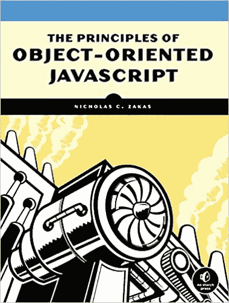](https://www.amazon.com/Principles-Object-Oriented-JavaScript-Nicholas-Zakas/dp/1593275404/ref=as_li_ss_tl?crid=1X6PBZUKN5THB&dchild=1&keywords=principles+of+object-oriented+javascript&qid=1596646260&sprefix=principles+of+object+oriented+javascript,aps,259&sr=8-1&linkCode=sl1&tag=daolf-20&linkId=72e6ade1e294bb37f6b95508271685ce&language=en_US)

> 如果您使用了更传统的面向对象语言，比如 C++或 Java，JavaScript 可能看起来根本就不是面向对象的。它没有类的概念，你甚至不需要定义任何对象来编写代码。但是不要被愚弄了——JavaScript 是一种非常强大且富于表现力的面向对象语言，它将许多设计决策都交到了您的手中。
> 
> 在《面向对象 JavaScript 的原理》中，Nicholas C. Zakas 深入探讨了 JavaScript 的面向对象本质，揭示了该语言独特的继承实现和其他关键特征。您将了解到:
> 
> 原始值和参考值之间的差异
> 
> 是什么让 JavaScript 函数如此独特\ n–创建对象的各种方法
> 
> 如何定义自己的构造函数\ n–如何使用和理解原型
> 
> 类型和对象的继承模式
> 
> 面向对象 JavaScript 的原则将让有经验的开发人员对 JavaScript 有更深的理解。解开 JavaScript 中对象工作方式背后的秘密，这样您就可以编写更清晰、更灵活、更高效的代码。

[链接到亚马逊](https://www.amazon.com/Principles-Object-Oriented-JavaScript-Nicholas-Zakas/dp/1593275404/ref=as_li_ss_tl?crid=1X6PBZUKN5THB&dchild=1&keywords=principles+of+object-oriented+javascript&qid=1596646260&sprefix=principles+of+object+oriented+javascript,aps,259&sr=8-1&linkCode=sl1&tag=daolf-20&linkId=72e6ade1e294bb37f6b95508271685ce&language=en_US)

# 8. **JavaScript 和 JQuery:交互式前端 Web 开发**

[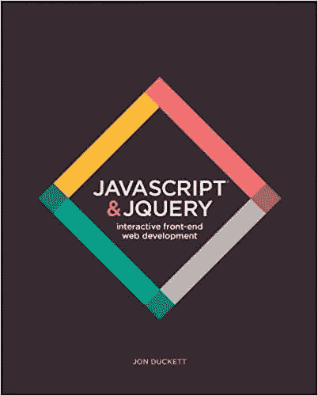](https://www.amazon.com/JavaScript-JQuery-Interactive-Front-End-Development/dp/1118531647/ref=as_li_ss_tl?dchild=1&keywords=javascript+and+jquery&qid=1596643478&sr=8-2&linkCode=sl1&tag=daolf-20&linkId=86b572bcd6a6c05d6cc4552356ef6080&language=en_US)

> 这本书是为那些想用 JavaScript 让他们的网站变得更有趣、更吸引人、更具互动性或更有用的人而写的。特别是，它针对的是没有计算机科学学位的人(嗯，反正还没有)。编程书籍可能会令人望而生畏，所以我们想写一本书，教读者如何以更温和、更直观的方式使用 JavaScript。重要的是，我们不想假设读者除了用 HTML 和 CSS 创建网页的能力之外，还有任何编程经验。(毕竟现在各种各样的人都在创建网站，我们也不是都是编程出身。)
> 
> 所以，如果你曾经努力让一个脚本在你的网页上工作，想要更好地了解如何定制脚本，或者想要从头开始编写你自己的脚本，这本书就是为你写的。我们不能保证删除程序员使用的不熟悉的术语，但是我们会告诉你它们的意思(借助可视化的例子和图表),这样 JavaScript 就不会看起来像外语了。

[链接到亚马逊](https://www.amazon.com/JavaScript-JQuery-Interactive-Front-End-Development/dp/1118531647/ref=as_li_ss_tl?dchild=1&keywords=javascript+and+jquery&qid=1596643478&sr=8-2&linkCode=sl1&tag=daolf-20&linkId=86b572bcd6a6c05d6cc4552356ef6080&language=en_US)

# 9.**开始 JavaScript**

[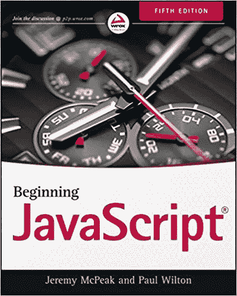](https://www.amazon.com/Beginning-JavaScript-Jeremy-McPeak/dp/1118903331/ref=as_li_ss_tl?dchild=1&keywords=beginning+javascript&qid=1596646335&sr=8-1&linkCode=sl1&tag=daolf-20&linkId=cd12a81357735c84b0396d62fb63451e&language=en_US)

> 开始 JavaScript 第 5 版向您展示如何有效地使用 JavaScript 框架、函数和现代浏览器，并教授使用 HTML5 的更有效的编码实践。
> 
> 这个新版本进行了广泛的更新，以反映 JavaScript 目前最常用的方式，向您介绍 JavaScript 开发人员可用的最新工具和技术。覆盖范围包括使用 HTML5 标记、JSON 数据格式、DOM APIs、jQuery 框架等的现代编码实践。
> 
> 带解答的练习提供了大量练习的机会，配套网站提供了书中所有示例的可下载代码。使用最新的编码风格学习 JavaScript。了解 JSON、函数、事件和特性检测。
> 
> 利用新的 HTML5 元素和相关的 API。探索新功能，包括地理定位、本地存储等。JavaScript 已经将 Web 从一个被动的媒介变成了一个丰富的、动态的和交互式的媒介。无论服务器端的技术如何，都是 JavaScript 让它在浏览器中活了起来。要像现在这样学习 JavaScript,《JavaScript 入门，第 5 版》是你的简明指南。

[链接到亚马逊](https://www.amazon.com/Beginning-JavaScript-Jeremy-McPeak/dp/1118903331/ref=as_li_ss_tl?dchild=1&keywords=beginning+javascript&qid=1596646335&sr=8-1&linkCode=sl1&tag=daolf-20&linkId=cd12a81357735c84b0396d62fb63451e&language=en_US)

# 10.**说 JavaScript**

[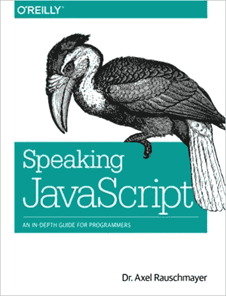](https://www.amazon.com/Speaking-JavaScript-Depth-Guide-Programmers/dp/1449365035/ref=as_li_ss_tl?crid=1F5XALZONDFZV&dchild=1&keywords=speaking+javascript&qid=1596646419&sprefix=speaking+javascript,aps,253&sr=8-1&linkCode=sl1&tag=daolf-20&linkId=858b8c0d8ca70da3c0fe87e255870ce7&language=en_US)

> 不管你喜不喜欢，如今 JavaScript 无处不在——从浏览器到服务器到移动设备——现在你也需要学习这种语言，或者比你所拥有的更深入。这本简明的书引导你进入并通过 JavaScript，作者是一位资深程序员，他曾经发现自己处于同样的位置。
> 
> 说 JavaScript 有助于你通过四个独立的部分来学习这门语言。首先，一个快速入门指南会教你足够多的语言来帮助你马上变得有效率。更有经验的 JavaScript 程序员会找到一个完整的、易于阅读的参考资料，它深入介绍了每种语言的特性。

[链接到亚马逊](https://www.amazon.com/Speaking-JavaScript-Depth-Guide-Programmers/dp/1449365035/ref=as_li_ss_tl?crid=1F5XALZONDFZV&dchild=1&keywords=speaking+javascript&qid=1596646419&sprefix=speaking+javascript,aps,253&sr=8-1&linkCode=sl1&tag=daolf-20&linkId=858b8c0d8ca70da3c0fe87e255870ce7&language=en_US)

# 11.**编写 JavaScript 应用程序**

[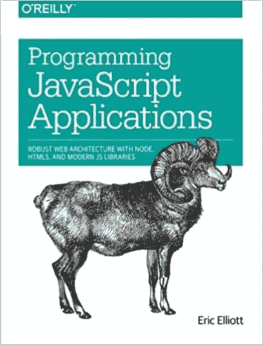](https://www.amazon.com/Programming-JavaScript-Applications-Architecture-Libraries/dp/1491950293/ref=as_li_ss_tl?crid=GXEYY2TNAFRE&dchild=1&keywords=programming+javascript+applications&qid=1596646528&sprefix=programming+javascript,aps,254&sr=8-1&linkCode=sl1&tag=daolf-20&linkId=bd1df4940dedfa3b00e22a97bbc730b3&language=en_US)

> 利用 JavaScript 的强大功能来构建易于扩展和维护的健壮的 web 级或企业级应用程序。通过应用这本实用书籍中概述的设计模式，有经验的 JavaScript 开发人员将学习如何编写灵活且有弹性的代码，随着代码库的增长，这些代码将更容易使用。JavaScript 可能是最基本的 web 编程语言，但在现实世界中，当您进行更改时，JavaScript 应用程序经常会中断。
> 
> 在本书中，作者 Eric Elliott 向您展示了如何在不影响代码其余部分的情况下，向大型 JavaScript 应用程序添加客户端和服务器端特性。分析大规模 JavaScript 应用程序的结构。利用桌面应用程序的功能构建现代 web 应用程序。了解代码组织、模块化和重用的最佳实践。将应用程序分成不同的责任层。使用 Node.js 构建高效的自描述超媒体 API。快速测试、集成和部署软件更新。通过用户身份验证和授权控制资源访问。通过国际化扩大您的应用范围

[链接到亚马逊](https://www.amazon.com/Programming-JavaScript-Applications-Architecture-Libraries/dp/1491950293/ref=as_li_ss_tl?crid=GXEYY2TNAFRE&dchild=1&keywords=programming+javascript+applications&qid=1596646528&sprefix=programming+javascript,aps,254&sr=8-1&linkCode=sl1&tag=daolf-20&linkId=bd1df4940dedfa3b00e22a97bbc730b3&language=en_US)

# 12.**面向网络开发者的专业 JavaScript】**

[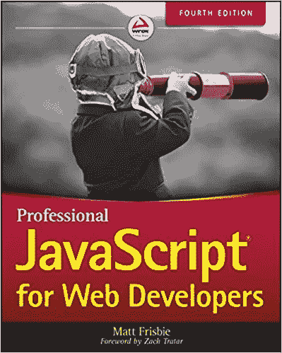](https://www.amazon.com/Professional-JavaScript-Developers-Matt-Frisbie/dp/1119366445/ref=as_li_ss_tl?crid=3615T8YS079OO&dchild=1&keywords=professional+javascript+for+web+developers&qid=1596646694&sprefix=professional+javascr,aps,260&sr=8-1&linkCode=sl1&tag=daolf-20&linkId=86c1ef16b2e1ea32cde55c7ce2ddef9a&language=en_US)

> 面向 Web 开发人员的专业 JavaScript 是下一级 JavaScript 开发的基本指南。这本书是为中高级程序员编写的，直接进入技术细节，帮助你清理代码，成为一名更老练的 JavaScript 开发人员。从特定于 JavaScript 的面向对象编程和继承，到将 JavaScript 与 HTML 和其他标记语言相结合，专家指导将带您了解基础知识和其他知识。
> 
> 这本书有 1200 页，是最全面的 JavaScript 参考资料。这个新的第四版已经更新，以涵盖通过 ECMAScript 2019 为专业开发人员详细解释了新的框架和库、新的技术、新的 API 等，重点在于帮助您将新技能应用到实际项目中。

[链接到亚马逊](https://www.amazon.com/Professional-JavaScript-Developers-Matt-Frisbie/dp/1119366445/ref=as_li_ss_tl?crid=3615T8YS079OO&dchild=1&keywords=professional+javascript+for+web+developers&qid=1596646694&sprefix=professional+javascr,aps,260&sr=8-1&linkCode=sl1&tag=daolf-20&linkId=86c1ef16b2e1ea32cde55c7ce2ddef9a&language=en_US)

# 结论

今天到此为止。希望这几本书能帮你开启编程之旅。

感谢阅读！在这个平台上关注我，了解更多开发者内容。祝您愉快，再见！👋