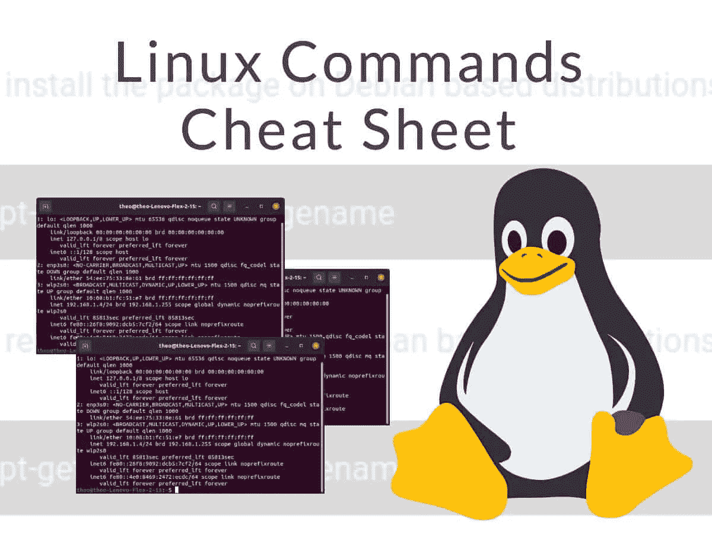

# 你在下次面试中可能会遇到的 15 个 Linux 命令

> 原文：<https://blog.devgenius.io/top-15-linux-commands-you-may-face-in-your-next-interview-ff827b4038f5?source=collection_archive---------11----------------------->



本文包含一些 Linux 命令，如果您正在使用 Linux 操作系统，或者您在下一次技术面试中可能会遇到这些命令，了解这些命令对您来说很重要。这将使你对 Linux 中的不同命令有一个基本的了解。

1.  **须藤命令**

sudo 代表“替代用户 do”或“超级用户 do ”,它允许。它允许具有适当权限用户以另一个用户的身份执行命令。该命令与 windows 中的“以管理员身份运行”相同。

```
sudo [command]
```

2. **pwd 命令**

pwd 代表打印工作目录，顾名思义，它打印当前工作的完整目录路径。

```
pwd -L :- Prints the symbolic path
pwd -P :- Prints the actual path
```

3. **cd 命令**

cd 代表更改目录。该命令用于在各种操作系统中改变当前工作目录。

```
$ cd [directory]ex:-
cd G: using this command you can go from your current directory to G drive
```

4. **ls 命令**

ls 代表列表。使用此命令，您可以看到当前工作目录中的每个文件。

```
$ ls
```

5.**猫命令**

cat 是 concatenate 的缩写。此命令显示一个或多个文件的内容，而无需打开文件进行编辑

```
$ cat filename  //It will show content of given filename
$ cat file1 file2 // It will show content of file1 and file2
$ cat -n filename // It will show content with line number
$ cat > newfile // Will create a file named newfile
$ cat [filename-whose-contents-is-to-be-copied] > [destination-filename] //The content will be copied in destination file
$ cat file1 >> file2 //Will append the contents of one file to the end of another file
```

6. **cp 命令**

cp 代表复制。该命令用于复制文件或文件组。它用不同的文件名在磁盘上创建文件的精确映像。

```
$ cp Src_file Dest_file
```

7. **mv 命令**

mv 代表移动。此命令用于将一个或多个文件或目录从一个地方移动到另一个地方。该命令也用于重命名文件或文件夹。

```
$ mv [Option] source destination
```

8. **mkdir 命令**

mkdir 代表制作目录。使用此命令，您可以一次创建多个目录(文件夹),并为目录设置权限。

```
$ mkdir [folder_name]
```

9. **rmdir 命令**

rmdir 代表删除空目录。这个命令用于在 Linux 中从文件系统中删除空目录。

```
*$ rmdir [-p] [-v | –verbose] [–ignore-fail-on-non-empty] directories*
```

10. **rm 命令**

rm 代表移除。此命令用于从文件系统中删除文件、目录、符号链接等对象。

```
$ rm a.txt   // file remove this a.text file
```

11.**触摸命令**

触摸命令是一个标准命令，用于创建、更改和修改文件的时间戳。使用 touch 命令创建的文件是空的。当用户在创建文件时没有要存储的数据时，可以使用该命令

```
$ touch file_name
```

12.**定位命令**

locate 命令用于按名称查找文件。

```
$ locate [OPTION]... PATTERN...
$ locate sample.txt //it will search a sample.txt file in perticular directory
```

13. **grep 命令**

grep 代表全局正则表达式打印。该命令用于在指定文件中搜索字符串。

```
$ grep [options] pattern [files]
$ grp -c "unix" sample.txt    // it will give the count of lines unix appears in sample.txt fie.
```

14.**尾部命令**

tail 是一个命令，用于打印某个文件的最后几行(默认为 10 行)，然后终止。

```
$ tail state.txt //prints last 10 lines of state.txt file
$ tail -3 state.txt //prints last 3 lines of state.txt file
$ tail +20 state.txt  // print lines starting from 20 in state.txt file
```

15.**差异命令**

diff 代表不同。该命令用于通过逐行比较文件来显示文件的差异。它告诉我们一个文件中的哪一行必须被改变以使两个文件相同。

```
$ diff [options] File1 File2
```