# 📚🏆20 大 Web 开发学习资源:从初级到高级

> 原文：<https://blog.devgenius.io/top-20-web-development-learning-resources-from-beginner-to-advanced-d577a51146e9?source=collection_archive---------1----------------------->

[Web 开发](https://en.wikipedia.org/wiki/Web_development)指建立和维护网站的行为；这些网站的复杂程度各不相同，从简单的静态网站到具有大型数据库的更复杂的 web 应用程序，以及社交媒体和电子商务应用程序等实时数据密集型应用程序。

**后端开发人员**设计应用程序 API 和数据库模式，并实现业务逻辑。在前端开发被认为是琐碎工作的时代，后端开发人员最初被称为开发人员。后端开发人员可以使用多种语言来满足他们的需求。后端开发人员应该精通 PHP、Java、Python、ASP.net、Ruby 等语言。

**前端开发人员**使用 API 并实现逻辑来处理网站的表现、交互性和用户体验。与后端不同，前端开发者的主要脚本语言是 JavaScript。然而，有大量的 JavaScript 框架、库、捆绑器和构建工具可用于前端开发。前端开发人员通常擅长其中的一项或多项。这些前端技术的一些例子是 React、Angular、Vue、Svelte、Webpack、Rollup、Snowpack、ESbuild 等。

除了 JavaScript，前端开发人员还使用 HTML 和 CSS 来构建和美化网站。

**全栈开发人员**是同时具备前端和后端开发技能的开发人员。

不管专业领域如何，优秀的开发人员遵循[男孩/女孩童子军规则](https://www.stepsize.com/blog/how-to-be-an-effective-boy-girl-scout-engineer?utm_source=dev.to&utm_medium=referral) : **总是让代码比你发现的更好**。他们通过使用[工具来提高生产力](https://dev.to/alexomeyer/10-must-have-vs-code-extensions-to-improve-your-productivity-4goe)，提高代码质量，促进协作，并管理技术债务。

网页开发是一项高薪技能，目前需求量很大。随着 Covid 的出现，许多企业和服务正在向网上转移；因此，增加了对 web 开发人员的需求。

因此，现在是学习 web 开发的最佳时机——让我们看看网站和在线平台来学习软件开发吧！

# [1。路线图](https://roadmap.sh/)

学习 web 开发是一个旅程，为此，你需要一个路线图。新开发人员在学习 web 开发时面临的最大挑战之一是不知道从哪里开始，学习什么，或者实现目标的途径。

Roadmap.sh 是一个社区项目，旨在创建路线图、指南和其他教育内容，以帮助开发人员找到正确的道路并指导他们的学习。

Read map 提供可下载的可视化指南，包含主题、工具、语言和所有必要的细节，以指导 noob 开发人员掌握 web 开发。

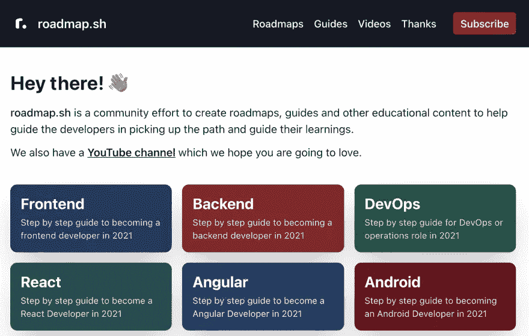

# [2。免费代码营](https://www.freecodecamp.org/)

Freecode camp 是一个广泛的开源在线编码训练营，提供广泛的 web 开发技能的免费培训和认证。Freecodecamp 提供的一些认证有网页设计、前端开发、数据可视化、后端开发& API、机器学习、质量保证、数据分析、信息安全等等。

Freecodecamp 拥有大约 40，000 名 freeCodeCamp.org 大学毕业生，在世界各地的大型技术公司工作，是该榜单上最全面、最广泛的在线培训平台。它的课程都是免费的。

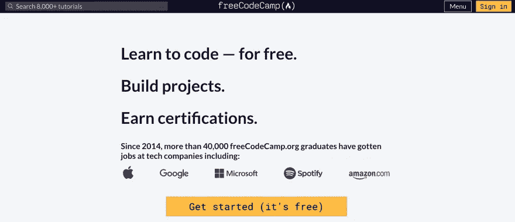

# [3。代码学院](https://www.codecademy.com/learn/paths/web-development)

Codecademy 是另一个在线学习平台，提供各种编程语言的培训，如 Java、JavaScript、PHP、Python、Kotlin、HTML、CSS、SQL、C++、Bash/Shell 等。

它提供一些编程语言的免费初级培训。此外，它还提供一些结构良好的付费专业课程；为职业道路量身定制。

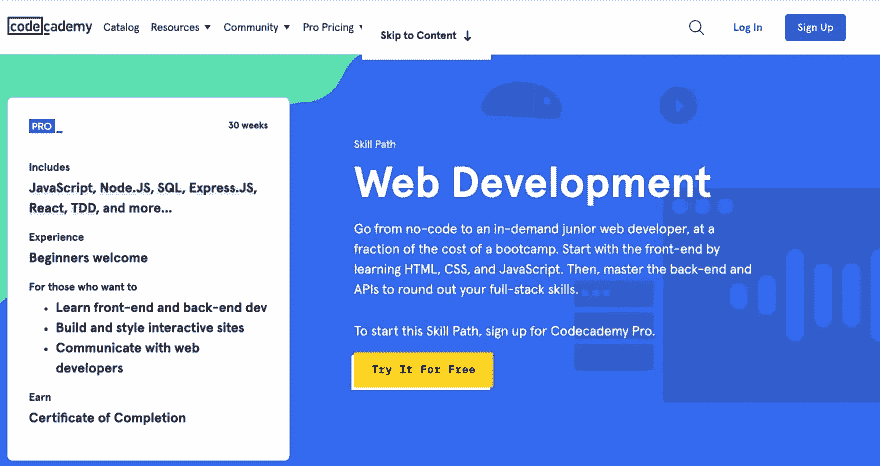

# [4。管理技术债务博客](https://www.stepsize.com/blog?utm_source=dev.to&utm_medium=referral)

软件开发不仅仅是发布特性，还包括维护健康的代码库和管理技术债务。

平均而言，[工程师每周花 1 天时间解决技术债务](https://www.stepsize.com/report?utm_source=dev.to&utm_medium=referral)和维护问题。此外，技术债务降低了团队的士气，导致工程团队的沮丧，并且有巨大的金钱成本。Stepsize 团队撰写了管理技术债务博客，在这里你可以找到学习如何处理技术债务的最佳资源:

*   [工程师技术债指南](https://www.stepsize.com/blog/complete-guide-to-technical-debt?utm_source=dev.to&utm_medium=referral)
    了解技术债的定义以及如何定义 it 软件工程。
*   [网络研讨会:如何处理技术债务](https://www.stepsize.com/blog/how-to-deal-with-tech-debt-lessons-learned-from-the-best-engineering-teams?utm_source=dev.to&utm_medium=referral)
    从 200 多个工程团队中学习技术债务的最佳实践和经验教训。
*   [跟踪和管理技术债务的工具](https://www.stepsize.com/blog/tools-to-track-and-manage-technical-debt?utm_source=dev.to&utm_medium=referral)
    为您的团队找到管理技术债务的最佳工具。

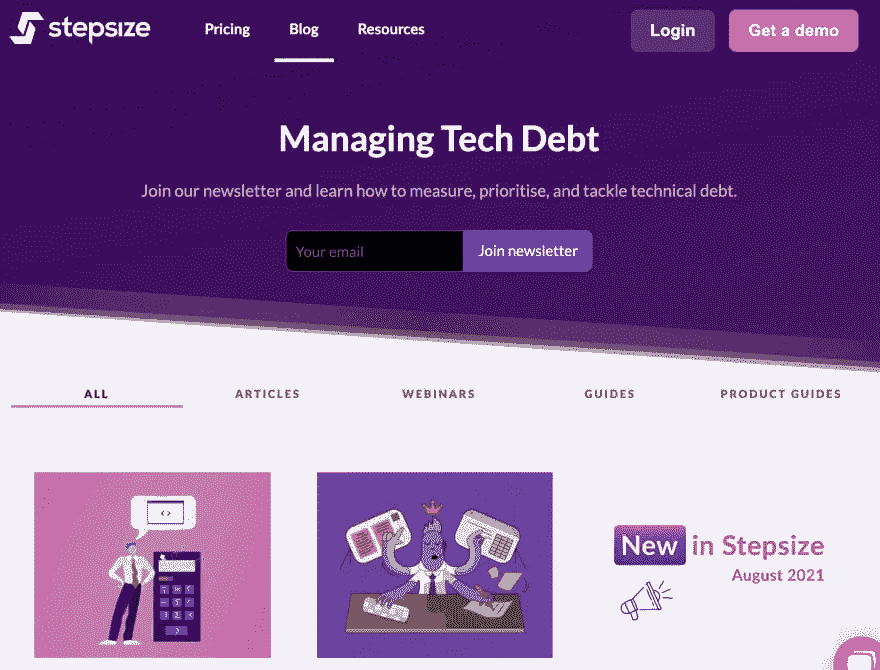

# [5。Scrimba](https://scrimba.com/)

Scrimba 是一个革命性的在线学习平台，通过交互式屏幕播放和现场活动教授网络开发。它的特色是免费和付费的低成本优质课程。
您可以通过练习这个[互动屏幕截图](https://scrimba.com/scrim/czvKPPsw)来了解更多关于 Scrimba 的信息。

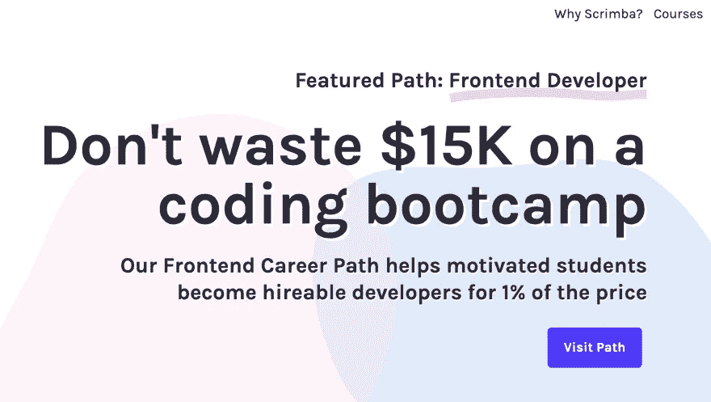

# [6。代码笔/挑战](https://codepen.io/challenges)

Codepen 是一个面向前端开发人员的开源社交开发环境。Codepen 的特色是一个支持 HTML、CSS 和 JavaScript 的在线文本编辑器。

Codepen 的创作被称为钢笔，可以是公共的，也可以是私人的，只能在付费计划中使用。

根据该网站，Codepen 挑战是通过构建东西来提升技能的有趣机会。每周，你都会收到一个围绕每月主题的新提示。最好的钢笔被挑选出来并在主页上展示！

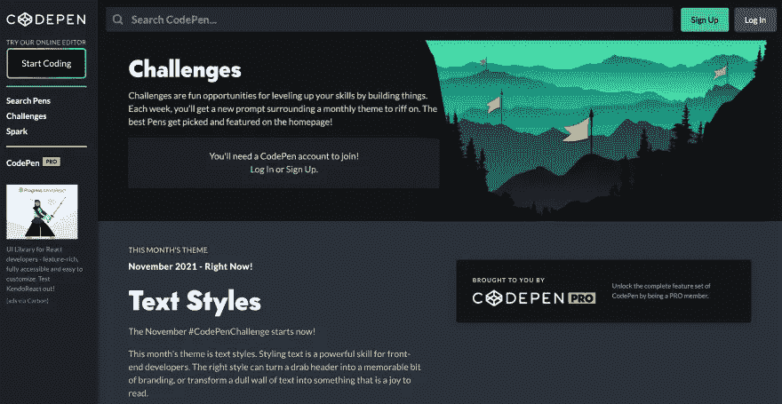

# [7。W3Schools](https://www.w3schools.com/)

W3School 提供了最广泛的免费在线学习资源之一。它的特色是关于各种编程语言的教程，比如 HTML、CSS、JavaScript、Python、SQL、PHP 等等。

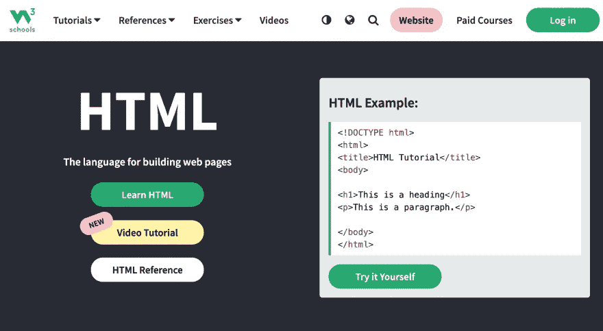

# [8。奥丁项目](https://www.theodinproject.com/)

与 Freecodecamp 类似，Odin 项目是一个开源的在线学习平台。它的特点是一个完整的课程堆栈，将指导您的道路，在您的旅程，以网页开发掌握。

奥丁项目培训有三种方式:

*   基础--您学习网络开发基础知识的地方。
*   Rails 上的全堆栈 Ruby——使用 Rails 上的 Ruby 后端进行全堆栈网络开发
*   全堆栈 JavaScript — —在前端和后端使用 JavaScript 的全堆栈网络开发。

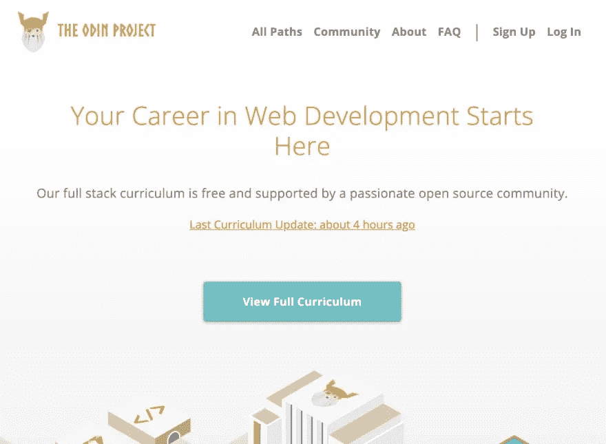

# [9。htmlreference。io](https://htmlreference.io/) 和 [cssreference。io](https://cssreference.io/)

这些都是很棒的在线学习资源，包括来自[布尔玛 CSS](https://bulma.io/) 的创建者的 HTML 和 CSS 参考。

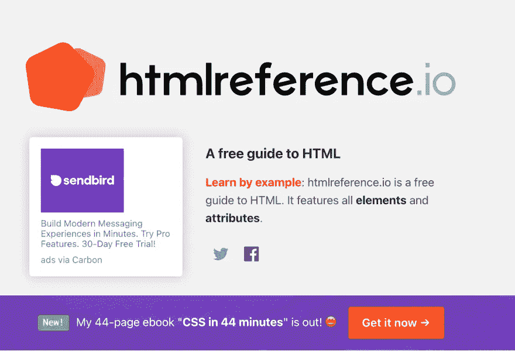

# [10。前端导师](https://www.frontendmentor.io/challenges)

这是另一个在线学习平台，通过挑战提升你的网络开发技能。前端导师具有不同难度水平的挑战:新手，初级，中级和高级。这是一种有趣且经过深思熟虑的学习 web 开发的方式，它不仅具有挑战性，还提供了 Figma 设计文件和优化的图像资产。

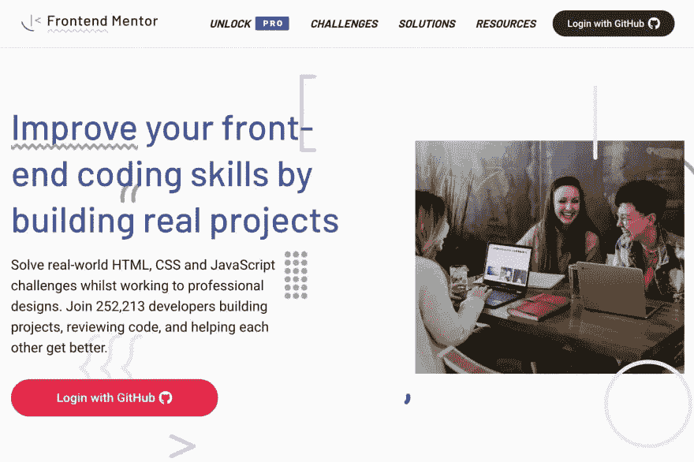

# [11。开发挑战](https://devchallenges.io/)

Dev Challenges 提供了大量的资源和一个很棒的社区，可以帮助你巩固你的 web 开发技能，并通过从事不同的称为 Challenges 的项目来增强你的信心。

开发挑战很容易开始。你所要做的就是选择一个挑战，独自或与团队一起构建项目，并提交你的解决方案。

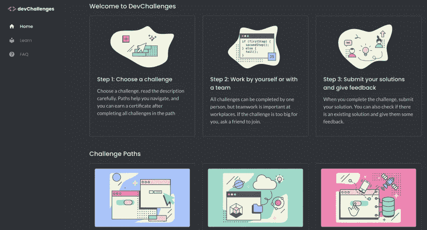

# 12。MDN

根据他们的网站，MDN Web Docs(以前称为 MDN-Mozilla Developer Network)是一个不断发展的网络技术和软件学习平台，包括 CSS、HTML 和 JavaScript。

此外，MDN 还提供了一个学习区，专门教授 web 开发的基础知识。 [MDN 学习区](https://developer.mozilla.org/en-US/docs/Learn)提供了大量关于 web 技术的文章，如 HTML、CSS、Git & Github、React、Ember、Angular、Vue、Django 等。如果你是一个热爱阅读的初学者，这是一个开始你的 web 开发之旅的好地方。

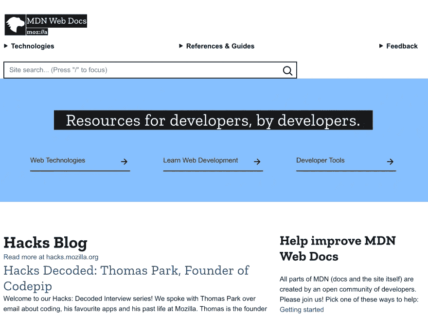

# [13。代码导师](https://www.codementor.io/projects)

Code Mentor 通过让您参与实际项目，为您提供了一个提升 web 开发技能的好方法。也可以查看这些项目的解决方案，学习别人的代码。

此外，Code Mentor 提供了一个由超过 12，000 名开发人员组成的繁荣社区，您可以在这里讨论项目、寻找同行或一对一的导师。

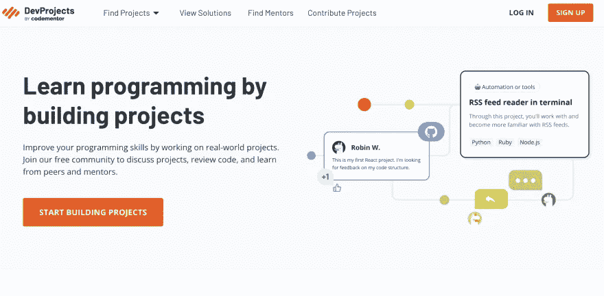

# [14。编码道场](https://algorithm.codingdojo.com/)

Coding Dojo 是一个很棒的在线学习平台，它通过在线编码平台、编码挑战、演练视频和评估来帮助您提高技能。

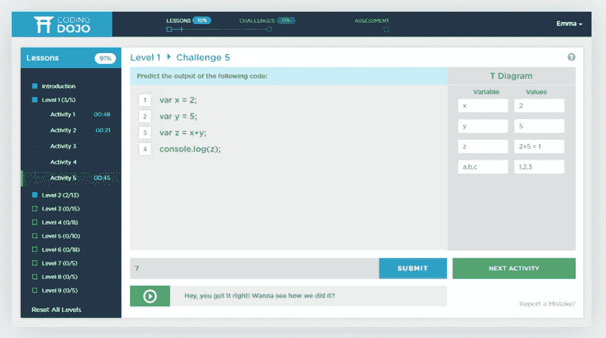

# [15。CSS 之战](https://cssbattle.dev/)

CSS 战采取了不同的学习方法。CSS 战斗的目的是通过 CSS 游戏来建立你的 CSS 技能。每场战斗都给你一个目标，这个目标是一个样式化的对象，你可以用尽可能少的 CSS 代码来复制它。

这是展示你的 CSS 肌肉和增长你的 CSS 技能的好方法。

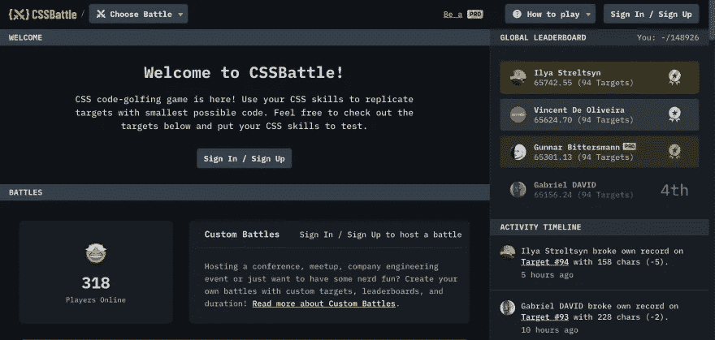

# 16。编码器

Codier 是另一个基于挑战的学习平台。Codier 通过接受他们的前端挑战，帮助您提高前端 web 开发技能。

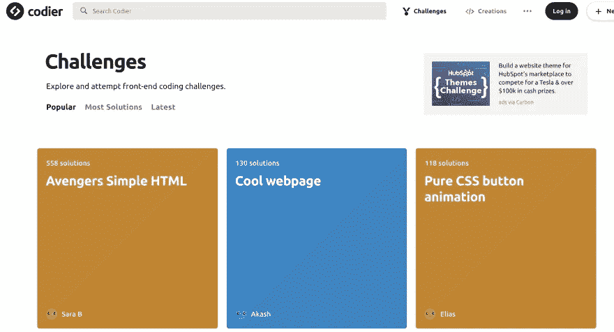

# [17。Ace 前端](https://www.acefrontend.com/)

Ace Front-end 是一个在线学习平台，只专注于基础知识--HTML、CSS 和 JavaScript。它旨在帮助前端开发人员在面试前磨练或提高他们的技能。

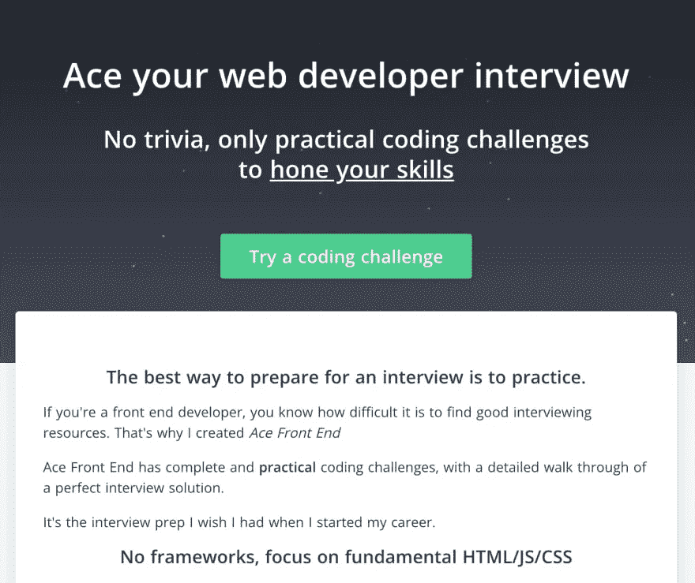

# [18。我可以使用](https://caniuse.com/)吗

根据该网站，“我可以使用”提供了最新的浏览器支持表，用于支持桌面和移动 web 浏览器上的前端 web 技术。

“我可以使用”允许您检查不同 CSS 功能的浏览器兼容性。此外，与 BrowserStack 合作，它可以让您测试您的网站在 2，000 多种真实浏览器和设备上的兼容性。

“我可以使用”是一个伟大的平台，对所有技能水平的开发人员都有用。它甚至允许你提交一个在平台上找不到的特性。

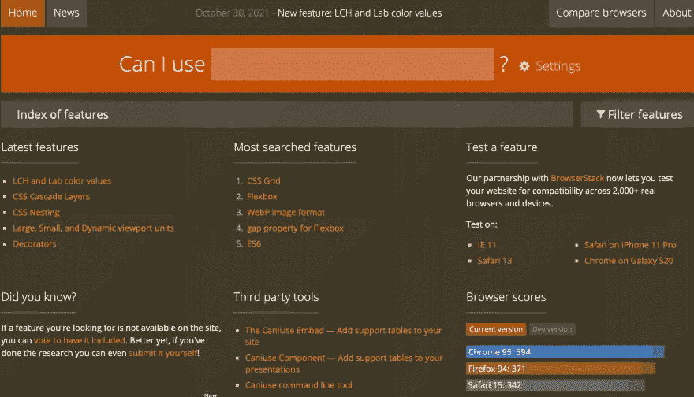

# 19。CSS 招数

CSS Tricks 是一个提供非常棒的 CSS 技巧的网站，对所有技能水平的开发者都有用。
除此之外，它还收集了大量关于前端 web 开发不同方面的文章、指南和视频。

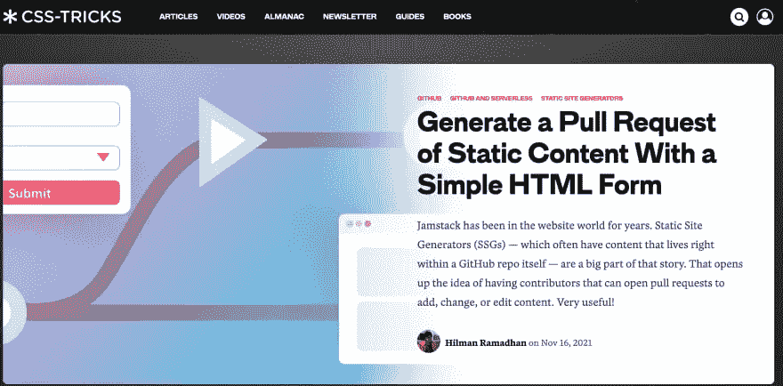

# [20。30 秒代码](https://www.30secondsofcode.org/)

《30 秒代码》是一本在线[编程食谱](https://en.wikibooks.org/wiki/Coding_Cookbook)，它为不同的编程语言提供了简短的代码片段。

30 秒的代码可能最适合中级和高级开发人员的需求。它提供了简短的代码片段和对常见编程问题的解释。因此，这是一个学习用于解决这些问题的设计模式的好地方。

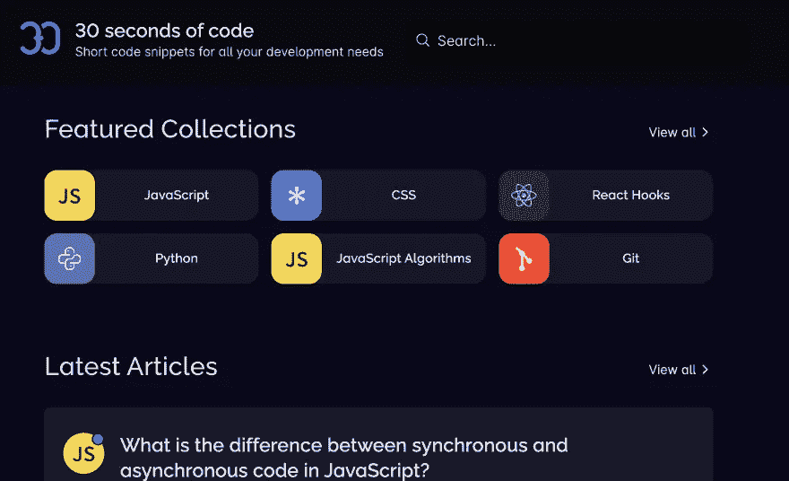

# 关键外卖

在这篇文章中，我们学习了 web 开发和 20 种不同的学习 web 开发的在线学习平台。

此外，这些平台采用不同的教学方法，如挑战、游戏、在线参考和食谱、视频等。

选择最适合你的方法，享受学习的过程，记住编写[高质量的代码](https://www.stepsize.com/blog/the-engineers-complete-guide-to-code-quality)不仅会带来更高质量的软件，还会带来更大的团队和个人满意度。