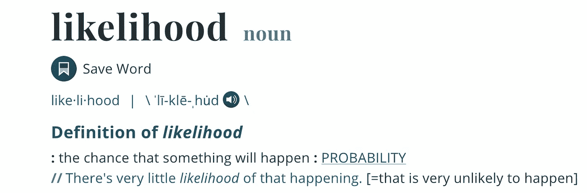
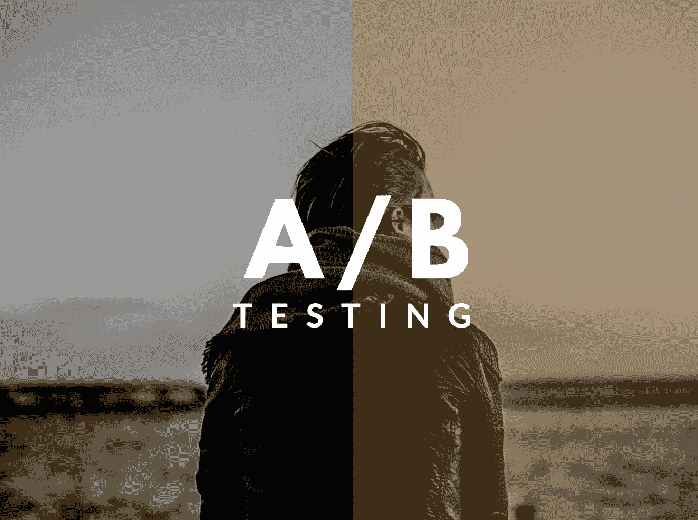
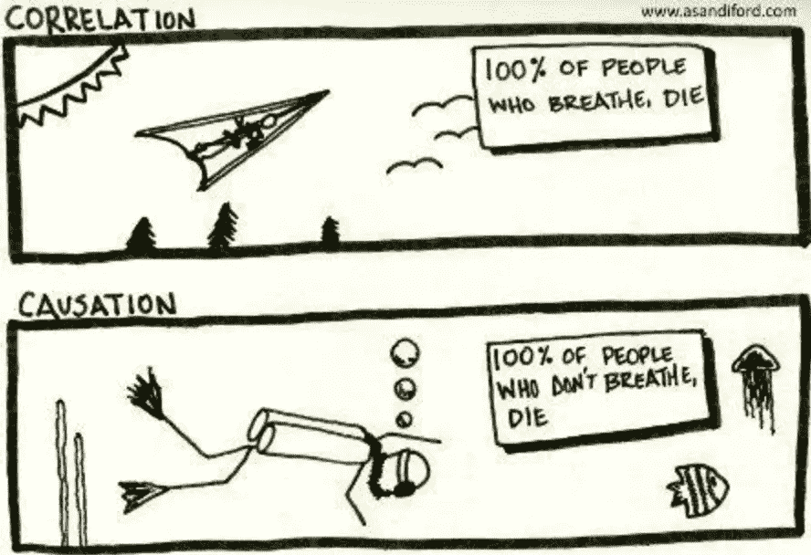

# 我希望在开始成为数据科学家时就知道的 3 大概念

> 原文：<https://blog.devgenius.io/top-3-concepts-i-wish-i-knew-when-i-started-as-a-data-scientist-45004bd3dae1?source=collection_archive---------1----------------------->

## 你应该知道的基本数据科学概念

图片由作者提供。

如果你正在开始一个数据科学的职业生涯，而你对以下 3 个概念没有更好的理解，你将面临很多问题。今天，您将简要了解巩固您的数据科学家职业生涯的 3 个概念。

## 概率与可能性

> 概率量化(对结果的)预期，可能性量化(在模型中)信任。

作为一名潜在的数据科学家，你应该清楚概率和可能性之间的细微差别。虽然“概率”和“可能性”通常是同义词，在字典中偶尔可以互换使用，但它们隐含地涉及统计学中的不同概念。

图片作者。来自[万豪韦伯斯特](https://www.merriam-webster.com/dictionary/likelihood)。

概率是指在提供数据分布或某些条件或证据的情况下，寻找某一特定事件发生的机会。它谈论未来，被写成 **P(假设|证据)**

而可能性则试图对数据进行分布拟合。它谈论过去，好像事情已经发生了。可以写成 **P(证据|假设)。**

简而言之，概率量化了(对结果的)预期，而可能性量化了(模型中的)信任。假设你在一场赌博中受到了挑战。现在，概率会给你收益或损失，而可能性会给你一个量化的版本，告诉你是否应该首先相信概率。

## 分割测试

> 除了一个可能会改变用户行为的差异，测试组 A 和 B 是相同的。

AB 测试或 A/B/n 测试是分裂测试的另一个名称。这是一个随机对照试验，有两个变量:A(有训练)和 B(没有训练)。这是一种比较单个变量的两个版本的方法，通常是通过比较受试者对变量 A 和变量 B 的反应，并找出两个变量中哪一个在你试图改善的 KPI 方面更有效。

图片作者。

## 基本的 A/B 测试程序如下:

1.  预测一两个你认为会提高产品/页面转化率的修改。
2.  制作产品的一个版本或变体，每个版本或变体都有一个变化。
3.  每个变体和原始产品获得等量的流量。
4.  只要您需要获得有统计学意义的结果，就运行测试。
5.  用达到统计显著性的新变体替换原始产品。
6.  重复这个过程。

## 相关性与因果性

> 虽然相关性和因果性可以共存，但它们是不相关的。

描述两个或多个变量之间关系的大小和方向的统计度量(用数字表示)。另一方面，相关性只是任何事物之间的关系。分析的一般和最优选目标是确定一个变量与另一个变量的相关程度，即，了解目标变量如何依赖于独立变量。

图片来自 [Pinterest](https://www.pinterest.com/pin/837810336915114610/) 。

虽然因果关系也被称为因果关系或因果关系，但它表明一个事件的发生是另一个事件发生的结果，表明两个游戏有因果关系。**它试图解决一个变量是否会影响另一个变量的问题。**

> 例如，*吸烟与酒精中毒有关，但它不会导致酒精中毒。*

因果关系是一个很难理解的概念。只看相关性而不确认因果关系就做出强有力的断言是一种完全错误的策略，应该理解的是，我们只是看到了相关性，而因果关系仍然是缺失的，除非并且直到因果关系能够被清楚地证明。

因此，如果你能尽快掌握这三个概念，你作为数据科学家的道路将会更快、更愉快。

> 嘿👋
> 
> 喜欢这篇文章吗？成为一个中等会员继续学习，没有限制。如果您使用以下链接 **，**，我将收取您一部分会员费，无需您支付额外费用。
> 
> 如果你对这篇文章有任何疑问，或者想在你的下一个数据工程或数据科学项目上合作，请在**[**LinkedIn**](https://www.linkedin.com/in/maladeep/)**上 ping 我。****
> 
> **还有，做 [**订阅**](https://medium.com/subscribe/@maladeep.upadhaya) 在我发布的时候通知。**

## **这里有更多的文章，你可能会喜欢❤**

** [## 超越 CSV:熊猫的数据摄取

### CSV 中的数据不会总是出现在你面前

towardsdatascience.com](https://towardsdatascience.com/go-beyond-csv-data-ingestion-with-pandas-4c1a0dd4f2e2)  [## 使用 Streamlit 构建您的第一个 Python 数据可视化 Web 应用程序

### 在不到 20 分钟的时间内，使用 Streamlit 视觉表达功能进行自我探索式可视化

towardsdatascience.com](https://towardsdatascience.com/build-your-first-data-visualization-web-app-in-python-using-streamlit-37e4c83a85db)  [## 用 Python 命名匹配的惊人有效的方法

### 数据匹配、模糊匹配、重复数据删除

towardsdatascience.com](https://towardsdatascience.com/surprisingly-effective-way-to-name-matching-in-python-1a67328e670e)  [## 概率与可能性:有什么区别？

### 用实例说明它们的区别的实用指南

anyi-guo.medium.com](https://anyi-guo.medium.com/probability-vs-likelihood-whats-the-difference-2d5cb9bd2f39)  [## 相关性并不意味着因果关系

### 相关性并不能证明因果关系！

medium.com](https://medium.com/analytics-vidhya/correlation-causation-977f71bb1e36)  [## 我希望在开始做数据分析师时就知道的 5 个概念

### 如果你问那些长期从事数据工作的人，你会发现他们理解…

medium.com](https://medium.com/@sidd.gcet/5-concepts-i-wish-i-knew-when-i-started-as-a-data-analyst-22e456d75350)  [## 数据科学面试中你应该知道的 3 个统计学概念

### 你应该知道的基本统计概念

towardsdatascience.com](https://towardsdatascience.com/3-statistics-concepts-you-should-know-for-data-science-interviews-54d827ec242c)**