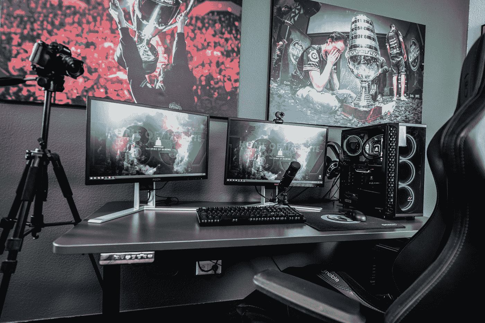

# 你应该知道的 3 大游戏开发引擎

> 原文：<https://blog.devgenius.io/top-3-game-development-engines-you-should-know-7a9f8ff181ce?source=collection_archive---------1----------------------->

## 最受欢迎的游戏引擎有哪些？

照片由[艾拉·唐](https://unsplash.com/@elladon?utm_source=medium&utm_medium=referral)在 [Unsplash](https://unsplash.com?utm_source=medium&utm_medium=referral) 拍摄

大家好！

今天我将与你分享最好的和最流行的游戏开发引擎。

## **1️⃣统一引擎🧡**

Unity engine 是世界上最著名的游戏引擎之一，尤其是在阿拉伯世界。这个引擎的特点是有很多功能和工具，你几乎可以免费使用，它是一个开发视频游戏的免费选项，不需要太多的编程经验。

**🔹Unity 特性**
它是最著名的引擎之一，有一个庞大的社区随时为你提供协助，它的图形功能强大，让你完全控制每一个元素的运动，支持 2D 和 3D 游戏以及虚拟现实游戏，支持几乎所有的操作系统以及 Xbox 和 PlayStation，并且它还有音频库来增加游戏的刺激性。

**🔸Unity 的缺点**
Unity 的一个缺点是对新手来说有点难，会分散他们的注意力，而且用 Unity 开发的游戏规模有点大。

## 2️⃣虚幻引擎🧡

我们名单中的第二个游戏引擎是虚幻引擎，它是由知名的 Epic Games 公司开发的，通过它，你可以以专业的方式和几乎免费的方式开发视频游戏，它也是世界上和阿拉伯世界中著名的引擎之一。

🔹虚幻引擎的特点
这个引擎的妙处在于你可以随心所欲的修改它，修改它的源代码，直到它符合你的需求，并且支持所有的系统，不需要太多编程经验就可以使用该引擎，它支持虚拟现实游戏，支持 Xbox 和 PlayStation。

🔸虚幻引擎缺点
这个引擎的一个缺点是需要大量的科学来理解它的系统，它的程序有点慢，如果你运行的是 Windows，你可以发现它的一些小问题。

## 3️⃣ CryEngine 🧡

这个引擎是一个特殊的引擎，被游戏领域最著名的公司所使用，如果你知道的话，它就是开发游戏 FarCry 的引擎。还有一些公司使用这个引擎育碧和亚马逊，育碧公司购买了这个引擎的部分股份，并在它的游戏中使用，亚马逊也开发了它的副本，并将其命名为亚马逊 Lumberyard，并在其产品中使用它。

🔹CryEngine 的特点之一是它是完全免费的，支持虚拟现实技术，在照明和运动方面优于其他引擎，并且运动是真实的，类似于身体的真实运动，支持人工智能，你可以在你的项目中使用它来给游戏带来更多的真实感，并且程序的大小很小。

🔸CryEngine Cons
它不支持稳定版本的 Mac 和 Linux，尽管该引擎是免费的，但它有许多付费的附加组件和功能，不能免费使用。

## 🔰结论

还有许多其他的游戏引擎，它们让初学者分心和困惑。在这篇文章中，我们讨论了 3 个最流行的引擎，但也有其他好的引擎，如 Godot，Amazon Lumberyard 和 RE Engine。

> 我希望这篇文章对你有用，感谢阅读
> 
> 阿尤布，