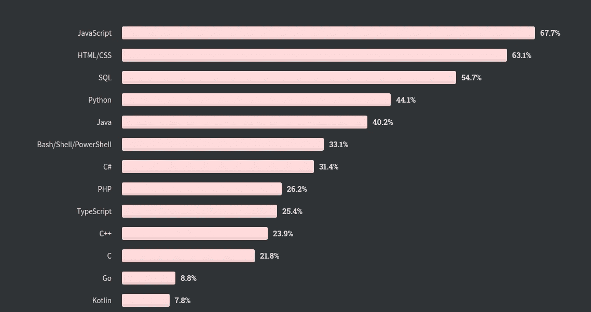
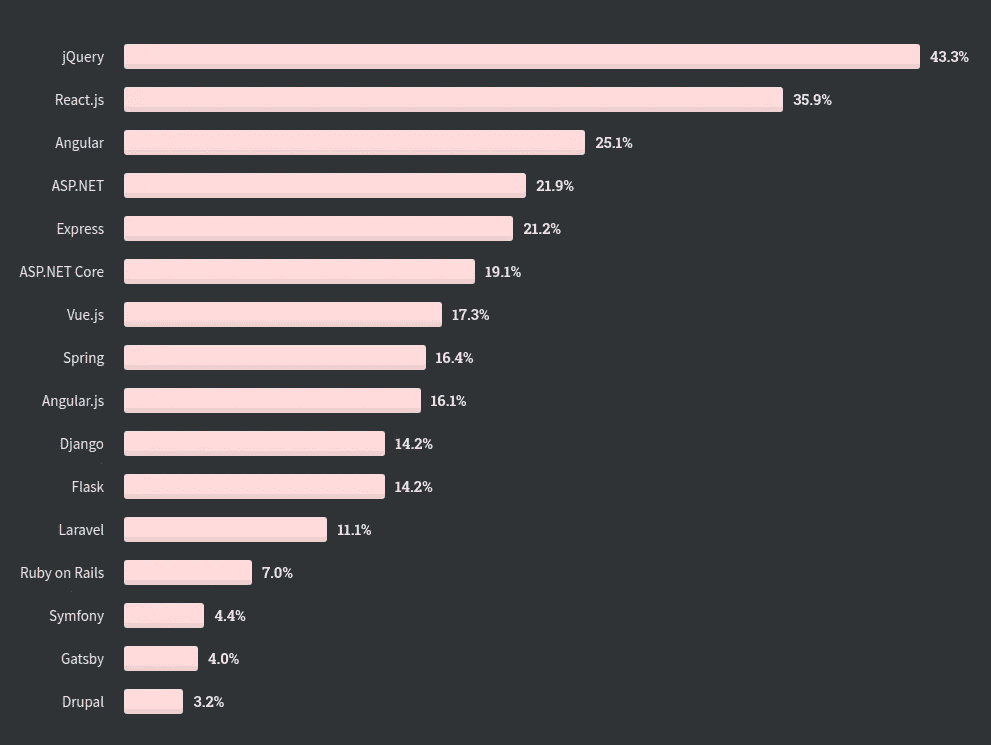

# 2021 年你应该学习的前 3 种编程语言！

> 原文：<https://blog.devgenius.io/top-3-programming-languages-to-learn-in-2020-b733458ba8dd?source=collection_archive---------17----------------------->

## 基于 65000 名开发者，StackOverflow 调查了 2020 年


克里斯·里德在 Unsplash 上拍摄的照片

编码教你理解计算机系统的基础。计算机如何完成它的任务以及它是如何工作的。

外面有大量的编程语言。它们各有利弊。

在这篇文章中，我将谈论 2021 年要学习的顶级编程语言，以及如何使用它们来实现你的梦想项目。

在我列出清单之前。这是 Stackoverflow 开发者调查 2020 的结果。[https://insights.stackoverflow.com/survey/20](https://insights.stackoverflow.com/survey/2020)二十

以下三种语言市场需求巨大。

**#1 Go 或 Golang**

**#2 巨蟒**

**#3 JavaScript**

如果你有时间的话。以下是我选择这些语言在 2021 年学习的原因。

# **#1 围棋(Golang)**


Go 是谷歌的一个工程师团队开发的开源编程语言。今天，大多数公司都使用 Go，包括苹果、谷歌、脸书、Docker 等财富公司。

根据团队的说法，Go 的诞生源于他们在谷歌工作时对现有语言和环境的不满。编程变得太难了，语言的选择是部分原因。人们不得不在高效编译、高效执行或编程简便之间做出选择；这三个版本都没有相同的主流语言版本。程序员可以通过转向动态类型语言，如 Python 和 JavaScript，而不是 C++或更小程度上的 Java，来选择轻松而不是安全和效率。

**Golang 是用来做什么的？**

Golang 可用于大规模网络服务器编程和分布式系统、web 开发等。

对 Golang 的需求越来越大，说明你应该在 2021 年学习 Golang。

# **#2 Python**


Python 是一种解释型高级通用编程语言。它可以用于多种目的。它简单易学，对初学者友好。

下面是一个简单的 python 代码:

```
# a function to find even or odd def evenOdd(num): 
if num % 2 == 0: 
  print(f"{num} is even") 
else: 
  print(f"{num} is odd")
```

Python 非常常用于机器学习，专业开发人员也用它来构建 web、移动和桌面应用程序。

但是 Python 不适合桌面和移动应用。我很快会谈到一种合适的语言。它在后端开发、机器学习、数据科学、自动化和脚本编写中非常受欢迎。

根据 stack overflow Developer Survey 2020，Python 是 2020 年最受欢迎的编程语言。

Python 可以用于多个领域，如数据科学、Web 开发、机器学习、脚本编写、软件开发、自动化等。

据 indeed.com 称，美国 python 开发人员的平均工资为 12 万美元以上。

Python 是我个人最喜欢的语言，我肯定会建议你在 2021 年开始使用 Python。

# **#3 JavaScript**


JavaScript 是高级的、解释的或即时编译的编程语言，具有一流的功能。好吧，你可能会想他到底在说什么。对吗？

简单地说，JavaScript 是一种网络编程语言。互联网上超过 75%的网站使用 JavaScript。

下面是 JS 的一个简单片段:

```
//function to find the even or odd number function evenOdd(num){ if(num % 2 == 0){ 
  return "Even"; 
}else{
  return "Odd";
 } 
}
```

根据 2020 年 StackOverflow 开发者调查报告，JavaScript 是使用最多的编程语言。



JavaScript 有大量惊人的库和框架，使得前端开发变得快速。这是 2019 年 StackOverflow 调查报告，显示了顶级 Web 框架。



JavaScript 可用于构建 web、移动和桌面应用程序。最流行的 javascript 库有 React、Vue.js、jQuery、Angular、React Native、Eletron.js 等。

其他流行的语言还有 SQL、HTML/CSS、Java 等。这些技术在市场上也有巨大的需求。

我的建议是从其中一种语言开始。当你对一种语言感到舒适时，掌握下一种语言就容易多了。

快乐学习。请别忘了跟着我。；)