# 2021 年最需要学习的 3 种编程语言

> 原文：<https://blog.devgenius.io/top-3-programming-languages-to-learn-in-2021-ca2732cc27fe?source=collection_archive---------1----------------------->

克里斯蒂安·威迪格在 [Unsplash](https://unsplash.com?utm_source=medium&utm_medium=referral) 上拍摄的照片

有许多编程语言，很难决定学习哪一种，尤其是如果你是编程新手。所以在这篇文章中，我想告诉你 2021 年最流行的三种编程语言。

你不需要学习所有的语言，但是如果你能学会至少一种语言，这将帮助你在不同的领域找到更多的工作机会，甚至可能有更好的薪水。

我将在 5 个主要因素下分析这些编程语言，例如:

*   流行趋势(过去 5 年)
*   学习的困难
*   职位空缺数量
*   这些编程语言的平均工资
*   它们被用在软件开发的哪些领域

第一个是…

# Java 语言(一种计算机语言，尤用于创建网站)

所以我们要分析的第一种编程语言是 Java。Java 是一种强类型的面向对象编程语言，广泛应用于公司和企业应用程序中。

## 趋势

根据 Google Trends，当我们回顾过去 5 年时，Java 的受欢迎程度略有下降:

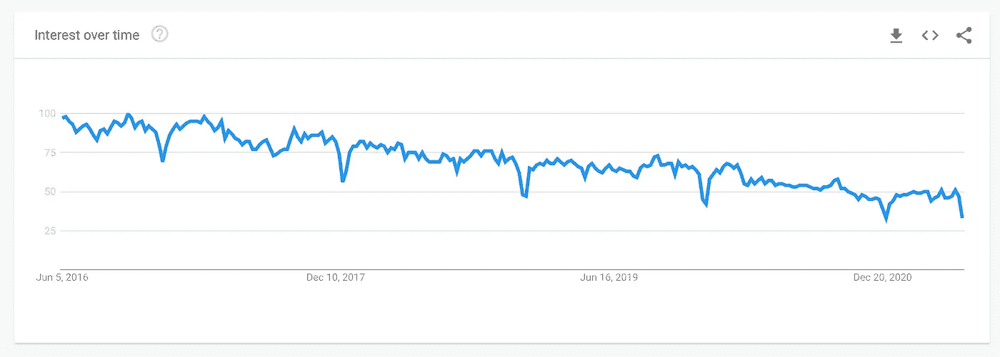

谷歌趋势(全球)

但是，Java 在软件开发行业仍然有很多机会，我们不认为 Java 会消失得那么快，所以学习 Java 仍然是一个不错的选择。

## 困难

下一个问题是“Java 有多难学？”。

如果你已经熟悉另一种编程语言，那么学习 Java 不会是一个巨大的问题，但如果你是一个初学者，你会发现 Java 很难学。

另一方面，与 Java 相比，还有更难的编程语言，所以总的来说，我们可以说 Java 对初学者来说有一个**中等难度**。

## 职位空缺数量(美国)

现在让我们看看 Java 有多少职位空缺。

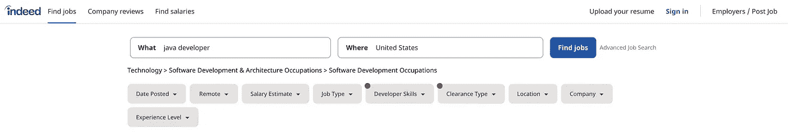

求职[indeed.com](https://www.indeed.com)

这些数字来自 indeed.com 网站，结果来自美国。但是你也可以搜索当地市场的空缺数量。

所以目前(2021 年 6 月)，Java 在美国的空缺数量是:

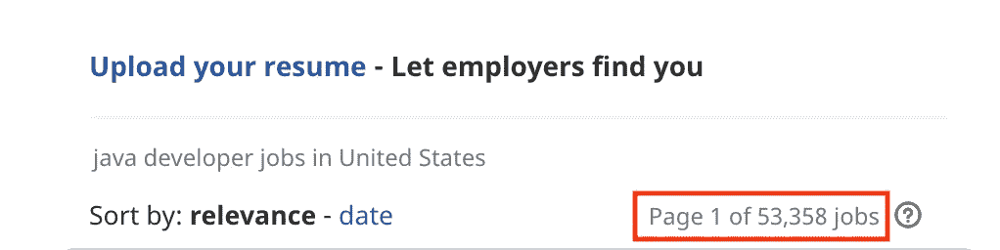

## 平均工资

平均工资呢？

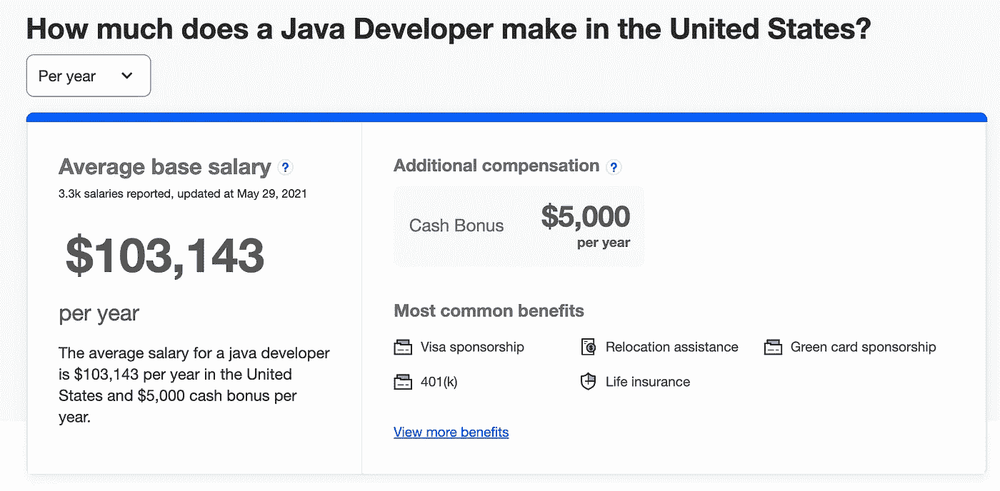

正如我们所见，Java 开发人员的平均年薪超过 10 万美元(美国也是如此)。

## 菲尔茨

Java 正被用于以下领域:

*   移动应用程序开发(针对 Android)
*   后端开发
*   服务器应用

还有更多。

# Java Script 语言

我们前三名中的下一种编程语言是 JavaScript。

JavaScript 是一种用于构建网站和基于网络的应用程序的编程语言。如果你打算成为一名 web 开发人员，学习 JavaScript 是必不可少的。

## 趋势

谷歌趋势又来了:

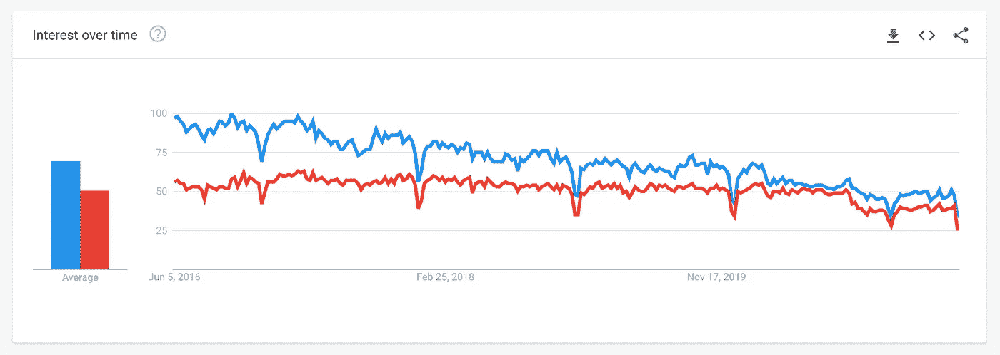

JavaScript(红色)在过去 5 年中同样受欢迎，但仍然比 Java(蓝色)稍逊一筹。

然而，[根据 stack overflow](https://insights.stackoverflow.com/survey/2020#technology-programming-scripting-and-markup-languages-all-respondents)2020 年的一项调查，JavaScript 是最受欢迎的编程语言(67.7%)，Java 的受欢迎程度仅为(40.2%):

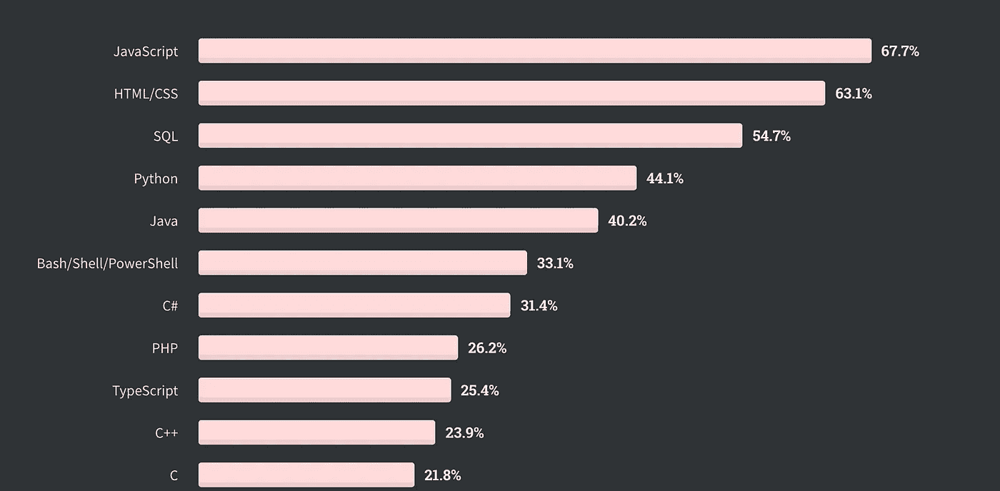

StackOverFlow 2020 开发者调查

## 困难

现在类似于 Java，如果你对另一种编程语言有一些经验，那么你可以更容易地学习 JavaScript，但对于完全的初学者，我相信 JavaScript 不是那么容易学习的。

因为 JavaScript 很庞大，而且随着时间的推移也发生了变化。JavaScript 包括如下内容:

*   函数式编程
*   DOM 管理
*   面向对象编程(后来出现在 JS 中)

对于初学者来说，理解这些术语可能会非常困难。因此，我也会给 JavaScript 一个中等难度的**。**

## **开口数量**

**JavaScript 的职位空缺数量(2021 年 6 月，还是在美国)约为 4.7 万个:**

**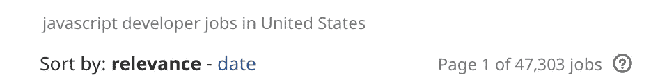**

**但如果你用其他关键词再次搜索，比如 Frontend developer、Angular、React 或 Node.js，那么还会有额外的职位空缺。**

## **平均工资**

**在美国，JavaScript 开发人员的平均年薪超过 11 万美元:**

**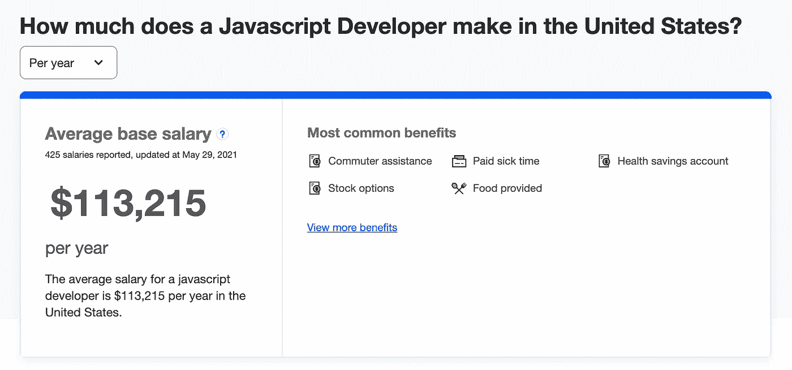**

## **菲尔茨**

**现在 JavaScript 的使用也越来越多。过去，JavaScript 只在前端开发中使用(针对 web 浏览器)，但今天也可以通过 Node.js 在后端使用 JavaScript。**

**所以基本上，如果你对 JavaScript 有很好的理解，你可以作为一个:**

*   **前端开发人员**
*   **后端开发者(如果你知道 Node.js 的话)**
*   **全栈开发人员(两者兼备)**

# **计算机编程语言**

**当今发展最快的编程语言是 Python。**

**Python 是一种高级的、面向对象的编程语言，已经存在了 30 多年，并得到了一个大型社区的支持。**

## **趋势**

**如果我们比较这三种语言，我们会发现 Python(黄色)是最流行的编程语言:**

**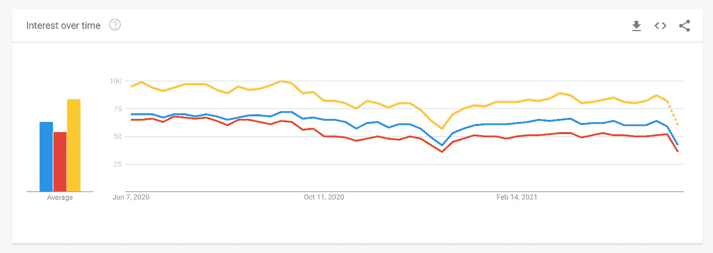**

**但问题是为什么 Python 变得如此流行？**

## **困难**

**嗯，第一个原因是 Python 有一个非常简单、初学者友好的语法，因此对于初学者来说，用 Python 开始学习编码将是一个很好的选择。**

## **菲尔茨**

**第二个原因是 Python 不仅仅是面向程序员的。**

**Python 也可以被不同职业的人使用。使用 Python 的工作领域各不相同，例如:**

*   **数据科学**
*   **人工智能和机器学习**
*   **任务自动化**
*   **web 开发**
*   **应用开发**

**还有更多。**

## **职位空缺**

**目前，到 2021 年 6 月，美国有超过 3.8 万个职位空缺:**

**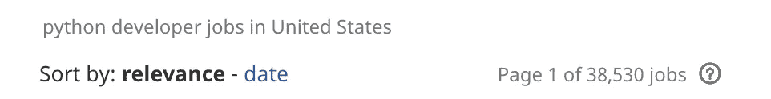**

## **薪水**

**Python 开发人员的平均年薪约为 10.8 万美元。**

**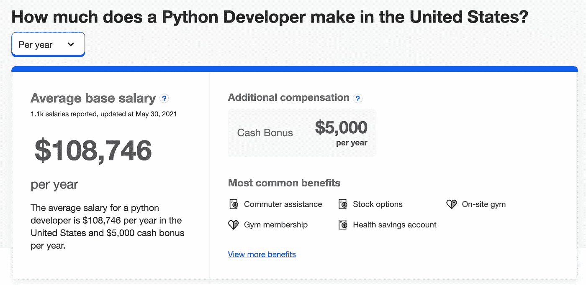**

**所以正如我们所看到的，不管你是不是初学者，如果你学会了这些编程语言中的至少一种，那么你将有足够的机会在 2021 年找到一份编程工作。**

**如果你有兴趣学习更多关于编程的知识，别忘了订阅[我的简讯](https://bit.ly/2KXEBsv)。**

**感谢您的阅读！**